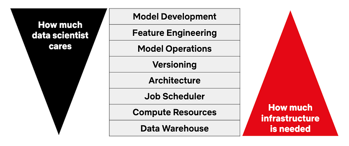
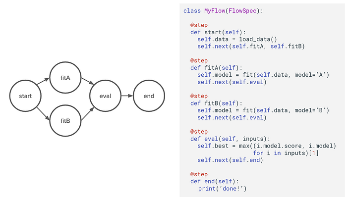
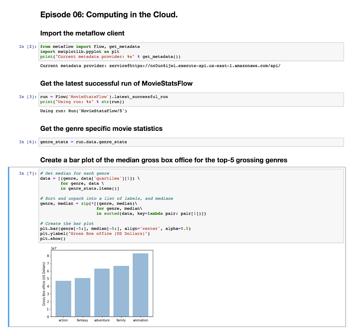
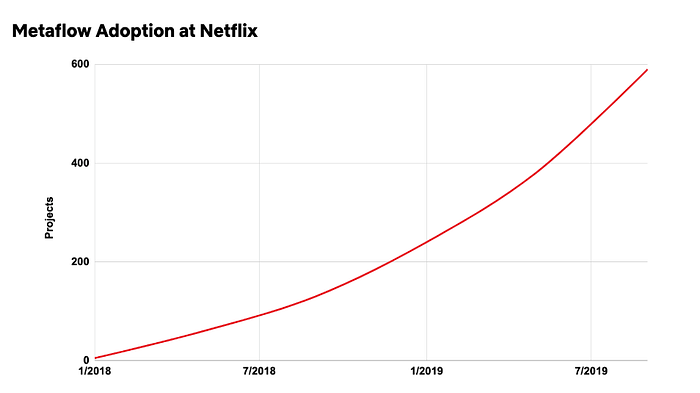

# Open-Sourcing Metaflow, a Human-Centric Framework for Data Science

by [David Berg](http://www.linkedin.com/in/david-j-berg), [Ravi Kiran Chirravuri](https://www.linkedin.com/in/crkgoogle/), [Romain Cledat](https://www.linkedin.com/in/romain-cledat-4a211a5), [Savin Goyal](http://www.linkedin.com/in/savingoyal), [Ferras Hamad](https://www.linkedin.com/in/ferras-hamad), [Ville Tuulos](https://www.linkedin.com/in/villetuulos/)

_tl;dr _Metaflow is now open-source! Get started at [metaflow.org](https://metaflow.org/).

Netflix applies data science to hundreds of use cases across the company, including optimizing content delivery and video encoding. Data scientists at Netflix relish [our culture](https://jobs.netflix.com/culture) that empowers them to work autonomously and use their judgment to solve problems independently. We want our data scientists to be curious and take smart risks that have the potential for high business impact.

About two years ago, we, at our newly formed Machine Learning Infrastructure team started asking our data scientists a question: “What is the hardest thing for you as a data scientist at Netflix?” We were expecting to hear answers related to large-scale data and models, and maybe issues related to modern GPUs. Instead, we heard stories about projects where getting the first version to production took surprisingly long — mainly because of mundane reasons related to software engineering. We heard many stories about difficulties related to data access and basic data processing. We sat in meetings where data scientists discussed with their stakeholders how to best version different versions of their models without impacting production. We saw how excited data scientists were about modern off-the-shelf machine learning libraries, but we also witnessed various issues caused by these libraries when they were casually included as dependencies in production workflows.

We realized that nearly everything that data scientists wanted to do was already doable technically, but nothing was easy enough. Our job as a Machine Learning Infrastructure team would therefore not be mainly about enabling new technical feats. Instead, we should make common operations so easy that data scientists would not even realize that they were difficult before. We would focus our energy solely on improving data scientist productivity by being fanatically human-centric.

How could we improve the quality of life for data scientists? The following picture started emerging:

Our data scientists love the freedom of being able to choose the best modeling approach for their project. They know that feature engineering is critical for many models, so they want to stay in control of model inputs and feature engineering logic. In many cases, data scientists are quite eager to own their own models in production, since it allows them to troubleshoot and iterate the models faster.

On the other hand, very few data scientists feel strongly about the nature of the data warehouse, the compute platform that trains and scores their models, or the workflow scheduler. Preferably, from their point of view, these foundational components should “just work”. If, and when they fail, the error messages should be clear and understandable in the context of their work.

A key observation was that most of our data scientists had nothing against writing Python code. In fact, plain-and-simple Python is quickly becoming the lingua franca of data science, so using Python is preferable to domain specific languages. Data scientists want to retain their freedom to use arbitrary, idiomatic Python code to express their business logic — like they would do in a Jupyter notebook. However, they don’t want to spend too much time thinking about object hierarchies, packaging issues, or dealing with obscure APIs unrelated to their work. **The infrastructure should allow them to exercise their freedom as data scientists but it should provide enough guardrails and scaffolding, so they don’t have to worry about software architecture too much.**

## Introducing Metaflow

These observations motivated Metaflow, our human-centric framework for data science. Over the past two years, Metaflow has been used internally at Netflix to build and manage hundreds of data-science projects from natural language processing to operations research.

By design, Metaflow is a deceptively simple Python library:

Data scientists can structure their workflow as a Directed Acyclic Graph of steps, as depicted above. The steps can be arbitrary Python code. In this hypothetical example, the flow trains two versions of a model in parallel and chooses the one with the highest score.

On the surface, this doesn’t seem like much. There are many existing frameworks, such as Apache Airflow or Luigi, which allow execution of DAGs consisting of arbitrary Python code. The devil is in the many carefully designed details of Metaflow: for instance, note how in the above example data and models are stored as normal Python instance variables. They work even if the code is executed on a distributed compute platform, which Metaflow supports by default, thanks to Metaflow’s built-in content-addressed artifact store. In many other frameworks, loading and storing of artifacts is left as an exercise for the user, which forces them to decide what should and should not be persisted. Metaflow removes this cognitive overhead.

Metaflow is packed with human-centric details like this, all of which aim at boosting data scientist productivity. For a comprehensive overview of all features of Metaflow, take a look at our documentation at [docs.metaflow.org](https://docs.metaflow.org/).

## Metaflow on Amazon Web Services

Netflix’s data warehouse contains hundreds of petabytes of data. While a typical machine learning workflow running on Metaflow touches only a small shard of this warehouse, it can still process terabytes of data.

Metaflow is a cloud-native framework. It leverages elasticity of the cloud by design — both for compute and storage. Netflix has been [one of the largest users of Amazon Web Services (AWS) for many years](https://medium.com/netflix-techblog/four-reasons-we-choose-amazons-cloud-as-our-computing-platform-4aceb692afec) and we have accumulated plenty of operational experience and expertise in dealing with the cloud, AWS in particular. For the open-source release, we partnered with AWS to provide a seamless integration between Metaflow and various AWS services.

Metaflow comes with built-in capability to snapshot all code and data in Amazon S3 automatically, which is a key value proposition of our internal Metaflow setup. This provides us with a comprehensive solution for versioning and experiment tracking without any user intervention, which is core to any production-grade machine learning infrastructure.

In addition, Metaflow comes bundled with a high-performance S3 client, which can load data up to 10Gbps. This client has been massively popular amongst our users, who can now load data into their workflows an order of magnitude faster than before, enabling faster iteration cycles.

For general purpose data processing, Metaflow integrates with AWS Batch, which is a managed, container-based compute platform provided by AWS. The user can benefit from infinitely scalable compute clusters by adding a single line in their code: @batch. For training machine learning models, besides writing their own functions, the user has the choice to use AWS Sagemaker, which provides high-performance implementations of various models, many of which support distributed training.

Metaflow supports all common off-the-shelf machine learning frameworks through our @conda decorator, which allows the user to specify external dependencies for their steps safely. The @conda decorator freezes the execution environment, providing good guarantees of reproducibility, both when executed locally as well as in the cloud.

For more details, read this page about [Metaflow’s integration with AWS](https://docs.metaflow.org/metaflow-on-aws/metaflow-on-aws).

## From Prototype To Production

Out of the box, Metaflow provides a first-class local development experience. It allows data scientists to develop and test code quickly on your laptop, similar to any Python script. If your workflow supports parallelism, Metaflow takes advantage of all CPU cores available on your development machine.

We encourage our users to deploy their workflows to production as soon as possible. In our case, “production” means a highly available, centralized DAG scheduler, Meson, where users can export their Metaflow runs for execution with a single command. This allows them to start testing their workflow with regularly updating data quickly, which is a highly effective way to surface bugs and issues in the model. Since Meson is not available in open-source, we are working on providing a similar integration to AWS Step Functions, which is a highly available workflow scheduler.

In a complex business environment like Netflix’s, there are many ways to consume the results of a data science workflow. Often, the final results are written to a table, to be consumed by a dashboard. Sometimes, the resulting model is deployed as a microservice to support real-time inferencing. It is also common to chain workflows so that the results of a workflow are consumed by another. Metaflow supports all these modalities, although some of these features are not yet available in the open-source version.

When it comes to inspecting the results, Metaflow comes with a notebook-friendly client API. Most of our data scientists are heavy users of Jupyter notebooks, so we decided to focus our UI efforts on a seamless integration with notebooks, instead of providing a one-size-fits-all Metaflow UI. Our data scientists can build custom model UIs in notebooks, fetching artifacts from Metaflow, which provide just the right information about each model. A similar experience is available with AWS Sagemaker notebooks with open-source Metaflow.

## Get Started With Metaflow

Metaflow has been eagerly adopted inside of Netflix, and today, we are making Metaflow available as an open-source project.

We hope that our vision of data scientist autonomy and productivity resonates outside Netflix as well. We welcome you to try Metaflow, start using it in your organization, and participate in its development.

You can find the project home page at [metaflow.org](https://metaflow.org/) and the code at [github.com/Netflix/metaflow](https://github.com/Netflix/metaflow). Metaflow is comprehensively documented at [docs.metaflow.org](https://docs.metaflow.org/). The quickest way to get started is to [follow our tutorial.](https://docs.metaflow.org/getting-started/tutorials) If you want to learn more before getting your hands dirty, you can watch presentations about [Metaflow at the high level](https://www.youtube.com/playlist?list=PLGEBSHR02Xbg0oTf7OwZ_Kk86Zx96mAOb) or dig deeper into [the internals of Metaflow](https://www.youtube.com/playlist?list=PLGEBSHR02XbhC-5Eqy7ERHxpuwiJHes4j).

If you have any questions, thoughts, or comments about Metaflow, you can find us at [Metaflow chat room](http://chat.metaflow.org/) or you can reach us by email at [help@metaflow.org](mailto:help@metaflow.org). We are eager to hear from you!

---
**Tags:** Data Science · Machine Learning · Productivity · Python · Open Source
