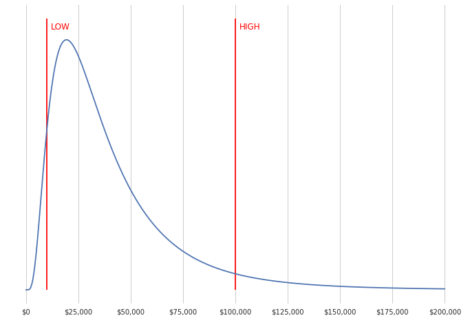
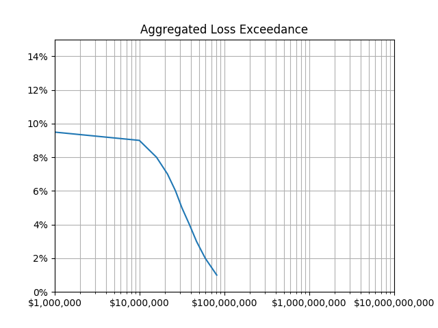

# Open-Sourcing riskquant, a library for quantifying risk

Netflix has a program in our Information Security department for quantifying the risk of deliberate (attacker-driven) and accidental losses. This program started on the Detection Engineering team with a home-grown Python library called [riskquant](https://github.com/Netflix-Skunkworks/riskquant), which we’ve released as open source for you to use (and contribute to). Since that library was written, we have hired two amazing full-time Risk Engineers ([Prashanthi Koutha](https://www.linkedin.com/in/prashanthi-koutha-819a0b8b/) and [Tony Martin-Vegue](https://www.linkedin.com/in/tonymartinvegue/)) who are expanding rigorous quantified risk across the company.

The Factor Analysis of Information Risk ([FAIR](https://www.fairinstitute.org/learn-fair)) framework describes best practices for quantifying risk, which at the highest level of abstraction involves forecasting two quantities:

- Frequency of loss: How many times per year do you expect this loss to occur?
- Magnitude of loss: If this loss occurs, how bad will it be? (Low-loss scenario to high-loss scenario, representing a 90% [confidence interval](https://en.wikipedia.org/wiki/Confidence_interval))

riskquant takes a list of loss scenarios, each with estimates of frequency, low loss magnitude, and high loss magnitude, and calculates and ranks the annualized loss for all scenarios. The annualized loss is the mean magnitude averaged over the expected interval between events, which is roughly the inverse of the frequency (e.g. a frequency of 0.1 implies an event about every 10 years).

For estimating magnitude, the 5th/95th (low/high) percentile estimates supplied by the user are mapped to a [lognormal](https://en.wikipedia.org/wiki/Log-normal_distribution) statistical distribution so that 5% of the probability falls below the lower magnitude, and 5% falls above the higher magnitude. A value drawn from the lognormal never falls below zero (reflecting that we can never earn money from a loss), and has a long tail on the high side (since losses can easily exceed initial estimates). Figure 1 shows a magnitude distribution where the 5th percentile was chosen as $10,000 and the 95th percentile was $100,000.

**Fig. 1:** Lognormal distribution of loss magnitude derived from low ($10K) and high ($100K) loss estimates, marked by the vertical red reference lines.

riskquant can also calculate a “loss exceedance curve” (LEC) showing how all the scenarios together map to the probability of exceeding different total loss amounts. We do this with a [Monte Carlo simulation](https://towardsdatascience.com/the-house-always-wins-monte-carlo-simulation-eb82787da2a3) of (by default) 100,000 possible ways that the next year could play out. First, we treat the estimated frequency as the mean of a [Poisson distribution](https://en.wikipedia.org/wiki/Poisson_distribution), and draw a random number of occurrences of each loss scenario in that year. For example, a frequency of 0.1 means about a 90% chance of no losses, 9% chance of 1 loss, and a 1% chance of 2 or more losses.

Then, for each loss that was predicted to occur, riskquant draws a random value from the lognormal magnitude distribution. All the loss magnitudes that occurred in a simulated year are summed together. At the end, we calculate the percentiles — what was the minimum loss experienced in the top 1% of simulated years? 2%? 3%? And so on.

The resulting aggregated loss exceedance curve for a particular set of loss scenarios could look like Figure 2, where the y-axis of the plot is a percentage, and the x-axis is a loss amount. You should read a point (X, Y) on the curve as: “There’s a Y percent chance that the loss will exceed X”.

**Fig. 2:** Example Loss Exceedance Curve. For this example, there’s about a 2% chance losses would exceed $60 million in a year.

You should compare the loss exceedance curve (LEC) to your organization’s risk tolerance — for example, by asking your executives: “If there was a 10% chance of losing more than $1B across all these risks, would that be OK? What amount of loss would you be OK with at that probability?” By finding the answer to that question at different levels of probability, you can draw a tolerance curve. If the LEC falls to the right of the tolerance curve at any point, then you may be carrying too much risk.

riskquant is modular, so the _magnitude_ model described above is just one possible model (called SimpleModel in the code). It could be extended to, for example, draw from an empirical distribution built from past data, or use a different distribution than the lognormal. As of the initial release, a Poisson distribution is supported for simulating _frequency _as a single value. The PERTModel in the code will simulate _frequency_ using a [modified-PERT distribution](https://en.wikipedia.org/wiki/PERT_distribution#The_modified-PERT_distribution).

We hope that by releasing this code, you’ll be able to start quantifying risks in your own enterprise. If you would like to implement new models and contribute them back, we’ll be happy to look at your Github pull request.

[_Markus De Shon_](https://www.linkedin.com/in/markus-de-shon-096889/)_ and _[_Shannon Morrison_](https://www.linkedin.com/in/shannon-morrison-0b71b544)_._

Check out our jobs in [Information Security](https://jobs.netflix.com/search?team=Security).

---
**Tags:** Security · Risk · Information Security
