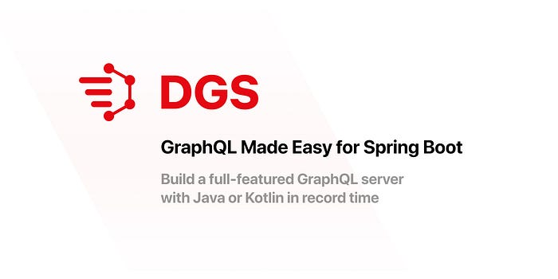
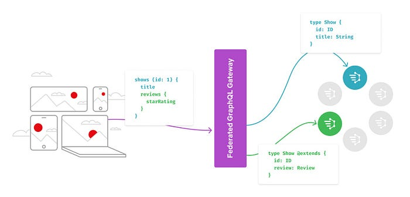
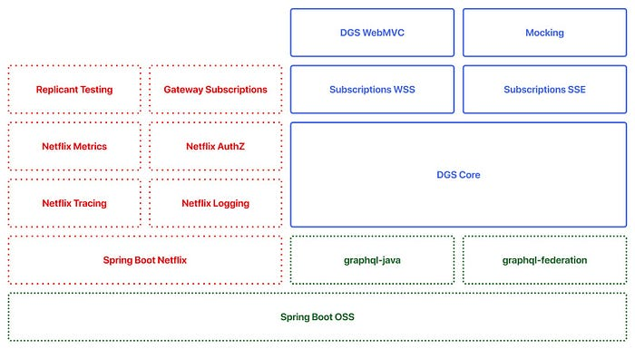

# Open Sourcing the Netflix Domain Graph Service Framework: GraphQL for Spring Boot

_By _[_Paul Bakker_](https://www.linkedin.com/in/paulb01)_ and _[_Kavitha Srinivasan_](https://www.linkedin.com/in/kavitha-srinivasan/)_, Images by _[_David Simmer_](https://www.linkedin.com/in/simmerer/)_, Edited by _[_Greg Burrell_](https://www.linkedin.com/in/greg-burrell-67ab273/)

Netflix has developed a [Domain Graph Service (DGS) framework](https://netflix.github.io/dgs/) and it is now open source. The DGS framework simplifies the implementation of GraphQL, both for standalone and federated GraphQL services. Our framework is battle-hardened by our use at scale.

By open-sourcing the project, we hope to contribute to the Java and GraphQL communities and learn from and collaborate with everyone who will be using the framework to make it even better in the future.

The key features of the DGS Framework include:

- Annotation-based Spring Boot programming model
- Test framework for writing query tests as unit tests
- Gradle Code Generation plugin to create Java/Kotlin types from a GraphQL schema
- Easy integration with GraphQL Federation
- Integration with Spring Security
- GraphQL subscriptions (WebSockets and SSE)
- File uploads
- Error handling
- Automatic support for interface/union types
- A GraphQL client for Java
- Pluggable instrumentation

## Why We Needed a DGS Framework

Around Spring 2019, Netflix embarked on a great adventure towards implementing a federated GraphQL architecture. Our colleagues wrote a [Netflix Tech Blog post](./how-netflix-scales-its-api-with-graphql-federation-part-1-ae3557c187e2.md) describing the details of this architecture. The transition to the new federated architecture meant that many of our backend teams needed to adopt GraphQL in our Java ecosystem. As you may recall from a [previous blog post](./netflix-oss-and-spring-boot-coming-full-circle-4855947713a0.md), Netflix has standardized on Spring Boot for backend development. Therefore, to make this federated architecture a success, we needed to have a great developer experience for GraphQL in Spring Boot.

We created our framework on top of Spring Boot and it leverages the [graphql-java](https://www.graphql-java.com/) library. This framework was initially intended to be internal only, focusing on integration with the Netflix ecosystem for tracing, logging, metrics, etc. However, proper modularization of the framework was always top of mind. It became apparent that much of the framework we had built was not actually Netflix specific. The framework was mostly just an easier way to build GraphQL services, both standalone and federated.

## Schema-First Development

A schema represents the GraphQL API. The schema is what makes GraphQL so powerful and different from REST. A GraphQL schema describes the API in terms of Query and Mutation operations along with their related types and fields. The API user can specify precisely which fields to retrieve in a query, making a GraphQL API very flexible.

There are two different approaches to GraphQL development; schema-first and code-first development. With **schema-first development**, you manually define your API’s schema using the [GraphQL Schema Language](http://spec.graphql.org/June2018/). The code in your service only implements this schema.

With **code-first development**, you don’t have a schema file. Instead, the schema gets generated at runtime based on definitions in code.

Both approaches, schema-first and code-first, are supported in our framework. **At Netflix we strongly prefer schema-first development because:**

1. The schema design is front and center of the developer experience.
2. It provides an easy way for tooling to consume the schema.
3. Backward-incompatible changes are more obvious with schema diffs. Backward compatibility is even more critical when working in a Federated GraphQL architecture.

Although it might be marginally quicker to generate schema from the code, putting the time into designing your schema in a human readable, collaborative way is well worth the effort towards a better API.

## The Framework in Action

The framework’s core revolves around the annotation-based programming model familiar to Spring Boot developers. Comprehensive documentation is available on [the website](https://netflix.github.io/dgs/) but let’s walk through an example to show you how easy it is to use this framework.

Let’s start with a **simple schema**.

To implement this API, we need to write a data fetcher.

The Show type is a simple POJO that we would typically generate using the [**DGS Code Generation plugin**](https://netflix.github.io/dgs/generating-code-from-schema/)** **for Gradle. A method annotated with **@DgsData** implements a data fetcher for a field. Note that we don’t need data fetchers for each field, we can return Java objects, and the framework will take care of the rest.The framework also has many conveniences such as the **@InputArgument** annotation used in this example.

**This code is enough to get a GraphQL endpoint running**. Just start the Spring Boot application, and the _/graphql _endpoint will be available, along with the [GraphiQL](https://github.com/graphql/graphiql) query editor on _/graphiql_ that comes out of the box. Although the code in this example is straightforward, it wouldn’t look much different if we work with Federated types, use **@Secured**, or add metrics and tracing using an extension point. The framework takes care of all the heavy lifting.

Another key feature is support for lightweight query tests. These tests allow you to execute queries without the need to work with the HTTP endpoint. The tests look and feel like plain JUnit tests.

Full documentation for the framework is available on [the DGS Framework github repository](https://netflix.github.io/dgs/).

## Fitting into the GraphQL Server Ecosystem

So how exactly does the DGS framework fit into the existing GraphQL ecosystem? The current ecosystem comprises servers, clients, the federated gateways, and tooling to help with query testing, schema management, code generation, etc. When it comes to building GraphQL servers using JVM, there are both schema-first and code-first libraries available.

A popular code-first library is [graphql-kotlin](https://github.com/ExpediaGroup/graphql-kotlin) for Kotlin. [graphql-java](https://www.graphql-java.com/) is most popular for implementing schema-first GraphQL APIs in Java, but is designed to be a low level library. The [graphql-java-kickstart ](https://github.com/graphql-java-kickstart)starter is a set of libraries for implementing GraphQL services, and provides [graphql-java-tools ](https://github.com/graphql-java-kickstart/graphql-java-tools)and [graphql-java-servlet](https://github.com/graphql-java-kickstart/graphql-java-servlet) on top of graphql-java.

Regardless of whether you use Java or Kotlin, our framework provides an easy way to build GraphQL services in Spring Boot. It can be used to build a standalone service as well as in the context of Federated GraphQL.

## Federation

The DGS Framework provides a convenient way to implement GraphQL services with federation. Federation allows services to share a unified graph exposed by a gateway. Typically, services share and extend types defined in the unified schema using the @extends directive as defined by [**Apollo’s federation specification**](https://www.apollographql.com/docs/federation/federation-spec/). This is an effective way to split the ownership of a large monolithic GraphQL schema across microservices.

For an incoming query, the federated gateway constructs a query plan to call out to the required services to fulfill that query. Each service, in turn, needs to be able to respond to the _entities query in order to partially fulfill the query for the data it owns.

Here is an example of a Reviews service that extends the Show type defined earlier with a reviews field:

*Federated GraphQL Architecture with Shows and Reviews DGSs*

Given this schema, the Reviews DGS needs to implement a resolver for the federated Show type with the reviews field populated. This can be done easily using the **@DgsEntityFetcher** annotation as shown here:

The framework also makes it easy to test federated queries using code generation to generate the __entities_ query for the service based on the schema. The complete code for the given example can be found [here](https://github.com/Netflix/dgs-federation-example).

## Framework Architecture

From the early days of development, we focused on good modularization of the code. This was an important design choice that made it possible to open source most of the framework without impacting our internal teams. We couldn’t use the module system introduced in Java 9 yet, because a lot of applications at Netflix are still using Java 8. However, with the help of Gradle **_api_** and **_implementation_** modules, we were able to create a clean module structure. At Netflix, we have many extensions for Spring Boot to integrate with our infrastructure. We call this Spring Boot Netflix. The DGS framework is built on standard open-source Spring Boot. On top of that, we have some modules that integrate with our specific infrastructure and use only extension points provided by the core framework.

The following is a diagram of how the modules fit together:

*DGS Framework with Netflix and OSS modules*

## Distributed Tracing and Metrics

At Netflix, we have custom infrastructure for features like tracing, metrics, distributed logging, and authentication/authorization. As mentioned earlier, the DGS framework integrates with this infrastructure to provide a seamless experience out of the box. While these features are not open-sourced, they are easy enough to add to the framework.

The framework supports [**_Instrumentation_**](https://netflix.github.io/dgs/advanced/instrumentation/) classes as defined in the [graphql-java](https://www.graphql-java.com/) library. By implementing the **_Instrumentation_** interface and annotating it **@Component**, the framework is able to pick it up automatically. You can find some reference examples in our [documentation](https://netflix.github.io/dgs/advanced/instrumentation/). In the future, we are hopeful and excited to see community contributions around common patterns for distributed tracing and metrics.

## Try It Out Today

To get started with the DGS Framework, refer to [our documentation and tutorials](https://netflix.github.io/dgs/). To contribute to the DGS framework, please check out the DGS Framework project on [GitHub](https://github.com/Netflix/dgs-framework). We also have a Gradle [code generation plugin](https://netflix.github.io/dgs/generating-code-from-schema/) for generating Java and Kotlin types from a GraphQL schema. To contribute to the code generation plugin, please check out the project on [GitHub](https://github.com/Netflix/dgs-codegen).

## A Team Effort

The DGS Framework has been a success at Netflix owing to the efforts of multiple teams coming together. We would like to acknowledge our close collaborators from the BFG team with whom we started on this amazing journey. We would also like to thank our many users for their timely feedback and code contributions.

_If you are passionate about GraphQL and building great developer experiences then check out the _[_many job opportunities_](https://jobs.netflix.com/)_ on our Netflix website_.

---
**Tags:** GraphQL · Spring Boot · Microservice Architecture
