# Optimized shot-based encodes for 4K: Now streaming!

by [Aditya Mavlankar](https://www.linkedin.com/in/aditya-mavlankar-7139791/), [Liwei Guo](https://www.linkedin.com/in/liwei-guo-a5aa6311/), [Anush Moorthy](https://www.linkedin.com/in/anush-moorthy-b8451142/) and [Anne Aaron](https://www.linkedin.com/in/anne-aaron/)

Netflix has an ever-expanding collection of titles which customers can enjoy in 4K resolution with a suitable device and subscription plan. Netflix creates _premium_ bitstreams for those titles in addition to the catalog-wide 8-bit stream profiles¹. _Premium_ features comprise a title-dependent combination of 10-bit bit-depth, 4K resolution, high frame rate (HFR) and high dynamic range (HDR) and pave the way for an extraordinary viewing experience.

The premium bitstreams, launched several years ago, were rolled out with a fixed-bitrate ladder, with fixed 4K resolution bitrates — 8, 10, 12 and 16 Mbps — regardless of content characteristics. Since then, we’ve developed algorithms such as [per-title encode optimizations](https://netflixtechblog.com/per-title-encode-optimization-7e99442b62a2) and [per-shot dynamic optimization](https://netflixtechblog.com/dynamic-optimizer-a-perceptual-video-encoding-optimization-framework-e19f1e3a277f), but these innovations were not back-ported on these premium bitstreams. Moreover, the encoding group of pictures (GoP) duration (or keyframe period) was constant throughout the stream causing additional inefficiency due to shot boundaries not aligning with GoP boundaries.

As the number of 4K titles in our catalog continues to grow and more devices support the premium features, we expect these video streams to have an increasing impact on our members and the network. We’ve worked hard over the last year to leapfrog to our most advanced encoding innovations — shot-optimized encoding and [4K VMAF model](https://netflixtechblog.com/vmaf-the-journey-continues-44b51ee9ed12) — and applied those to the premium bitstreams. More specifically, we’ve improved the traditional 4K and 10-bit ladder by employing

- shot-based encoding
- dynamic optimization (DO) similar to that [applied on our catalog-wide 8-bit stream profiles](https://netflixtechblog.com/optimized-shot-based-encodes-now-streaming-4b9464204830)
- improved encoder settings.

In this blog post, we present benefits of applying the above-mentioned optimizations to standard dynamic range (SDR) 10-bit and 4K streams (some titles are also HFR). As for HDR, our team is currently developing an HDR extension to VMAF, [Netflix’s video quality metric](https://netflixtechblog.com/toward-a-practical-perceptual-video-quality-metric-653f208b9652), which will then be used to optimize the HDR streams.

¹ _The 8-bit stream profiles go up to 1080p resolution._

## Bitrate versus quality comparison

For a sample of titles from the 4K collection, the following plots show the rate-quality comparison of the fixed-bitrate ladder and the optimized ladder. The plots have been arranged in decreasing order of the new highest bitrate — which is now content adaptive and commensurate with the overall complexity of the respective title.

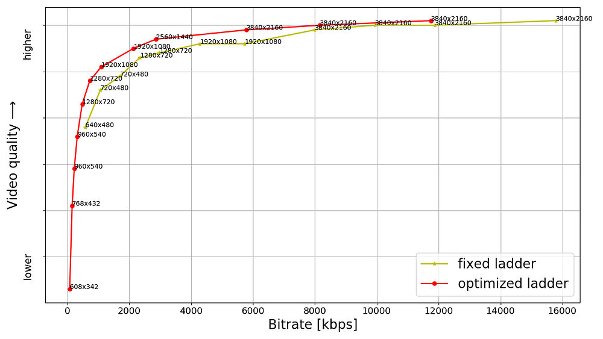
*Fig. 1: Example of a thriller-drama episode showing new highest bitrate of 11.8 Mbps*

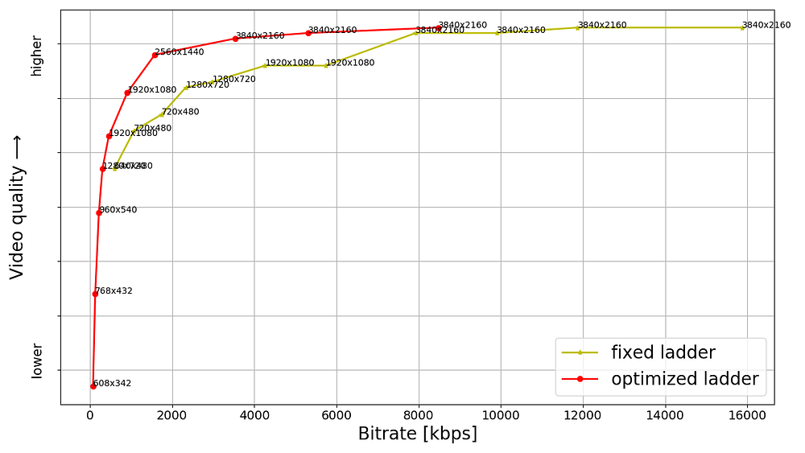
*Fig. 2: Example of a sitcom episode with some action showing new highest bitrate of 8.5 Mbps*

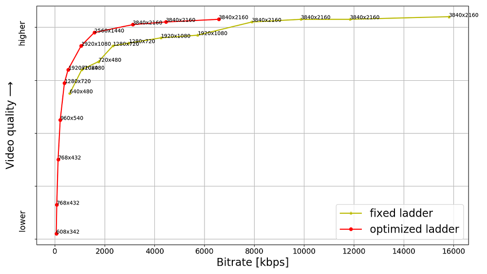
*Fig. 3: Example of a sitcom episode with less action showing new highest bitrate of 6.6 Mbps*

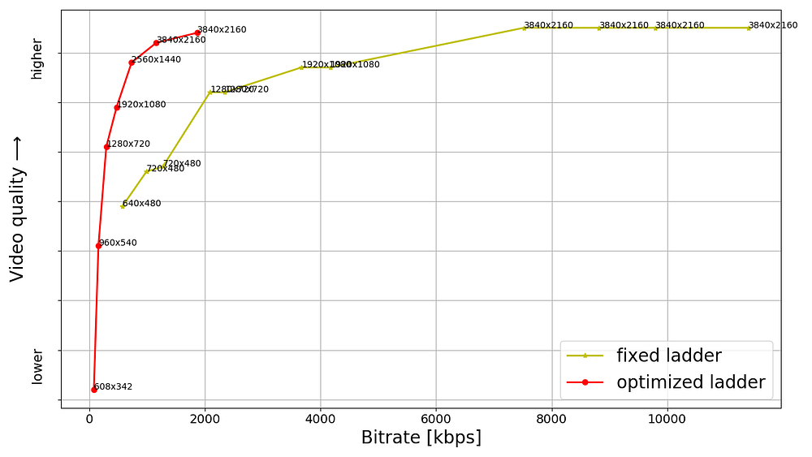
*Fig. 4: Example of a 4K animation episode showing new highest bitrate of 1.8 Mbps*

The bitrate as well as quality shown for any point is the _average_ for the corresponding stream, computed over the duration of the title. The annotation next to the point is the corresponding encoding resolution; it should be noted that video received by the client device is decoded and scaled to the device’s display resolution. As for VMAF score computation, for encoding resolutions less than 4K, we follow the [VMAF best practice](https://netflixtechblog.com/vmaf-the-journey-continues-44b51ee9ed12) to upscale to 4K assuming bicubic upsampling. Aside from the encoding resolution, each point is also associated with an appropriate pixel aspect ratio (PAR) to achieve a target 16:9 display aspect ratio (DAR). For example, the 640x480 encoding resolution is paired with a 4:3 PAR to achieve 16:9 DAR, consistent with the DAR for other points on the ladder.

The last example, showing the new highest bitrate to be 1.8 Mbps, is for a 4K animation title episode which can be very efficiently encoded. It serves as an extreme example of content adaptive ladder optimization — it however should not to be interpreted as all animation titles landing on similar low bitrates.

The resolutions and bitrates for the fixed-bitrate ladder are pre-determined; minor deviation in the achieved bitrate is due to rate control in the encoder implementation not hitting the target bitrate precisely. On the other hand, each point on the optimized ladder is associated with _optimal_ bit allocation across all shots with the goal of maximizing a video quality objective function while resulting in the corresponding average bitrate. Consequently, for the optimized encodes, the bitrate varies shot to shot depending on relative complexity and overall bit budget and in theory can reach the respective codec level maximum. Various points are constrained to different codec levels, so receivers with different decoder level capabilities can stream the corresponding subset of points up to the corresponding level.

The fixed-bitrate ladder often appears like steps — since it is not title adaptive it switches “late” to most encoding resolutions and as a result the quality stays flat within that resolution even with increasing bitrate. For example, two 1080p points with identical VMAF score or four 4K points with identical VMAF score, resulting in wasted bits and increased storage footprint.

On the other hand, the optimized ladder appears closer to a monotonically increasing curve — increasing bitrate results in an increasing VMAF score. As a side note, we do have some additional points, not shown in the plots, that are used in resolution limited scenarios — such as a streaming session limited to 720p or 1080p highest encoding resolution. Such points lie under (or to the right of) the convex hull main ladder curve but allow quality to ramp up in resolution limited scenarios.

## Challenging-to-encode content

For the optimized ladders we have logic to detect quality saturation at the high end, meaning an increase in bitrate not resulting in material improvement in quality. Once such a bitrate is reached it is a good candidate for the topmost rung of the ladder. An additional limit can be imposed as a safeguard to avoid excessively high bitrates.

Sometimes we ingest a title that would need more bits at the highest end of the quality spectrum — even higher than the 16 Mbps limit of the fixed-bitrate ladder. For example,

- a rock concert with fast-changing lighting effects and other details or
- a wildlife documentary with fast action and/or challenging spatial details.

This scenario is generally rare. Nevertheless, below plot highlights such a case where the optimized ladder exceeds the fixed-bitrate ladder in terms of the highest bitrate, thereby achieving an improvement in the highest quality.

As expected, the quality is higher for the same bitrate, even when compared in the low or medium bitrate regions.

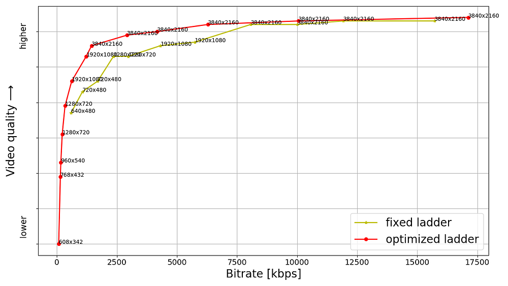
*Fig. 5: Example of a movie with action and great amount of rich spatial details showing new highest bitrate of 17.2 Mbps*

## Visual examples

As an example, we compare the 1.75 Mbps encode from the fixed-bitrate ladder with the 1.45 Mbps encode from the optimized ladder for one of the titles from our 4K collection. Since 4K resolution entails a rather large number of pixels, we show 1024x512 pixel cutouts from the two encodes. The encodes are decoded and scaled to a 4K canvas prior to extracting the cutouts. We toggle between the cutouts so it is convenient to spot differences. We also show the corresponding full frame which helps to get a sense of how the cutout fits in the corresponding video frame.

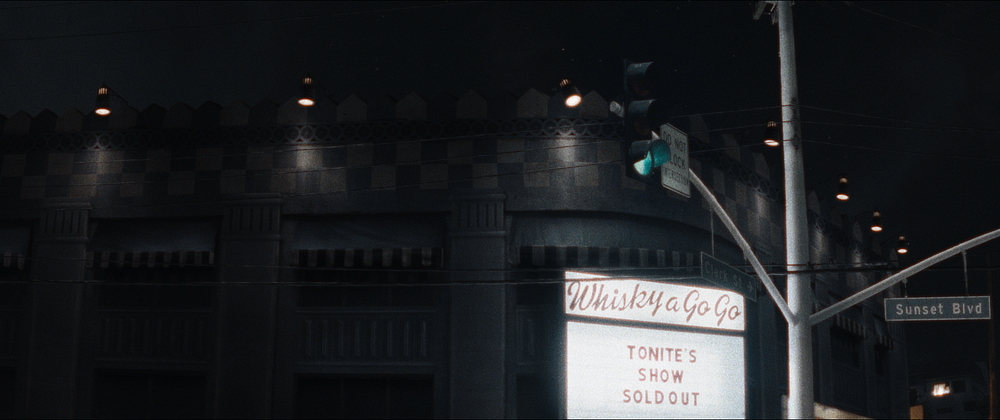
*Fig. 6: Pristine full frame — the purpose is to give a sense of how below cutouts fit in the frame*

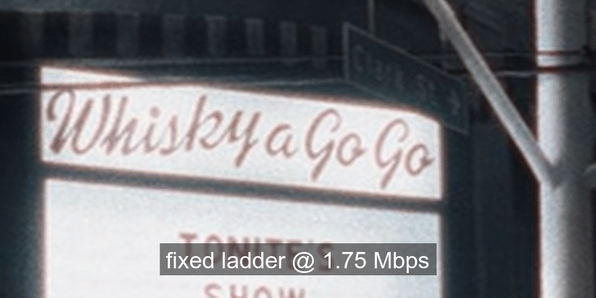

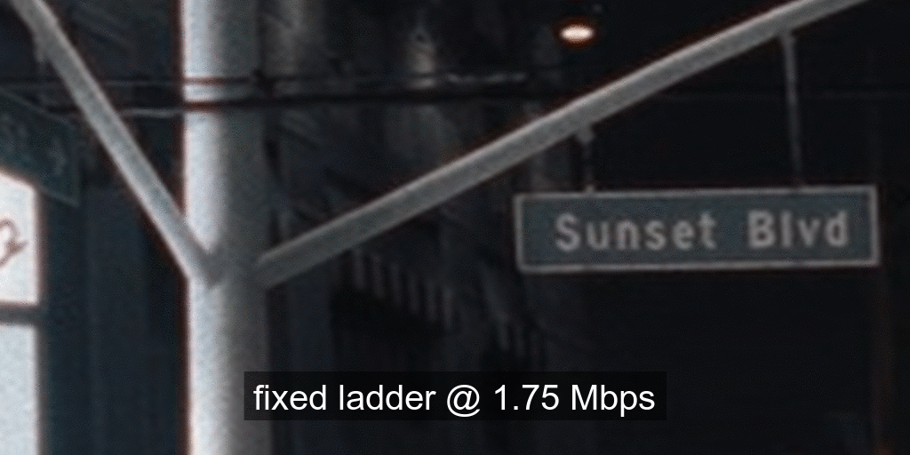

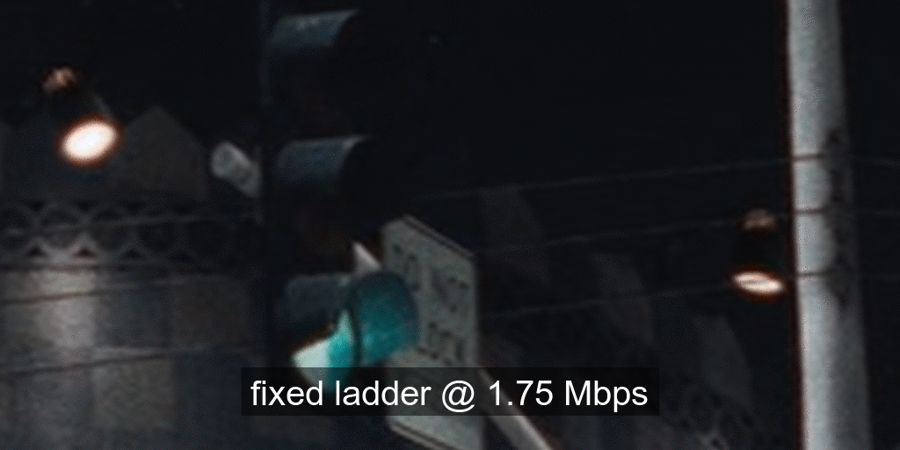
*Fig. 7: Toggling between 1024x512 pixel cutouts from two encodes as annotated. Corresponding to pristine frame shown in Figure 6.*

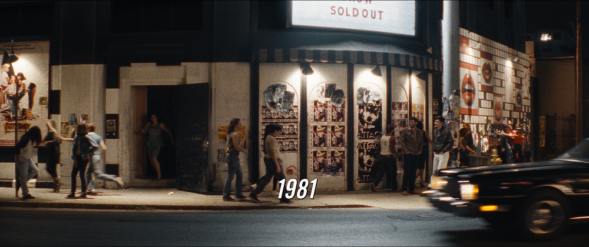
*Fig. 8: Pristine full frame — the purpose is to give a sense of how below cutouts fit in the frame*

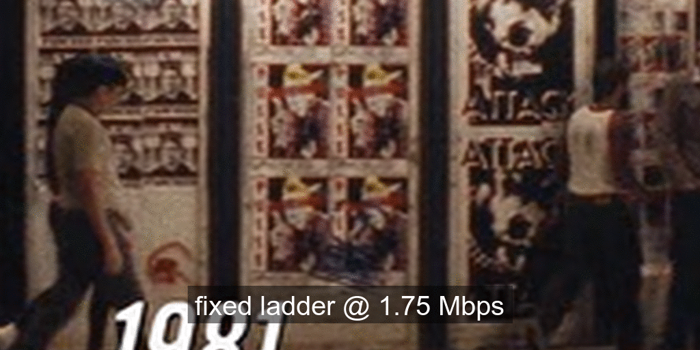

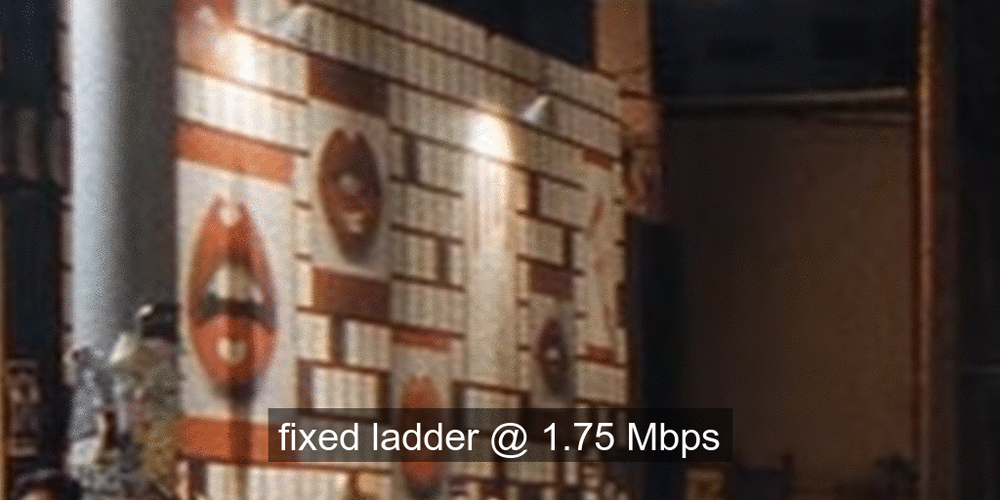
*Fig. 9: Toggling between 1024x512 pixel cutouts from two encodes as annotated. Corresponding to pristine frame shown in Figure 8.*

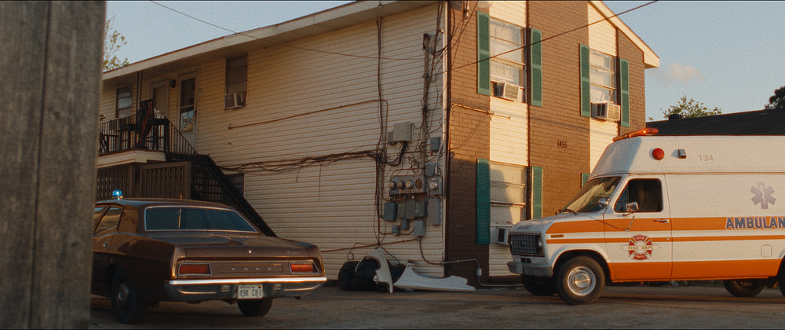
*Fig. 10: Pristine full frame — the purpose is to give a sense of how below cutouts fit in the frame*

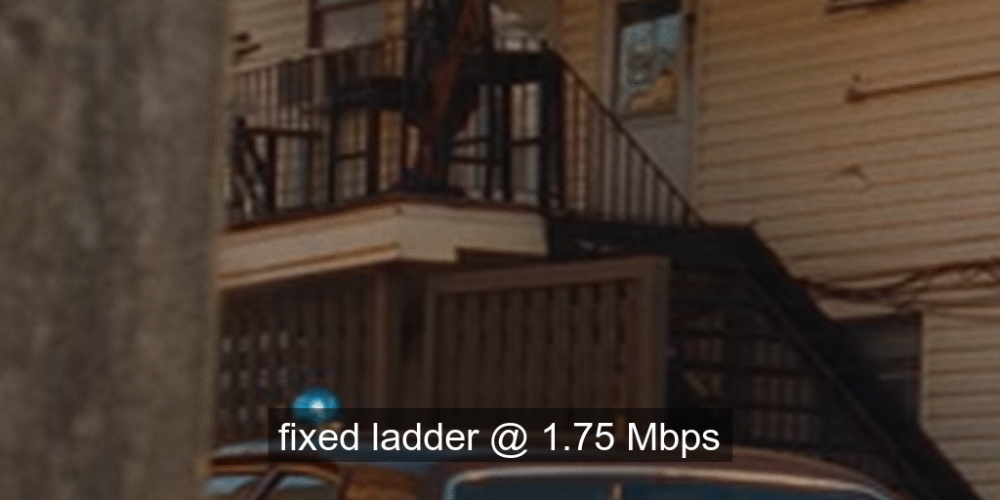

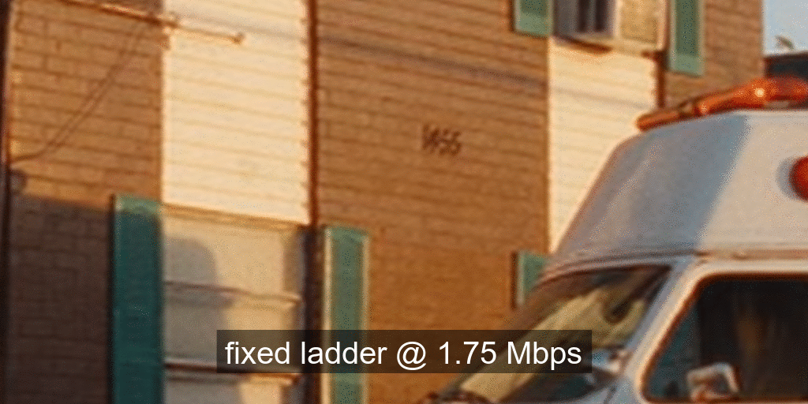
*Fig. 11: Toggling between 1024x512 pixel cutouts from two encodes as annotated. Corresponding to pristine frame shown in Figure 10.*

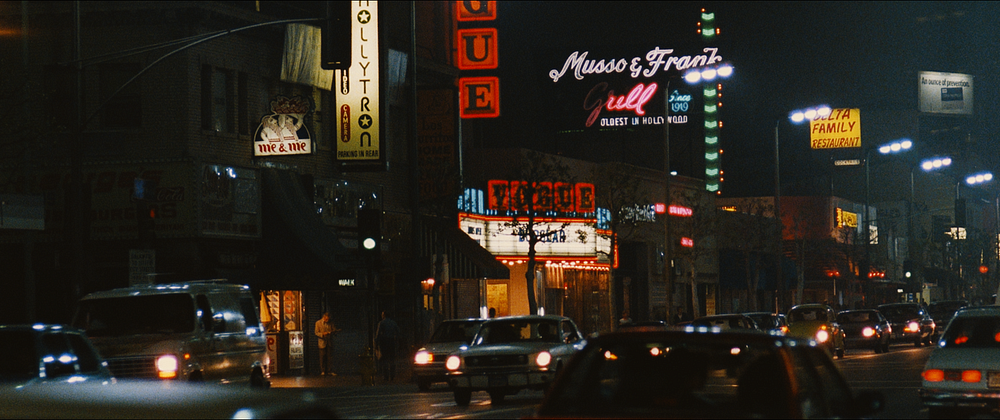
*Fig. 12: Pristine full frame — the purpose is to give a sense of how below cutouts fit in the frame*

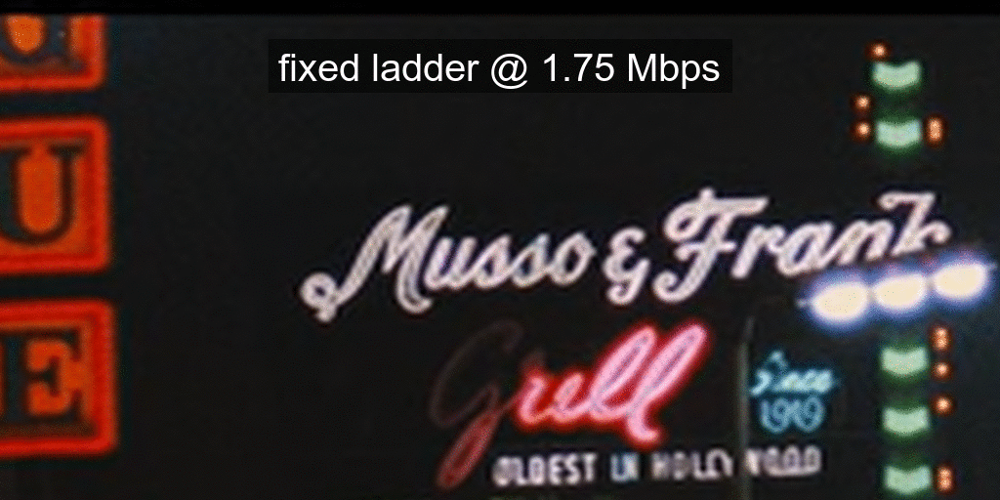

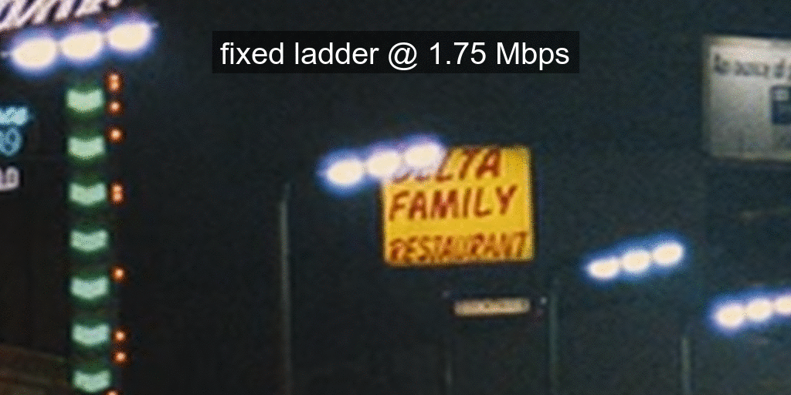
*Fig. 13: Toggling between 1024x512 pixel cutouts from two encodes as annotated. Corresponding to pristine frame shown in Figure 12.*

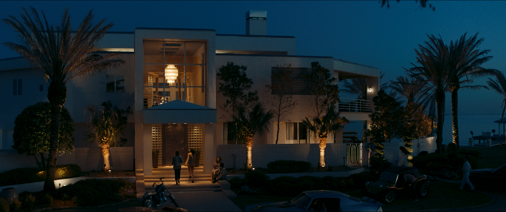
*Fig. 14: Pristine full frame — the purpose is to give a sense of how below cutouts fit in the frame*

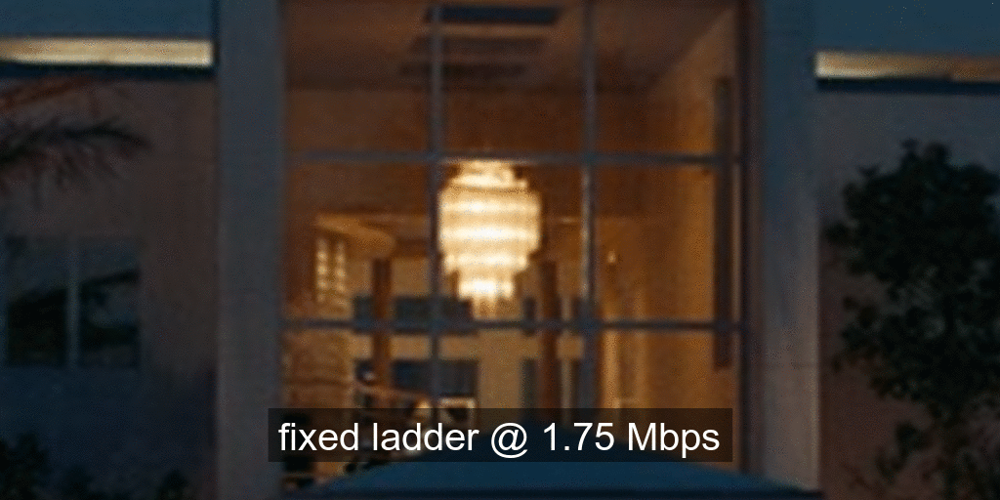
*Fig. 15: Toggling between 1024x512 pixel cutouts from two encodes as annotated. Corresponding to pristine frame shown in Figure 14.*

As can be seen, the encode from the optimized ladder delivers crisper textures and higher detail for less bits. At 1.45 Mbps it is by no means a perfect 4K rendition, but still very commendable for that bitrate. There exist higher bitrate points on the optimized ladder that deliver impeccable 4K quality, also for less bits compared to the fixed-bitrate ladder.

## Compression and bitrate ladder improvements

Even before testing the new streams in the field, we observe the following advantages of the optimized ladders vs the fixed ladders, evaluated over 100 sample titles:

- Computing the [Bjøntegaard Delta (BD) rate](https://www.itu.int/wftp3/av-arch/video-site/0104_Aus/VCEG-M33.doc) shows **_50% gains_** on average over the fixed-bitrate ladder. Meaning, on average we need **_50% less bitrate_** to achieve the same quality with the optimized ladder.
- The highest 4K bitrate on average is 8 Mbps which is also a **_50% reduction_** compared to 16 Mbps of the fixed-bitrate ladder.
- As mobile devices continue to improve, they adopt premium features (other than 4K resolution) like 10-bit and HFR. These video encodes can be delivered to mobile devices as well. The fixed-bitrate ladder starts at 560 kbps which may be too high for some cellular networks. The optimized ladder, on the other hand, has lower bitrate points that are viable in most cellular scenarios.
- The optimized ladder entails a smaller storage footprint compared to the fixed-bitrate ladder.
- The new ladder considers adding 1440p resolution (aka QHD) points if they lie on the convex hull of rate-quality tradeoff and most titles seem to get the 1440p treatment. As a result, when averaged over 100 titles, the bitrate required to jump to a resolution higher than 1080p (meaning either QHD or 4K) is **_1.7 Mbps compared to 8 Mbps_** of the fixed-bitrate ladder. When averaged over 100 titles, the bitrate required to jump to 4K resolution is **_3.2 Mbps compared to 8 Mbps_** of the fixed-bitrate ladder.

## Benefits to members

At Netflix we perform A/B testing of encoding optimizations to detect any playback issues on client devices as well as gauge the benefits experienced by our members. One set of streaming sessions receives the default encodes and the other set of streaming sessions receives the new encodes. This in turn allows us to compare error rates as well as various metrics related to quality of experience (QoE). Although our streams are standard compliant, the A/B testing can and does sometimes find device-side implementations with minor gaps; in such cases we work with our device partners to find the best remedy.

Overall, while A/B testing these new encodes, we have seen the following benefits, which are in line with the offline evaluation covered in the previous section:

- For members with high-bandwidth connections we deliver **_the same great quality at half the bitrate_** on average.
- For members with constrained bandwidth we deliver higher quality at the same (or even lower) bitrate — higher VMAF at the same encoding resolution and bitrate or even higher resolutions than they could stream before. For example, members who were limited by their network to 720p can now be served 1080p or higher resolution instead.
- Most streaming sessions start with a higher initial quality.
- **_The number of rebuffers per hour go down by over 65%_**; members also experience fewer quality drops while streaming.
- The reduced bitrate together with some Digital Rights Management (DRM) system improvements (not covered in this blog) result in **_reducing the initial play delay by about 10%_**.

## Next steps

We have started re-encoding the 4K titles in our catalog to generate the optimized streams and we expect to complete in a couple of months. We continue to work on applying similar optimizations to our HDR streams.

## Acknowledgements

We thank Lishan Zhu for help rendered during A/B testing.

This is a collective effort on the part of our larger team, known as Encoding Technologies, and various other teams that we have crucial partnerships with, such as:

- The various [client device and UI engineering teams](https://jobs.netflix.com/teams/client-and-ui-engineering) that manage the Netflix experience on various platforms
- The [data science and engineering teams](https://jobs.netflix.com/teams/data-science-and-engineering) that help us run and analyze A/B tests
- The [Open Connect](https://media.netflix.com/en/company-blog/how-netflix-works-with-isps-around-the-globe-to-deliver-a-great-viewing-experience) team that manages Netflix’s own content delivery network
- The [Product Edge](https://www.youtube.com/watch?v=5ju4W9KAzcY) team that steers the Netflix experience for every client device including the experience served in various encoding A/B tests
- The [Media Cloud Engineering](https://jobs.netflix.com/teams/studio-technologies) team that manages the compute platform/orchestration that enables us to execute video encoding at scale

If you are passionate about video compression research and would like to contribute to this field, we have an [open](https://jobs.netflix.com/jobs/867864) position.

---
**Tags:** Video Encoding · Video Compression · Netflix · Video Quality · Encoding
