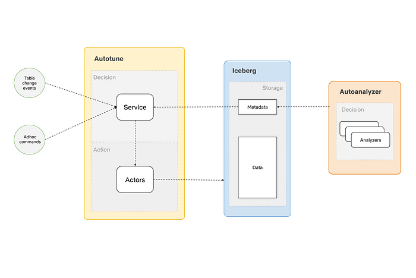
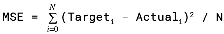
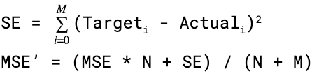
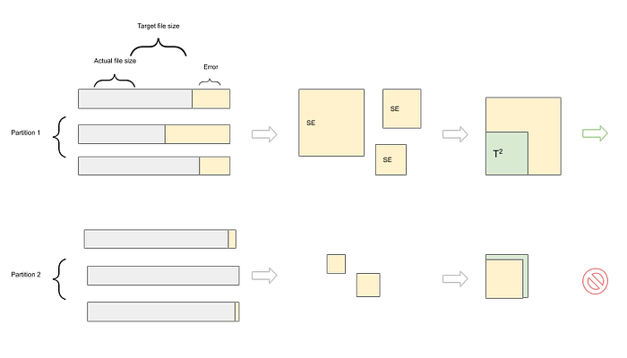
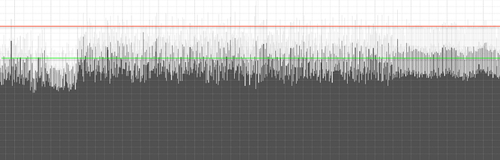
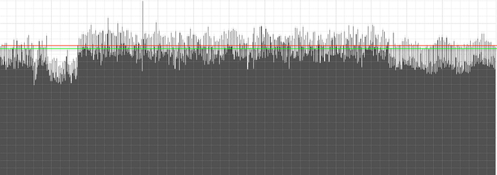
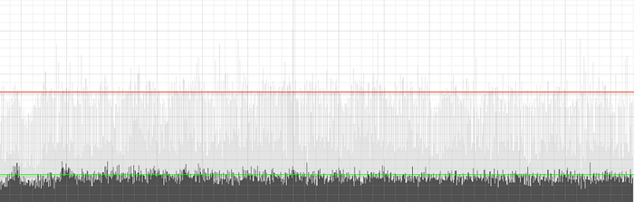
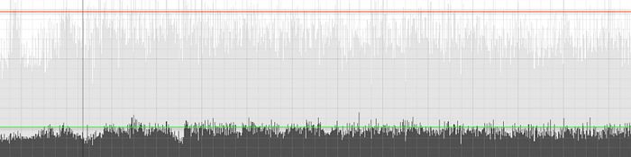

# Optimizing data warehouse storage

By [Anupom Syam](https://www.linkedin.com/in/anupom/)

## Background

At Netflix, our current data warehouse contains hundreds of Petabytes of data stored in [AWS S3](https://aws.amazon.com/s3/), and each day we ingest and create additional Petabytes. At this scale, we can gain a significant amount of performance and cost benefits by optimizing the storage layout (records, objects, partitions) as the data lands into our warehouse.

There are several benefits of such optimizations like saving on storage, faster query time, cheaper downstream processing, and an increase in developer productivity by removing additional ETLs written only for query performance improvement. On the other hand, these optimizations themselves need to be sufficiently inexpensive to justify their own processing cost over the gains they bring.

We built AutoOptimize to efficiently and transparently optimize the data and metadata storage layout while maximizing their cost and performance benefits.

This article will list some of the use cases of AutoOptimize, discuss the design principles that help enhance efficiency, and present the high-level architecture. Then deep dive into the merging use case of AutoOptimize and share some results and benefits.

## Use cases

We found several use cases where a system like AutoOptimize can bring tons of value. Some of the optimizations are prerequisites for a high-performance data warehouse. Sometimes Data Engineers write downstream ETLs on ingested data to optimize the data/metadata layouts to make other ETL processes cheaper and faster. The goal of AutoOptimize is to centralize such optimizations that will remove duplicate work and while doing it more efficiently than vanilla ETLs.

### Merge

As the data lands into the data warehouse through real-time data ingestion systems, it comes in different sizes. This results in a perpetually increasing number of small files across the partitions. Merging those numerous smaller files into a handful of larger files can make query processing faster and reduce storage space.

### Sort

Presorted records and files in partitions make queries faster and save significant amounts of storage space as it enables a higher level of compression. We already had some existing tables with sorting stages to reduce table storage and improve downstream query performance.

### Compaction

Modern data warehouses allow updating and deleting pre-existing records. [Iceberg](https://iceberg.apache.org/) plans to enable this in the form of delta files. Over time, the number of delta files grows, and compacting them to their source files can make the read operations more optimal.

### Metadata optimization

In [Iceberg](https://iceberg.apache.org/), the physical partitioning is decoupled from logical partitioning by keeping a map to file locations in the metadata. This enables us to add additional indexes in the metadata to make point queries more optimal. We can also reorganize the metadata to make file scanning much faster.

## Design Principles

For AutoOptimize to efficiently optimize the data layout, we’ve made the following choices:

1. **Just in time** vs. periodic optimization  
Only optimize a given data set when required (based on what changed) instead of blind periodic runs.
2. **Essential** vs. complete optimization  
Allow users to optimize at the point of diminishing returns instead of a binary setting. For example, we allow a partition to have a few small files instead of always merging files in perfect sizes.
3. **Minimum replacement** vs. full overwrite  
Only replace the required minimum amount of files instead of a full sweep overwrite.

These principles reduce resource usage by being more efficient and effective while lowering the end-to-end latency in data processing.

Other than these principles, there are some other design considerations to support and enable:

- Multi-tenancy with database and table prioritization.
- Both automatic (event-driven) as well as manual (ad-hoc) optimization.
- Transparency to end-users.

## High-Level Design

*AutoOptimize High-Level Design*

AutoOptimize is split into 2 subsystems (Service and Actors) to decouple the decisions from the actions at a high level. This decoupling of responsibilities helps us to design, manage, use, and scale the subsystems independently.

### AutoOptimize Service

The service is the decision-maker. It decides what to do and when to do in response to an incoming event. It is responsible for listening to incoming events and requests and prioritizing different tables and actions to make the best usage of the available resources.

The work done in the service can be further broken down into the following 3 steps:

**Observe:** Listen to changes in the warehouse in near real-time. Also, respond to ad-hoc requests created manually by end-users.

**Orient:** Gather tuning parameters for a particular table that changed. Also, adjust the resource allocation for the table or the number of actors depending on the backlog.

**Decide:** Determine the highest value action with the right parameters for this particular change and when to act depending on how the action falls in the global priority across all tables and actions.

In AutoOptimize, the service is a cluster of Java (Spring Boot) applications using Redis to keep the states.

### AutoOptimize Actors

Actors in AutoOptimize are responsible for the actual work (merging/sorting/compaction etc.). The AutoOptimize Service sends commands to the actors that specify what to do. The job of Actors is to perform those commands in a distributed and fault-tolerant manner.

**Actors in AutoOptimize are a pool of long-running Spark jobs managed by the AutoOptimize service.**

> This was not intentional but we found that the way we modularized AutoOptimize’s decision-making workflow is very similar to the [OODA loop](https://en.wikipedia.org/wiki/OODA_loop) and decided to use the same taxonomy.

### Other Components

**Iceberg  
**We use [Apache Iceberg](https://iceberg.apache.org/) as the table format. AutoOptimize relies on some of the Iceberg specific features such as snapshot and atomic operations to perform the optimizations in an accurate and scalable manner.

**AutoAnalyze  
**In short, AutoAnalyze finds the best tuning/configuration parameters for a table. It uses “What-If” experiments and previous experiences and heuristics to find the most fitting attributes for a table. We will publish a follow-up blog post about AutoAnalyze in the future. For AutoOptimize, it may find if a table needs file merging or suggest a target file size and other parameters.

## Deep Dive into File Merge

File merge is the first use-case that we built for AutoOptimize. Previously we had our homegrown system called [Ursula](https://netflixtechblog.com/hadoop-platform-as-a-service-in-the-cloud-c23f35f965e7) responsible for data ingestion into the Hive based warehouse. The Ursula based pipeline also performed file merges on the ingested table partitions periodically. Since then, we have moved our ingestion to [Keystone](https://netflixtechblog.com/keystone-real-time-stream-processing-platform-a3ee651812a) and our table layout to [Iceberg](https://iceberg.apache.org/).

The migration out of Ursula to Keystone/Iceberg based ingestion initiated the need for a replacement for Ursula file merge. File merging is necessary for a low latency streaming ingestion pipeline as data often arrive late and unevenly. The number of small files cripples across partitions over time and can have some serious side effects like:

1. Slowing down queries.
2. More processing resources.
3. Increase in storage space.

The goal of File merge in AutoOptimize is to efficiently reduce the side effects while not adding additional latency to the data pipeline.

## Solutions

This section will discuss some of the solutions that helped us achieve the previously stated goals.

### Just in time optimization

AutoOptimize file merge gets triggered via table change events. This allows AutoOptimize to act right away with a minimum lag. But the problem with being event-driven is it’s expensive to scan the changed partitions every time they change. If we can determine “how noisy” a partition is from the changesets in a rolling manner, we will eliminate unnecessary full partition scanning with early signals from snapshots.

### Essential work

After a full partition scan, AutoOptimize gets a more comprehensive view of the state of the partition. We can get a more accurate state of the partition at this stage and avoid non-essential work.

**Partition Entropy  
**We introduced a concept called Partition Entropy (_PE_) used for early pruning at each step to reduce actual work. It’s a set of stats about the state of the partition. We calculate this in a rolling manner after each snapshot scan and more exhaustively after each partition scan.

The parts of PE that deal with file sizes are called File Size Entropy (_FSE_). _FSE_ of a partition is derived from the Mean Squared Error (_MSE_) of file sizes in a partition. We will use the terms _FSE_ and _MSE_ interchangeably.

We use the standard [Mean Squared Error](https://en.wikipedia.org/wiki/Mean_squared_error) formula:

Where,

**_N_** = Number of files in the partition  
**_Target_** = Target File Size  
**_Actual_** = **_min_**(Actual File Size, **_Target_**)

When a partition is scanned, it’s easy to calculate the _MSE_ using the above formula as we know the sizes of all files in that partition. We store the _MSE_ and N for each partition in Redis for later use.

At the snapshot scan stage, we get a commit definition containing the list of files and their metadata (like size, number of records, etc.) that got added and deleted in the commit. We calculate the new _MSE’_ of a changed partition in a rolling manner from the snapshot information and the previously stored stats using this formula:

Where,

**_M _**= Number of files added in the snapshot.  
**_Target_** = Target File Size.  
**_Actual_** = **_min_**(Actual File Size, **_Target_**)  
**_N_** = Previously stored number of files in the partition.  
**_MSE_** = Previously stored _MSE._

We have a tolerance threshold (_T_) for each partition and skip further processing of the partition if _MSE < T²_. This helps us significantly reduce the number of full partition scans at the snapshot scan step and the number of actual merges in the partition scan stage.

*Entropy-Based Filtering*

> The actual formulas are a little bit more complicated than what stated here, as we need to take care of deleted files and some other edge cases. We could also use [Mean Absolute Error](https://en.wikipedia.org/wiki/Mean_absolute_error) but we want to be biased towards outliers — as the goal is to have a more even file size in a partition than having a mixed bag of different sizes with some perfect sized files.

### Minimum replacement

Once we start processing a partition, we find the minimum amount of work needed to reduce the File Size Entropy and thus reduce the number of small files.

We use 2 different packing algorithms to achieve this:

**Knuth/Plass line breaking algorithm  
**We use [this strategy](http://www.eprg.org/G53DOC/pdfs/knuth-plass-breaking.pdf) when the sort order among files is important. With a correct error function (ex: _Error_²), this algorithm helps minimize _MSE_ with a bounding run time of O(_n_²).

**First Fit Decreasing bin packing algorithm  
**We use a modified version of the original FFD algorithm if we can ignore the sort order. This helps reduce the number of replacements with an O(_nlog_(_n_)) running time.

These methods help us smooth out the file size histogram while doing it optimally with minimal file replacement.

### Multi-tenancy

AutoOptimize is multi-tenant; that is, it runs on many different databases and tables. When running the optimizations, it also needs to prioritize and allocate resources at different levels for different tasks. It requires answering questions like which table should be processed first or get more resource bandwidth or what optimization gives the most ROI.

To support multi-tenancy and tasks prioritization, it needs to have the following properties:

- Weighted resource sharing across different priorities.
- Fair resource sharing across different tables and tasks with the same priority.
- Handle bursts to prevent starvation.

We use different types of Weighted Fair Queue implementations inside AutoOptimize, including different combinations of the followings:

1. [Weighted Round Robin](https://en.wikipedia.org/wiki/Weighted_round_robin)
2. [Deficit Weighted Round Robin](http://pages.cs.wisc.edu/~akella/CS740/S07/740-Papers/SV95.pdf)
3. [Fixed Priority Preemptive](https://en.wikipedia.org/wiki/Fixed-priority_pre-emptive_scheduling)

**Reliable Priority Queue  
**To support prioritization and fair resource usage, we introduced a concept called Reliable Priority Queue (RPQ) in AutoOptimize. A reliable queue does not lose items if the subscriber fails to process the items after a dequeue. An RPQ also has a sense of prioritization across different items while being reliable. The concept is fairly similar to the default Redis [RPOPLPUSH reliable queue pattern](https://redis.io/commands/rpoplpush#pattern-reliable-queue). But for AutoOptimize’s use case, we use Sorted Sets instead of lists to enable prioritization.

The goal of AutoOptimize is to optimize the warehouse with a holistic perspective. Making it multi-tenant with a notion of different priorities helps us make the most optimal resource allocation.

## Results

**22% reduction in partition scans**

**2% reduction in merge actions**

**72% reduction in file replacements**

These savings are stacked on top of each other as they are applied in sequence in the AutoOptimize pipeline. This results in a massive reduction in actual processing need while reducing the number of files by 80%.

**80% reduction in the number of files**

**70% saving in compute**

We are using 70% less compute instances than our previous merge implementation.

We also see **up to 60%** improvement in query performance and an additional 1% saving in storage.

## Benefits

**Increase processing efficiency: **As AutoOptimize uses file replacement and can avoid processing by filtering early, it can save processing costs by skipping files that are not required to be merged.

**Increase storage efficiency:** AutoOptimize helps save storage costs by enabling AutoAnalyze recommendations to sort the records.

**Reduce lag:** Periodic overwrite ETLs take more time as it works in batches. AutoOptimize reduces end to end lag in data processing by optimizing as we go.

**Faster query: **A smaller number of files results in smaller file scanning, fewer network calls, and makes queries faster.

**Ease of use:** AutoOptimize provides a frictionless way to setup optimization with minimum maintenance overhead from Data Engineering.

**Developer productivity:** Instead of adding an ETL per table for merging, which adds ongoing incremental maintenance cost, we have a single solution that can transparently scale to many tables.

## Conclusion

We believe the problems we faced at Netflix are not unique, and some of the techniques and design considerations we made can be applied more generally. By laying out the data intelligently as they are ingested into the warehouse, we are removing complexities for Data Engineers and accelerating the end-to-end pipeline. At the same time, we are gaining a significant amount of performance and cost improvement by optimizing only when it makes sense. We plan to extend AutoOptimize into other use cases and integrate it more with the Iceberg ecosystem in the future.

---
**Tags:** Data Platforms · Optimization · Big Data · Big Data Infrastructure · Data Infrastructure
