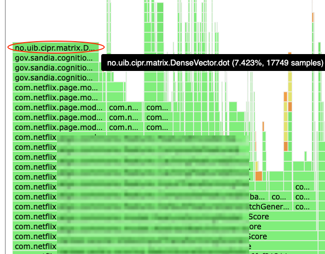
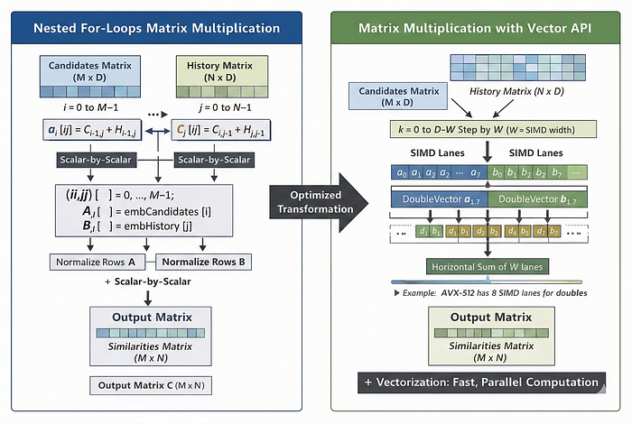
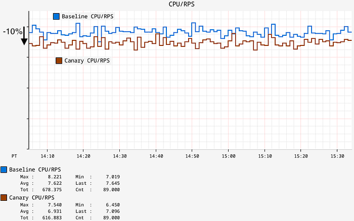
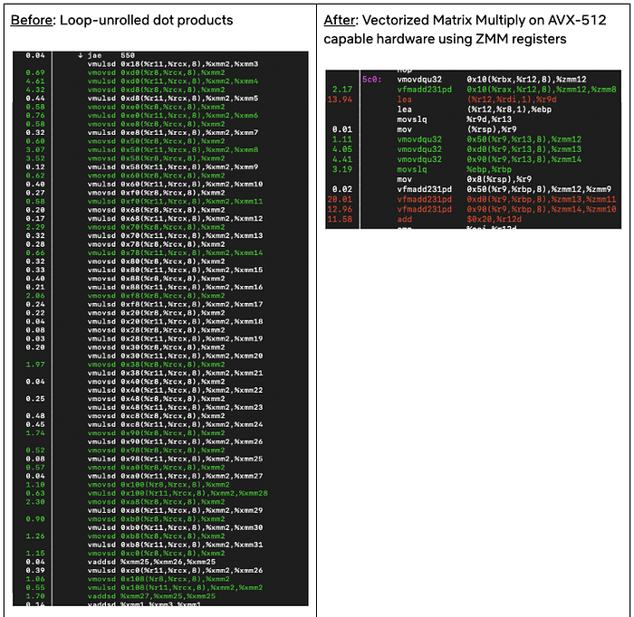

# Optimizing Recommendation Systems with JDK’s Vector API

_By _[_Harshad Sane_](https://www.linkedin.com/in/harshad-sane-56711a11/)

Ranker is one of the largest and most complex services at Netflix. Among many things, it powers the personalized rows you see on the Netflix homepage, and runs at an enormous scale. When we looked at CPU profiles for this service, one feature kept standing out: **video serendipity scoring** — the logic that answers a simple question:

_“How different is this new title from what you’ve been watching so far?”_

This single **feature** was consuming about 7.5% of total CPU on each node running the service. What started as a simple idea — “just batch the video scoring feature” — turned into a deeper optimization journey. Along the way we introduced batching, re-architected memory layout and tried various libraries to handle the scoring kernels.

Read on to learn how we achieved the same serendipity scores, but at a meaningfully lower CPU per request, resulting in a reduced cluster footprint.

## Problem: The Hotspot in Ranker

At a high level, serendipity scoring works like this: A candidate title and each item in a member’s viewing history are represented as embeddings in a vector space. For each candidate, we compute its similarity against the history embeddings, find the maximum similarity, and convert that into a “novelty” score. That score becomes an input feature to the downstream recommendation logic.

The original implementation was straightforward but expensive. For each candidate we fetch its embedding, loop over the history to compute cosine similarity one pair at a time and track the maximum similarity score. Although it is easy to reason about, at Ranker’s scale, this results in significant sequential work, repeated embedding lookups, scattered memory access, and poor cache locality. Profiling confirmed this.


*Flamegraph showing inefficient scoring*

A flamegraph made it clear: One of the top hotspots in the service was Java dot products inside the serendipity encoder. Algorithmically, the hotspot was a nested loop structure of M candidates × N history items where each pair generates its own cosine similarity i.e. O(M×N) separate dot product operations.

## Solution

### The Original Implementation: Single video cosine loop

In simplified form the code looked like this:

```
for (Video candidate : candidates) {
  Vector c = embedding(candidate); // D-dimensional
  double maxSim = -1.0;

  for (Video h : history) {
    Vector v = embedding(h); // D-dimensional
    double sim = cosine(c, v); // dot(c, v) / (||c|| * ||v||)
    maxSim = Math.max(maxSim, sim);
  }

  double serendipity = 1.0 - maxSim;
  emitFeature(candidate, serendipity);
}
```

The nested for loop with O(M×N) separate dot products brought upon its own overheads. One interesting detail we learned by instrumenting traffic shapes: most requests (about 98%) were single-video, but the remaining 2% were large batch requests. Because those batches were so large, the total volume of videos processed ended up being roughly 50:50 between single and batch jobs. This made batching worth pursuing even if it didn’t help the median request.

### Step 1 : Batching, from Nested Loops to Matrix Multiply

The first idea was to stop thinking in terms of “many small dot products” and instead treat the work as a matrix operation. i.e. For batch candidates, implement a data layout to parallelize the math in a single operation i.e. matrix multiply. If `D` is the embedding dimension:

1. Pack all candidate embeddings into a matrix A of shape `M x D`
2. Pack all history embeddings into a matrix B of shape `N x D`
3. Normalize all rows to unit length.
4. Compute: cosine similarities as   
 [ C = A x B^T ]; where C is an M x N matrix of cosine similarities.

In pseudo‑code:

```
// Build matrices
double[][] A = new double[M][D]; // candidates
double[][] B = new double[N][D]; // history

for (int i = 0; i < M; i++) {
  A[i] = embedding(candidates[i]).toArray();
}
for (int j = 0; j < N; j++) {
  B[j] = embedding(history[j]).toArray();
}

// Normalize rows to unit vectors
normalizeRows(A);
normalizeRows(B);

// Compute C = A * B^T
double[][] C = matmul(A, B);
C[i][j] = cosine(candidates[i], history[j])

// Derive serendipity
for (int i = 0; i < M; i++) {
  double maxSim = max(C[i][0..N-1]);
  double serendipity = 1.0 - maxSim;
  emitFeature(candidates[i], serendipity);
}
```

This turns **M×N separate dot products into a single matrix multiply**, which is exactly what CPUs and optimized kernels are built for. We integrated this into the existing framework by supporting both, `encode()`for single videos and `batchEncode()` for batches, while maintaining backward compatibility. At this point it seemed like we were “done”, but we weren't.

### Step 2: When Batching Isn’t Enough

Once we had a batched implementation, we ran canaries and saw something surprising: about a 5% performance regression. The algorithm wasn’t the issue — turning M×N separate dot products into a matrix multiplication is mathematically sound. The problem was the overhead we introduced in the first implementation.

1. Our initial version built `double[][]` matrices for candidates, history, and results on every batch. Those large, short-lived allocations created GC pressure, and the `double[][]` layout itself is non-contiguous in memory, which meant extra pointer chasing and worse cache behavior.
2. On top of that, the first-cut Java matrix multiply was a straightforward scalar implementation, so it couldn’t take advantage of SIMD. In other words, we paid the cost of batching without getting the compute efficiency we were aiming for.

The lesson was immediate: algorithmic improvements don’t matter if the implementation details—memory layout, allocation strategy, and the compute kernel—work against you. That set up the next step for making the data layout cache-friendly and eliminating per-batch allocations before revisiting the matrix multiply kernel.

### Step 3: Flat Buffers & ThreadLocal Reuse

We reworked the data layout to be cache-friendly and allocation-light. Instead of `double[m][n]`, we moved to flat `double[]` buffers in row-major order. That gave us contiguous memory and predictable access patterns. Then we introduced a `ThreadLocal<BufferHolder>` that owns reusable buffers for candidates, history, and any other scratch space. Buffers grow as needed but never shrink, which avoids per-request allocation while keeping each thread isolated (no contention). A simplified sketch:

```
class BufferHolder {  
  double[] candidatesFlat = new double[0];  
  double[] historyFlat = new double[0];  

  double[] getCandidatesFlat(int required) {  
    if (candidatesFlat.length < required) {  
      candidatesFlat = new double[required];  
    }  
    return candidatesFlat;  
  }  
  
  double[] getHistoryFlat(int required) {  
    if (historyFlat.length < required) {  
      historyFlat = new double[required];  
    }  
    return historyFlat;  
  }  
}  

private static final ThreadLocal<BufferHolder> threadBuffers =  
    ThreadLocal.withInitial(BufferHolder::new);
```

This change alone made the batched path far more predictable: fewer allocations, less GC pressure, and better cache locality.

Now the remaining question was the one we originally thought we were answering: what’s the best way to do the matrix multiply?

**Step 4: BLAS: Great in Tests, Not in Production**

The obvious next step was BLAS (Basic Linear Algebra Subprograms). In isolation, microbenchmarks looked promising. But once integrated into the real batch scoring path, the gains didn’t materialize. A few things were working against us:

- The default `netlib-java` path was using F2J (Fortran-to-Java) BLAS rather than a truly native implementation.
- Even with native BLAS, we paid overhead for setup and JNI transitions.
- Java’s row-major layout doesn’t match the column-major expectations of many BLAS routines, which can introduce conversion and temporary buffers.
- Those extra allocations and copies mattered in the full pipeline, especially alongside TensorFlow embedding work.

BLAS was still a useful experiment — it clarified where time was being spent, but it wasn’t the drop-in win we wanted. What we needed was something that stayed pure Java, fit our flat-buffer architecture, and could still exploit SIMD.

**Step 5: JDK Vector API to the rescue**

**_A Short Note on the JDK Vector API: _**The JDK Vector API is an _incubating_ feature that provides a portable way to express data-parallel operations in Java — think “SIMD without intrinsics”. You write in terms of vectors and lanes, and the JIT maps those operations to the best SIMD instructions available on the host CPU (SSE/AVX2/AVX-512), with a scalar fallback when needed. More crucially for us, it’s pure Java: no native dependencies, no JNI transitions, and a development model that looks like normal Java code rather than platform-specific assembly or intrinsics.

This was a particularly good match for our workload because we had already moved embeddings into flat, contiguous `double[]` buffers, and the hot loop was dominated by large numbers of dot products. The final step was to replace BLAS with a pure-Java SIMD implementation using the JDK Vector API. By this point we already had the right shape for high performance — batching, flat buffers, and ThreadLocal reuse. So the remaining work was to swap out the compute kernel without introducing JNI overhead or platform-specific code. We did that behind a small factory. At class load time, `MatMulFactory` selects the best available implementation:

- If `jdk.incubator.vector` is available, use a Vector API implementation.
- Otherwise, fall back to a scalar implementation with a highly optimized loop-unrolled dot product (implemented by my colleague Patrick Strawderman, inspired by patterns used in [Lucene](https://github.com/apache/lucene/blob/6d4314d46fd69ca16edce0cd1c8507aa0e66ccd6/lucene/core/src/java/org/apache/lucene/util/VectorUtilDefaultProvider.java#L26))

In the Vector API implementation, the inner loop computes a dot product by accumulating `a * b` into a vector accumulator using `fma()` (fused multiply-add). `DoubleVector.SPECIES_PREFERRED` lets the runtime pick an appropriate lane width for the machine. Here’s a simplified sketch of the inner loop:

```
// Vector API path (simplified)  
for (int i = 0; i < M; i++) {  
  for (int j = 0; j < N; j++) {  
  
  DoubleVector acc = DoubleVector.zero(SPECIES);  
    int k = 0;  
    // SPECIES.length() (e.g. often 4 doubles on AVX2 and 8 doubles on AVX-512). 
    for (; k + SPECIES.length() <= D; k += SPECIES.length()) {  
      DoubleVector a = DoubleVector.fromArray(SPECIES, candidatesFlat, i*D + k);  
      DoubleVector b = DoubleVector.fromArray(SPECIES, historyFlat,   j*D + k);
      acc = a.fma(b, acc);  // fused multiply-add  
    }  
    double dot = acc.reduceLanes(VectorOperators.ADD);  
    // handle tail k..D-1  
    similaritiesFlat[i*N + j] = dot;  
  }  
}
```

Figure below shows how the Vector API utilizes SIMD hardware to process multiple doubles per instruction (e.g., 4 lanes on AVX2 and 8 lanes on AVX‑512). What used to be many scalar multiply-adds becomes a smaller number of vector `fma()` operations plus a reduction—same algorithm, much better use of the CPU’s vector units.


*Vectorization with SIMD*

### Fallbacks & Safety: When the Vector API Isn’t Available

Because the Vector API is still incubating, it requires a runtime flag: `--add-modules=jdk.incubator.vector` We didn’t want correctness or availability to depend on that flag. So we designed the fallback behavior explicitly: At startup, we detect Vector API support and use the SIMD batched matmul when available; otherwise we fall back to an optimized scalar path, with single-video requests continuing to use the per-item implementation.

That gives us a clean operational story: services can opt in to the Vector API for maximum performance, but the system remains safe and predictable without it.

### Results in Production:

With the full design in place with batching, flat buffers, ThreadLocal reuse, and the Vector API, we ran canaries that run production traffic. We observed a ~7% drop in CPU utilization and ~12% drop in average latency. To normalize across any small throughput differences, we also tracked CPU/RPS (CPU consumed per request-per-second). That metric improved by roughly 10%, meaning we could handle the same traffic with about 10% less CPU, and we saw similar numbers hold after full production rollout.


*CPU/RPS on Ranker*

At the function operator level, we saw the CPU drop from the initial 7.5% to a merely ~1% with the optimization in place. At the assembly level, the shift was clear: from loop-unrolled scalar dot products to a vectorized matrix multiply on AVX-512 hardware.


*Assembly snippet from batchEncode*

## Closing Thoughts

This optimization ended up being less about finding the “fastest library” and more about getting the fundamentals right: choosing the right computation shape, keeping data layout cache-friendly, and avoiding overheads that can erase theoretical wins. Once those pieces were in place, the JDK Vector API was a great fit, as it let us express SIMD-style math in pure Java, without JNI, while still keeping a safe fallback path. Another bonus was the low developer overhead: compared to lower-level approaches, the Vector API let us replace a much larger, more complex implementation with a relatively small amount of readable Java code, which made it easier to review, maintain, and iterate on.

Have you tried the Vector API in a real service yet? I’d love to hear what workloads it helped (or didn’t), and what you learned about benchmarking and rollout in production.


---

_Special thanks to _[_Jason Koch_](https://www.linkedin.com/in/jason-koch-5692172/)_, _[_Patrick Strawderman_](https://www.linkedin.com/in/patrickstrawderman/)_, _[_Daniel Huang_](https://www.linkedin.com/in/yuewangh/)_, _[_Fan Yang_](https://www.linkedin.com/in/fan-yang-a15ba249/)_, and the Performance Engineering team at Netflix_

---
**Tags:** Performance · Java · Machine Learning · Netflix · Simd
