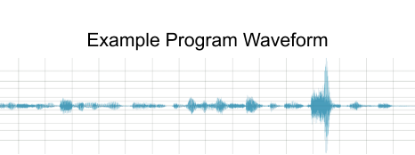
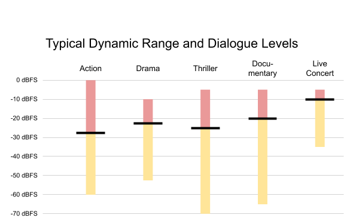
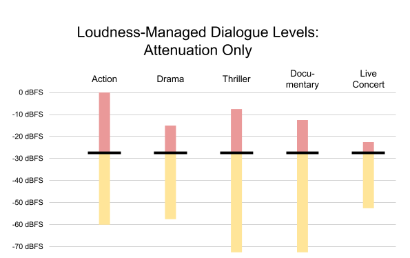
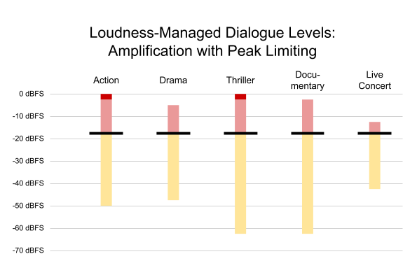
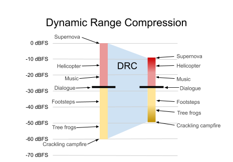
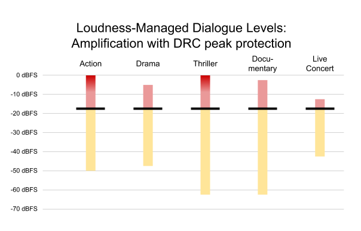
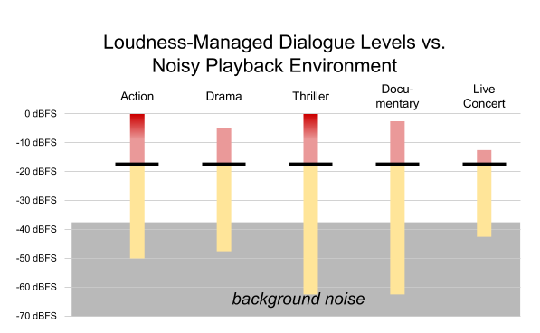
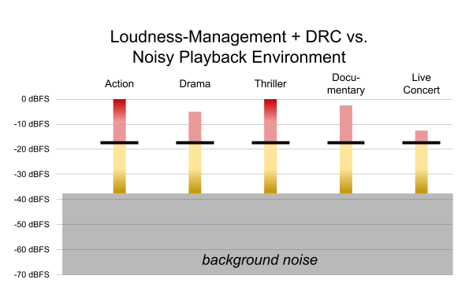
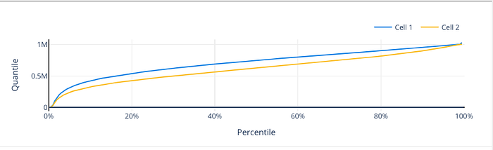
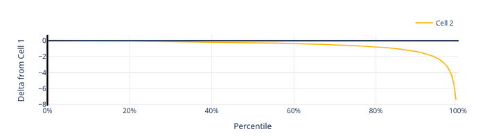

# Optimizing the Aural Experience on Android Devices with xHE-AAC

By [Phill Williams](https://www.linkedin.com/in/phillipwilliams) and [Vijay Gondi](https://www.linkedin.com/in/vijay-gondi-755237/)

## Introduction

At Netflix, we are passionate about delivering great audio to our members. We began streaming 5.1 channel surround sound in 2010, [Dolby Atmos in 2017](https://media.netflix.com/en/company-blog/dolby-atmos-coming-to-netflix), and [adaptive bitrate audio in 2019](./engineering-a-studio-quality-experience-with-high-quality-audio-at-netflix-eaa0b6145f32.md). Continuing in this tradition, we are proud to announce that Netflix now streams Extended HE-AAC with MPEG-D DRC ([xHE-AAC](https://www.iis.fraunhofer.de/en/ff/amm/broadcast-streaming/xheaac.html)) to compatible Android Mobile devices (Android 9 and newer). With its capability to improve intelligibility in noisy environments, adapt to variable cellular connections, and scale to studio-quality, xHE-AAC will be a sonic delight to members who stream on these devices.

## xHE-AAC Features

### MPEG-D DRC

One way that xHE-AAC brings value to Netflix members is through its mandatory [MPEG-D DRC](https://www.iso.org/standard/75930.html) metadata. We use APIs described in the [MediaFormat](http://developer.android.com/reference/android/media/MediaFormat.html) class to control the experience in decoders. In this section we will first describe loudness and dynamic range, and then explain how MPEG-D DRC in xHE-AAC works and how we use it.

### Dialogue Levels and Dynamic Range

In order to understand the utility of loudness management & dynamic range control, we first must understand the phenomena that we are controlling. As an example, let’s start with the waveform of a program, shown below in Figure 1.

*Figure 1. Example program waveform*

To measure a program’s dynamic range, we break the waveform into short segments, such as half-second intervals, and compute the [RMS](https://en.wikipedia.org/wiki/Root_mean_square) level of each segment in [dBFS](https://en.wikipedia.org/wiki/DBFS). The summary of those measurements can be plotted on a single vertical line, as shown below in Figure 2. The ambient sound of a campfire may be up to 60 dB softer than the exploding car in an action scene. The **dynamic range** of a program is the difference between its quietest and the loudest sounds. So in our example, we would say that the program has a dynamic range of 60 dB. We will revisit this example in the section that discusses dynamic range control.

*Figure 2. Dynamic range of a program with some examples*

[**Loudness**](https://en.wikipedia.org/wiki/Loudness) is the subjective perception of [sound pressure](https://en.wikipedia.org/wiki/Sound_pressure). Although it is most directly correlated with sound pressure level, it is also affected by the duration and spectral makeup of the sound. [Research](https://www.aes.org/e-lib/browse.cfm?elib=12415) has shown that, in cinematic and television content, the **dialogue level** is the most important element to viewers’ perception of a program’s loudness. Since it is the critical component of program loudness, dialogue level is indicated with a bold black line in Figure 2.

Not every program has the same dialogue level or the same dynamic range. Figure 3 shows a variety of dialogue levels and dynamic ranges for different programs.

*Figure 3. Typical dynamic range and dialogue levels of a variety of content. Black lines indicate average dialogue level; red and yellow are used for louder/softer sounds.*

The action film contains dialogue at -27 dBFS, leaving headroom for loud effects like explosions. On the other hand, the live concert has a relatively small dynamic range, with dialogue near the top of the mix. Other shows have varying dialogue levels and varying dynamic ranges. Each show is mixed based on a unique set of conditions.

Now, imagine you were watching these shows, one after the other. If you switched from the action show to the live concert, you would likely be diving for the volume control to turn it down! Then, when the drama comes on, you might not be able to understand the dialogue until you turn the volume back up. If you were to switch partway through shows, the effect might even be more pronounced. This is what loudness management aims to solve.

### Loudness Management

The goal of loudness management is to **play all titles at a consistent volume, relative to each other. **When it is working effectively, once you set your volume to a comfortable level, you never have to change it, even as you switch from a movie to a documentary, to a live concert. Netflix specifically aims to **play all dialogue at the same level.** This is consistent with the North American television broadcasting standard [ATSC A/85](https://www.atsc.org/atsc-documents/a85-techniques-for-establishing-and-maintaining-audio-loudness-for-digital-television/) and [AES71](https://www.aes.org/publications/standards/search.cfm?docID=107) recommendations for online video distribution.

The loudness metrics of all Netflix content are measured before encoding. Since our goal is to play all dialogue at the same level, we use anchor-based (dialogue) measurement, as recommended in A/85. The measured dialog level is delivered in MPEG-D DRC metadata in the xHE-AAC bitstream, using the _anchorLoudness_ metadata set. In the example from Figure 3, the action show would have an anchorLoudness of -27 dBFS; the documentary, -20 dBFS.

On Android, Netflix uses [KEY_AAC_DRC_TARGET_REFERENCE_LEVEL](https://developer.android.com/reference/android/media/MediaFormat#KEY_AAC_DRC_TARGET_REFERENCE_LEVEL) to set the output level. The decoder applies a gain equal to the difference between the output level and the _anchorLoudness_ metadata, to normalize all content such that dialogue is always output at the same level. In Figure 4, the output level is set to -27 dBFS. Content with higher anchor loudness is attenuated accordingly.

*Figure 4. Content from Figure 3, normalized to achieve consistent dialogue levels*

Now, in our imaginary playback scenario, you no longer reach for the volume control when switching from the action program to the live concert — or when switching to any other program.

Each device can set a target output level based on its capabilities and the member’s environment. For example, on a mobile device with small speakers, it is often desirable to use a higher output level, such as -16 dBFS, as shown in Figure 5.

*Figure 5. Content from Figure 3, normalized to a higher output level, with peak limiting applied as needed (dark red)*

Some programs — notably, the action and the thriller — were _amplified_ to achieve the desired output level. In so doing, the loudest content in these programs would be clipped, introducing undesirable harmonic distortion into the sound — so the decoder must apply peak limiting to prevent spurious output. This is not ideal, but it may be a desirable tradeoff to achieve a sufficient output level on some devices. Fortunately, xHE-AAC provides an option to improve peak protection, as described in the Peak Audio Sample Metadata section below.

By using metadata and decode-side gain to normalize loudness, Netflix leverages xHE-AAC to minimize the total number of gain stages in the end-to-end system, maximizing audio quality. Devices retain the ability to customize output level based on unique listening conditions. We also retain the option to defeat loudness normalization completely, for a ‘pure’ mode, when listening conditions are optimal, as in a home theater setting.

### Dynamic Range Control

Dynamic range control (DRC) has a wide variety of creative and practical uses in audio production. When playing back content, the goal of dynamic range control is to **optimize the dynamic range of a program to provide the best listening experience on any device, in any environment**. Netflix leverages the _uniDRC()_ payload metadata, contained in xHE-AAC MPEG-D DRC, to carefully and thoughtfully apply a sophisticated DRC when we know it will be beneficial to our members, based on their device and their environment.

*Figure 2 (repeated). Dynamic range of a program with some examples*

Figure 2 is repeated above. It has a total dynamic range of 60 dB. In a high-end listening environment, like over-ear headphones, home theater, or cinema, members can be fully immersed into both the subtlety of a quiet scene and a bombastic action scene. But many playback scenarios exist where reproduction of such a large dynamic range is undesirable or even impossible (e.g. low-fidelity earbuds, or mobile device speakers, or playback in the presence of loud background noise). If the dynamic range of a member’s device and environment is less than the dynamic range of the content, then they will not hear all of the details in the soundtrack. Or they might frequently adjust the volume during the show, turning up the soft sections, and then turning it back down when things get loud. In extreme cases, they may have difficulty understanding the dialogue, even with the volume turned all the way up. In all of these situations, DRC can be used to reduce the dynamic range of the content to a more suitable range, shown in Figure 6.

*Figure 6. The program from Figure 5, after dynamic range compression (gradient). Note that DRC affects loudest and softest parts, but not dialogue.*

To reduce dynamic range in a sonically pleasing way requires a sophisticated algorithm, ideally with significant lookahead. Specifically, a good DRC algorithm will not affect dialogue levels, and only apply a gentle adjustment when sounds are too loud or too soft for the listening conditions. As such, it is common to compute DRC parameters at encode-time, when processing power and lookahead is ample. The decoder then simply applies gains that have been specified in metadata. This is exactly how MPEG-D DRC works in xHE-AAC.

Since listening conditions cannot be predicted at encode time, MPEG-D DRC contains multiple DRC profiles that cover a range of situations — for example, Limited Playback Range (for playback over small speakers), Clipping Protection (only for clipping protection as described below), or Noisy Environment (for … noisy environments). On Android decoders, DRC profiles are selected using [KEY_AAC_DRC_EFFECT_TYPE](https://developer.android.com/reference/android/media/MediaFormat#KEY_AAC_DRC_EFFECT_TYPE).

MPEG-D DRC has an alternate way for decoders to control how much DRC is applied, and that is to scale DRC gains. On Android decoders, this is done using [KEY_AAC_DRC_ATTENUATION_FACTOR](https://developer.android.com/reference/android/media/MediaFormat#KEY_AAC_DRC_ATTENUATION_FACTOR) and [KEY_AAC_DRC_BOOST_FACTOR](https://developer.android.com/reference/android/media/MediaFormat#KEY_AAC_DRC_BOOST_FACTOR).

### Peak Audio Sample Metadata

In MPEG-D DRC, _samplePeakLevel_ signals the **maximum level **of a program. Another way to think of it is the maximum headroom of the program. For example, in Figure 3, the thriller’s _samplePeakLevel_ is -6 dBFS.

When the combination of a program’s _anchorLoudness_ and a decoder’s target output level results in amplification, as in the action and thriller programs in Figure 3, _samplePeakLevel_ allows DRC gains to be used for peak limiting instead of the decoder’s built-in peak limiter. Again, since DRC is calculated in the encoder using a sophisticated algorithm, this results in higher fidelity audio than running a peak limiter, with limited lookahead, in the decoder. As shown in Figure 7, _samplePeakLevel _allows the decoder to replace its peak limiter with DRC for the loudest peaks.

*Figure 7. Content from Figure 3, normalized to a higher output level, using DRC to prevent clipping as needed.*

### Putting it Together

Working together, loudness management and DRC can provide an optimal listening experience even in a compromised environment. Figure 8 illustrates a case in which the member is in a noisy environment. The background noise is so loud that softer details — everything below -40 dBFS — are completely inaudible, even when using an elevated target output level of -16 dBFS.

*Figure 8. Content from Figure 7, in the presence of background noise*

This example is not the worst-case. As previously mentioned, in some scenarios, members using small mobile device speakers are unable to hear even the dialogue due to the background noise!

This is where DRC metadata shows its full value. By engaging DRC, the softest details of programs are boosted enough to be heard even in the presence of the background noise, as illustrated in Figure 9. Since loudness management has already been used to normalize dialogue to -16 dBFS, DRC has no effect on the dialogue. This provides the best possible experience for suboptimal listening situations.

*Figure 9. Content from Figure 8, with DRC applied to boost previously-inaudible details.*

### Seamless Switching and Adaptive Bit Rate

For years, adaptive video bitrate switching has been a core functionality for Netflix media playback. Audio bitrates were fixed, partly due to codec limitations. In 2019, we began delivering [high-quality, adaptive bitrate audio to TVs](./engineering-a-studio-quality-experience-with-high-quality-audio-at-netflix-eaa0b6145f32.md). Now, thanks to xHE-AAC’s native support for seamless bitrate switching, we can bring adaptive bitrate audio to Android mobile devices. Using an approach similar to that described in our [High Quality Audio Article](./engineering-a-studio-quality-experience-with-high-quality-audio-at-netflix-eaa0b6145f32.md), our xHE-AAC streams deliver studio-quality audio when network conditions allow, and minimize rebuffers when the network is congested.

## Deployment, Testing and Observations

At Netflix we always perform a comprehensive [AB test](https://netflixtechblog.com/its-all-a-bout-testing-the-netflix-experimentation-platform-4e1ca458c15) before any major product change, and a new streaming audio codec is no exception. Content was encoded using the xHE-AAC encoder provided by Fraunhofer IIS, packaged using [MP4Box](http://gpac.io/), and A/B tested against our existing streaming audio codec, HE-AAC, on Android mobile devices running Android 9 and newer. Default values were used for [KEY_AAC_DRC_TARGET_REFERENCE_LEVEL](https://developer.android.com/reference/android/media/MediaFormat#KEY_AAC_DRC_TARGET_REFERENCE_LEVEL) and [KEY_AAC_DRC_EFFECT_TYPE](https://developer.android.com/reference/android/media/MediaFormat#KEY_AAC_DRC_EFFECT_TYPE) in the xHE-AAC decoder.

Members engage with audio using the device’s built-in speakers, wired headphones/earbuds, or Bluetooth connected devices. We refer to these as the _audio sinks_. At a high level, xHE-AAC with default loudness and DRC settings showed improved consumer engagement on Android mobile.

In particular, our test focused on audio-related metrics and member usage patterns. Let’s look at three of them: Time-weighted device volume level, volume change interactions, and audio sink changes.

### Volume Level

*Figure 10. Time-weighted volume level distribution for built-in speakers. (Cell 2: xHE-AAC)*

Figure 10 illustrates the volume level for the built-in speaker audio sink. The y-axis shows the volume level reported by Android — which is mapped from 0 (mute) to 1,000,000 (max level). The x-axis shows the percentile that had volume set at or below a particular level. One way to read the graph would be to say that for Cell 2, about 30% of members had the volume set below 0.5M; for Cell 1, it was about 15%. Overall, time-weighted volume levels of xHE-AAC are lower; this is expected as the content itself is 11dB louder. We also note that fewer members have the volume at the maximum level. We believe that if a member has volume at maximum level, they may still not be satisfied with the output level. So we see this as a sign that fewer members are dissatisfied with the overall volume level.

### Volume Changes

*Figure 11. Difference in total volume change interactions (Cell 2: xHE-AAC)*

When a show has a high dynamic range, a member may ‘ride the volume’ to turn down the loud segments and turn up the soft segments. Figure 11 shows that volume change interactions are noticeably down for xHE-AAC. This indicates that DRC is doing a good job of managing the volume changes within shows. These differences are far more pronounced for titles with a high dynamic range.

### Audio Sink Changes

On mobile devices, most Netflix members use built-in speakers. When members switch to headphones, it can be a sign that the built-in output level is not satisfactory, and they hope for a better experience. For example, perhaps the dialogue level is not audible. In our test, we found that members switched away from built-in speakers 7% less often when listening to xHE-AAC. When the content was high dynamic range, they switched 16% less.

## Conclusion

The lessons we have learned while deploying xHE-AAC to Android Mobile devices are not unique — we expect them to apply to other platforms that support the new codec. Netflix always strives to give the best member experience, in every listening environment. So the next time you experience _The Crown_, get ready to be immersed and not have to reach out to the volume control or grab your earbuds.

---
**Tags:** Audio · Streaming · Loudness · Android
