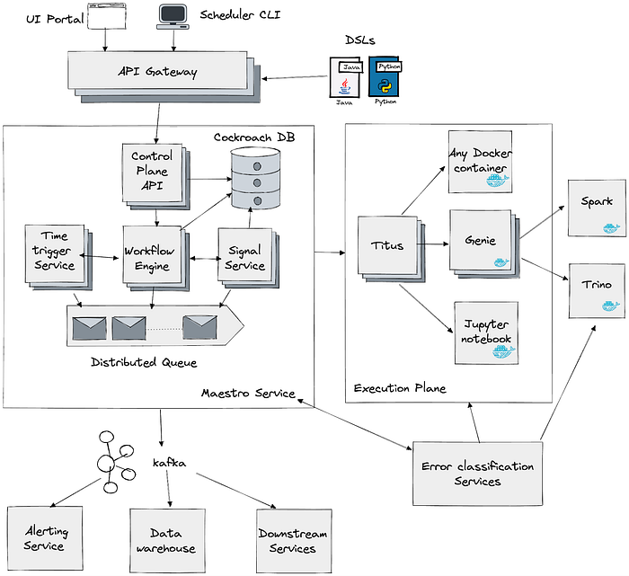
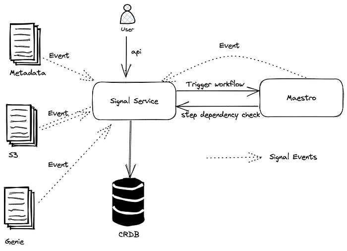
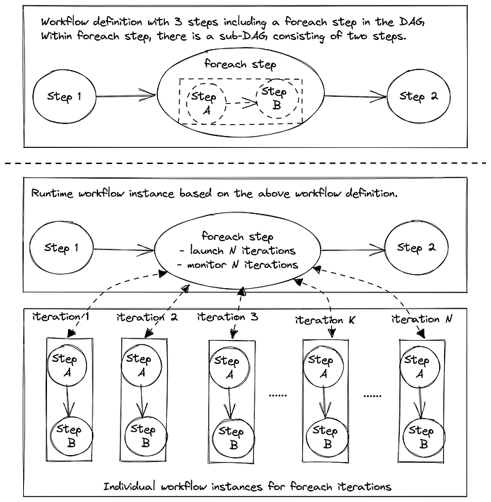
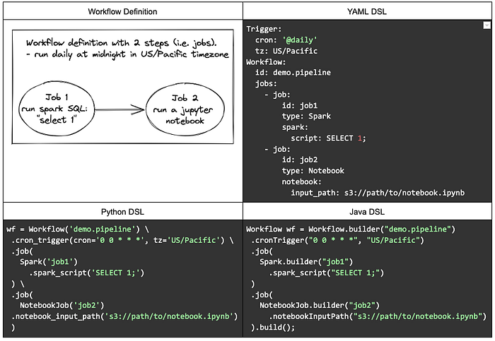
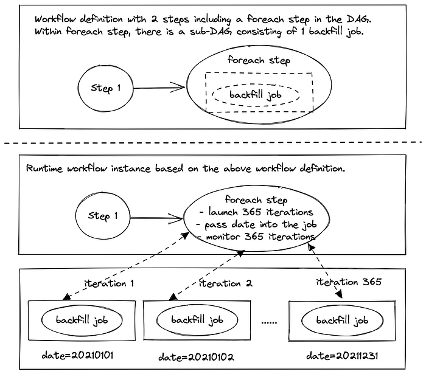

# Orchestrating Data/ML Workflows at Scale With Netflix Maestro

by [Jun He](https://www.linkedin.com/in/jheua/), [Akash Dwivedi](https://www.linkedin.com/in/akash-dwivedi-b9779317), [Natallia Dzenisenka](https://www.linkedin.com/in/natalliadzenisenka/), [Snehal Chennuru](https://www.linkedin.com/in/snehalchennuru), [Praneeth Yenugutala](https://www.linkedin.com/in/praneethy91), [Pawan Dixit](https://www.linkedin.com/in/pawan-dixit-b4307b2/)

At Netflix, Data and Machine Learning (ML) pipelines are widely used and have become central for the business, representing diverse use cases that go beyond recommendations, predictions and data transformations. A large number of batch workflows run daily to serve various business needs. These include ETL pipelines, ML model training workflows, batch jobs, etc. As Big data and ML became more prevalent and impactful, the scalability, reliability, and usability of the orchestrating ecosystem have increasingly become more important for our data scientists and the company.

In this blog post, we introduce and share learnings on Maestro, a workflow orchestrator that can schedule and manage workflows at a massive scale.

## Motivation

Scalability and usability are essential to enable large-scale workflows and support a wide range of use cases. Our existing orchestrator (Meson) has worked well for several years. It schedules around 70 thousands of workflows and half a million jobs per day. Due to its popularity, the number of workflows managed by the system has grown exponentially. We started seeing signs of scale issues, like:

- Slowness during peak traffic moments like 12 AM UTC, leading to increased operational burden. The scheduler on-call has to closely monitor the system during non-business hours.
- Meson was based on a single leader architecture with high availability. As the usage increased, we had to vertically scale the system to keep up and were approaching AWS instance type limits.

With the high growth of workflows in the past few years — increasing at > 100% a year, the need for a scalable data workflow orchestrator has become paramount for Netflix’s business needs. After perusing the current landscape of workflow orchestrators, we decided to develop a next generation system that can scale horizontally to spread the jobs across the cluster consisting of 100’s of nodes. It addresses the key challenges we face with Meson and achieves operational excellence.

## Challenges in Workflow Orchestration

### Scalability

The orchestrator has to schedule hundreds of thousands of workflows, millions of jobs every day and operate with a strict SLO of less than 1 minute of scheduler introduced delay even when there are spikes in the traffic. At Netflix, the peak traffic load can be a few orders of magnitude higher than the average load. For example, a lot of our workflows are run around midnight UTC. Hence, the system has to withstand bursts in traffic while still maintaining the SLO requirements. Additionally, we would like to have a single scheduler cluster to manage most of user workflows for operational and usability reasons.

Another dimension of scalability to consider is the size of the workflow. In the data domain, it is common to have a super large number of jobs within a single workflow. For example, a workflow to backfill hourly data for the past five years can lead to 43800 jobs (24 * 365 * 5), each of which processes data for an hour. Similarly, ML model training workflows usually consist of tens of thousands (or even millions) of training jobs within a single workflow. Those large-scale workflows might create hotspots and overwhelm the orchestrator and downstream systems. Therefore, the orchestrator has to manage a workflow consisting of hundreds of thousands of jobs in a performant way, which is also quite challenging.

### Usability

Netflix is a data-driven company, where key decisions are driven by data insights, from the pixel color used on the landing page to the renewal of a TV-series. Data scientists, engineers, non-engineers, and even content producers all run their data pipelines to get the necessary insights. Given the diverse backgrounds, usability is a cornerstone of a successful orchestrator at Netflix.

We would like our users to focus on their business logic and let the orchestrator solve cross-cutting concerns like scheduling, processing, error handling, security etc. It needs to provide different grains of abstractions for solving similar problems, high-level to cater to non-engineers and low-level for engineers to solve their specific problems. It should also provide all the knobs for configuring their workflows to suit their needs. In addition, it is critical for the system to be debuggable and surface all the errors for users to troubleshoot, as they improve the UX and reduce the operational burden.

Providing abstractions for the users is also needed to save valuable time on creating workflows and jobs. We want users to rely on shared templates and reuse their workflow definitions across their team, saving time and effort on creating the same functionality. Using job templates across the company also helps with upgrades and fixes: when the change is made in a template it’s automatically updated for all workflows that use it.

However, usability is challenging as it is often opinionated. Different users have different preferences and might ask for different features. Sometimes, the users might ask for the opposite features or ask for some niche cases, which might not necessarily be useful for a broader audience.

## Introducing Maestro

Maestro is the next generation Data Workflow Orchestration platform to meet the current and future needs of Netflix. It is a general-purpose workflow orchestrator that provides a fully managed workflow-as-a-service (WAAS) to the data platform at Netflix. It serves thousands of users, including data scientists, data engineers, machine learning engineers, software engineers, content producers, and business analysts, for various use cases.

Maestro is highly scalable and extensible to support existing and new use cases and offers enhanced usability to end users. Figure 1 shows the high-level architecture.


*Figure 1. Maestro high level architecture*

**In Maestro, a workflow is a ****[DAG (Directed acyclic graph)](https://en.wikipedia.org/wiki/Directed_acyclic_graph)**** of individual units of job definition called Steps.** Steps can have dependencies, triggers, workflow parameters, metadata, step parameters, configurations, and branches (conditional or unconditional). In this blog, we use step and job interchangeably. A workflow instance is an execution of a workflow, similarly, an execution of a step is called a step instance. Instance data include the evaluated parameters and other information collected at runtime to provide different kinds of execution insights. The system consists of 3 main micro services which we will expand upon in the following sections.

Maestro ensures the business logic is run in isolation. Maestro launches a unit of work (a.k.a. Steps) in a container and ensures the container is launched with the users/applications identity. Launching with identity ensures the work is launched on-behalf-of the user/application, the identity is later used by the downstream systems to validate if an operation is allowed or not, for an example user/application identity is checked by the data warehouse to validate if a table read/write is allowed or not.

### Workflow Engine

Workflow engine is the core component, which manages workflow definitions, the lifecycle of workflow instances, and step instances. It provides rich features to support:

- Any valid DAG patterns
- Popular data flow constructs like sub workflow, [foreach](./orchestrating-data-ml-workflows-at-scale-with-netflix-maestro-aaa2b41b800c.md), conditional branching etc.
- Multiple failure modes to handle step failures with different error retry policies
- Flexible concurrency control to throttle the number of executions at workflow/step level
- Step templates for common job patterns like running a Spark query or moving data to Google sheets
- Support parameter code injection using customized expression language
- Workflow definition and ownership management.  
Timeline including all state changes and related debug info.

We use [Netflix open source project Conductor](https://conductor.netflix.com/) as a library to manage the workflow state machine in Maestro. It ensures to enqueue and dequeue each step defined in a workflow with at least once guarantee.

### Time-Based Scheduling Service

Time-based scheduling service starts new workflow instances at the scheduled time specified in workflow definitions. Users can define the schedule using cron expression or using periodic schedule templates like hourly, weekly etc;. This service is lightweight and provides an at-least-once scheduling guarantee. Maestro engine service will deduplicate the triggering requests to achieve an exact-once guarantee when scheduling workflows.

Time-based triggering is popular due to its simplicity and ease of management. But sometimes, it is not efficient. For example, the daily workflow should process the data when the data partition is ready, not always at midnight. Therefore, on top of manual and time-based triggering, we also provide event-driven triggering.

### Signal Service

Maestro supports event-driven triggering over signals, which are pieces of messages carrying information such as parameter values. Signal triggering is efficient and accurate because we don’t waste resources checking if the workflow is ready to run, instead we only execute the workflow when a condition is met.

Signals are used in two ways:

- A trigger to start new workflow instances
- A gating function to conditionally start a step (e.g., data partition readiness)

Signal service goals are to

- Collect and index signals
- Register and handle workflow trigger subscriptions
- Register and handle the step gating functions
- Captures the lineage of workflows triggers and steps unblocked by a signal


*Figure 2. Signal service high level architecture*

The maestro signal service consumes all the signals from different sources, e.g. all the warehouse table updates, S3 events, a workflow releasing a signal, and then generates the corresponding triggers by correlating a signal with its subscribed workflows. In addition to the transformation between external signals and workflow triggers, this service is also responsible for step dependencies by looking up the received signals in the history. Like the scheduling service, the signal service together with Maestro engine achieves exactly-once triggering guarantees.

Signal service also provides the signal lineage, which is useful in many cases. For example, a table updated by a workflow could lead to a chain of downstream workflow executions. Most of the time the workflows are owned by different teams, the signal lineage helps the upstream and downstream workflow owners to see who depends on whom.

## Orchestration at Scale

All services in the Maestro system are stateless and can be horizontally scaled out. All the requests are processed via distributed queues for message passing. By having a shared nothing architecture, Maestro can horizontally scale to manage the states of millions of workflow and step instances at the same time.

[CockroachDB](https://github.com/cockroachdb/cockroach) is used for persisting workflow definitions and instance state. We chose CockroachDB as it is an open-source distributed SQL database that provides strong consistency guarantees that can be scaled horizontally without much operational overhead.

It is hard to support super large workflows in general. For example, a workflow definition can explicitly define a DAG consisting of millions of nodes. With that number of nodes in a DAG, UI cannot render it well. We have to enforce some constraints and support valid use cases consisting of hundreds of thousands (or even millions) of step instances in a workflow instance.

Based on our findings and user feedback, we found that in practice

- Users don’t want to manually write the definitions for thousands of steps in a single workflow definition, which is hard to manage and navigate over UI. When such a use case exists, it is always feasible to decompose the workflow into smaller sub workflows.
- Users expect to repeatedly run a certain part of DAG hundreds of thousands (or even millions) times with different parameter settings in a given workflow instance. So at runtime, a workflow instance might include millions of step instances.

Therefore, we enforce a workflow DAG size limit (e.g. 1K) and we provide a foreach pattern that allows users to define a sub DAG within a foreach block and iterate the sub DAG with a larger limit (e.g. 100K). Note that foreach can be nested by another foreach. So users can run millions or billions of steps in a single workflow instance.

In Maestro, foreach itself is a step in the original workflow definition. Foreach is internally treated as another workflow which scales similarly as any other Maestro workflow based on the number of step executions in the foreach loop. The execution of sub DAG within foreach will be delegated to a separate workflow instance. Foreach step will then monitor and collect status of those foreach workflow instances, each of which manages the execution of one iteration.


*Figure 3. Maestro’s scalable foreach design to support super large iterations*

With this design, foreach pattern supports sequential loop and nested loop with high scalability. It is easy to manage and troubleshoot as users can see the overall loop status at the foreach step or view each iteration separately.

## Workflow Platform for Everyone

We aim to make Maestro user friendly and easy to learn for users with different backgrounds. We made some assumptions about user proficiency in programming languages and they can bring their business logic in multiple ways, including but not limited to, a bash script, a [Jupyter notebook](https://jupyter.org/), a Java jar, a docker image, a SQL statement, or a few clicks in the UI using [parameterized workflow templates](./orchestrating-data-ml-workflows-at-scale-with-netflix-maestro-aaa2b41b800c.md).

### User Interfaces

Maestro provides multiple domain specific languages (DSLs) including YAML, Python, and Java, for end users to define their workflows, which are decoupled from their business logic. Users can also directly talk to Maestro API to create workflows using the JSON data model. We found that human readable DSL is popular and plays an important role to support different use cases. YAML DSL is the most popular one due to its simplicity and readability.

Here is an example workflow defined by different DSLs.


*Figure 4. An example workflow defined by YAML, Python, and Java DSLs*

Additionally, users can also generate certain types of workflows on UI or use other libraries, e.g.

- In Notebook UI, users can directly schedule to run the chosen notebook periodically.
- In Maestro UI, users can directly schedule to move data from one source (e.g. a data table or a spreadsheet) to another periodically.
- Users can use [Metaflow](https://github.com/Netflix/metaflow) library to create workflows in Maestro to execute DAGs consisting of arbitrary Python code.

### Parameterized Workflows

Lots of times, users want to define a dynamic workflow to adapt to different scenarios. Based on our experiences, a completely dynamic workflow is less favorable and hard to maintain and troubleshooting. Instead, Maestro provides three features to assist users to define a parameterized workflow

- Conditional branching
- Sub-workflow
- Output parameters

Instead of dynamically changing the workflow DAG at runtime, users can define those changes as sub workflows and then invoke the appropriate sub workflow at runtime because the sub workflow id is a parameter, which is evaluated at runtime. Additionally, using the output parameter, users can produce different results from the upstream job step and then iterate through those within the foreach, pass it to the sub workflow, or use it in the downstream steps.

Here is an example (using YAML DSL) of backfill workflow with 2 steps. In step1, the step computes the backfill ranges and returns the dates (from 20210101 to 20220101) back. Next, foreach step uses the dates from step1 to create foreach iterations. Finally, each of the backfill jobs gets the date from the foreach and backfills the data based on the date.

```
Workflow:
  id: demo.pipeline
  FROM_DATE: 20210101 #inclusive
  TO_DATE: 20220101   #exclusive
  jobs:
    - job:
        id: step1
        type: NoOp
        '!dates': dateIntsBetween(FROM_DATE, TO_DATE, 1); #SEL expr
    - foreach:
        id: step2
        params:
          date: ${dates@step1}  #reference upstream step parameter
        jobs:
          - job: 
              id: backfill
              type: Notebook
              notebook:
                input_path: s3://path/to/notebook.ipynb
              arg1: $date  #pass the foreach parameter into notebook
```


*Figure 5. An example of using parameterized workflow to backfill data*

The parameter system in Maestro is completely dynamic with code injection support. Users can write the code in Java syntax as the parameter definition. We developed our own secured expression language (SEL) to ensure security. It only exposes limited functionality and includes additional checks (e.g. the number of iteration in the loop statement, etc.) in the language parser.

### Execution Abstractions

Maestro provides multiple levels of execution abstractions. Users can choose to use the provided step type and set its parameters. This helps to encapsulate the business logic of commonly used operations, making it very easy for users to create jobs. For example, for spark step type, all users have to do is just specify needed parameters like spark sql query, memory requirements, etc, and Maestro will do all behind-the-scenes to create the step. If we have to make a change in the business logic of a certain step, we can do so seamlessly for users of that step type.

If provided step types are not enough, users can also develop their own business logic in a Jupyter notebook and then pass it to Maestro. Advanced users can develop their own well-tuned docker image and let Maestro handle the scheduling and execution.

Additionally, we abstract the common functions or reusable patterns from various use cases and add them to the Maestro in a loosely coupled way by introducing job templates, which are parameterized notebooks. This is different from step types, as templates provide a combination of various steps. Advanced users also leverage this feature to ship common patterns for their own teams. While creating a new template, users can define the list of required/optional parameters with the types and register the template with Maestro. Maestro validates the parameters and types at the push and run time. In the future, we plan to extend this functionality to make it very easy for users to define templates for their teams and for all employees. In some cases, sub-workflows are also used to define common sub DAGs to achieve multi-step functions.

## Moving Forward

We are taking Big Data Orchestration to the next level and constantly solving new problems and challenges, please stay tuned. If you are motivated to solve large scale orchestration problems, please [join us](https://jobs.netflix.com/search?team=Data+Platform) as we are hiring.

## Acknowledgements

Thanks [Andrew Seier](https://www.linkedin.com/in/andrew-seier/), [Alexandre Bertails](https://www.linkedin.com/in/bertails/), [Jess Hester](https://www.linkedin.com/in/hesterjessica), [Xiao Chen](https://www.linkedin.com/in/chenxiao000), [Liang Tian](https://www.linkedin.com/in/liangtian/), [Romain Cledat](https://www.linkedin.com/in/romain-cledat-4a211a5), [Yun Li](https://www.linkedin.com/in/yun-li-66a50719/), [Olek Gorajek](https://www.linkedin.com/in/agorajek/), [Anoop Panicker](https://www.linkedin.com/in/anoop-panicker/), [Aravindan Ramkumar](https://www.linkedin.com/in/aravindanr/), [Andrew Leung](https://www.linkedin.com/in/anwleung), and other stunning colleagues at Netflix for their contributions to the Maestro integration works while developing Maestro. We also thank Eva Tse, Charles Smith, Charles Zhao, and other leaders of Netflix engineering organizations for their constructive feedback and suggestions on the Maestro architecture and design.

---
**Tags:** Workflow · Orchestration · Machine Learning · Data Pipeline · Distributed Systems
