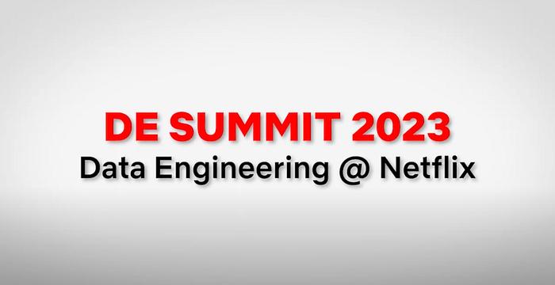

# Our First Netflix Data Engineering Summit

[Holden Karau](https://www.linkedin.com/in/holdenkarau) [Elizabeth Stone](https://www.linkedin.com/in/elizabeth-stone-608a754) [Pedro Duarte](https://www.linkedin.com/in/pmd323/) [Chris Stephens](https://www.linkedin.com/in/cjstep) [Pallavi Phadnis](https://www.linkedin.com/in/pallavi-phadnis-75280b20/) [Lee Woodridge](https://www.linkedin.com/in/leewoodridge/) [Mark Cho ](https://www.linkedin.com/in/markcho)[Guil Pires](https://www.linkedin.com/in/guilhermesmi) [Sujay Jain](https://www.linkedin.com/in/sujayjain) [Tristan Reid](https://www.linkedin.com/in/tristanreid) [Senthilnathan Athinarayanan](https://www.linkedin.com/in/senthilnathan-rajagopalan-athinarayanan-26a97138) [Bharath Mummadisetty](https://www.linkedin.com/in/bharath-chandra-mummadisetty-27591a88) [Abhinaya Shetty](https://www.linkedin.com/in/abhinaya-shetty-ab871418) [Judit Lantos](https://www.linkedin.com/in/jlantos/) [Amanuel Kahsay](https://www.linkedin.com/in/amanuel-kahsay-81ab29153/) [Dao Mi](https://www.linkedin.com/in/daomi) [Mick Dreeling](https://www.linkedin.com/in/mdreeling) [Chris Colburn](https://www.linkedin.com/in/chris-colburn) and [Agata Gryzbek](https://www.linkedin.com/in/agatagrzybek)

## Introduction

**Earlier this summer Netflix held our first-ever Data Engineering Forum. Engineers from across the company came together to share best practices on everything from Data Processing Patterns to Building Reliable Data Pipelines. The result was a series of talks which we are now sharing with the rest of the Data Engineering community!**

You can find each of the talks below with a short description of each, or you can go straight to the playlist on YouTube [here](https://www.youtube.com/watch?v=SJxRd1uHAkA&list=PLSECvWLlUYeF06QK5FOOELvgKdap3cQf0).

## The Talks

[The Netflix Data Engineering Stack](https://youtu.be/QxaOlmv79ls)

Chris Stephens, Data Engineer, Content & Studio and Pedro Duarte, Software Engineer, Consolidated Logging walk engineers new to Netflix through the building blocks of the Netflix Data Engineering stack. Learn more about how batch and streaming data pipelines are built at Netflix.

[Data Processing Patterns](https://www.youtube.com/watch?v=vuyjK2TFZNk&list=PLSECvWLlUYeF06QK5FOOELvgKdap3cQf0&index=3)

Lee Woodridge and Pallavi Phadnis, Data Engineers at Netflix, talk about how you can apply different processing strategies for your batch pipelines by implementing generic abstractions to help scale, be more efficient, handle late-arriving data, and be more fault tolerant.

[Streaming SQL on Data Mesh using Apache Flink](https://www.youtube.com/watch?v=TwcWvwU7B64&list=PLSECvWLlUYeF06QK5FOOELvgKdap3cQf0&index=4)

Mark Cho, Guil Pires and Sujay Jain, Engineers from the Netflix Data Platform talk about how a managed Streaming SQL using Apache Flink can help unlock new Stream Processing use cases at Netflix. You can read more about Data Mesh, Netflix’s next-generation stream processing platform,[ here](./data-mesh-a-data-movement-and-processing-platform-netflix-1288bcab2873.md)

[Building Reliable Data Pipelines](https://www.youtube.com/watch?v=uWmJxbhI304&list=PLSECvWLlUYeF06QK5FOOELvgKdap3cQf0&index=5)

Holden Karau, OSS Engineer, Data Platform Engineering, talks about the importance of reliable data pipelines and how to build them covering tools from testing to validation and auditing. The talk uses Apache Spark as an example, but the concepts generalize regardless of your specific tools.

[Knowledge Management — Leveraging Institutional Data](https://www.youtube.com/watch?v=F4N8AmScZ-w&list=PLSECvWLlUYeF06QK5FOOELvgKdap3cQf0&index=6)

Tristan Reid, software engineer, shares experiences about the Knowledge Management project at Netflix, which seeks to leverage language modeling techniques and metadata from internal systems to improve the impact of the >100K memos that circulate within the company.

[Psyberg, An Incremental ETL Framework Using Iceberg](https://www.youtube.com/watch?v=jRckeOedtx0&list=PLSECvWLlUYeF06QK5FOOELvgKdap3cQf0&index=8)

Abhinaya Shetty and Bharath Mummadisetty, Data Engineers from Netflix’s Membership Data Engineering team, introduce Psyberg, an incremental ETL framework. Learn about how Psyberg leverages Iceberg metadata to handle late-arriving data, and improves data pipelines while simplifying on-call life!

[Start/Stop/Continue for optimizing complex ETL jobs](https://www.youtube.com/watch?v=Dr8LMn-nJGc&list=PLSECvWLlUYeF06QK5FOOELvgKdap3cQf0&index=9)

Judit Lantos, Data Engineer, Member Experience Data Engineering, shares a case study to demonstrate an effective approach for optimizing complex ETL jobs.

[Media Data for ML Studio Creative Production](https://youtu.be/1gGi3NBZk7M)

In the last 2 decades, Netflix has revolutionized the way video content is consumed, however, there is significant work to be done in revolutionizing how movies and tv shows are made. In this video, Sr. Data Engineers Amanual Kahsay and Dao Mi showcase how data and insights are being utilized to accomplish such a vision.

We hope that our fellow members of the Data Engineering Community find these videos useful and engaging. Please follow our Netflix Data[ Twitter account](https://twitter.com/netflixdata) for updates and notifications of future Data Engineering Summits!

[Mick Dreeling](https://www.linkedin.com/in/mdreeling/), [Chris Colburn](https://www.linkedin.com/in/chris-colburn/)

---
**Tags:** Data Engineering · Data Science · Data Visualization · Data · Data Engineer
