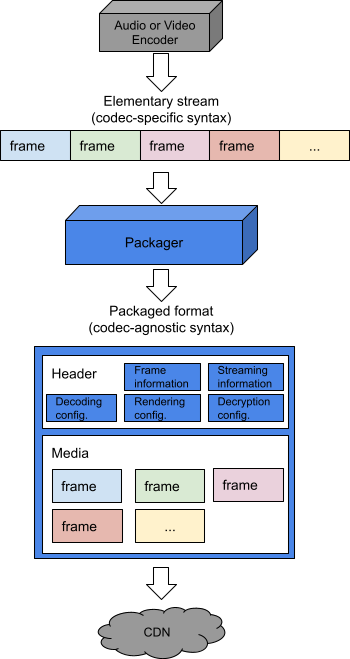

# Packaging award-winning shows with award-winning technology

By [Cyril Concolato](https://www.linkedin.com/in/cyril-concolato-567a522/)

## Introduction

In previous blog posts, our colleagues at Netflix have explained how [4K video streams are optimized](./optimized-shot-based-encodes-for-4k-now-streaming-47b516b10bbb.md), [how even legacy video streams are improved](./improving-our-video-encodes-for-legacy-devices-2b6b56eec5c9.md) and more recently [how new audio codecs can provide better aural experiences to our members](./optimizing-the-aural-experience-on-android-devices-with-xhe-aac-c27714292a33.md). In all these cases, prior to being delivered through our content delivery network [Open Connect](https://netflixtechblog.com/distributing-content-to-open-connect-3e3e391d4dc9), our award-winning TV shows, movies and documentaries like _The Crown _need to be packaged to enable crucial features for our members. In this post, we explain these features and how we rely on award-winning standard formats and open source software to enable them.

*The Crown*

## Key Packaging Features

In typical streaming pipelines, packaging is the step that happens just after encoding, as depicted in the figure below. The output of an encoder is a sequence of bytes, called an elementary stream, which can only be parsed with some understanding of the elementary stream syntax. For example, detecting frame boundaries in an AV1 video stream requires being able to parse so-called Open Bitstream Units (OBU) and identifying Temporal Delimiters OBU. However, high level operations performed on client devices, such as seeking, do not need to be aware of the elementary syntax and benefit from a codec-agnostic format. The packaging step aims at producing such a codec-agnostic sequence of bytes, called packaged format, or container format, which can be manipulated, to some extent, without a deep knowledge of the coding format.

*Figure 1 — Simplified architecture of a streaming preparation pipeline*

A key feature that our members rightfully deserve when playing audio, video, and timed text is synchronization. At Netflix, we strive to provide an experience where you never see the lips of the Queen of England move before you hear her corresponding dialog in _The Crown_. Synchronization is achieved by fundamental elements of signaling such as clocks or time lines, time stamps, and time scales that are provided in packaged content.

Our members don’t simply watch our series from beginning to end. They seek into _Bridgerton_ when they resume watching. They rewind and replay their favorite chess move in _The Queen’s Gambit_. They skip introductions and recaps when they frantically binge-watch _Lupin_. They make playback decisions when they watch interactive titles such as _You vs. Wild_. Due to the nature of the audio or video compression techniques, a player cannot necessarily start decoding the stream exactly where our members want. Under the hood, players have to locate points in the stream where decoding can start, decode as quickly as they can, until the user seek point is reached before starting playback. This is another basic feature of packaging: signaling frame types and particularly Random Access Points.

When our members’ kids watch _Carmen Sandiego_ in the back seats of their parents’ car or more generally when the network throughput varies, adaptive streaming technologies are applied to provide the best viewing experience under the network conditions. [Adaptive streaming technologies](./engineering-a-studio-quality-experience-with-high-quality-audio-at-netflix-eaa0b6145f32.md) require that streams of various qualities be encoded to common constraints but they also rely on another key feature of packaging to offer seamless quality switching, called indexing. Indexing lets the player fetch only the corresponding segments of the new stream.

Many other elements of signaling are provided in our packaged content to enable the viewing to start as quickly as possible and in the best possible conditions. Decryption modules need to be initialized with the appropriate scheme and initialization vector. Hardware video decoders need to know in advance the resolution and bit depth of the video streams to allocate their decoding buffers. Rendering pipelines need to know ahead of time the speaker configuration of audio streams or whether the video streams are HDR or SDR. Being able to signal all these elements is also a key feature of modern packaging formats.

## The role of standards and open source software

Our 200+ million members watch Netflix on a wide variety of devices, from smartphones, to laptops, to TVs and many more, developed by a large number of partners. Reducing the friction when on-boarding a new device and making sure that our content will be playable on old devices for a long time is very important. That is where standards play a key role. The ISO Base Media File Format (ISOBMFF) is the key packaging standard in the entertainment industry as recently recognized with a [Technology & Engineering Emmy® Award](https://theemmys.tv/tech-72nd-award-recipients/) by the National Academy of Television Arts & Sciences (NATAS).

ISOBMFF provides all the key packaging features mentioned above, and as history proves, it is also versatile and extensible, in its capabilities of adding new signaling features and in its support of codec. Streams encoded with well-established codecs such as AVC and AAC can be carried in ISOBMFF files, but the specification is also regularly extended to support the latest codecs. The Media Systems team at Netflix actively contributes to the development, the maintenance, and the adoption of ISOBMFF. As an example, Netflix led the specification for the carriage of [AOM’s AV1 video streams in ISOBMFF](https://aomediacodec.github.io/av1-isobmff/).

With 20+ years of existence, ISOBMFF accumulated a lot of technical tools for various use cases. Figure 2 illustrates the complexity of ISOBMFF today through the concept of ‘brands’, a concept similar to profiles in audio or video standards. Initially, limited and well-nested, the standard is now very broad and evolving in various directions.

*Figure 2 — Illustrating the complexity of the 6th edition of ISOBMFF. Each rectangle represents a ‘brand’ (indicated by a four character code in bold), and its required set of tools (indicated by a ‘+’ line). Brands are nested. All the tools of inner brands are required by outer brands.*

For the Netflix streaming service, we rely on a subset of these tools as identified by the Common Media Application Format (CMAF) standard, and the content protection tools defined in the Common Encryption (CENC) standard.

Multimedia standards like ISOBMFF, CMAF and CENC go hand in hand with open source software implementations. Open source software can demonstrate the features of the standard, enabling the industry to understand its benefits and broadening its adoption. Open source software can also help improve the quality of a standard by highlighting possible ambiguities through a neutral, reference implementation. The Media Systems team at Netflix maintains such a reference open source implementation, called [Photon](https://github.com/Netflix/photon), for the SMPTE IMF standard. For ISOBMFF, Netflix uses [MP4Box](https://github.com/gpac/gpac/wiki/MP4Box), the reference open source implementation from the [GPAC team](http://gpac.io/).

In this packaging ecosystem of standards and open source software, our work within the Media Systems team includes identifying the tools within the existing standards to address new streaming use cases. When such tools don’t exist, we define new standards or expand existing ones, including ISOBMFF and CMAF, and support open source software to match these standards. For example, when our video encoding colleagues design dynamically optimized encoding schemes producing streaming segments with variable durations, we modify our workflow to ensure that segments across video streams with different bit rates remain time aligned. Similarly, when our audio encoding colleagues introduce xHE-AAC, which obsoletes the old assumption that every audio frame is decodable, we guarantee that audio/video segments remain aligned too. Finally, when we want to help the industry converge to a common encryption scheme for new video codecs such as AV1, we coordinate the discussions to select the scheme, in this case pattern-based subsample encryption (a.k.a ‘cbcs’), and lead the way by providing reference bitstreams. And of course, our work includes handling the many types of devices in the field that don’t have proper support of the standards.

## Conclusion

We hope that this post gave you a better understanding of a part of the work of the Media Systems team at Netflix, and hopefully next time you watch one of our award-winning shows, you will recognize the part played by ISOBMFF, a key, award-winning technology. If you want to explore another facet of the team’s work, have a look at [the other award-winning technology, TTML](https://theemmys.tv/tech-67th-award-recipients/), that we use for [our Japanese subtitles](https://netflixtechblog.com/implementing-japanese-subtitles-on-netflix-c165fbe61989).

## We’re hiring!

If this work sounds exciting to you and you’d like to help the Media Systems team deliver an even better experience, [Netflix is searching for an experienced Engineering Manager for the team](https://jobs.netflix.com/jobs/46030992). Please contact [Anne Aaron](https://www.linkedin.com/in/anne-aaron/) for more info.

---
**Tags:** Streaming · Netflix · Open Source · File Format · Award Winning
