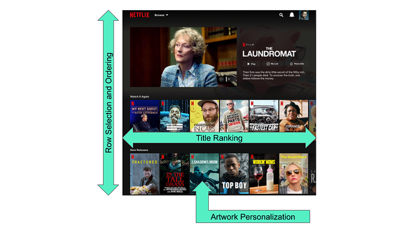
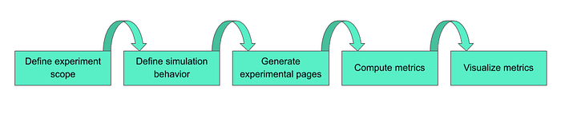
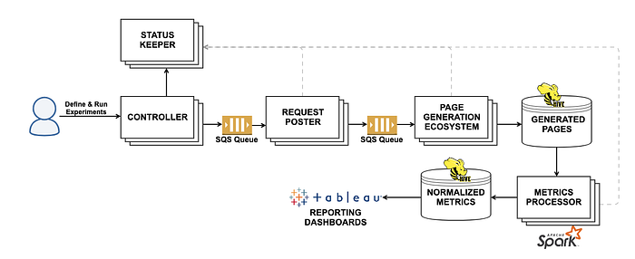
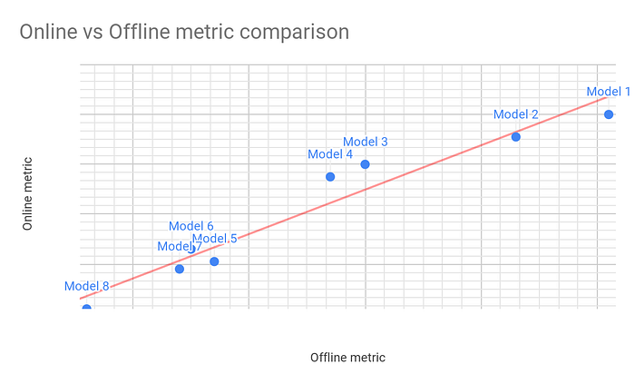

# Page Simulation for Better Offline Metrics at Netflix

by [David Gevorkyan](https://www.linkedin.com/in/davidgevorkyan/), [Mehmet Yilmaz](https://www.linkedin.com/in/mehmet-mustafa-yilmaz-255a091a/), [Ajinkya More](https://www.linkedin.com/in/ajinkyam/), [Gaurav Agrawal](https://www.linkedin.com/in/gauravagrawal01/),   
[Richard Wellington](https://www.linkedin.com/in/richardwellington/), [Vivek Kaushal](https://www.linkedin.com/in/vkaushal21/), [Prasanna Padmanabhan](https://www.linkedin.com/in/prasannapadmanabhan/), [Justin Basilico](https://twitter.com/justinbasilico)

At Netflix, we spend a lot of effort to make it easy for our members to find content they will love. To make this happen, we personalize many aspects of our service, including which movies and TV shows we present on each member’s homepage. Over the years, we have built a recommendation system that uses many different machine learning algorithms to create these personalized recommendations. We also apply additional business logic to handle constraints like maturity filtering and deduplication of videos. All of these algorithms and logic come together in our page generation system to produce a personalized homepage for each of our members, which we have outlined in a previous [post](https://medium.com/netflix-techblog/learning-a-personalized-homepage-aa8ec670359a). While a diverse set of algorithms working together can produce a great outcome, innovating on such a complex system can be difficult. For instance, adding a single feature to one of the recommendation algorithms can change how the whole page is put together. Conversely, a big change to such a ranking system may only have a small incremental impact (for instance because it makes the ranking of a row similar to that of another existing row).

*Every aspect is personalized*

With systems driven by machine learning, it is important to measure the overall system-level impact of changes to a model, not just the local impact on the model performance itself. One way to do this is by running A/B tests. Netflix typically A/B tests all changes before rolling them out to all members. A drawback to this approach is that tests take time to run and require experimental models be ready to run in production. In Machine Learning, offline metrics are often used to measure the performance of model changes on historical data. With a good offline metric, we can gain a reasonable understanding of how a particular model change would perform online. We would like to extend this approach, which is typically applied to a single machine-learned model, and apply it to the entire homepage generation system. This would allow us to measure the potential impact of offline changes in any of the models or logic involved in creating the homepage before running an A/B test.

**To achieve this goal, we have built a system that simulates what a member’s homepage would have been given an experimental change and compares it against the page the member actually saw in the service.** This provides an indication of the overall quality of the change. While we primarily use this for evaluating modifications to our machine learning algorithms, such as what happens when we have a new row selection or ranking algorithm, we can also use it to evaluate any changes in the code used to construct the page, from filtering rules to new row types. A key feature of this system is the ability to reconstruct a view of the systemic and user-level data state at a certain point in the past. As such, the system uses time-travel mechanisms for more precise reconstruction of an experience and coordinates time-travel across multiple systems. Thus, the simulator allows us to rapidly evaluate new ideas without needing to expose members to the changes.

In this blog post, we will go into more detail about this page simulation system and discuss some of the lessons we learned along the way.

## Why Is This Hard?

A simulation system needs to run on many samples to generate reliable results. In our case, this requirement translates to generating millions of personalized homepages. Naturally, some problems of scale come into the picture, including:

- How to ensure that the executions run within a reasonable time frame
- How to coordinate work despite the distributed nature of the system
- How to ensure that the system is easy to use and extend for future types of experiments

## Stages Involved

At a high level, the Page Simulation system consists of the following stages:

We’ll go through each of these stages in more detail below.

## Experiment Scope

The experiment scope determines the set of experimental pages that will be simulated and which data sources will be used to generate those pages. Thus, the experimenter needs to tailor the scope to the metrics the experiment aims to measure. This involves defining three aspects:

- A data source
- Stratification rules for profile selection
- Number of profiles for the experiment

### Data Sources

We provide two different mechanisms for data retrieval: via _time travel_ and via _live_ service calls.

In the first approach, we use data from [time-travel infrastructure](https://medium.com/netflix-techblog/distributed-time-travel-for-feature-generation-389cccdd3907) built at Netflix to compute pages as they would have been at some point in the past. In the experimentation landscape, this gives us the ability to backtest the performance of experimental page generation model accurately. In particular, it lets us compare a new page against a page that a member has seen and interacted with in the past, including what actions they took in the session.

The second approach retrieves data in the exact same way as the live production system. To simulate production systems closely, in this mode, we randomly select profiles that have recently logged into Netflix. The primary drawback of using live data is that we can only compute a limited set of metrics compared to the time-travel approach. However, this type of experiment is still valuable in the following scenarios:

- Doing final sanity checks before allocating a new A/B test or rolling out a new feature
- Analyzing changes in page composition, which are measures of the rows and videos on the page. These measures are needed to validate that the changes we seek to test are having the intended effect without unexpected side-effects
- Determining if two approaches are producing sufficiently similar pages that we may not need to test both
- Early detection of negative interactions between two features that will be rolled out simultaneously

### Stratification

Once the data source is specified, a combination of different stratification types can be applied to refine user selection. Some examples of stratification types are:

- Country — select profiles based on their country
- Tenure — select profiles based on their membership tenure; long-term members vs members in trial period
- Login device — select users based on their active device type; e.g. Smart TV, Android, or devices supporting certain feature sets

### Number of Profiles

We typically start with a small number to perform a dry run of the experiment configuration and then extend it to millions of users to ensure reliable and statistically significant results.

## Simulating Modified Behavior

Once the experiment scope is determined, experimenters specify the modifications they would like to test within the page generation framework. Generally, these changes can be made by either modifying the configuration of the existing system or by implementing new code and deploying it to the simulation system.

There are several ways to control what changes are run in the simulator, including but not limited to:

1. A/B test allocations

- Collect metrics of the behavior of an A/B test that is not yet allocated
- Analyze the behavior across cells using custom metrics
- Inspect the effect of cross-allocating members to multiple A/B tests

2. Page generation models

- Compare performance of different page generation models
- Evaluate interactions between different models (when page is constructed using multiple models)

3. Device capabilities and page geometry

- Evaluate page composition for different geometries. Page geometry is the number of rows and columns, which differs between device types

Multiple modifications can be grouped together to define different experimental variants. During metrics computation we collect each metric at the level of variant and stratum. This detailed breakdown of metrics allows for a fine-grained attribution of any shifts in page characteristics.

## Experiment Workflow

*Architecture diagram of the Page Simulation System*

The lifecycle of an experiment starts when a user (Engineer, Researcher, Data Scientist or Product Manager) configures an experiment and submits it for execution (detailed below). Once the execution is complete, they get detailed Tableau reports. Those reports contain page composition and other important metrics regarding their experiment, which can be split by the different variants under test.

The execution workflow for the experiment proceeds through the following stages:

- Partition the experiment into smaller chunks
- Compute pages asynchronously for each partition
- Compute experiment metrics

### Experiment Partition

In the Page Simulation system an experiment is configured as a single entity, however when executing the experiment, the system splits it into multiple partitions. This is needed to isolate different parts of the experiment for the following reasons:

- Some modifications to the page algorithm might impact the latency of page generation significantly
- When time traveling to different times, different clusters of the page generation system are needed for each time (more on this later)

### Asynchronous Page Computation

We embrace asynchronous computation as much as possible, especially in the page computation stage, which can be very compute-intensive and time consuming due to the heavy machine-learned models we often test. Each experiment partition is sent out as an event to a _Request Poster_. The Request Poster is responsible for reading data and applying stratification to select profiles for each partition. For each selected profile, page computation requests are generated and sent to a dedicated queue per partition. Each queue is then processed by a separate _Page Generation_ cluster that is launched to serve a particular partition. Once the generator is running, it processes the requests in the queue to compute the simulated pages. Generated pages are then persisted to an S3-backed Hive table for metrics processing.

We chose to use queue-based communication between the systems instead of RESTFul calls to decouple the systems and allow for easy retries of each request, as well as individual experiment partitions. Writing the generated pages to Hive and running the Metrics Computation stage out-of-band allows us to modify or add new metrics on previously generated pages, thus avoiding needing to regenerate them.

### Creating Mini Netflix Ecosystem on the Fly

The page generation system at Netflix consists of many interdependent services. Experiments can simulate new behaviors in any number of these microservices. Thus, for each experiment, we need to create an isolated mini Netflix ecosystem where each service exhibits their respective new behaviors. Because of this isolation requirement, we architected a system that can create a mini Netflix ecosystem on the fly.

Our approach is to create Docker container stacks to define a mini Netflix ecosystem for each simulation. We use [Titus](https://netflix.github.io/titus/) as a container management platform, which was built internally at Netflix. We configure each cluster using custom bootstrapping code in order to create different server environments, for example to initialize the containers with different machine-learned model versions and other data to precisely replicate time-traveled state in the past. Because we would like to time-travel all the services together to replicate a specific point in time in the past, we created a new capability to start stacks of multiple services with a common time configuration and route traffic between them on-the-fly per experiment to maintain temporal accuracy of the data. This capability provides the precision we need to simulate and correlate metrics correctly with actions of our members that happened in the past.

Achieving high temporal accuracy across multiple systems and data sources is challenging. It took us several iterations to determine the correct set of data and services to include in this time-travel scheme for accurate simulation of pages in time-travel mode. To this end, we developed tools that compared real pages computed by our live production system with that of our simulators, both in terms of the final output and the features involved in our models. To ensure that we maintain temporal accuracy going forward, we also automated these checks to avoid future regressions and identify new data sources that we need to handle. As such, the system is architected in a flexible way so we can easily incorporate more downstream systems into the time-travel experiment workflow.

### Metrics Computation

Once the generated pages are saved to a Hive table, the system sends a signal to the workflow manager (_Controller_) for the completion of the page generation experiment. This signal triggers a Spark job to calculate the metrics, normalize the results and save both the raw and normalized data to Hive. Experimenters can then access the results of their experiment either using pre-configured Tableau reports or from [notebooks](https://medium.com/netflix-techblog/open-sourcing-polynote-an-ide-inspired-polyglot-notebook-7f929d3f447) that pull the raw data from Hive. If necessary, they can also access the simulated pages to compute new experiment-specific metrics.

## Experiment Workflow Management

Given the asynchronous nature of the experiment workflow and the need to govern the lifecycle of multiple clusters dedicated to each partition, we needed a solution to manage the experiment workflow. Thus, we built a simple and lightweight workflow management system with the following capabilities:

- Automatic retry of workflow steps in case of a transient failure
- Conditional execution of workflow steps
- Recording execution history

We use this simple workflow engine for the execution of the following tasks:

- Govern the lifecycle of page generation services dedicated to each partition (external startup, shutdown tasks)
- Initialize metrics computation when page generation for all partitions is complete
- Terminate the experiment when the experiment does not have a sufficient page yield (i.e. there is a high error rate)
- Send out notifications to experiment owners on the status of the experiment
- Listen to the heartbeat of all components in the experimentation system and terminate the experiment when an issue is detected

### Status Keeper

To facilitate lifecycle management and to monitor the overall health of an experiment, we built a separate micro-service called _Status Keeper_. This service provides the following capabilities:

- Expose a detailed report with granular metrics about different steps (_Controller_ / _Request Poster_ / _Page Generator_ and _Metrics Processor_) in the system
- Aid in lifecycle decisions to fast fail the experiment if failure threshold has reached
- Store and retrieve status and aggregate metrics

Throughout the experiment workflow, each application in the Page Simulation system reports its status to the _Status Keeper_. We combine all the status and metrics recorded by each application in the system to create a view of the overall health of the system.

## Metrics

### Need for Offline Metrics

An important part of improving our page generation approach is having good offline metrics to track model performance and to compare different model variants. Usually, there is not a perfect correspondence between offline results and results from A/B testing (if there was, it would do away with the need for online testing). For example, suppose we build two model variants and we find that one is better than the other according to our offline metric. The online A/B test performance will usually be measured by a different metric, and it may turn out that the model that’s worse on the offline metric is actually the better model online or even that there is no statistically significant difference between the two models online. Given that A/B tests need to run for a while to measure long-term metrics, finding an offline metric that provides an accurate pulse of how the testing might pan out is critical. So one of the main objectives in building our page simulation system was to come up with offline metrics that correspond better with online A/B metrics.

### Presentation Bias

One major source of discrepancy between online and offline results is presentation bias. The real pages we presented to our members are the result of ranking videos and rows from our current production page generation models. Thus, the engagement data (what members click, play or thumb) we get as a result can be strongly influenced by those models. Members can only see and play from rows that the production system served to them. Thus, it is important that our offline metrics mitigate this bias (i.e. it should not unduly favor or disfavor the production model).

### Validation

In the absence of A/B testing results on new candidate models, there is no ground truth to compare offline metrics against. However, because of the system described above, we can simulate how a member’s page might have looked at a past point-in-time if it had been generated by our new model instead of the production model. Because of time travel, we could also build the new model based on the data available at that time so as to get us as close as possible to the unobserved counterfactual page that the new model would have shown.

Given these pages, the next question to answer was exactly what numerical metrics we can use for validating the effectiveness of our offline metrics. This turned out to be easy with the new system because we could use models from past A/B tests to ascertain how well the offline metrics computed on the simulated pages correlated with the actual online metrics for those A/B tests. **That is, we could take the hypothetical pages generated by certain models, evaluate them according to an offline metric, and then see how well those offline metrics correspond to online ones.** After trying out a few variations, we were able to settle on a suite of metrics that had a much stronger correlation with corresponding online metrics across many A/B tests as compared to our previous offline metric, as shown below.

### Benefits

Having such offline metrics that strongly correlate with online metrics allows us to experiment more rapidly and reject model variants which may not be significantly better than the current production model, thus saving valuable A/B testing bandwidth and time. It has also helped us detect bugs early in the model development process when the offline metrics go vigorously against our hypothesis. This has saved many development cycles, experimentation cycles, and has enabled us to try out more ideas.

In addition, these offline metrics enable us to:

- Compare models trained with different objective functions
- Compare models trained on different datasets
- Compare page construction related changes outside of our machine learning models
- Reconcile effects due to changes arising out of many A/B tests running simultaneously

## Conclusion

Personalizing home pages for users is a hard problem and one that traditionally required us to run A/B tests to find out whether a new approach works. However, our Page Simulation system allows us to rapidly try out new ideas and obtain results without needing to expose our members to all these experiences. Being able to create a mini Netflix ecosystem on the fly helps us iterate fast and allows us to try out more far-fetched ideas. Building this system was a big collaboration between our engineering and research teams that allows our researchers to run page simulations and our engineers to quickly extend the system to accommodate new types of simulations. This, in turn, has resulted in improvements of the personalized homepages for our members. If you are interested in helping us solve these types of problems and helping entertain the world, please take a look at some of our open positions on the [Netflix jobs page](https://jobs.netflix.com/).

---
**Tags:** Page Generation · Personalization · Simulation · Experimentation · Metrics
