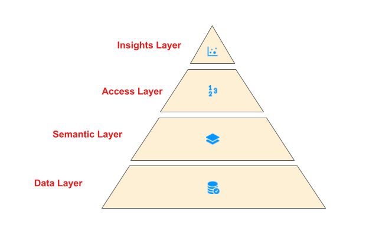
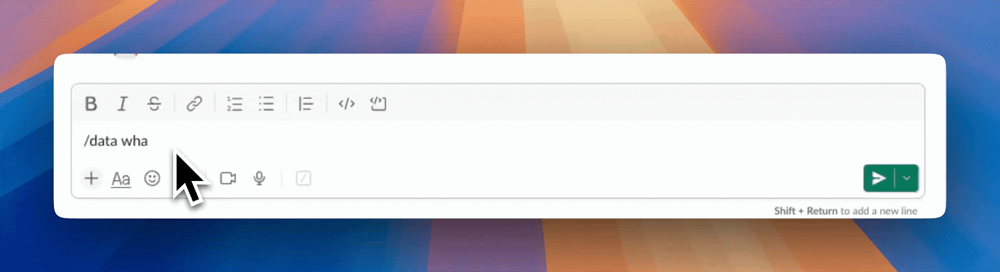

# Part 1: A Survey of Analytics Engineering Work at Netflix

_This article is the first in a multi-part series sharing a breadth of Analytics Engineering work at Netflix, recently presented as part of our annual internal Analytics Engineering conference. _**_We kick off with a few topics focused on how we’re empowering Netflix to efficiently produce and effectively deliver high quality, actionable analytic insights across the company._**_ Subsequent posts will detail examples of exciting analytic engineering domain applications and aspects of the technical craft._

At Netflix, we seek to entertain the world by ensuring our members find the shows and movies that will thrill them. Analytics at Netflix powers everything from understanding what content will excite and bring members back for more to how we should produce and distribute a content slate that maximizes member joy. Analytics Engineers deliver these insights by establishing deep business and product partnerships; translating business challenges into solutions that unblock critical decisions; and designing, building, and maintaining end-to-end analytical systems.

Each year, we bring the Analytics Engineering community together for an Analytics Summit — a 3-day internal conference to share analytical deliverables across Netflix, discuss analytic practice, and build relationships within the community. We covered a broad array of exciting topics and wanted to spotlight a few to give you a taste of what we’re working on across Analytics Engineering at Netflix!

## DataJunction: Unifying Experimentation and Analytics

[Yian Shang](https://www.linkedin.com/in/shyiann/), [Anh Le](https://www.linkedin.com/in/anhqle/)

At Netflix, like in many organizations, creating and using metrics is often more complex than it should be. Metric definitions are often scattered across various databases, documentation sites, and code repositories, making it difficult for analysts and data scientists to find reliable information quickly. This fragmentation leads to inconsistencies and wastes valuable time as teams end up reinventing metrics or seeking clarification on definitions that should be standardized and readily accessible.

Enter [DataJunction](https://datajunction.io/) (DJ). DJ acts as a central store where metric definitions can live and evolve. Once a metric owner has registered a metric into DJ, metric consumers throughout the organization can apply that same metric definition to a set of filtered records and aggregate to any dimensional grain.

As an example, imagine an analyst wanting to create a “Total Streaming Hours” metric. To add this metric to DJ, they need to provide two pieces of information:

- The fact table that the metric comes from:

SELECT  
 account_id, country_iso_code, streaming_hours  
FROM streaming_fact_table

- The metric expression:

`SUM(streaming_hours)`

Then metric consumers throughout the organization can call DJ to request either the SQL or the resulting data. For example,

- total_streaming_hours of each account:

dj.sql(metrics=[“total_streaming_hours”], dimensions=[“account_id”]))

- total_streaming_hours of each country:

dj.sql(metrics=[“total_streaming_hours”], dimensions=[“country_iso_code”]))

- total_streaming_hours of each account in the US:

dj.sql(metrics=[“total_streaming_hours”], dimensions=[“country_iso_code”], filters=[“country_iso_code = ‘US’”]))

The key here is that DJ can perform the dimensional join on users’ behalf. If country_iso_code doesn’t already exist in the fact table, the metric owner only needs to tell DJ that account_id is the foreign key to an `users_dimension_table` (we call this process “[dimension linking](https://datajunction.io/docs/0.1.0/data-modeling/dimension-links/)”). DJ then can perform the joins to bring in any requested dimensions from `users_dimension_table`.

The Netflix Experimentation Platform heavily leverages this feature today by treating cell assignment as just another dimension that it asks DJ to bring in. For example, to compare the average streaming hours in cell A vs cell B, the Experimentation Platform relies on DJ to bring in “cell_assignment” as a user’s dimension (no different from country_iso_code). A metric can therefore be defined once in DJ and be made available across analytics dashboards and experimentation analysis.

DJ has a strong pedigree–there are several prior [semantic layers](https://benn.substack.com/p/bi-by-another-name) in the industry (e.g. [Minerva](https://medium.com/airbnb-engineering/how-airbnb-achieved-metric-consistency-at-scale-f23cc53dea70) at Airbnb; dbt Transform, Looker, and AtScale as paid solutions). DJ stands out as an [open source](https://github.com/DataJunction/dj) solution that is actively developed and stress-tested at Netflix. We’d love to see DJ easing _your_ metric creation and consumption pain points!

## LORE: How we’re democratizing analytics at Netflix

[Apurva Kansara](https://www.linkedin.com/in/apurvakansara/)

At Netflix, we rely on data and analytics to inform critical business decisions. Over time, this has resulted in large numbers of dashboard products. While such analytics products are tremendously useful, we noticed a few trends:

1. A large portion of such products have less than 5 MAU (monthly active users)
2. We spend a tremendous amount of time building and maintaining business metrics and dimensions
3. We see inconsistencies in how a particular metric is calculated, presented, and maintained across the Data & Insights organization.
4. It is challenging to scale such bespoke solutions to ever-changing and increasingly complex business needs.

Analytics Enablement is a collection of initiatives across Data & Insights all focused on empowering Netflix analytic practitioners to efficiently produce and effectively deliver high-quality, actionable insights.

Specifically, these initiatives are focused on enabling analytics rather than on the activities that produce analytics (e.g., dashboarding, analysis, research, etc.).

As part of broad analytics enablement across all business domains, we invested in a chatbot to provide real insights to our end users using the power of LLM. One reason LLMs are well suited for such problems is that they tie the versatility of natural language with the power of data query to enable our business users to query data that would otherwise require sophisticated knowledge of underlying data models.

Besides providing the end user with an instant answer in a preferred data visualization, LORE instantly learns from the user’s feedback. This allows us to teach LLM a context-rich understanding of internal business metrics that were previously locked in custom code for each of the dashboard products.

Some of the challenges we run into:

- Gaining user trust: To gain our end users’ trust, we focused on our model’s explainability. For example, LORE provides human-readable reasoning on how it arrived at the answer that users can cross-verify. LORE also provides a confidence score to our end users based on its grounding in the domain space.
- Training: We created easy-to-provide feedback using 👍 and 👎 with a fully integrated fine-tuning loop to allow end-users to teach new domains and questions around it effectively. This allowed us to bootstrap LORE across several domains within Netflix.

Democratizing analytics can unlock the tremendous potential of data for everyone within the company. With Analytics enablement and LORE, we’ve enabled our business users to truly have a conversation with the data.

## Leveraging Foundational Platform Data to enable Cloud Efficiency Analytics

[J Han](https://www.linkedin.com/in/jhan-104105/?utm_source=share&utm_campaign=share_via&utm_content=profile), [Pallavi Phadnis](https://www.linkedin.com/in/pallavi-phadnis-75280b20/)

At Netflix, we use Amazon Web Services (AWS) for our cloud infrastructure needs, such as compute, storage, and networking to build and run the streaming platform that we love. Our ecosystem enables engineering teams to run applications and services at scale, utilizing a mix of open-source and proprietary solutions. In order to understand how efficiently we operate in this diverse technological landscape, the Data & Insights organization partners closely with our engineering teams to share key efficiency metrics, empowering internal stakeholders to make informed business decisions.

This is where our team, Platform DSE (Data Science Engineering), comes in to enable our engineering partners to understand what resources they’re using, how effectively they utilize those resources, and the cost associated with their resource usage. By creating curated datasets and democratizing access via a custom insights app and various integration points, downstream users can gain granular insights essential for making data-driven, cost-effective decisions for the business.

To address the numerous analytic needs in a scalable way, we’ve developed a two-component solution:

1. Foundational Platform Data (FPD): This component provides a centralized data layer for all platform data, featuring a consistent data model and standardized data processing methodology. We work with different platform data providers to get _inventory_, _ownership_, and _usage_ data for the respective platforms they own.
2. Cloud Efficiency Analytics (CEA): Built on top of FPD, this component offers an analytics data layer that provides time series efficiency metrics across various business use cases. Once the foundational data is ready, CEA consumes inventory, ownership, and usage data and applies the appropriate _business logic_ to produce _cost_ and _ownership attribution_ at various granularities.

As the source of truth for efficiency metrics, our team’s tenants are to provide accurate, reliable, and accessible data, comprehensive documentation to navigate the complexity of the efficiency space, and well-defined Service Level Agreements (SLAs) to set expectations with downstream consumers during delays, outages, or changes.

Looking ahead, we aim to continue onboarding platforms, striving for nearly complete cost insight coverage. We’re also exploring new use cases, such as tailored reports for platforms, predictive analytics for optimizing usage and detecting anomalies in cost, and a root cause analysis tool using LLMs.

Ultimately, our goal is to enable our engineering organization to make efficiency-conscious decisions when building and maintaining the myriad of services that allows us to enjoy Netflix as a streaming service. For more detail on our modeling approach and principles, check out [this post](./cloud-efficiency-at-netflix-f2a142955f83.md)!

---

Analytics Engineering is a key contributor to building our deep data culture at Netflix, and we are proud to have a large group of stunning colleagues that are not only applying but advancing our analytical capabilities at Netflix. The 2024 Analytics Summit continued to be a wonderful way to give visibility to one another on work across business verticals, celebrate our collective impact, and highlight what’s to come in analytics practice at Netflix.

To learn more, follow the [Netflix Research Site](https://research.netflix.com/research-area/analytics), and if you are also interested in entertaining the world, have a look at [our open roles](https://explore.jobs.netflix.net/careers)!

---
**Tags:** Analytics Engineering · Analytics
