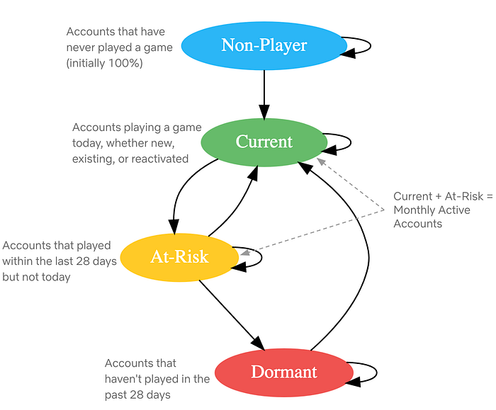
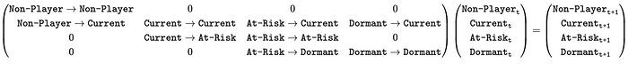
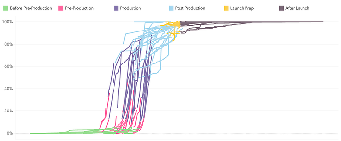
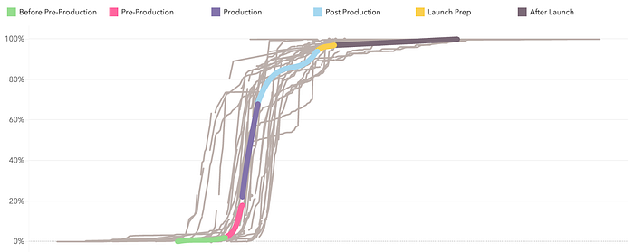

# Part 2: A Survey of Analytics Engineering Work at Netflix

**_This article is the second in a multi-part series sharing a breadth of Analytics Engineering work at Netflix, recently presented as part of our annual internal Analytics Engineering conference. Need to catch up? Check out _****[_Part 1_](https://research.netflix.com/publication/part-1-a-survey-of-analytics-engineering-work-at-netflix)****_. In this article, we highlight a few exciting analytic business applications, and in our final article we’ll go into aspects of the technical craft._**

## Game Analytics

[Yimeng Tang](https://www.linkedin.com/in/yimeng-tang-49566b207/), [Claire Willeck](https://www.linkedin.com/in/clairewilleck/), [Sagar Palao](https://www.linkedin.com/in/sagarpalao/)

## User Acquisition Incrementality for Netflix Games

Netflix has been launching games for the past three years, during which it has initiated various marketing efforts, including User Acquisition (UA) campaigns, to promote these games across different countries. These UA campaigns typically feature static creatives, launch trailers, and game review videos on platforms like Google, Meta, and TikTok. The primary goals of these campaigns are to encourage more people to install and play the games, making incremental installs and engagement crucial metrics for evaluating their effectiveness.

Most UA campaigns are conducted at the country level, meaning that everyone in the targeted countries can see the ads. However, due to the absence of a control group in these countries, we adopt a synthetic control framework ([blog post](./round-2-a-survey-of-causal-inference-applications-at-netflix-fd78328ee0bb.md)) to estimate the counterfactual scenario. This involves creating a weighted combination of countries not exposed to the UA campaign to serve as a counterfactual for the treated countries. To facilitate easier access to incrementality results, we have developed an interactive tool powered by this framework. This tool allows users to directly obtain the lift in game installs and engagement, view plots for both the treated country and the synthetic control unit, and assess the p-value from placebo tests.

To better guide the design and budgeting of future campaigns, we are developing an Incremental Return on Investment model. This model incorporates factors such as the incremental impact, the value of the incremental engagement and incremental signups, and the cost of running the campaign. In addition to using the causal inference framework mentioned earlier to estimate incrementality, we also leverage other frameworks, such as Incremental Account Lifetime Valuation ([blog post](./a-survey-of-causal-inference-applications-at-netflix-b62d25175e6f.md)), to assign value to the incremental engagement and signups resulting from the campaigns.

## Measuring and Validating Incremental Signups for Netflix Games

Netflix is a subscription service meaning members buy subscriptions which include games but not the individual games themselves. This makes it difficult to measure the impact of different game launches on acquisition. We only observe signups, not why members signed up.

This means we need to estimate incremental signups. We adopt an approach developed at Netflix to estimate incremental acquisition ([technical paper](https://arxiv.org/pdf/2106.15346)). This approach uses simple assumptions to estimate a counterfactual for the rate that new members start playing the game.

Because games differ from series/films, it’s crucial to validate this estimation method for games. Ideally, we would have causal estimates from an A/B test to use for validation, but since that is not available, we use another causal inference design as one of our ensemble of validation approaches. This causal inference design involves a systematic framework we designed to measure game events that relies on synthetic control ([blog post](./round-2-a-survey-of-causal-inference-applications-at-netflix-fd78328ee0bb.md)).

As we mentioned above, we have been launching User Acquisition (UA) campaigns in select countries to boost game engagement and new memberships. We can use this cross-country variation to form a synthetic control and measure the incremental signups due to the UA campaign. The incremental signups from UA campaigns differ from those attributed to a game, but they should be similar. When our estimated incremental acquisition numbers over a campaign period are similar to the incremental acquisition numbers calculated using synthetic control, we feel more confident in our approach to measuring incremental signups for games.

## Netflix Games Players’ Adventure: Modeled using State Machine

At Netflix Games, we aim to have a high number of members engaging with games each month, referred to as Monthly Active Accounts (MAA). To evaluate our progress toward this objective and to find areas to boost our MAA, we modeled the Netflix players’ journey as a state machine.

We track a daily state machine showing the probability of account transitions between states.

*Netflix Players’ Journey as State machine*

Modeling the players’ journey as a state machine allows us to simulate future states and assess progress toward engagement goals. The most basic operation involves multiplying the daily state-transition matrix with the current state values to determine the next day’s state values.

This basic operation allows us to explore various scenarios:

- Constant Trends: If transition rates stay constant, we can predict future states by repeatedly multiplying the daily state-transition matrix to new state values, helping us assess progress towards annual goals under unchanged conditions.
- Dynamic Scenarios: By modifying transition rates, we can simulate complex scenarios. For instance, mimicking past changes in transition rates from a game launch allows us to predict the impact of similar future launches by altering the transition rate for a specific period.
- Steady State: We can calculate the steady state of the state-transition matrix (excluding new players) to estimate the MAA once all accounts have tried Netflix games and understand long-term retention and reactivation effects.

Beyond predicting future states, we use the state machine for sensitivity analysis to find which transition rates most impact MAA. By making small changes to each transition rate we calculate the resulting MAA and measure its impact. This guides us in prioritizing efforts on top-of-funnel improvements, member retention, or reactivation.

## Content Cash Modeling

[Alex Diamond](https://www.linkedin.com/in/alexandra-diamond-b04902219/)

At Netflix we produce a variety of entertainment: movies, series, documentaries, stand-up specials, and more. Each format has a different production process and different patterns of cash spend, called our “Content Forecast”. Looking into the future, Netflix keeps a plan of how many titles we intend to produce, what kinds, and when. Because we don’t yet know what specific titles that content will eventually become, these generic placeholders are called “TBD Slots.” A sizable portion of our Content Forecast is represented by TBD Slots.

Almost all businesses have a cash forecasting process informing how much cash they need in a given time period to continue executing on their plans. As plans change, the cash forecast will change. Netflix has a cash forecast that projects our cash needs to produce the titles we plan to make. This presents the question: how can we optimally forecast cash needs for TBD Slots, given we don’t have details on what real titles they will become?

The large majority of our titles are funded throughout the production process — starting from when we begin developing the title to shooting the actual shows and movies to launch on our Netflix service.

Since cash spend is driven by what is happening on a production, we model it by breaking down into these three steps:

1. Determine estimated production phase durations using historical actuals
2. Determine estimated percent of cash spent in each production phase
3. Model the shape of cash spend within each phase

Putting these three pieces together allows us to generate a generic estimation of cash spend per day leading up to and beyond a title’s launch date (a proxy for “completion”). We could distribute this spend linearly across each phase, but this approach allows us to capture nuance around patterns of spend that ramp up slowly, or are concentrated at the start and taper off throughout.

Before starting any math, we need to ensure a high quality historical dataset. Data quality plays a huge role in this work. For example, if we see 80% of our cash spent before production even started, it might be safe to say that either the production dates (which are manually captured) are incorrect or that title had a unique spending pattern that we don’t want to anticipate our future titles will follow.

For the first two steps, finding the estimated phase durations and cash percent per phase, we’ve found that simple math works best, for interpretability and consistency. We use a weighted average across our “clean” historical actuals to produce these estimated assumptions.

For modeling the shape of spend throughout each phase, we perform constrained optimization to fit a 3rd degree polynomial function. The constraints include:

1. Must pass through the points (0,0) and (1,1). This ensures that 0% through the phase, 0% of that phase’s cash has been spent. Similarly, 100% through the phase, 100% of that phase’s cash has been spent.
2. The derivative must be non-negative. This ensures that the function is monotonically increasing, avoiding counterintuitively forecasting any negative spend.

The optimization’s objective function minimizes the sum of squared residuals and returns the coefficients of the polynomial that will guide the shape of cash spend through each phase.

Once we have these coefficients, we can evaluate this polynomial at each day of the expected phase duration, and then multiply the result by the expected cash per phase. With some additional data processing, this yields an expected percent of cash spend each day leading up to and beyond the launch date, which we can base our forecasts on.

## Assistive Speech Recognition in Dubbing Workflows at Netflix

[Tanguy Cornau](https://www.linkedin.com/in/tanguycornuau/)

Great stories can come from anywhere and be loved everywhere. At Netflix, we strive to make our titles accessible to a global audience, transcending language barriers to connect with viewers worldwide. One of the key ways we achieve this is through creating dubs in many languages.

From the transcription of the original titles all the way to the delivery of the dub audio, we blend innovation with human expertise to preserve the original creative intent.

Leveraging technologies like Assistive Speech Recognition (ASR), we seek to make the _transcription_ part of the process more efficient for our linguists. Transcription, in our context, involves creating a verbatim script of the spoken dialogue, along with precise timing information to perfectly align the text with the original video. With ASR, instead of starting the transcription from scratch, linguists get a pre-generated starting point which they can use and edit for complete accuracy.

This efficiency enables linguists to focus more on other creative tasks, such as adding cultural annotations and references, which are crucial for downstream dubbing.

With ASR, and other new and enhanced technologies we introduce, rigorous analytics and measurement are essential to their success. To effectively evaluate our ASR system, we’ve established a multi-layered measurement framework that provides comprehensive insights into its performance across many dimensions (for example, the accuracy of the text and timing predictions), offline and online.

ASR is expected to perform differently for various languages; therefore, at a high level, we track metrics by original language of the show, allowing us to assess overall ASR effectiveness and identify trends across different linguistic contexts. We further break down performance by various dimensions, e.g. content type, genre, etc… to help us pinpoint specific areas where the ASR system may encounter difficulties. Furthermore, our framework allows us to conduct in-depth analyses of individual titles’ transcription, focusing on critical quality dimensions around text and timing accuracy of ASR suggestions. By zooming in on where the system falls short, we gain valuable insights into specific challenges, enabling us to further refine our understanding of ASR performance.

These measurement layers collectively empower us to continuously monitor, identify improvement areas, and implement targeted enhancements, ensuring that our ASR technology gets more and more accurate, effective, and helpful to linguists across diverse content types and languages. By refining our dubbing workflows through these innovations, we aim to keep improving the quality of our dubs to help great stories travel across the globe and bring joy to our members.

---

Analytics Engineering is a key contributor to building our deep data culture at Netflix, and we are proud to have a large group of stunning colleagues that are not only applying but advancing our analytical capabilities at Netflix. The 2024 Analytics Summit continued to be a wonderful way to give visibility to one another on work across business verticals, celebrate our collective impact, and highlight what’s to come in analytics practice at Netflix.

To learn more, follow the [Netflix Research Site](https://research.netflix.com/research-area/analytics), and if you are also interested in entertaining the world, have a look at [our open roles](https://explore.jobs.netflix.net/careers)!

---
**Tags:** Analytics Engineering · Analytics
