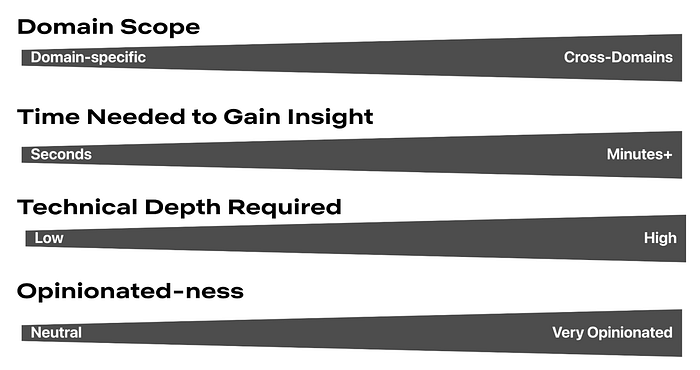
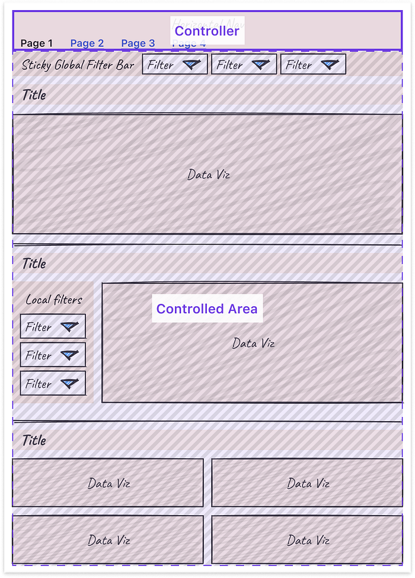
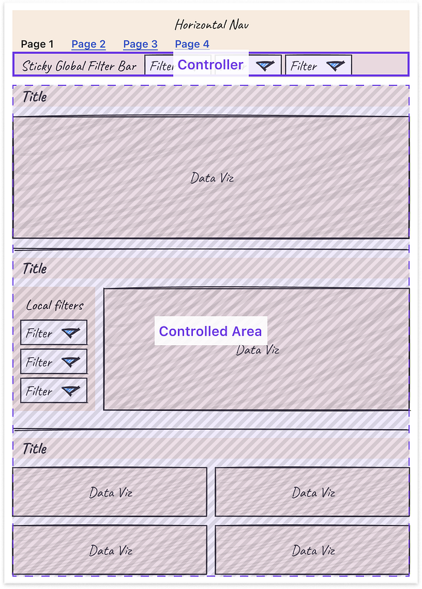
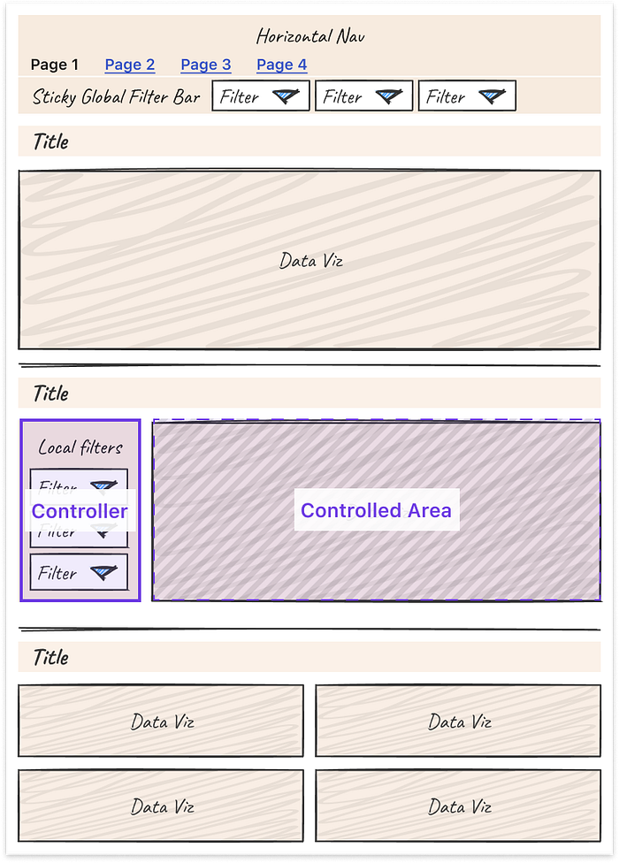
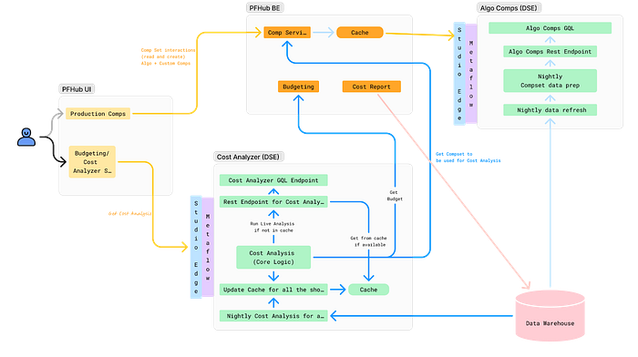
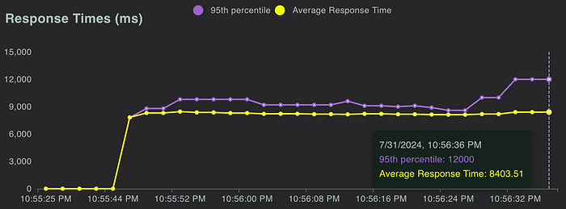
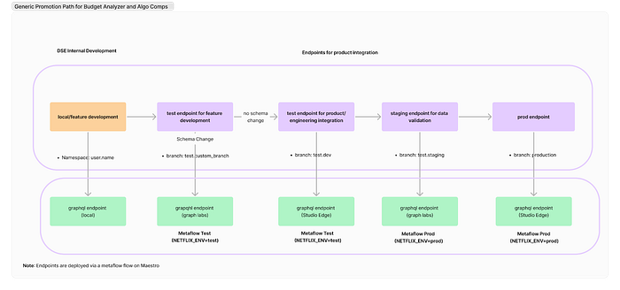

# Part 3: A Survey of Analytics Engineering Work at Netflix

_This article is the last in a multi-part series sharing a breadth of Analytics Engineering work at Netflix, recently presented as part of our annual internal Analytics Engineering conference. Need to catch up? Check out _[_Part 1_](https://research.netflix.com/publication/part-1-a-survey-of-analytics-engineering-work-at-netflix)_, which detailed how we’re empowering Netflix to efficiently produce and effectively deliver high quality, actionable analytic insights across the company and _[_Part 2_](https://research.netflix.com/publication/part-2-a-survey-of-analytics-engineering-work-at-netflix)_, which stepped through a few exciting business applications for Analytics Engineering. This post will go into aspects of technical craft._

## Dashboard Design Tips

[Rina Chang](https://www.linkedin.com/in/rinachang), [Susie Lu](https://www.linkedin.com/in/shansusielu/)

What is design, and why does it matter? Often people think design is about how things look, but design is actually about how things work. Everything is designed, because we’re all making choices about how things work, but not everything is designed well. Good design doesn’t waste time or mental energy; instead, it helps the user achieve their goals.

When applying this to a dashboard application, the easiest way to use design effectively is to leverage existing patterns. (For example, people have learned that blue underlined text on a website means it’s a clickable link.) So knowing the arsenal of available patterns and what they imply is useful when making the choice of when to use which pattern.

First, to design a dashboard well, you need to understand your user.

- Talk to your users throughout the entire product lifecycle. Talk to them early and often, through whatever means you can.
- Understand their needs, ask why, then ask why again. Separate symptoms from problems from solutions.
- Prioritize and clarify — less is more! Distill what you can build that’s differentiated and provides the most value to your user.

Here is a framework for thinking about what your users are trying to achieve. Where do your users fall on these axes? Don’t solve for multiple positions across these axes in a given view; if that exists, then create different views or potentially different dashboards.

Second, understanding your users’ mental models will allow you to choose how to structure your app to match. A few questions to ask yourself when considering the information architecture of your app include:

- Do you have different user groups trying to accomplish different things? Split them into different apps or different views.
- What should go together on a single page? All the information needed for a single user type to accomplish their “job.” If there are multiple [jobs to be done](https://www.christenseninstitute.org/theory/jobs-to-be-done/), split each out onto its own page.
- What should go together within a single section on a page? All the information needed to answer a single question.
- Does your dashboard feel too difficult to use? You probably have too much information! When in doubt, keep it simple. If needed, hide complexity under an “Advanced” section.

Here are some general guidelines for page layouts:

- Choose infinite scrolling vs. clicking through multiple pages depending on which option suits your users’ expectations better
- Lead with the most-used information first, above the fold
- Create signposts that cue the user to where they are by labeling pages, sections, and links
- Use cards or borders to visually group related items together
- Leverage nesting to create well-understood “scopes of control.” Specifically, users expect a controller object to affect children either: Below it (if horizontal) or To the right of it (if vertical)

Third, some tips and tricks can help you more easily tackle the unique design challenges that come with making interactive charts.

- Titles: Make sure filters are represented in the title or subtitle of the chart for easy scannability and screenshot-ability.
- Tooltips: Core details should be on the page, while the context in the tooltip is for deeper information. Annotate multiple points when there are only a handful of lines.
- Annotations: Provide annotations on charts to explain shifts in values so all users can access that context.
- Color: Limit the number of colors you use. Be consistent in how you use colors. Otherwise, colors lose meaning.
- Onboarding: Separate out onboarding to your dashboard from routine usage.

Finally, it is important to note that these are general guidelines, but there is always room for interpretation and/or the use of good judgment to adapt them to suit your own product and use cases. At the end of the day, the most important thing is that a user can leverage the data insights provided by your dashboard to perform their work, and good design is a means to that end.

## Learnings from Deploying an Analytics API at Netflix

[Devin Carullo](https://www.linkedin.com/in/devincarullo/)

At Netflix Studio, we operate at the intersection of art and science. Data is a tool that enhances decision-making, complementing the deep expertise and industry knowledge of our creative professionals.

One example is in production budgeting — namely, determining how much we should spend to produce a given show or movie. Although there was already a process for creating and comparing budgets for new productions against similar past projects, it was highly manual. We developed a tool that automatically selects and compares similar Netflix productions, flagging any anomalies for Production Finance to review.

To ensure success, it was essential that results be delivered in real-time and integrated seamlessly into existing tools. This required close collaboration among product teams, DSE, and front-end and back-end developers. We developed a GraphQL endpoint using Metaflow, integrating it into the existing budgeting product. This solution enabled data to be used more effectively for real-time decision-making.

We recently launched our MVP and continue to iterate on the product. Reflecting on our journey, the path to launch was complex and filled with unexpected challenges. As an analytics engineer accustomed to crafting quick solutions, I underestimated the effort required to deploy a production-grade analytics API.

*Fig 1. My vague idea of how my API would work*

*Fig 2: Our actual solution*

With hindsight, below are my key learnings.

**Measure Impact and Necessity of Real-Time Results**

Before implementing real-time analytics, assess whether real-time results are truly necessary for your use case. This can significantly impact the complexity and cost of your solution. Batch processing data may provide a similar impact and take significantly less time. It’s easier to develop and maintain, and tends to be more familiar for analytics engineers, data scientists, and data engineers.

Additionally, if you are developing a proof of concept, the upfront investment may not be worth it. Scrappy solutions can often be the best choice for analytics work.

**Explore All Available Solutions**

At Netflix, there were multiple established methods for creating an API, but none perfectly suited our specific use case. Metaflow, a tool developed at Netflix for data science projects, already supported REST APIs. However, this approach did not align with the preferred workflow of our engineering partners. Although they could integrate with REST endpoints, this solution presented inherent limitations. Large response sizes rendered the API/front-end integration unreliable, necessitating the addition of filter parameters to reduce the response size.

Additionally, the product we were integrating into was using GraphQL, and deviating from this established engineering approach was not ideal. Lastly, given our goal to overlay results throughout the product, GraphQL features, such as federation, proved to be particularly advantageous.

After realizing there wasn’t an existing solution at Netflix for deploying python endpoints with GraphQL, we worked with the Metaflow team to build this feature. This allowed us to continue developing via Metaflow and allowed our engineering partners to stay on their paved path.

**Align on Performance Expectations**

A major challenge during development was managing API latency. Much of this could have been mitigated by aligning on performance expectations from the outset. Initially, we operated under our assumptions of what constituted an acceptable response time, which differed greatly from the actual needs of our users and our engineering partners.

Understanding user expectations is key to designing an effective solution. Our methodology resulted in a full budget analysis taking, on average, 7 seconds. Users were willing to wait for an analysis when they modified a budget, but not every time they accessed one. To address this, we implemented caching using Metaflow, reducing the API response time to approximately 1 second for cached results. Additionally, we set up a nightly batch job to pre-cache results.

While users were generally okay with waiting for analysis during changes, we had to be mindful of GraphQL’s 30-second limit. This highlighted the importance of continuously monitoring the impact of changes on response times, leading us to our next key learning: rigorous testing.

**Real-Time Analysis Requires Rigorous Testing**

Load Testing: We leveraged Locust to measure the response time of our endpoint and assess how the endpoint responded to reasonable and elevated loads. We were able to use FullStory, which was already being used in the product, to estimate expected calls per minute.

*Fig 3. Locust allows us to simulate concurrent calls and measure response time*

Unit Tests & Integration Tests: Code testing is always a good idea, but it can often be overlooked in analytics. It is especially important when you are delivering live analysis to circumvent end users from being the first to see an error or incorrect information. We implemented unit testing and full integration tests, ensuring that our analysis would return correct results.

**The Importance of Aligning Workflows and Collaboration**

This project marked the first time our team collaborated directly with our engineering partners to integrate a DSE API into their product. Throughout the process, we discovered significant gaps in our understanding of each other’s workflows. Assumptions about each other’s knowledge and processes led to misunderstandings and delays.

Deployment Paths: Our engineering partners followed a strict deployment path, whereas our approach on the DSE side was more flexible. We typically tested our work on feature branches using Metaflow projects and then pushed results to production. However, this lack of control led to issues, such as inadvertently deploying changes to production before the corresponding product updates were ready and difficulties in managing a test endpoint. Ultimately, we deferred to our engineering partners to establish a deployment path and collaborated with the Metaflow team and data engineers to implement it effectively.

*Fig 4. Our current deployment path*

Work Planning: While the engineering team operated on sprints, our DSE team planned by quarters. This misalignment in planning cycles is an ongoing challenge that we are actively working to resolve.

Looking ahead, our team is committed to continuing this partnership with our engineering colleagues. Both teams have invested significant time in building this relationship, and we are optimistic that it will yield substantial benefits in future projects.

## External Speaker: Benn Stancil

In addition to the above presentations, we kicked off our Analytics Summit with a keynote talk from [Benn Stancil](https://www.linkedin.com/in/benn-stancil/), Founder of Mode Analytics. Benn stepped through a history of the modern data stack, and the group discussed ideas on the future of analytics.

---

Analytics Engineering is a key contributor to building our deep data culture at Netflix, and we are proud to have a large group of stunning colleagues that are not only applying but advancing our analytical capabilities at Netflix. The 2024 Analytics Summit continued to be a wonderful way to give visibility to one another on work across business verticals, celebrate our collective impact, and highlight what’s to come in analytics practice at Netflix.

To learn more, follow the [Netflix Research Site](https://research.netflix.com/research-area/analytics), and if you are also interested in entertaining the world, have a look at [our open roles](https://explore.jobs.netflix.net/careers)!

---
**Tags:** Analytics · Analytics Engineering
