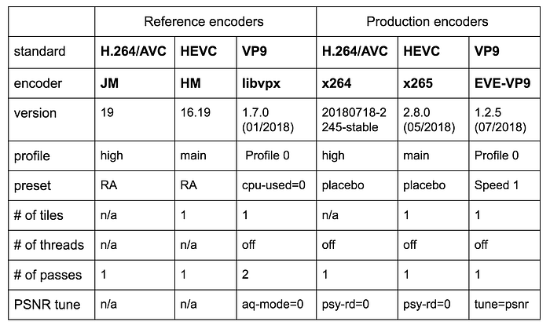
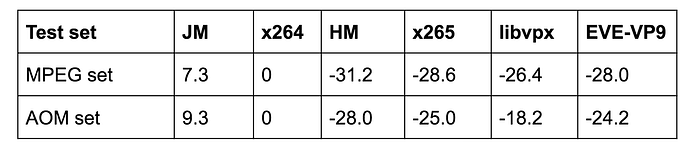
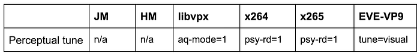
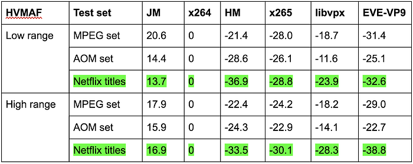

# Performance comparison of video coding standards: an adaptive streaming perspective

> by Joel Sole, Liwei Guo, Andrey Norkin, Mariana Afonso, Kyle Swanson, Anne Aaron

_“This is my advice to people: Learn how to cook, try new recipes, learn from your mistakes, be fearless, and above all have fun” _— Julia Child (American chef, author, and television personality)

At Netflix, we are continually refining the recipes we use to serve your favorite shows and movies at the best possible quality. An essential element in this dish is the video encoding technology we use to transform our video content into compressed bitstreams (suitable for whatever bandwidth you happen to be enjoying Netflix at). A fantastic amount of work has been done by the video coding community to develop video coding standards (codecs) with the goal of achieving always better compression ratios. Therefore, an essential task is the assessment of the quality of the ingredients we use and, in the Netflix encoding kitchen, we do this by regularly evaluating the performance of existing and upcoming video codecs and encoders. We select the freshest and best encoding technologies so that you can savor our content, from the satiating cinematography of_ _[_Salt Fat Acid Heat_](https://www.netflix.com/watch/80198345) to the gorgeous food shots of [Chef’s Table](https://www.netflix.com/title/80007945).

*Chef’s Table*

## Factors in codec comparisons

Many articles have been published comparing the performance of video codecs. The reader of these articles might often be confused by their seemingly contradicting conclusions. One article might claim that codec A is 15% better than codec B, while the next one might assert that codec B is 10% better than codec A.

A deeper dive into the topic reveals that these apparent contradictions should be expected. Why? Because the testing methodology and content play a crucial role in the evaluation of video codecs. A different selection of the testing conditions can lead to disparate results. We discuss below several factors that impact the assessment of video codecs:

1. Encoder implementation
2. Encoder settings
3. Methodology
4. Content
5. Metrics

Where applicable, we make the distinction between the traditional comparison approach and our approach for adaptive streaming.

### Encoder implementation

Video coding standards are instantiated in software or hardware with goals as varied as research, broadcasting, or streaming. A ‘reference encoder’ is a software implementation used during the video standardization process and for research, and as a reference by implementers. Generally, this is the first implementation of a standard and not used for production. Afterward, production encoders developed by the open-source community or commercial entities come along. These are practical implementations deployed by most companies for their encoding needs and are subject to stricter speed and resource constraints. Therefore, the performance of reference and production encoders might be substantially different. Besides, the standard profile and specific version influence the observed performance, especially for a new standard with still immature implementations. Netflix deploys production encoders tuned to achieve the highest subjective quality for streaming.

### Encoding settings

Encoding parameters such as the number of coding passes, parallelization tools, rate-control, visual tuning, and others introduce a high degree of variability in the results. The selection of these encoding settings is mainly application-driven.

Standardization bodies tend to use test conditions that let them compare one tool to another, often maximizing a particular objective metric and reducing variability over different experiments. For example, rate-control and visual tunings are generally disabled, to focus on the effectiveness of core coding tools.

**Netflix encoding recipes focus on achieving the best quality, enabling the available encoder tools that boost visual appearance, and thus, giving less weight to indicators like speed or encoder footprint that are crucial in other applications.**

### Methodology

Testing methodology in codec standardization establishes well-defined “common test conditions” to assess new coding tools and to allow for reproducibility of the experiments. Common test conditions consist of a relatively small set of test sequences (single shots of 1 to 10 seconds) that are encoded only at the input resolution with a fixed set of quality parameters. Quality (PSNR) and bitrate are gathered for each of these quality points and used to compute the average bitrate savings, the so-called BD-rate, as illustrated below.

While the methodology in standards has been suitable for its intended purpose, other considerations come into play in the adaptive streaming world. Notably, the option to offer multiple representations of the same video at different bitrates and resolutions to match network bandwidth and client processing and display capabilities. The content, encoding, and display resolutions are not necessarily tied together. Removing this constraint implies that quality can be optimized by encoding at different resolutions.

Per-resolution rate-quality curves cross, so there is a range of rates for which each encoding resolution gives the best quality. The ‘convex hull’ is derived by selecting the optimal curve at each rate for the entire range. Then, the BD-rate difference is computed on the convex hulls, instead of using the single resolution curves.

The flexibility in delivering bitstreams on the convex hull as opposed to just the single resolution ones leads to remarkable quality improvements. The **dynamic optimizer** (DO) methodology generalizes this concept to sequences with multiple shots. DO operates on the convex hull of all the shots in a video to jointly optimize the overall rate-distortion by finding the optimal compression path for an encode across qualities, resolutions, and shots.

DO was introduced in this [tech blog](https://medium.com/netflix-techblog/dynamic-optimizer-a-perceptual-video-encoding-optimization-framework-e19f1e3a277f). It showed a 25% in BD-rate savings for multiple-shot videos. Three characteristics that make DO particularly well-suited for adaptive streaming and codec comparisons are:

1. It is codec agnostic since it can be applied in the same way to any encoder.
2. It can use any metric to guide its optimization process.
3. It eliminates the need for high-level rate control across shots in the encoder. Lower-level rate control, like adaptive quantization within a frame, is still useful, because DO does not operate below the shot level.

DO, as originally presented, is a non-real-time, computationally expensive algorithm. However, because of the exhaustive search, DO could be seen as the upper-bound performance for high-level rate control algorithms.

### Content

For a fair comparison, the testing content should be balanced, covering a variety of distinct types of video (natural vs. animation, slow vs. high motion, etc.) or reflect the kind of content for the application at hand.

The testing content should not have been used during the development of the codec. Netflix has produced and made public long video sequences with multiple shots, such as ‘El Fuente’ or ‘Chimera’, to extend the available videos for R&D and mitigate the problem of conflating training and test content. Internally, we extensively evaluate algorithms using full titles from our catalog.

### Metrics

Traditionally, PSNR has been the metric of choice given its simplicity, and it reasonably matches subjective opinion scores. Other metrics, such as VIF or SSIM, better correlate with the subjective scores. Metrics have commonly been computed at the encoding resolution.

Netflix highly relies on **VMAF** throughout its video pipeline. VMAF is a perceptual video quality metric that models the human visual system. It correlates better than PSNR with subjective opinion over a wide quality range and content. VMAF enables reliable codec comparisons across the broad range of bitrates and resolutions occurring in adaptive streaming. This [tech blog](https://medium.com/netflix-techblog/vmaf-the-journey-continues-44b51ee9ed12) is useful to learn more about VMAF and its current deployment status.

*Approximate correspondence between VMAF values and subjective opinion*

Two relevant aspects when employing metrics are the resolution at which they are computed and the temporal averaging:

1. **_Scaled_ metric**: VMAF is not computed at the encoding resolution, but at the display resolution, which better emulates our members viewing experience. This is not unique to VMAF, as PSNR and other metrics can be applied at any desired resolution by appropriately scaling the video.
2. **Temporal average: **Metrics are calculated on a per-frame basis. Normally, the arithmetic mean has been the method of choice to obtain the temporal average across the entire sequence. We employ the harmonic mean, which gives more weight to outliers than the arithmetic mean. The rationale for using the harmonic mean is that if there are few frames that look really bad in a shot of a show you are watching, then your experience is not that great, no matter how good the quality of the rest of the shot is. The acronym for the harmonic VMAF is HVMAF.

## Codec comparison results

Putting in practice the factors mentioned above, we show the results drawn from the two distinct codec comparison approaches, the traditional and the adaptive streaming one.

Three commonly used video coding standards are tested: H.264/AVC and H.265/HEVC by ITU.T and ISO/MPEG and VP9 by Google. For each standard, we use the reference encoder and a production encoder.

### Results with the traditional approach

The traditional approach uses fixed QP (quality) encoding for a set of short sequences.

- **Encoder settings** are listed in the table below.

- **Methodology**: Five fixed quality encodings per sequence at the content resolution are generated.
- **Content**: 14 standard sequences from the MPEG Common Test Conditions set (mostly from JVET) and 14 from the Alliance for Open Media (AOM) set. All sequences are 1080p. These are short clips: about 10 seconds for the MPEG set and 1 second for the AOM set. Mostly, they are single shot sequences.
- **Metrics**: BD-rate savings are computed using the Classic PSNR for the luma component.

Results are summarized in the table below. BD-rates are given in percentage with respect to x264. Positive numbers indicate an average increase of bitrate, while negative numbers indicate bitrate reduction.

*BD-rate (in %) using PSNR of the 6 PSNR-tuned video encoders*

Interestingly, using the MPEG set doesn’t seem to benefit HEVC encoders, or using the AOM set help VP9 encoders.

### Results from an adaptive streaming perspective

This section describes a more comprehensive experiment. It builds on top of the traditional approach, modifying some aspects in each of the factors:

- **Encoder settings**: Settings are changed to incorporate perceptual tunings. The rest of the settings remain as previously defined.

- **Methodology**: Encoding is done at 10 different resolutions for each shot, from 1920x1080 down to 256x144. DO performs the overall encoding optimization using HVMAF.
- **Content**: A set of 8 Netflix full titles (like Orange is the New Black, House of Cards or Bojack) is added to the other two test sets. Netflix titles are 1080p, 30fps, 8 bits/component. They contain a wide variety of content in about 8 hours of video material.
- **Metrics**: HVMAF is employed to assess these perceptually-tuned encodings. The metric is computed over the relevant quality range of the convex hull. HVMAF is computed after scaling the encodes to the display resolution (assumed to be 1080p), which also matches the resolution of the source content.

Additionally, we split results into two ranges to visualize performance at different qualities. The low range refers to HVMAF between 30 and 63, while the high range refers to HVMAF between 63 and 96, which correlates with high subjective quality.

The highlighted rows in the HVMAF BD-rates table are the most relevant operation points for Netflix.

*BD-rate (in %) using HVMAF of 6 video encoders tuned for perceptual quality. BD-rates percentages use x264 as the reference.*

## Takeaways

Encoder, encoding settings, methodology, testing content, and metrics should be thoroughly described in any codec comparison since they greatly influence results. As illustrated above, a different selection of the testing conditions leads to different conclusions on the relative performance of the encoders. For example, EVE-VP9 is about 1% worse than x265 in terms of PSNR for the traditional approach, but about 12% better for the HVMAF high range case.

Given the vast amount of video compressed and delivered by services like Netflix and that traditional and adaptive streaming approaches do not necessarily converge to the same outcome, it would be beneficial if the video coding community considered the adaptive streaming perspective in the comparisons. For example, it is relatively easy to compute metrics on the convex hull or to add the HVMAF numbers to the reported metrics.

Like great recipes, video encoding also has essential elements; VMAF, dynamic optimization, and great codecs. With these ingredients and continuous innovation, we are striving to perfect our recipe — high-quality video encodes at the lowest possible bitrates. If these problems excite you and you would like to contribute to building our video encoding pipeline, check out the Video Algorithms job posts ([here](https://jobs.netflix.com/jobs/867864) and [here](https://jobs.netflix.com/jobs/868026)).

## Acknowledgments

For more detailed technical information and results, you can check out the paper ‘[Video codec comparison using the dynamic optimizer framework](http://spie.org/Publications/Proceedings/Paper/10.1117/12.2322118)’ by Ioannis Katsavounidis and Liwei Guo.

We would like to thank Ioannis Katsavounidis for all the technical work that lead to this blog, and Jan De Cock, Chen Chao, Aditya Mavlankar, Zhi Li, and David Ronca for their contributions.

Our experimentations were run on the [Archer platform](https://medium.com/netflix-techblog/simplifying-media-innovation-at-netflix-with-archer-3f8cbb0e2bcb) built by the Netflix media infrastructure team. We always appreciate their continued efforts to make media innovation at Netflix a pleasant experience.

---
**Tags:** Video · Compression · Standards · Video Quality · Netflix
