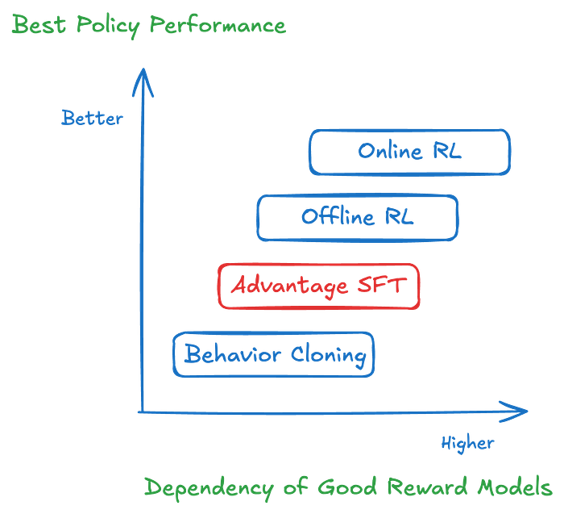
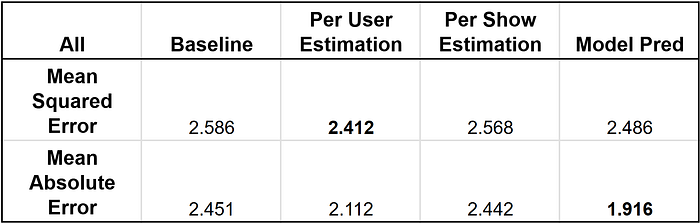
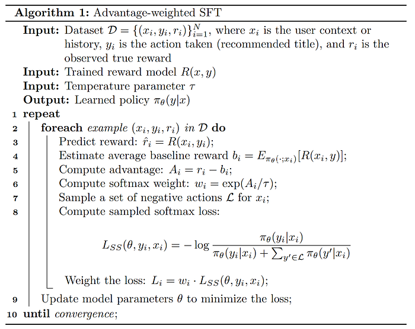
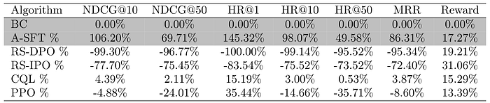

# Post-Training Generative Recommenders with Advantage-Weighted Supervised Finetuning

Author: [Keertana Chidambaram](https://keertanavc.github.io/), [Qiuling Xu](https://www.linkedin.com/in/qiuling-xu-a445b815a), [Ko-Jen Hsiao](https://www.linkedin.com/in/markhsiao/), [Moumita Bhattacharya](https://www.linkedin.com/in/moumitab/)

(*The work was done when Keertana interned at Netflix.)

## Introduction

This blog focuses on post-training generative recommender systems. Generative recommenders (GRs) represent a new paradigm in the field of recommendation systems (e.g. [HSTU](https://github.com/meta-recsys/generative-recommenders), [OneRec](https://arxiv.org/abs/2502.18965)). These models draw inspiration from recent advancements in transformer architectures used for language and vision tasks. They approach the recommendation problem, including both ranking and retrieval, as a sequential transduction task. This perspective enables generative training, where the model learns by imitating the next event in a sequence of user activities, thereby effectively modeling user behavior over time.

However, a key challenge with simply replicating observed user patterns is that it may not always lead to the best possible recommendations. User interactions are influenced by a variety of factors — such as trends, or external suggestions — and the system’s view of these interactions is inherently limited. For example, if a user tries a popular show but later indicates it wasn’t a good fit, a model that only imitates this behavior might continue to recommend similar content, missing the chance to enhance the user’s experience.

This highlights the importance of incorporating user preferences and feedback, rather than solely relying on observed behavior, to improve recommendation quality. In the context of recommendation systems, we benefit from a wealth of user feedback, which includes explicit signals such as ratings and reviews, as well as implicit signals like watch time, click-through rates, and overall engagement. This abundance of feedback serves as a valuable resource for improving model performance.

Given the recent success of reinforcement learning techniques in post-training large language models, such as DPO and GRPO, this study investigates whether similar methods can be applied to generative recommenders. Ultimately, our goal is to identify both the opportunities and challenges in using these techniques to enhance the quality and relevance of recommendations.

Unlike language models, post-training generative recommenders presents unique challenges. One of the most significant is the **difficulty of obtaining counterfactual feedback in recommendation scenarios**. The recommendation feedback is generated on-policy — that is, it reflects users’ real-time interactions with the system as they naturally use it. Since a typical user sequence can span weeks or even years of activity, it is impractical to ask users to review or provide feedback on hypothetical, counterfactual experiences. As a result, the absence of counterfactual data makes it challenging to apply post-training methods such as PPO or DPO, which require feedback from counterfactual user sequences.

Furthermore, post-training methods typically rely on a reward model — either implicit or explicit — to guide optimization. The quality of reward models heavily influences the effectiveness of post-training. In the context of recommendation systems, however, reward signals tend to be much noisier. For instance, if we use watch time as an implicit reward, it may not always accurately reflect user satisfaction: a viewer might stop watching a favorite show simply due to time constraints, while finishing a lengthy show doesn’t necessarily indicate genuine enjoyment.

To address these post-training challenges, we introduce a novel algorithm called Advantage-Weighted Supervised Fine-tuning (A-SFT). Our analysis first demonstrates that reward models in recommendation systems often exhibit higher uncertainty due to the issues discussed above. Rather than relying solely on these uncertain reward models, A-SFT combines supervised fine-tuning with the advantage function to more effectively guide post-training optimization. This approach proves especially effective when the reward model has high variance but still provides valuable directional signals. We benchmark A-SFT against four other representative methods, and our results show that A-SFT achieves better alignment between the pre-trained generative recommendation model and the reward model.

In Figure 1, we conceptualize the pros and cons of different post-training paradigms. For example, Online Reinforcement Learning is most useful when the reward model has a good generalization ability, and behavior cloning is suitable when no reward models are available. Using these algorithms under fitting use cases is the key to a successful post-training. For example, over-exploitation of noisy reward models will hurt task performance, as guidance from the reward models can be simply noise. Conversely, not leveraging a good reward model leaves out potential improvements. We find A-SFT fits the sweet point between offline reinforcement learning and behavior cloning, where it benefits from the directional signals in those noisy estimations and is less dependent on the reward accuracy.

Figure 1: The landscape of RL algorithms based on the reward models’ accuracy

## Challenges in Post-training for Recommendation

Reinforcement Learning from Human Feedback (RLHF) is the most popular framework for post-training large language models. In this framework, human annotators evaluate and rank different outputs generated by a model. This feedback is then used to train a reward model that predicts how well a model output aligns with human preferences. This reward model then serves as a proxy for human judgment during reinforcement learning, guiding the model to generate outputs that are more likely to be preferred by humans.

While traditional RLHF methods like PPO or DPO are effective for aligning LLMs, there are several challenges in applying them directly to large-scale recommendation systems:

1. Lack of Counter-factual Observations

As in typical RLHF settings, collecting real-time feedback from a diverse user base across a wide range of items is both costly and impractical. The data in recommendation are generated by the real-time user interests. Any third-party annotators or even the user themselves lack the practical means to evaluate an alternative reality. For example, it is impractical to ask the Netflix users to evaluate hundreds of unseen movies. Consequently, we lack a live environment in which to perform reinforcement learning.

2. Noisy Reward Models

In addition to the limited counter-factual data, the recommendation task itself has a higher randomness by its nature. The recommendation data has less structure than language data. Users choose to watch some shows not because there is a grammar rule that nouns need to follow by the verbs. In fact, the users’ choices usually exhibit a level of permutation invariance, where swapping the order of events in the user history still makes a valid activity sequence. This randomness in the behaviors makes learning a good reward model extremely difficult. Often the reward models we learnt still have a large margin of errors.

Here is an ablation study we did on the reward model performance with O(Millions) users and O(Billions) of tokens. The reward model uses an open-sourced HSTU architecture in the convenience of reproducing this study. We adopt the standard RLHF approach of training a reward model using offline, human-collected feedback. We start by creating a proxy reward, scored on a scale from 1 to 5 in the convenience of understanding. This reward model is co-trained as a shallow reward head on top of the generative recommender. It predicts the reward for the most recently selected title based on a user’s interaction history. To evaluate its effectiveness, we compare the model’s performance against two simple baselines: (1) predicting the next reward as the average reward the user has given in their past interactions, and (2) predicting it as the average reward that all users have assigned to that particular title in previous interactions.

Table 1: Reward model performance metrics

We observe that the model’s predictions do not significantly outperform the simple baselines. This result is intuitive, as a user’s historical interactions typically cover only a small subset of titles, making it difficult to accurately predict their responses to the vast number of unexplored titles in the catalogue. We expect this to be a potential issue for any large recommendation systems where the ratio between explored and unexplored titles is very small.

3. Lack of Logged Policy

In recommendation systems, the policy that generated the logged data is typically unknown and cannot be directly estimated. Offline reinforcement learning methods often rely on Inverse Propensity Scoring (IPS) to debias such data by reweighting interactions according to the logging policy’s action probabilities. However, estimating the logging policy accurately is challenging and prone to error, which can introduce additional biases, and IPS itself is known to suffer from high variance. Consequently, offline RL approaches that depend on IPS are ill-suited for our setting.

## Advantage Weighted Supervised Fine Tuning

Given the three challenges outlined above, we propose a new algorithm Advantage-Weighted SFT (A-SFT). It leverages a combination of supervised fine-tuning and advantage reweighting from reinforcement learning. The key observation is as follows. Despite the reward estimation for each individual event having a high uncertainty, we find the estimations of rewards contain directional signals between high-reward and low-reward events. These signals could help better align the model during post-training.

A central factor in this study is the generalization ability of the reward model. Better generalization enables more accurate predictions of user preferences for unseen titles, thereby making exploration more effective. For reward models with moderate to high generalization power, both online RL methods such as PPO and offline RL methods such as CQL can perform effectively. However, in our setting, reward model generalization is worse than the language counterparts’, which makes these algorithms less appropriate. In addition, the use of techniques like inverse propensity scoring (IPS) introduces a heightened risk of high-variance estimates, prompting us to exclude algorithms such as off-policy REINFORCE.

Our proposed method A-SFT does not rely on IPS. With no need of prior knowledge of the logging policy, it can be generally applied to cases where observation of the environments are limited or biased. This is particularly useful to the recommendation setting due to the user feedback loop and distribution shifts with time. Without knowing the logging policy, A-SFT still provides means to control the policy deviation between the current policy and logging policy by tuning the parameter. This design provides essential means to control the learnt bias from uncertain reward models. We show that A-SFT outperforms baseline behavior cloning by directly optimizing observed rewards.

The advantage-weighted SFT algorithm is as follows:

For the results presented in this blog post, we treat the recommendation problem as a contextual bandit, i.e. given a history of user interactions as the context, can we recommend a high reward next title recommendation for the user?

## Benchmarks

We compared representative algorithms including PPO, IPO, DPO, CQL and SFT as the baselines:

1. **Reward weighted Behavior Cloning**: This benchmark algorithm modifies supervised fine-tuning (SFT) by weighting the loss with the raw rewards of the chosen item instead of weighing the loss with advantage as in the proposed algorithm.
2. **Rejection Sampling Direct Preference Optimization / Identity Preference Optimization (RS DPO/IPO)**: this is a variant of DPO/IPO where, for each user history x, ​we generate contrasting response pairs by training an ensemble of reward models to estimate confidence intervals for the reward of multiple potential responses y. If the lower bound of the reward confidence interval for one response​ is less than the upper bound for another response, then this pair is used to train DPO/IPO.
3. **Conservative Q-Learning (CQL)**: This is a standard offline algorithm that learns a conservative Q function, penalizing overestimation of Q-values, particularly in regions of the state-action space with little or no reward data.
4. **Proximal Policy Optimization (PPO)**: This is a standard RLHF (Reinforcement Learning from Human Feedback) algorithm that uses reward models as an online environment. PPO learns an advantage function and optimizes the policy to maximize expected reward while maintaining proximity to the initial policy.

We sampled a separate test set of O(Millions) users. This test set is collected on a future date after the training.

## Offline Evaluation Results

We evaluate our algorithm on a dataset of high-reward user trajectories. For sake of simplicity, we consider a trajectory to have a high reward if the accumulated reward is higher than the median of the population. We present the following metrics for the held out test dataset:

1. **NDCG@k**: This measures the ranking quality of the recommended items up to position k. It accounts for the position of relevant items in the recommendation list, assigning higher scores when relevant items appear higher in the ranking. The gain is discounted logarithmically at lower ranks, and the result is normalized by the ideal ranking (i.e., the best possible ordering of items).
2. **HR@k**: This measures the proportion of test cases in which the ground-truth chosen item y appears in the top k recommendations. It is a binary metric per test case (hit or miss) and is averaged over all test cases.
3. **MRR**: MRR evaluates the ranking quality by measuring the reciprocal of the rank at which the chosen item appears in the recommendation list. The metric is averaged across all test cases.
4. **Reward Model as A Judge**: We use the reward model to evaluate the policy for future user events. We propose to use an ensemble of reward models for the evaluation to increase confidence. The result is based on the discounted reward generated for a few steps. The standard deviation is less than 4%.

We measure the percentage improvement in each metric compared to the baseline, Reward Weighted Behavior Cloning(BC). We notice that advantage weighted SFT shows the largest improvement in metrics, outweighing BC as well as reward model dependent algorithms like CQL, PPO, DPO and IPO.

Our experiments show that advantage weighted SFT is a simple but promising approach for post-training generative recommenders as it deals with the issue of poor reward model generalizations and lack of IPS. More specifically, we find PPO, IPO and DPO achieve a good reward score, but also causes the overfitting from the reward model. Conservative Q-Learning achieves more robust improvements but does not fully capture the potential signals in the reward modeling. A-SFT achieved both better recommendation metrics and reward scores.

---
**Tags:** Recommendations · AI · Large Language Models · Reinforcement Learning
