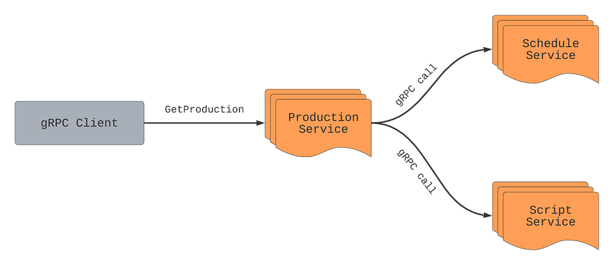
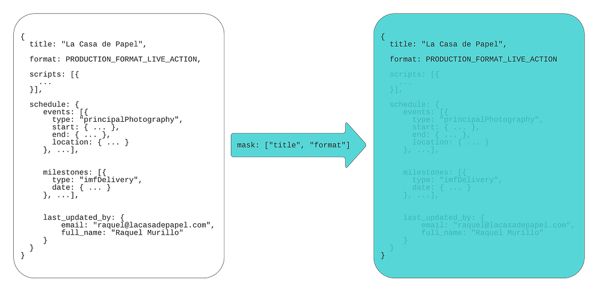
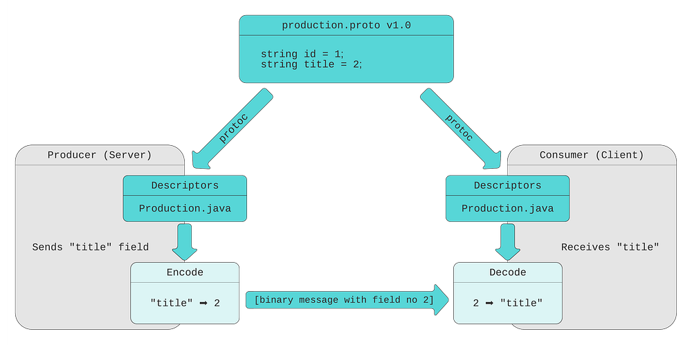
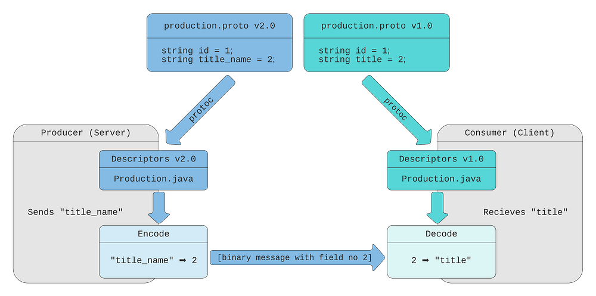
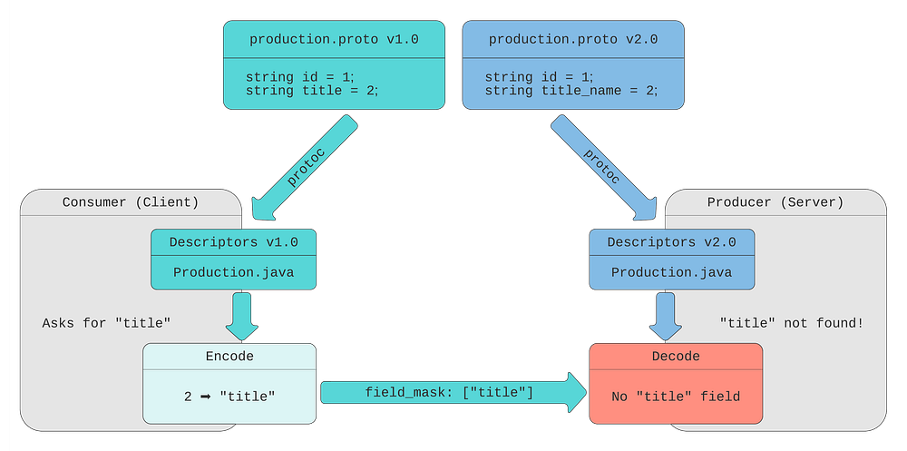

# Practical API Design at Netflix, Part 1: Using Protobuf FieldMask

By [_Alex Borysov_](https://www.linkedin.com/in/aborysov/), [_Ricky Gardiner_](https://www.linkedin.com/in/rickygardiner/)

## Background

**At Netflix, we heavily use ****[gRPC](https://grpc.io/)**** for the purpose of backend to backend communication.** When we process a request it is often beneficial to know which fields the caller is interested in and which ones they ignore. Some response fields can be expensive to compute, some fields can require remote calls to other services.** ****Remote calls are never free; they impose extra latency, increase probability of an error, and consume network bandwidth****.** How can we understand which fields the caller doesn’t need to be supplied in the response, so we can avoid making unnecessary computations and remove calls? With GraphQL this comes out of the box through the use of field selectors. In the JSON:API standard a similar technique is known as [Sparse Fieldsets](https://jsonapi.org/format/#fetching-sparse-fieldsets). How can we achieve a similar functionality when designing our gRPC APIs? The solution we use within the [Netflix Studio Engineering](./netflix-studio-engineering-overview-ed60afcfa0ce.md) is protobuf [FieldMask](https://developers.google.com/protocol-buffers/docs/reference/csharp/class/google/protobuf/well-known-types/field-mask).

*Money Heist (La casa de papel) / Netflix*

## Protobuf FieldMask

[Protocol Buffers](https://developers.google.com/protocol-buffers), or simply protobuf, is a data serialization mechanism. By default, gRPC uses protobuf as its IDL (interface definition language) and data serialization protocol.

FieldMask is a protobuf message. There are a number of utilities and conventions on how to use this message when it is present in an RPC request. A FieldMask message contains a single field named `paths`, which is used to specify fields that should be returned by a read operation or modified by an update operation.

## Example: Netflix Studio Production

*Money Heist (La casa de papel) / Netflix*

Let’s assume there is a Production service that manages Studio Content Productions (in the film and TV industry, the term [production](https://en.wikipedia.org/wiki/Filmmaking) refers to the process of making a movie, not the environment to run a software).

`GetProduction` returns a Production message by its unique ID. A production contains multiple fields such as: title, format, schedule dates, scripts aka screenplay, budgets, episodes, etc, but let’s keep this example simple and focus on filtering out schedule dates and scripts when requesting a production.

### Reading Production Details

Let’s say we want to get production information for a particular production such as “La Casa De Papel” using the `GetProduction` API. While a production has many fields, some of these fields are returned from other services such as `schedule` from the Schedule service, or `scripts` from the Script service.

The Production service will make RPCs to Schedule and Script services every time `GetProduction` is called, even if clients ignore the `schedule` and `scripts` fields in the response. As mentioned above, remote calls are not free. If the service knows which fields are important for the caller, it can make an informed decision about making expensive calls, starting resource-heavy computations, and/or calling the database. In this example, if the caller only needs production title and production format, the Production service can avoid making remote calls to Schedule and Script services.

Additionally, requesting a large number of fields can make the response payload massive. This can become an issue for some applications, for example, on mobile devices with limited network bandwidth. In these cases it is a good practice for consumers to request only the fields they need.

*Money Heist (La casa de papel) / Netflix*

A naïve way of solving these problems can be adding additional request parameters, such as `includeSchedule` and `includeScripts`:

This approach requires adding a custom `includeXXX` field for every expensive response field and doesn’t work well for nested fields. It also increases the complexity of the request, ultimately making maintenance and support more challenging.

### Add FieldMask to the Request Message

Instead of creating one-off “include” fields, API designers can add `field_mask` field to the request message:

Consumers can set paths for the fields they expect to receive in the response. If a consumer is only interested in production titles and format, they can set a FieldMask with paths “title” and “format”:

*Masking fields*

Please note, even though code samples in this blog post are written in Java, demonstrated concepts apply to any other language supported by protocol buffers.

If consumers only need a title and an email of the last person who updated the schedule, they can set a different field mask:

By convention, if a FieldMask is not present in the request, all fields should be returned.

### Protobuf Field Names vs Field Numbers

You might notice that paths in the FieldMask are specified using field names, whereas on the wire, encoded protocol buffers messages contain only field numbers, not field names. This (alongside some other techniques like [ZigZag encoding](https://en.wikipedia.org/wiki/Variable-length_quantity#Zigzag_encoding) for signed types) makes protobuf messages space-efficient.

To understand the difference between field numbers and field names, let’s take a detailed look at how protobuf encodes and decodes messages.

Our protobuf message definition (.proto file) contains Production message with five fields. Every field has a type, name, and number.

When the protobuf compiler (protoc) compiles this message definition, it creates the code in the language of your choice (Java in our example). This generated code contains classes for defined messages, together with message and field descriptors. Descriptors contain all the information needed to encode and decode a message into its binary format. For example, they contain field numbers, names, types. Message producer uses descriptors to convert a message to its wire format. For efficiency, the binary message contains only field number-value pairs. Field names are not included. When a consumer receives the message, it decodes the byte stream into an object (for example, Java object) by referencing the compiled message definitions.

As mentioned above, FieldMask lists field names, not numbers. Here at Netflix we are using field numbers and convert them to field names using [FieldMaskUtil.fromFieldNumbers()](https://developers.google.com/protocol-buffers/docs/reference/java/com/google/protobuf/util/FieldMaskUtil.html#fromFieldNumbers-java.lang.Class-int...-) utility method. This method utilizes the compiled message definitions to convert field numbers to field names and creates a FieldMask.

However, there is an easy-to-overlook limitation: using FieldMask can limit your ability to rename message fields. Renaming a message field is generally considered a safe operation, because, as described above, the field name is not sent on the wire, it is derived using the field number on the consumer side. With FieldMask, field names are sent in the message payload (in the `paths` field value) and become significant.

Suppose we want to rename the field `title` to `title_name` and publish version 2.0 of our message definition:

In this chart, the producer (server) utilizes new descriptors, with field number 2 named `title_name`. The binary message sent over the wire contains the field number and its value. The consumer still uses the original descriptors, where the field number 2 is called `title`. It is still able to decode the message by field number.

This works well if the consumer doesn’t use FieldMask to request the field. If the consumer makes a call with the “title” path in the FieldMask field, the producer will not be able to find this field. The producer doesn’t have a field named `title` in its descriptors, so it doesn’t know the consumer asked for field number 2.

As we see, if a field is renamed, the backend should be able to support new and old field names until all the callers migrate to the new field name (backward compatibility issue).

There are multiple ways to deal with this limitation:

- Never rename fields when FieldMask is used. This is the simplest solution, but it’s not always possible
- **Require the backend to support all the old field names. This solves the backward compatibility issue but requires extra code on the backend to keep track of all historical field names**
- Deprecate old and create a new field instead of renaming. In our example, we would create the `title_name` field number 6. This option has some advantages over the previous one: it allows the producer to keep using generated descriptors instead of custom converters; also, deprecating a field makes it more prominent on the consumer side

Regardless of the solution, it is important to remember that FieldMask makes field names an integral part of your API contract.

### Using FieldMask on the Producer (Server) Side

On the producer (server) side, unnecessary fields can be removed from the response payload using the [FieldMaskUtil.merge()](https://developers.google.com/protocol-buffers/docs/reference/java/com/google/protobuf/util/FieldMaskUtil.html#merge-com.google.protobuf.FieldMask-com.google.protobuf.Message-com.google.protobuf.Message.Builder-) method (lines ##8 and 9):

**If the server code also needs to know which fields are requested in order to avoid making external calls, database queries or expensive computations, this information can be obtained from the FieldMask paths field**:

This code calls the `makeExpensiveCallToScheduleService`method (line #21) only if the `schedule` field is requested. Let’s explore this code sample in more detail.

(1) The `SCHEDULE_FIELD_NAME` constant contains the name of the field. This code sample uses message type [Descriptor](https://developers.google.com/protocol-buffers/docs/reference/java/com/google/protobuf/Descriptors) and [FieldDescriptor](https://developers.google.com/protocol-buffers/docs/reference/java/com/google/protobuf/Descriptors.FieldDescriptor.html) to lookup field name by field number. The difference between protobuf field names and field numbers is described in the Protobuf Field Names vs Field Numbers section above.

(2) [FieldMaskUtil.normalize()](https://developers.google.com/protocol-buffers/docs/reference/java/com/google/protobuf/util/FieldMaskUtil.html#normalize-com.google.protobuf.FieldMask-) returns FieldMask with alphabetically sorted and deduplicated field paths (aka canonical form).

(3) Expression (lines ##14 - 17) that yields the `scheduleFieldRequested`value takes a stream of FieldMask paths, maps it to a stream of top-level fields, and returns `true` if top-level fields contain the value of the `SCHEDULE_FIELD_NAME` constant.

(4) `ProductionSchedule` is retrieved only if `scheduleFieldRequested` is `true`.

If you end up using FieldMask for different messages and fields, consider creating reusable utility helper methods. For example, a method that returns all top-level fields based on FieldMask and FieldDescriptor, a method to return if a field is present in a FieldMask, etc.

## Ship Pre-built FieldMasks

Some access patterns can be more common than others. If multiple consumers are interested in the same subset of fields, API producers can ship client libraries with FieldMask pre-built for the most frequently used field combinations.

Providing pre-built field masks simplifies API usage for the most common scenarios and leaves consumers the flexibility to build their own field masks for more specific use-cases.

## Limitations

- Using FieldMask can limit your ability to rename message fields (described in the Protobuf Field Names vs Field Numbers section)
- Repeated fields are only allowed in the last position of a path string. This means you cannot select (mask) individual sub-fields in a message inside a list. This can change in the foreseeable future, as a recently approved Google API Improvement Proposal [AIP-161 Field masks](https://google.aip.dev/161) includes support for wildcards on repeated fields.

## Bella Ciao

Protobuf FieldMask is a simple, yet powerful concept. It can help make APIs more robust and service implementations more efficient.

This blog post covered how and why it is used at Netflix Studio Engineering for APIs that read the data. [Part 2](./practical-api-design-at-netflix-part-2-protobuf-fieldmask-for-mutation-operations-2e75e1d230e4.md) will shed light on using FieldMask for update and remove operations.

---
**Tags:** API · Protocol Buffers · Grpc · Api Design · Microservice Architecture
