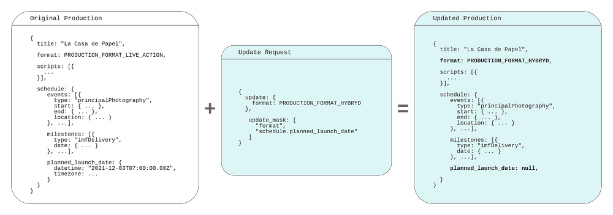

# Practical API Design at Netflix, Part 2: Protobuf FieldMask for Mutation Operations

By [_Ricky Gardiner_](https://www.linkedin.com/in/rickygardiner/), [_Alex Borysov_](https://www.linkedin.com/in/aborysov/)

## Background

In our [previous post](./practical-api-design-at-netflix-part-1-using-protobuf-fieldmask-35cfdc606518.md), we discussed how we utilize [FieldMask](https://developers.google.com/protocol-buffers/docs/reference/csharp/class/google/protobuf/well-known-types/field-mask) as a solution when designing our APIs so that consumers can request the data they need when fetched via gRPC. In this blog post we will continue to cover how Netflix Studio Engineering uses FieldMask for mutation operations such as update and remove.

## Example: Netflix Studio Production

*Money Heist (La casa de papel) / Netflix*

[Previously](./practical-api-design-at-netflix-part-1-using-protobuf-fieldmask-35cfdc606518.md) we outlined what a Production is and how the Production Service makes gRPC calls to other microservices such as the Schedule Service and Script Service to retrieve schedules and scripts (aka screenplay) for a particular production such as La Casa De Papel. We can take that model and showcase how we can mutate particular fields on a production.

## Mutating Production Details

Let’s say we want to update the `format` field from `LIVE_ACTION` to `HYBRID` as our production has added some animated elements. A naive way for us to solve this is to add an updateProductionFormatRequest method and gRPC endpoint just to update the productionFormat:

This allows us to update the production format for a particular production but what if we then want to update other fields such as `title`or even multiple fields such as `productionFormat`, `schedule`, etc? Building on top of this we could just implement an update method for every field: one for Production format, another for title and so on:

This can become unmanageable when maintaining our APIs due to the number of fields on the Production. What if we want to update more than one field and do it atomically in a single RPC? Creating additional methods for various combinations of fields will lead to an explosion of mutation APIs. This solution is not scalable.

Instead of trying to create every single combination possible, another solution could be to have an `UpdateProduction` endpoint that requires all fields from the consumer:

The issue with this solution is two-fold as the consumer must know and provide every single required field in a Production even if they just want to update one field such as the format. The other issue is that since a Production has many fields the request payload can become quite large particularly if the production has schedule or scripts information.

What if, instead of all the fields, we send only the fields we actually want to update, and leave all other fields unset? In our example, we would only set the production format field (and ID to reference the production):

This could work if we never need to remove or blank out any fields. But what if we want to remove the value of the `title` field? Again, we can introduce one-off methods like `RemoveProductionTitle`, but as discussed above, this solution does not scale well. What if we want to remove a value of a nested field such as the planned launch date field from the schedule? We would end up adding remove RPCs for every individual nullable sub-field.

## Utilizing FieldMask for Mutations

Instead of numerous RPCs or requiring a large payload, we can utilize a FieldMask for all our mutations. The FieldMask will list all of the fields we would like to explicitly update. First, let’s update our proto file to add in the `UpdateProductionRequest`, which will contain the data we want to update from a production, and a FieldMask of what should be updated:

Now, we can use a FieldMask to make mutations. We can update the format by creating a FieldMask for the `format` field by using the [FieldMaskUtil.fromStringList()](https://developers.google.com/protocol-buffers/docs/reference/java/com/google/protobuf/util/FieldMaskUtil.html#fromStringList-java.lang.Class-java.lang.Iterable-) utility method which constructs a FieldMask for a list of field paths in a certain type. In this case, we will have one type, but will build upon this example later:

Since our FieldMask only specifies the `format` field that will be the only field that is updated even if we provide more data in `ProductionUpdateOperation`. It becomes easier to add or remove more fields to our FieldMask by modifying the paths. Data that is provided in the payload but not added in a path of a FieldMask will not be updated and simply ignored in the operation. But, if we omit a value it will perform a remove mutation on that field. Let’s modify our example above to showcase this and update the format but remove the planned launch date, which is a nested field on the `ProductionSchedule` as “schedule.planned_launch_date”:

In this example, we are performing both update and remove mutations as we have added “format” and “schedule.planned_launch_date” paths to our FieldMask. When we provide this in our payload these fields will be updated to the new values, but when building our payload we are only providing the `format` and omitting the `schedule.planned_launch_date`. Omitting this from the payload but having it defined in our FieldMask will function as a remove mutation:

## Empty / Missing Field Mask

When a field mask is unset or has no paths, the update operation applies to all the payload fields. This means the caller must send the whole payload or, as mentioned above, any unset fields will be removed.

This convention has an implication on schema evolution: when a new field is added to the message, all the consumers must start sending its value on the update operation or it will get removed.

Suppose we want to add a new field: production budget. We will extend both the `Production` message, and `ProductionUpdateOperation`:

If there is a consumer that doesn’t know about this new field or hasn’t updated client stubs yet, it can accidentally null the budget field out by not sending the FieldMask in the update request.

To avoid this issue, the producer should consider requiring the field mask for all the update operations. Another option would be to implement a versioning protocol: force all callers to send their version numbers and implement custom logic to skip fields not present in the old version.

## Bella Ciao

In this blog post series, we have gone over how we use FieldMask at Netflix and how it can be a practical and scalable solution when designing your APIs.

**API designers should aim for simplicity, but make their APIs open for extension and evolution. It’s often not easy to keep APIs simple and future-proof.** Utilizing FieldMask in APIs helps us achieve both simplicity and flexibility.

---
**Tags:** API · Protocol Buffers · Grpc · Api Design · Microservice Architecture
