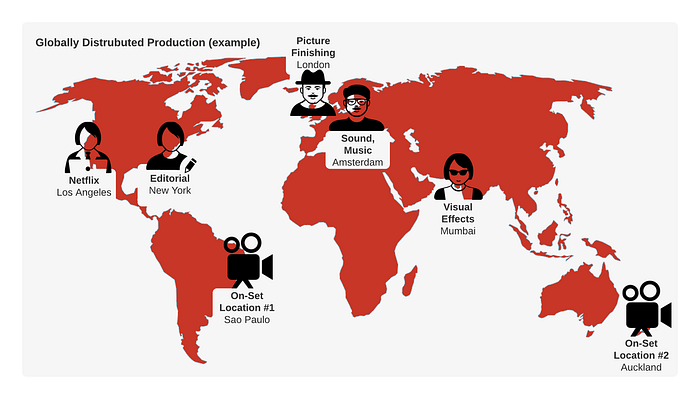
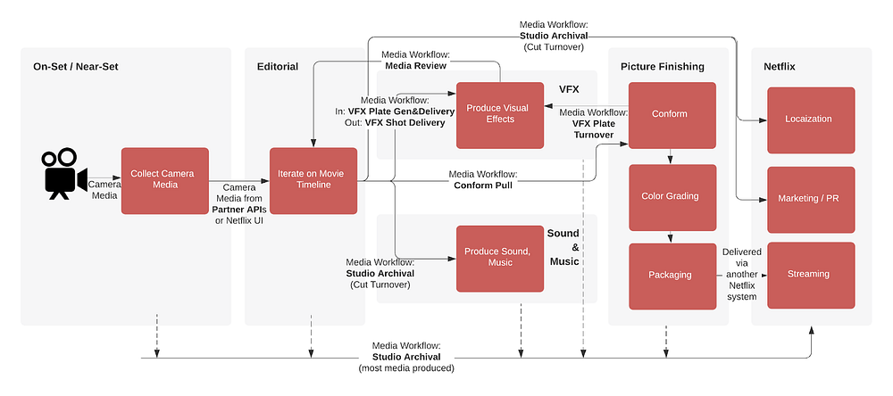
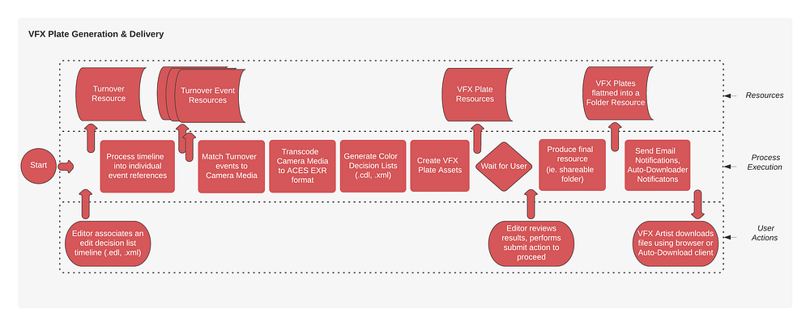
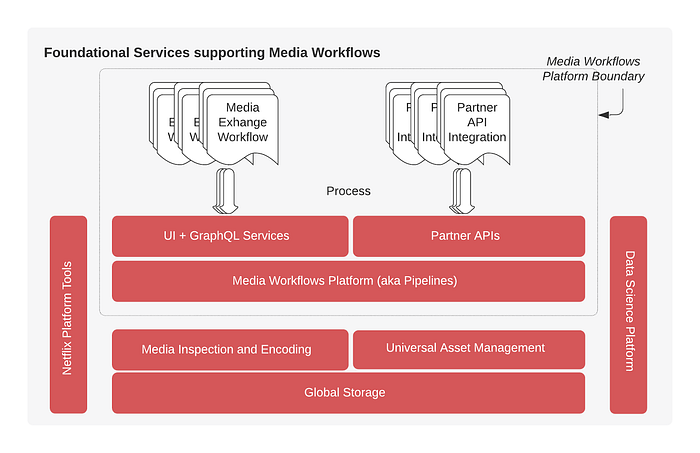

# Production Media Management: Transforming Media Workflows by leveraging the Cloud

_Written by _[_Anton Margoline_](https://www.linkedin.com/in/margoline/)_, _[_Avinash Dathathri_](https://www.linkedin.com/in/avinash-dathathri/)_, _[_Devang Shah_](https://www.linkedin.com/in/shahdewang/)_ and _[_Murthy Parthasarathi_](https://www.linkedin.com/in/pvmurthy/)_. Credit to Netflix Studio’s Product, Design, Content Hub Engineering teams along with all of the supporting partner and platform teams._

In this post, we will share a behind-the-scenes look at how Netflix delivers technology and infrastructure to help production crews create and exchange media during _production_ and _post production_ [stages](https://en.wikipedia.org/wiki/Filmmaking#Stages_of_production). We’ll also cover how our [Studio Engineering](./netflix-studio-engineering-overview-ed60afcfa0ce.md) efforts are helping Netflix productions to spend less time on media logistics by utilizing our cloud based services.

## Lights, Camera, Media! Productions take on media management

In a typical [live action](https://en.wikipedia.org/wiki/Live_action) production, after media is offloaded from the camera and sound recorders on set, it is operated on as files on disk using various tools between departments, like Editorial, Sound and Music, Visual Effects (VFX), Picture Finishing and teams at Netflix. Increasingly, the teams are globally distributed, and each stage of the process generates many terabytes of data.

Media exchanges between different departments constitute a media workflow, and no two productions share the same workflow, known in the industry by the term ‘[snowflake workflow](https://www.youtube.com/watch?v=03nV2W2ba4I)’. The stories demand different technical approaches to production, which is why a media workflow for a multi-camera show with visual effects such as [Stranger Things](https://www.netflix.com/title/80057281), has a different workflow to [Formula 1: Drive to Survive](https://www.netflix.com/watch/80204890) with an extensive amount of footage.

Media workflows are always evolving and adapting; driven by changes in production technology (new cameras and formats), post production technology (tools used by Sound, Music, VFX, and Picture Finishing) and consumer technology (adoption of [4K](https://en.wikipedia.org/wiki/4K_resolution), [HDR](https://en.wikipedia.org/wiki/High_dynamic_range), and [Atmos](https://en.wikipedia.org/wiki/Dolby_Atmos)). It would be impossible to describe all of the complexities and the history of the industry in a single post. For a more comprehensive overview, please refer to Scott Arundale and Tashi Trieu’s book, [_Modern Post: Workflows and Techniques for Digital Filmmakers_](https://www.routledge.com/Modern-Post-Workflows-and-Techniques-for-Digital-Filmmakers/Arundale-Trieu/p/book/9780415747028)_._

## Workflows are louder than words. Technology empowering Netflix productions today!

Now that we understand what media workflows are, let’s take a look at some of the workflows we’ve enabled.

**Collect Camera Media **(On-Set/Near-Set)

We enable camera and sound media imports via our partner API integrations or via Netflix media import UIs. Along with the files, metadata plays an important role in downstream workflows, so we make significant efforts to categorize all media into respective assets with the help of the metadata we collect from our partner API integrations as well as our internal video inspection services. Media Workflows:

- **Content Hub (Netflix UI) Import:** Imports footage media, which is inspected and, with the help of the metadata, categorized into assets.
- **Partner API Import**: We provide external APIs for our partners to exchange media files and metadata to and from the cloud. We have pilot integrations with media management tools including Colorfront’s [Express Dailies](https://colorfront.com/SOFTWARE/Express%20Dailies), [Light Iron](https://www.lightiron.com/services/dailies/) and Fotokem’s [Nextlab](https://fotokem.com/#/production) and we’re looking to extend this in the future.

**Iterate on a Movie Timeline **(Editorial)

We enable Editorial workflows to drive media interchange between Editorial and VFX, Sound & Music, Picture Finishing facility and Netflix. Most of the workflows start with an Editor providing an [edit decision list](https://en.wikipedia.org/wiki/Edit_decision_list) timeline with a playable reference (.mov file). Depending on the type of the workflow, this timeline can be shared as is, or transformed into alternative formats required by the tools used in other areas of production. Media Workflows:

- **VFX Plate Generation & Delivery**: Editorial turns over an [edit decision list](https://en.wikipedia.org/wiki/Edit_decision_list) timeline which is processed into media references and either matched to already uploaded VFX Plates ([ACES](https://en.wikipedia.org/wiki/Academy_Color_Encoding_System) [EXR](https://en.wikipedia.org/wiki/OpenEXR) images + other files) or, if the plates are not available, they are transcoded from the raw camera media. At the end of the workflow, the VFX facility receives VFX Plates as a downloadable folder.
- **Conform Pull**:** **Editorial shares an [edit decision list](https://en.wikipedia.org/wiki/Edit_decision_list) timeline, which upon processing is turned over to the Picture Finishing facility as a downloadable folder with original camera media trimmed to the parts used in the timeline.
- **Studio Archival** (Cut Turnover): As production iterates on the timeline, versions of the timeline (cuts) are shared (turned over) with other areas of production so they can begin their work. Major versions are known as “[Locked](https://en.wikipedia.org/wiki/Picture_lock) Cuts”. Utilizing this workflow, an Editor uploads the aforementioned timeline with its related files. The media is transcoded onto different formats and, as required and permitted, shared with other departments downstream, such as dubbing, marketing or PR.

**Produce Visual Effects **(VFX)

We enable VFX via several media workflows, starting from the initial request from an Editorial department to facilitate the visual effects work, iterating on the produced VFX shots using Media Review workflows, delivering back the finished product by VFX Shot Delivery and, at the very end, archiving everything for safekeeping. Media Workflows:

- **Media Review**: VFX Shot delivery and review workflow, used by Editorial, show-side VFX and Netflix. Both Netflix and our productions frequently rely on 3rd party software to manage their VFX assets, which is why this workflow leverages integrations to sync media and metadata.
- **VFX Shot Delivery**:** **VFX Shots are delivered from VFX to Picture Finishing facility.
- **Studio Archival** (most VFX media): Shots and other media used to produce visual effects are delivered and archived for safekeeping.

**Picture Finishing** (Picture Finishing Facility)

We enable Picture Finishing facilities to get all of the ingredients needed to do the conform, where all media used in the timeline is verified and made available for [color grading](https://en.wikipedia.org/wiki/Color_grading). If the facility also helps with media management on a given production, we have workflows where the Picture Finishing facility would manage VFX Plate delivery to the VFX facility. Media workflows: **VFX Plate Delivery**: Provides means to procure VFX Plates ([ACES](https://en.wikipedia.org/wiki/Academy_Color_Encoding_System) [EXR](https://en.wikipedia.org/wiki/OpenEXR) images + other files) used by VFX in the process of creating visual effects.

**Sound, Music**

We enable Editorial to share their versions of the timeline (cuts) in the form of playable timeline references (.mov files) with Sound/Music. We also enable Sound/Music to deliver their final products as Stems and Mixes so they can be used further into the production cycle, such as for mixing, [dubbing](https://en.wikipedia.org/wiki/Dubbing_(filmmaking)) and safekeeping. Media Workflows: **Studio Archival** and its variants.

**Localization, Marketing/PR, Streaming **(Netflix)

We enable our production partners to deliver media from many different aspects of production, some of which are mentioned in the areas above, with many more. In addition to safekeeping the media, Studio Archival media workflows empower media used during production for Marketing, PR and other workflows. Media Workflows: **Studio Archival** and its variants.

## The magic is in the details. VFX Plate Generation & Delivery workflow

Lets dive deeper into VFX Plate Generation & Delivery media workflow to demonstrate the steps required within this media exchange. While describing the details we’ll use the opportunity to refer to how our technology infrastructure enables this workflow among many others.

The VFX Plate Generation & Delivery workflow is a process by which an Editor provides the necessary media to a Visual Effects team, with metadata and raw ingredients necessary to begin their work. This workflow is enabled by camera media workflows, which would have been done earlier to make the camera media and its metadata available.

The VFX Plate Generation & Delivery workflow is started by an Editorial team with an [edit decision list](https://en.wikipedia.org/wiki/Edit_decision_list) timeline file (.edl, .xml) exported from a [Non Linear Editing](https://en.wikipedia.org/wiki/Non-linear_editing) tool. This timeline file contains only the references to media with additional information about time, color, markers and more, but not any of the actual media files. In addition to the timeline, the Editor chooses whether they would want the resulting media to be rescaled to UHD and how many extra frames they would like to have added for each event referenced in the timeline.

After processing the timeline file, each individual media reference is extracted with relevant timecode, media reference, color decisions and markers. To support different editorial tools, each having its own [edit decision list](https://en.wikipedia.org/wiki/Edit_decision_list) timeline format, our Video Encoding platform interprets the timeline into a standardized interchange format called [OpenTimelineIO](https://opentimelineio.readthedocs.io/en/latest/).

Media reference, color decisions and markers are linked with the original camera media and transcoded from raw camera formats onto [ACES](https://en.wikipedia.org/wiki/Academy_Color_Encoding_System) [EXR](https://en.wikipedia.org/wiki/OpenEXR). Most Visual Effects tools are not able to process raw camera files directly. Along with image media, color metadata is extracted from the timeline to generate [Color Decision List](https://en.wikipedia.org/wiki/ASC_CDL) files (.cdl, .xml) which are used to communicate color decisions made by an Editor. All of the media transformations and metadata are then persisted as VFX Plate assets.

The Editor then reviews VFX Plate Generation & Delivery details, with all of the timeline events clearly identified and any inconsistencies spotted, such as if raw camera media is not found or there are any challenges with transcoding media. If all looks good, an Editor is able to submit this workflow onto the final step where results are packaged and shared with the Visual Effects team.

To share results with Visual Effects artists, we’re transforming all of the VFX Plate assets and media created earlier and sharing with the recipients, who can either download the files via browser, or use our auto-downloader tools for additional convenience. Concluding this workflow is an email, sharing all the relevant information with the Editorial and VFX teams.

We’re leveraging the VFX Plate Generation & Delivery workflow (among others) on shows including the next installments of our amazing series like [Money Heist](https://www.netflix.com/title/80192098), [Selena](https://www.netflix.com/title/81022733) and others. We’re excited to help even more productions this year, as we’re continuing to build support for more use cases and polish the experiences.

## Walk, before you run. Scalable components powering Media Workflows

Let’s now zoom out and take a look at the foundation that supports the **20+ **unique media workflows that we’ve enabled in the last two years, with more being added at an accelerating rate.

No single monolithic service would scale to support the various demands of this platform. Many teams at Netflix contribute to the success of Media Workflows Platform, by providing the foundations we rely on for many of the steps taken.

**Media Workflows Platform (also known as “Content Hub”)**: a component that powers all of our media workflows. At a very high level it is composed of the Platform, UI and Partner APIs.

- **UI + GraphQL Services**: facilitating various media workflows, one use case at a time, built with the help of the recently open sourced domain graph service [implementation](./open-sourcing-the-netflix-domain-graph-service-framework-graphql-for-spring-boot-92b9dcecda18.md) for the [federated GraphQL](./how-netflix-scales-its-api-with-graphql-federation-part-2-bbe71aaec44a.md) environment.
- **Partner APIs: **external partner APIs enabling integrations into Netflix media workflows.
- **Media Workflows Platform: a **flexible platform that enables diverse, scalable, easy to customize production media workflows, built on the foundational tenets:

**_— Resource Management_**_ to associate files, assets and other workflows  
 — _**_Robust Execution Engine_**_ execution engine, powered by _[_Conductor_](./evolution-of-netflix-conductor-16600be36bca.md)_  
 — _**_State Machine_**_ defining user and system interaction  
 — _**_Reusable Steps_**_ enabling component reuse across different workflows_

**Media Inspection and Encoding**: scalable media services that are able to handle various media types, including raw camera media. Use cases range from gathering metadata to transforming (change format) or trans-wrapping (trim media).

**Universal Asset Management**: all media with its metadata maintained in a common asset management system enabling a common framework for consuming media assets in a microservice environment.

**Global Storage**: global, fault tolerant storage solution that supports file-based workflows in the cloud.

**Data Science Platform**: all of the layers feed into the data science platform, enabling insights to help us iterate on improving our services using data-driven metrics.

**Netflix Platform Tools**: paved path services provided in building, deploying and orchestrating our services together.

## Take me home. We ❤️ empowering Media Workflows, do you?

We’ve helped productions manage and exchange **many** petabytes of media which is only accelerating with more usage of the platform. Some of our recent workflows in Editorial are in pilot on a **handful** of productions, our VFX workflows helped **dozens** of shows, Media Review assisted **hundreds** of shows and, our Archival workflows are used on **all** of our shows. While we’ve innovated on many workflows, we’re continuing to add support for more workflows and are refining existing ones to be more helpful. Our media workflows platform is a robust, scalable and easy to customize solution that helps us create great content!

Thanks for getting this far! If you are just learning about how production media management works, we hope this sparks an interest in our problem space. If you are designing tools to empower media workflows, we hope that by sharing our challenges and approaches to solving them, we can all learn from each other. Realizing common challenges inspires more openness and the standardization we crave. We’re really excited to see the proliferation of open APIs and industry standards for media transformation and interchange such as [OpenTimelineIO](https://opentimelineio.readthedocs.io/en/latest/), [OpenColorIO](https://opencolorio.org/), [ACES](https://en.wikipedia.org/wiki/Academy_Color_Encoding_System) and more.

If you’re passionate about building production media workflows, or any of the foundational services, we’re always looking for talented engineers. Please check out our job listings for [Studio Engineering](https://jobs.netflix.com/search?team=Core+Engineering&subteam=Studio+Engineering), [Production Media Engineering](https://jobs.netflix.com/jobs/30849280), [Product Management](https://jobs.netflix.com/jobs/65803134), [Content Engineering](https://jobs.netflix.com/search?team=Core+Engineering&subteam=Content+Engineering+Core), [Data Science Engineering](https://jobs.netflix.com/search?team=Data+Science+and+Engineering) and [many more](https://jobs.netflix.com/search).

---
**Tags:** Media Management · Movie Production · Production Technology · Media Workflows · Content Hub
