# Protecting a Story’s Future with History and Science

_By Kylee Peña, Chris Clark, Mike Whipple, and Ben Sutor_

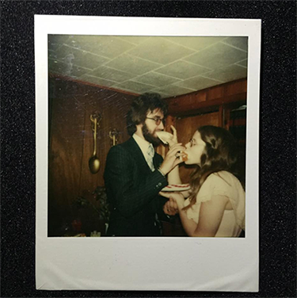
*Kylee’s parents after their wedding in 1978.*

I — Kylee — have two photos from my parents’ wedding. Just two. This year they celebrated 40 years of marriage, so both photos were shot on film. Both capture a joy and awkwardness that come with young weddings. They’re fresh and full of life, candid captures from another era.

One of the photos is a Polaroid Instant Camera shot. It’s the only copy of the photo. The colors are beginning to fade, and the image itself is only three or four inches across.

The other was shot on a 35mm camera. My mom and dad stand next to their best man and maid of honor, but the details are lost because the exposure is far too dark. And the negative was lost long ago too.

These are two photos that are important to my history, but I’ll probably never be able to make them any better. One was shot on a lost format, the color and contrast embedded into a single original copy as it was shot. The other could be cleaned up and blown up significantly with modern technology — if only the negative had been handled with care.

Everyone has images that are precious to them: that miraculous video of your dog doing that trick he does. The shot of your grandparents on their final anniversary together. Your own wedding, in which you invested thousands of your own savings. Imagine if you couldn’t play the video anymore, or if your grandparents’ portrait got blurry, or if your skin and wedding dress had a green hue on it.

On a movie or television show, this type of thing happens all the time to the director or cinematographer. They have worked their entire lives to get to the point of capturing that picture, and capturing it correctly. And then later it looks bad and wrong — 24 times a second.

By reaching beyond film and television art and into the realms of history and science, we’ve been working on solving this issue for Netflix projects. The future of our industry always has unknowns thanks in large part to rapidly accelerating innovations in technology. However, we can use what we _do_ know from a hundred years of filmmaking, and the study of human perception, to best preserve content as new technology emerges which allows us to make the experience of viewing it even better. Preserving creative intent while preserving these important images is the goal.

With some attention and care spent up front on building and testing a color managed workflow, a show can look as expected at every point in the process, and archival assets can be created that increase the longevity of a show far into the future and protect it for remastering. The assets we require at Netflix might be digital files that make their way to the cloud via our Content Hub, but the concepts are rooted in history and science.

## What’s Inside the Archive?

Anyone who has delivered to (or been interested in delivering to) Netflix is familiar with these terms: **non-graded archival master** (NAM) and [SMPTE **interoperable master format**](https://www.smpte.org/technical-specifications/tsp2121-app-dpp) (IMF). Other studios or facilities may have similar assets or similar names, and these are ours. Generally speaking, each delivery to Netflix will include these assets.

A **non-graded archival master** (NAM) is a complete copy of the ungraded, yet fully conformed, final locked picture including VFX, rendered in the original working color space such as ACES or the original camera log space, with no output or display transform rendered in or applied. This is used strictly for archival purposes.

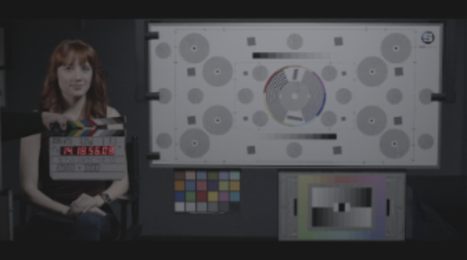

The NAM isn’t very pretty to watch because images in logarithmic a.k.a “log” or linear space are not rendered for display and potentially hold more information than current displays can reproduce.

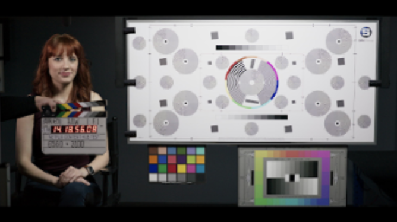

]The **interoperable master format** (IMF) deliverable is a complete copy of the fully conformed, final locked picture with VFX, this time rendering in the output or display transform, meaning it is encoded in the mastering display’s color space. While the IMF is also archived, it is used to create all streaming masters.

These assets are delivered in an uncompressed or losslessly compressed format such as a 16-bit DPX or EXR.

Formerly, we required a **graded archival master** (GAM), which added in the final color grading decisions to the fully conformed final locked picture, rendered in the original working color space such as ACES or the original camera log space — _again_, with no output or display transform rendered in or applied.

The decision to remove the GAM from our delivery list came after extensive analysis revealed that if we were to remaster to a new display space one to four years after final delivery, even a properly produced GAM would likely have color correction and often texture effects (such as grain) “baked in”, leaving our filmmakers unable to correct spatial issues or artifacts introduced during grading without leveraging the Non-Graded Archival Master.

We are constantly working to improve our filmmaker’s image authorship experience and increase their confidence and flexibility in image and color decisions from camera to screen. The NAM currently gives us the most flexibility in the future because we’re preserving a copy of the show in the original color space. While retaining all the original information and dynamic range as it was originally shot, we can remaster shows (and remaster them more easily) while referencing the original creative intent, assuring they’ll continue to look the best they possibly can for years to come.

To understand where these terms and processes come from, we have to go back to film class.

## Film History 101

Thinking more deeply about Netflix and the technology evolution pushing forward the creative technical work behind television and film, the last thing to come to mind might be physical film. But in fact, our streaming and archival assets have their roots in over a hundred years of film history.

Today, more often than not, productions have largely moved to digital acquisition on camera cards and hard drives. A century ago, when the only image capture format was celluloid, the physical processes to handle it were developed and refined over the years that followed.

*A motion picture film strip (Source: Wikimedia Commons)*

In a physical film workflow, photography was completed on set and exposed film negatives were sent to a lab for a one light print. Multiple camera rolls were strung together into a lab roll, and dailies were created using a simple set of light values that made a positive human-viewable print.

An editor would cut together the film and a negative cut list (similar to an EDL, with a list of edit decisions and key codes instead of file names and time codes) was sent to a negative cutter for conforming the locked picture from the original negative.

**This final cut glued together by a negative cutter is the equivalent of our modern day non-graded archival master (NAM).**

After this point, a director of photography would work with a color timer to apply a one-light to the entire negative, then give creative adjustments on each scene. The color timer would program the printer lights on a shot by shot basis in an analog process, creating what would be similar to a modern color decision list (CDL). When the color was agreed upon, the negative was printed with the timing lights. This second negative — a negative of a negative — was called the interpositive (IP).

**This IP or “negative negative” with all the final color decisions included is the equivalent of our formerly required graded archival master (GAM). **Since this film stock is based on the original negative, it can hold the same amount of information and dynamic range as the original negative.

Internegatives were created from the IP for bulk printing, and a positive (human viewable) film print was created from that. A print film stock, unlike negative film stocks, has specific characteristics required to produce a pleasing image when shown on a film projector. **The film print is our equivalent of an interoperable master format deliverable (IMF).**

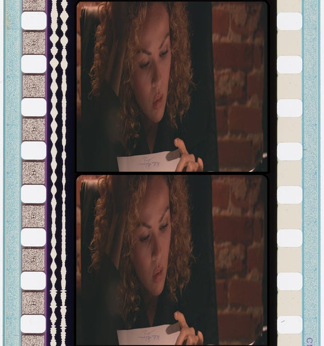
*35mm film print (Image courtesy of Adakin Productions) Source: Wikipedia*

As film continued to evolve and transition into digital workflows, motion imaging experts have continued to innovate and improve this process and transition it into modern workflows. Decades of work on moving pictures combined with the proliferation of faster, cheaper storage and smaller, better camera sensors have led to the ability to create a robust archive ready for remastering where no scenes will ever be lost to time.

## Next Up, Science Class: Color Science

To create these archival assets in today’s digital workflows (and maintain a happy creative team viewing their show exactly as they shot it at every point in the process), proper color management is key from the start. A basic understanding of color science is helpful in understanding how and why color, perception, and display technology is critical.

Most pictures today are color pictures. Color is made up of light, which at different wavelengths we would call “red,” “green,” “blue,” and many other names.

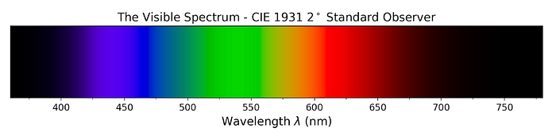
*Source: Colour Science for Python*

This light goes through two phases:

1. Light enters the eye and tiny cells on our retina (cones) react to it.
2. Signal travels to the back of our brain (visual cortex) to form a color perception.

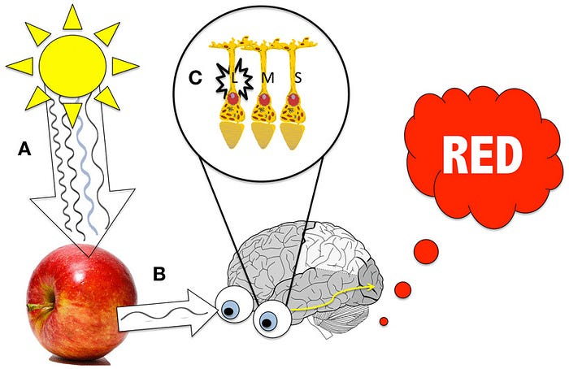
*Source: Wikimedia Commons*

The eye-retina portion (1) is a fairly well-understood science, standardized by the CIE into three measurable “tristimulus values” known as XYZ.* These values are based on our three cone types which respond to long (L), medium (M), and short (S) wavelengths of light.

XYZ is often called colorimetry, or the measurement of color. If you can get XYZ₁ to match XYZ₂, to the average observer, the colors will match. For example, we can print a picture of an apple, using printer dyes, which measures the same XYZ values as the original apple, even though the exact spectral characteristics of the printer dyes and apple differ. This is how most color imaging systems are successful.

The cognitive portion (2) is far more complex, and involves your viewing environment, adaptation state, as well as expectations and memory. This is known as color appearance, and is also well-studied and modeled — but we’ll save that for a future blog.

For this reason, XYZ makes for a fine and proven way of calibrating displays to match. Until someone figures out how to feed content straight to your brain, displays are the only way we can view content, so understanding their characteristics and making sure they’re working as intended is important.

But before we get to the display, we have to _create_ the images to display.

Cameras in our industry typically attempt to respond to light as close to the human visual system as possible, using color filters to emulate the three cone responses of the human eye. A perfectly designed camera would be able to record all visible colors, store them in XYZ, and perfectly store all the colors of a scene! Unfortunately, achieving this with an electronic camera system is difficult, so most cameras are not perfectly colorimetric. Still, the “emulate-the-human-eye” design criteria remains, and most cameras do a fairly good job at it.

Since cameras are not perfect, in very simple terms, they do two things:

1. Apply a Input Transform from raw sensor RGB → XYZ colorimetry, optimizing this transform for the most important** colors found in the real world.
2. Apply an Output Transform from XYZ → RGB for display.

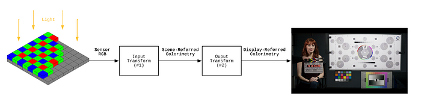

Sometimes this is all done in one step. For example, when you get a JPEG out of a camera or your smartphone, these two steps have occurred, and you are looking at what is known as a “display-referred” image. In other words, the RGB values correspond to the colors that should be coming off of the display.

It is worth noting here that broadcast cameras often operate in the same manner — they apply #1 and #2 to output “display-referred” images, which can be sent directly to a display.

Shooting RAW is different. Professional cameras allow for #1 and #2 to _not_ be applied. This means you get the raw sensor RGB values. No color transforms are applied until you process or “develop” that image.

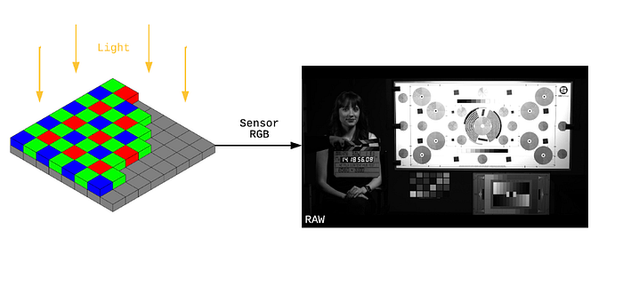

Now, let’s say you applied color transform #1 from above, but not #2, and you output an image in XYZ. This is known as a “scene-referred” image. In other words, the values correspond to the estimated*** colors in the scene, either in XYZ or an RGB encoding defined within XYZ.

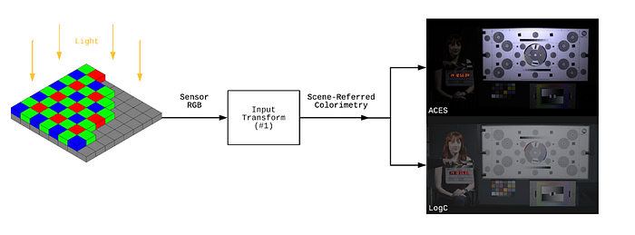

Scene-referred images usually contain much more information than displays can show, just like a film negative. This is true in both dynamic range and color. This can be stored in various ways. Camera companies in our industry usually define their own “scene-referred” color spaces.

Just a few examples include:

- ARRI: Alexa LogC Wide Gamut
- Sony: S-Log3 S-Gamut3.cine
- Panasonic: V-Log V-Gamut
- RED: RED Wide Gamut Log3G10

These color spaces are designed specifically to encompass the range of light and color that each camera is capable of capturing, and are storable in an integer encoding (usually 10-bit or 12-bit). This takes care of the Input Transform (#1).

It might seem appropriate to simply show the scene-referred color on a display, but the Output Transform (#2) portion is required to account for differences in luminance between the scene and display, as well as the change in viewing environment. For example, a _picture_ of a sunny day is not nearly as bright as the physical sun, so this must be accounted for in terms of contrast and color. This concept of “picture rendering” has many approaches, and goes beyond the scope of this blog post, but since it has a large impact on the overall “look” of an imaging system, it is worth introducing the concept here.

For this reason, camera companies usually provide default Output Transforms (in the form of look-up tables or LUTs) so that you can take a Log image from their camera and view it in a color space such as BT. 1886.

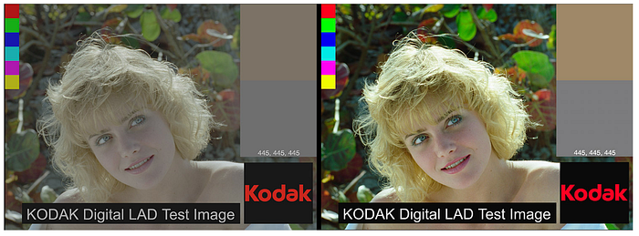
*Source: Kodak*

## An Eye Toward Color Management

These concepts all come together to form a color managed workflow. Because color management assures image fidelity, predictability of viewing images, and ease with mixed image sources, it’s the best way to work to protect the present _and_ future viewing of movies or series. A color managed workflow requires a defined working color space and an agreed upon output transform or LUT, clearly documented and shared with all parties in a workflow.

Once a working color space is defined, all color corrections are made within that space. However, since we know this space is scene-referred and can’t be viewed directly, the output transform must be used to preview what the image will look like on your display.

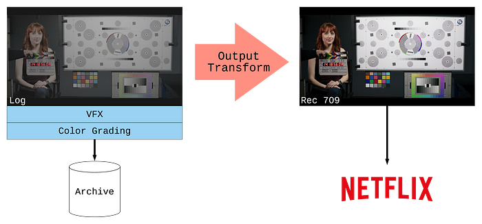
*In this example, the working color space is Log and the display color space is BT. 1886. The Output Transform separates the two, and is only baked in for the BT. 1886 streaming master. The archival masters (non-graded and graded) remain in Log color space.*

It might _seem_ easier to just convert all images to a display color space like BT. 1886. But this removes all the dynamic range and additional information from the post production process and the resulting archive. As new display technology emerges as years pass by, your images are stuck in time like Kylee’s parents’ wedding photos.

Using an Output Transform or display LUT — such as a creative LUT designed by a colorist or DI facility, or even a default camera LUT like ARRI’s 709 LUT — can not only serve as the base “look” of the show, but it protects and preserves the working color space and the full dynamic range it has to offer for color and VFX, and the eventual NAM and GAM archival assets.

Additionally, in productions with secondary cameras, an Input Transform can be used to convert images into this larger working color space. Most professional cameras have published color space definitions, and most professional color grading software implement these in their toolsets. This unifies images into a common color space and reduces time spent matching different cameras to one another.

The Academy Color Encoding Standard (ACES) is a color management system which attempts to unify these “scene-referred” color spaces into a larger, standardized one. It covers all visible colors, and uses 16-bit half-float (32 stops of linear dynamic range) encoding stored in an [OpenEXR](http://www.openexr.com/) container, well beyond the range of any camera today. Camera manufacturers also publish Input Transforms in order to convert from their native sensor RGB into ACES RGB.

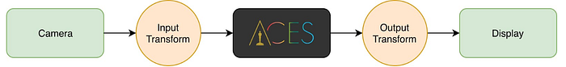
*Source: Academy of Motion Picture Arts and Sciences*

ACES also defines a standard set of Output Transforms in order to provide a standard way to view an image on a calibrated display, regardless of the camera. This part is key in terms of providing a consistent view of working images, since these ACES Output Transforms are built-in to most popular color grading and VFX software.

It’s worth noting that in the past, color transforms had to be exported into fixed LUTs (look-up tables) for performance reasons. However, increasingly with modern GPUs, systems are able to apply the pure math of a color transform without the need for LUTs.

## But what about viewing it all?

Similar to camera color spaces, display color spaces are typically defined in XYZ space. However, no current displays can properly show everything in most scene-referred images due to absolute luminance and color gamut limitations, and the evolution of display technology means what you can see will change year by year.

Displays receive a signal and output light. Display standards, and calibration to those standards, allow us to send a signal and get a predictable output of light and color.

Today, most displays are additive, in that they have three “primaries” which emit red, green, and blue (RGB) light, and when combined or added, they form white. The ‘white point’ is the color that is produced when equal amounts of red, green, and blue are sent to the monitor.

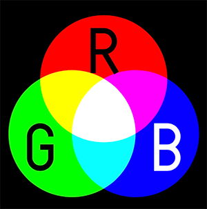
*Source: Wikimedia Commons*

Display standards exist so that you can take an image from Display #1 and send it to Display #2 and get the same color. In other words, _which _red, green, blue, and white are being used?

This is especially important in broadcast TV and the internet, where images are sent to millions of displays simultaneously. Common display standards include sRGB (internet, mobile), BT. 1886 (HD broadcast), Rec. 2020 (UHD and HDR broadcast), and P3 (digital cinema and HDR).

These standards define three main components:

- Primaries, usually defined in XYZ
- White point, usually defined in XYZ
- EOTF (Electro-Optical Transfer Function / signal-to-luminance (Y))

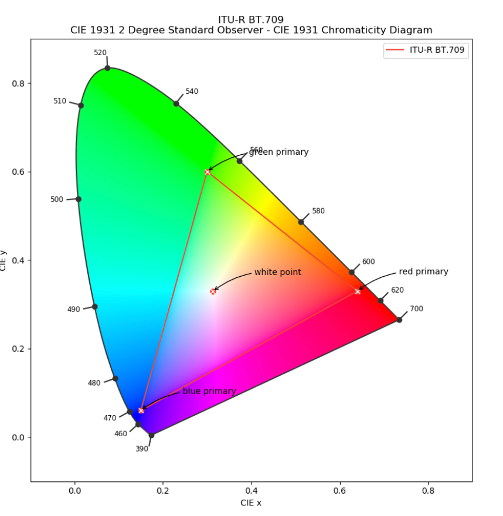

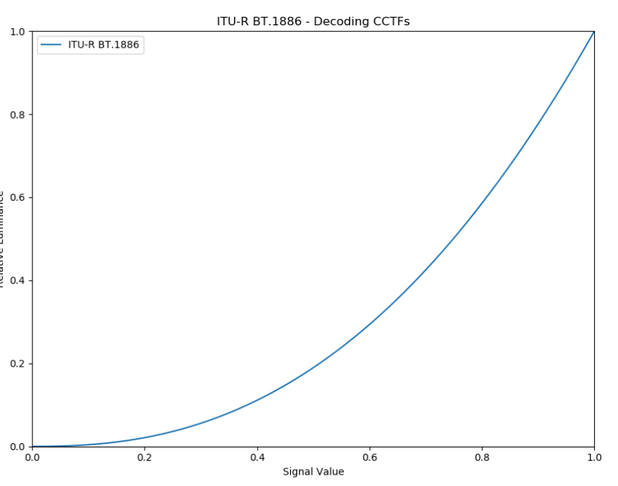
*Example Primaries and White Point of ITU-R BT.709 aka “Rec. 709” color space (left), Example Transfer Function from ITU-R BT.1886 standard (right)*

Test patterns are measured in order to tune displays to hit standard targets as closely as possible. Usually the test patterns include patches of red, green, blue, and white, as well as a greyscale to measure the EOTF.

Only after calibration do creative adjustments become meaningful, and color transforms become useful. A color managed workflow requires this step in order to truly have an impact on image fidelity and consistency.

Display technology has come a long way since we first began exhibiting motion images in public and then the home. From projection systems in theaters to over-the-air broadcast to emissive displays like OLED and even an iPhone, the display technology on which we look at images continues to evolve quickly. Color management and proper archival elements protect the high quality display of a movie for the future.

## Summary

Returning to the original story of my parents and their remaining wedding photos, it’s apparent how being in the moment and dealing with all the challenges of that moment — budget, time, people, access to technology — can seem small compared to what is happening around you. But as time goes on, the remaining records of that experience only become more precious. And the opportunity to preserve it — and preserve it well — is missed altogether.

Drawing a parallel to a film or television show, preserving these captured moments and assuring the creative intent behind them is preserved and protected for years of enjoyment is incredibly important. Some shows become cultural touchstones. Others are personal favorites that provide comfort for many years. In any case, for many filmmakers they are the culmination of an individual’s life work and deserve the respect of a high quality viewing experience and high fidelity archive.

At Netflix, we are constantly refining our process and approach to these processes while continuing to rely on the vast collective knowledge of so many years of film history and scientific research. Within the Creative Technologies team, we are always on the hunt for new and innovative ways to increase the usefulness of assets while becoming more and more flexible for creatives and technicians alike. In addition to our focus on color management, we are also investigating the next step in the evolution of archival and streaming assets: a dual-purpose archival/streaming deliverable specification which would encapsulate scene-referred imagery within an IMF container. While history and science may give us many resources to work from, the relationships we cultivate with the production community may give the best guidance.

Some movies have been lost to time. Some remastered films are missing entire scenes. And I’m not the only one whose family photo albums are rapidly fading, their quality locked in by the imaging technology available at the time. By combining thoughtful planning and technology, we can preserve the human experience and its stories for decades to come.

*Despite improperly captured and archived wedding photos, Kylee’s parents are still happily married after 40 years. And this photo was captured in Canon RAW and is backed up in two locations.*

### Footnotes

_*XYZ, in this blog, refers to the CIE 1931 2-degree color matching functions (CMFs). This is different than DCI X’Y’Z’ (pronounced “X-prime, Y-prime, Z-prime”) which is a color encoding, based on XYZ, defined for digital cinema._

_**Examples might be skin tones, blue skies, foliage, and other common colors._

- _**The word ‘estimated’ is used since cameras are not perfect colorimetric devices._

_Note: as our deliverables change, this blog may be updated._

---
**Tags:** Film And Television · Color Science · Film History · Post Production · Color Management
