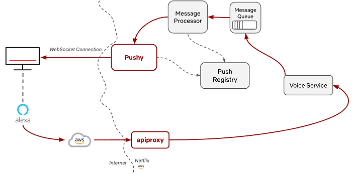
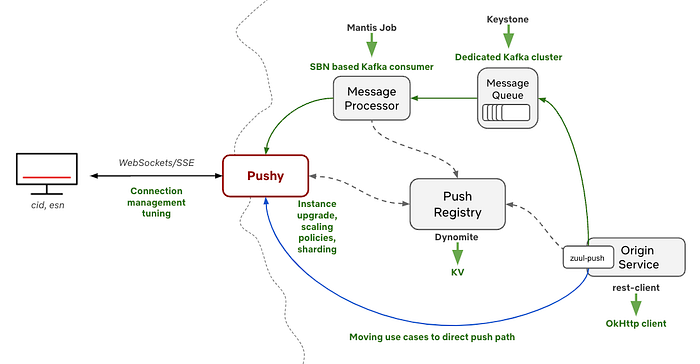
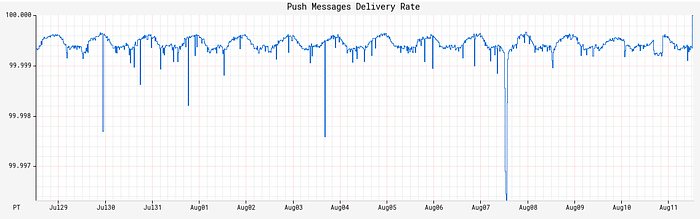
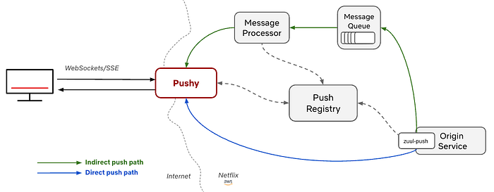
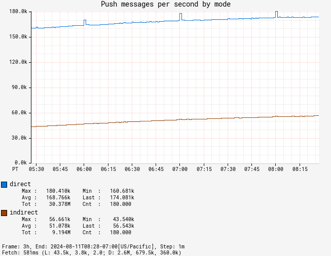
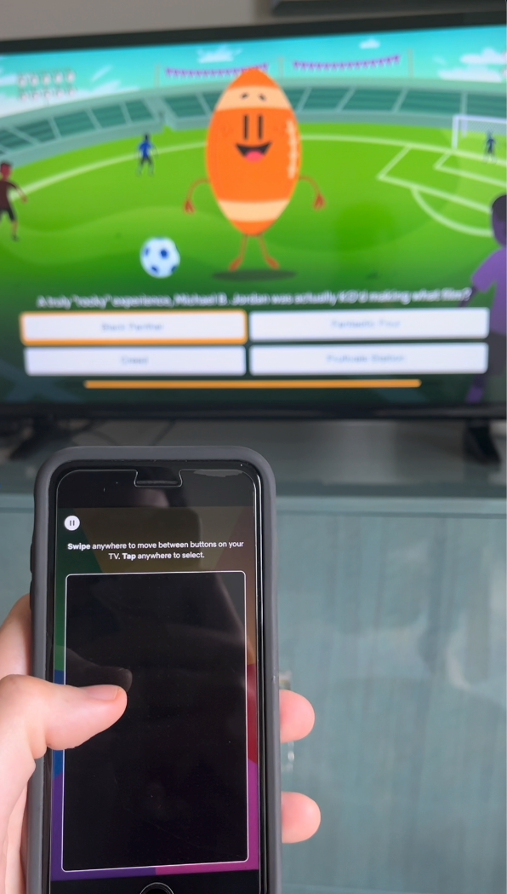
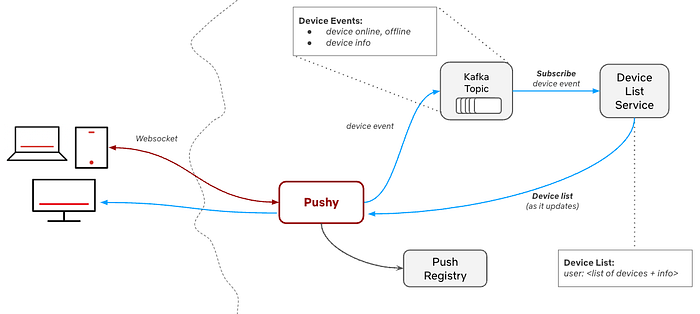
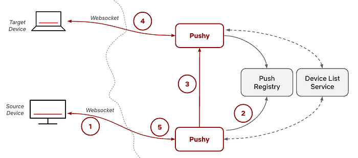
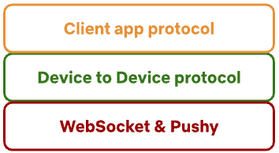
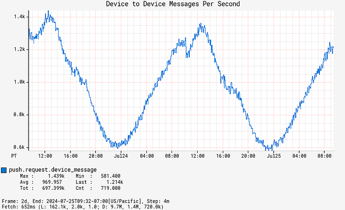

# Pushy to the Limit: Evolving Netflix’s WebSocket proxy for the future

_By _[_Karthik Yagna_](https://www.linkedin.com/in/kyagna/)_, _[_Baskar Odayarkoil_](https://www.linkedin.com/in/baskar-o-n-46477b3/)_, and _[_Alex Ellis_](https://www.linkedin.com/in/alexander-ellis/)

Pushy is Netflix’s WebSocket server that maintains persistent WebSocket connections with devices running the Netflix application. This allows data to be sent to the device from backend services on demand, without the need for continually polling requests from the device. Over the last few years, Pushy has seen tremendous growth, evolving from its role as a best-effort message delivery service to be an integral part of the Netflix ecosystem. This post describes how we’ve grown and scaled Pushy to meet its new and future needs, as it handles hundreds of millions of concurrent WebSocket connections, delivers hundreds of thousands of messages per second, and maintains a steady 99.999% message delivery reliability rate.

## History & motivation

There were two main motivating use cases that drove Pushy’s initial development and usage. The first was voice control, where you can play a title or search using your virtual assistant with a voice command like “Show me Stranger Things on Netflix.” (See [_How to use voice controls with Netflix_](https://help.netflix.com/en/node/111997) if you want to do this yourself!).

If we consider the Alexa use case, we can see how this partnership with Amazon enabled this to work. Once they receive the voice command, we allow them to make an authenticated call through [apiproxy](https://netflixtechblog.com/open-sourcing-zuul-2-82ea476cb2b3), our streaming edge proxy, to our internal voice service. This call includes metadata, such as the user’s information and details about the command, such as the specific show to play. The voice service then constructs a message for the device and places it on the message queue, which is then processed and sent to Pushy to deliver to the device. Finally, the device receives the message, and the action, such as “Show me Stranger Things on Netflix”, is performed. This initial functionality was built out for FireTVs and was expanded from there.

*Sample system diagram for an Alexa voice command. Where aws ends and the internet begins is an exercise left to the reader.*

The other main use case was RENO, the Rapid Event Notification System mentioned above. Before the integration with Pushy, the TV UI would continuously poll a backend service to see if there were any row updates to get the latest information. These requests would happen every few seconds, which ended up creating extraneous requests to the backend and were costly for devices, which are frequently resource constrained. The integration with WebSockets and Pushy alleviated both of these points, allowing the origin service to send row updates as they were ready, resulting in lower request rates and cost savings.

For more background on Pushy, you can see [this InfoQ talk by Susheel Aroskar](https://www.youtube.com/watch?v=6w6E_B55p0E). Since that presentation, Pushy has grown in both size and scope, and this article will be discussing the investments we’ve made to evolve Pushy for the next generation of features.

## Client Reach

This integration was initially rolled out for Fire TVs, PS4s, Samsung TVs, and LG TVs, leading to a reach of about 30 million candidate devices. With these clear benefits, we continued to build out this functionality for more devices, enabling the same efficiency wins. As of today, we’ve expanded our list of candidate devices even further to nearly a billion devices, including mobile devices running the Netflix app and the website experience. We’ve even extended support to older devices that lack modern capabilities, like support for TLS and HTTPS requests. For those, we’ve enabled secure communication from client to Pushy via an encryption/decryption layer on each, allowing for confidential messages to flow between the device and server.

## Scaling to handle that growth (and more)

### Growth

With that extended reach, Pushy has gotten busier. Over the last five years, Pushy has gone from tens of millions of concurrent connections to hundreds of millions of concurrent connections, and it regularly reaches 300,000 messages sent per second. To support this growth, we’ve revisited Pushy’s past assumptions and design decisions with an eye towards both Pushy’s future role and future stability. Pushy had been relatively hands-free operationally over the last few years, and as we updated Pushy to fit its evolving role, our goal was also to get it into a stable state for the next few years. This is particularly important as we build out new functionality that relies on Pushy; a strong, stable infrastructure foundation allows our partners to continue to build on top of Pushy with confidence.

Throughout this evolution, we’ve been able to maintain high availability and a consistent message delivery rate, with Pushy successfully maintaining 99.999% reliability for message delivery over the last few months. When our partners want to deliver a message to a device, it’s our job to make sure they can do so.

Here are a few of the ways we’ve evolved Pushy to handle its growing scale.

*A few of the related services in Pushy’s immediate ecosystem and the changes we’ve made for them.*

### Message processor

One aspect that we invested in was the evolution of the asynchronous message processor. The previous version of the message processor was a Mantis stream-processing job that processed messages from the message queue. It was very efficient, but it had a set job size, requiring manual intervention if we wanted to horizontally scale it, and it required manual intervention when rolling out a new version.

It served Pushy’s needs well for many years. As the scale of the messages being processed increased and we were making more code changes in the message processor, we found ourselves looking for something more flexible. In particular, we were looking for some of the features we enjoy with our other services: automatic horizontal scaling, canaries, automated red/black rollouts, and more observability. With this in mind, we rewrote the message processor as a standalone Spring Boot service using Netflix paved-path components. Its job is the same, but it does so with easy rollouts, canary configuration that lets us roll changes safely, and autoscaling policies we’ve defined to let it handle varying volumes.

Rewriting always comes with a risk, and it’s never the first solution we reach for, particularly when working with a system that’s in place and working well. In this case, we found that the burden from maintaining and improving the custom stream processing job was increasing, and we made the judgment call to do the rewrite. Part of the reason we did so was the clear role that the message processor played — we weren’t rewriting a huge monolithic service, but instead a well-scoped component that had explicit goals, well-defined success criteria, and a clear path towards improvement. Since the rewrite was completed in mid-2023, the message processor component has been completely zero touch, happily automated and running reliably on its own.

### Push Registry

For most of its life, Pushy has used [Dynomite](https://netflixtechblog.com/introducing-dynomite-making-non-distributed-databases-distributed-c7bce3d89404) for keeping track of device connection metadata in its Push Registry. Dynomite is a Netflix open source wrapper around Redis that provides a few additional features like auto-sharding and cross-region replication, and it provided Pushy with low latency and easy record expiry, both of which are critical for Pushy’s workload.

As Pushy’s portfolio grew, we experienced some pain points with Dynomite. Dynomite had great performance, but it required manual scaling as the system grew. The folks on the Cloud Data Engineering (CDE) team, the ones building the paved path for internal data at Netflix, graciously helped us scale it up and make adjustments, but it ended up being an involved process as we kept growing.

**These pain points coincided with the introduction of KeyValue, which was a new offering from the CDE team that is roughly “HashMap as a service” for Netflix developers. KeyValue is an abstraction over the storage engine itself, which allows us to choose the best storage engine that meets our SLO needs. In our case, we value low latency — the faster we can read from KeyValue, the faster these messages can get delivered. With CDE’s help, we migrated our Push Registry to use KV instead, and we have been extremely satisfied with the result. After tuning our store for Pushy’s needs, it has been on autopilot since, appropriately scaling and serving our requests with very low latency.**

### Scaling Pushy horizontally and vertically

Most of the other services our team runs, like apiproxy, the streaming edge proxy, are CPU bound, and we have autoscaling policies that scale them horizontally when we see an increase in CPU usage. This maps well to their workload — more HTTP requests means more CPU used, and we can scale up and down accordingly.

Pushy has slightly different performance characteristics, with each node maintaining many connections and delivering messages on demand. In Pushy’s case, CPU usage is consistently low, since most of the connections are parked and waiting for an occasional message. Instead of relying on CPU, we scale Pushy on the number of connections, with exponential scaling to scale faster after higher thresholds are reached. We load balance the initial HTTP requests to establish the connections and rely on a reconnect protocol where devices will reconnect every 30 minutes or so, with some staggering, that gives us a steady stream of reconnecting devices to balance connections across all available instances.

For a few years, our scaling policy had been that we would add new instances when the average number of connections reached 60,000 connections per instance. For a couple hundred million devices, this meant that we were regularly running thousands of Pushy instances. We can horizontally scale Pushy to our heart’s content, but we would be less content with our bill and would have to shard Pushy further to get around NLB connection limits. This evolution effort aligned well with an internal focus on cost efficiency, and we used this as an opportunity to revisit these earlier assumptions with an eye towards efficiency.

Both of these would be helped by increasing the number of connections that each Pushy node could handle, reducing the total number of Pushy instances and running more efficiently with the right balance between instance type, instance cost, and maximum concurrent connections. It would also allow us to have more breathing room with the NLB limits, reducing the toil of additional sharding as we continue to grow. That being said, increasing the number of connections per node is not without its own drawbacks. When a Pushy instance goes down, the devices that were connected to it will immediately try to reconnect. By increasing the number of connections per instance, it means that we would be increasing the number of devices that would be immediately trying to reconnect. We could have a million connections per instance, but a down node would lead to a thundering herd of a million devices reconnecting at the same time.

This delicate balance led to us doing a deep evaluation of many instance types and performance tuning options. Striking that balance, we ended up with instances that handle an average of 200,000 connections per node, with breathing room to go up to 400,000 connections if we had to. This makes for a nice balance between CPU usage, memory usage, and the thundering herd when a device connects. We’ve also enhanced our autoscaling policies to scale exponentially; the farther we are past our target average connection count, the more instances we’ll add. These improvements have enabled Pushy to be almost entirely hands off operationally, giving us plenty of flexibility as more devices come online in different patterns.

### Reliability & building a stable foundation

Alongside these efforts to scale Pushy for the future, we also took a close look at our reliability after finding some connectivity edge cases during recent feature development. We found a few areas for improvement around the connection between Pushy and the device, with failures due to Pushy attempting to send messages on a connection that had failed without notifying Pushy. Ideally something like a silent failure wouldn’t happen, but we frequently see odd client behavior, particularly on older devices.

In collaboration with the client teams, we were able to make some improvements. On the client side, better connection handling and improvements around the reconnect flow meant that they were more likely to reconnect appropriately. In Pushy, we added additional heartbeats, idle connection cleanup, and better connection tracking, which meant that we were keeping around fewer and fewer stale connections.

While these improvements were mostly around those edge cases for the feature development, they had the side benefit of bumping our message delivery rates up even further. We already had a good message delivery rate, but this additional bump has enabled Pushy to regularly average 5 9s of message delivery reliability.

*Push message delivery success rate over a recent 2-week period.*

## Recent developments

With this stable foundation and all of these connections, what can we now do with them? This question has been the driving force behind nearly all of the recent features built on top of Pushy, and it’s an exciting question to ask, particularly as an infrastructure team.

### Shift towards direct push

The first change from Pushy’s traditional role is what we call direct push; instead of a backend service dropping the message on the asynchronous message queue, it can instead leverage the Push library to skip the asynchronous queue entirely. When called to deliver a message in the direct path, the Push library will look up the Pushy connected to the target device in the Push Registry, then send the message directly to that Pushy. Pushy will respond with a status code reflecting whether it was able to successfully deliver the message or it encountered an error, and the Push library will bubble that up to the calling code in the service.

*The system diagram for the direct and indirect push paths.*

Susheel, the original author of Pushy, added this functionality as an optional path, but for years, nearly all backend services relied on the indirect path with its “best-effort” being good enough for their use cases. In recent years, we’ve seen usage of this direct path really take off as the needs of backend services have grown. In particular, rather than being just best effort, these direct messages allow the calling service to have immediate feedback about the delivery, letting them retry if a device they’re targeting has gone offline.

These days, messages sent via direct push make up the majority of messages sent through Pushy. For example, for a recent 24 hour period, direct messages averaged around 160,000 messages per second and indirect averaged at around 50,000 messages per second..

*Graph of direct vs indirect messages per second.*

### Device to device messaging

As we’ve thought through this evolving use case, our concept of a message sender has also evolved. What if we wanted to move past Pushy’s pattern of delivering server-side messages? What if we wanted to have a device send a message to a backend service, or maybe even to another device? Our messages had traditionally been unidirectional as we send messages from the server to the device, but we now leverage these bidirectional connections and direct device messaging to enable what we call device to device messaging. This device to device messaging supported early phone-to-TV communication in support of games like Triviaverse, and it’s the messaging foundation for our [Companion Mode](https://help.netflix.com/en/node/132821) as TVs and phones communicate back and forth.

*A screenshot of one of the authors playing Triviaquest with a mobile device as the controller.*

This requires higher level knowledge of the system, where we need to know not just information about a single device, but more broader information, like what devices are connected for an account that the phone can pair with. This also enables things like subscribing to device events to know when another device comes online and when they’re available to pair or send a message to. This has been built out with an additional service that receives device connection information from Pushy. These events, sent over a Kafka topic, let the service keep track of the device list for a given account. Devices can subscribe to these events, allowing them to receive a message from the service when another device for the same account comes online.

*Pushy and its relationship with the Device List Service for discovering other devices.*

This device list enables the discoverability aspect of these device to device messages. Once the devices have this knowledge of the other devices connected for the same account, they’re able to choose a target device from this list that they can then send messages to.

Once a device has that list, it can send a message to Pushy over its WebSocket connection with that device as the target in what we call a _device to device message_ (1 in the diagram below). Pushy looks up the target device’s metadata in the Push registry (2) and sends the message to the second Pushy that the target device is connected to (3), as if it was the backend service in the direct push pattern above. That Pushy delivers the message to the target device (4), and the original Pushy will receive a status code in response, which it can pass back to the source device (5).

*A basic order of events for a device to device message.*

### The messaging protocol

We’ve defined a basic JSON-based message protocol for device to device messaging that lets these messages be passed from the source device to the target device. As a networking team, we naturally lean towards abstracting the communication layer with encapsulation wherever possible. This generalized message means that device teams are able to define their own protocols on top of these messages — Pushy would just be the transport layer, happily forwarding messages back and forth.

*The client app protocol, built on top of the device to device protocol, built on top of Pushy.*

This generalization paid off in terms of investment and operational support. We built the majority of this functionality in October 2022, and we’ve only needed small tweaks since then. We needed nearly no modifications as client teams built out the functionality on top of this layer, defining the higher level application-specific protocols that powered the features they were building. We really do enjoy working with our partner teams, but if we’re able to give them the freedom to build on top of our infrastructure layer without us getting involved, then we’re able to increase their velocity, make their lives easier, and play our infrastructure roles as message platform providers.

With early features in experimentation, Pushy sees an average of 1000 device to device messages per second, a number that will only continue to grow.

*Graph of device to device messages per second.*

### The Netty-gritty details

In Pushy, we handle incoming WebSocket messages in our PushClientProtocolHandler ([code pointer to class in Zuul that we extend](https://github.com/Netflix/zuul/blob/99ef8841c8b7b82536d5fb193fd751c675c9ad0d/zuul-core/src/main/java/com/netflix/zuul/netty/server/push/PushClientProtocolHandler.java)), which extends Netty’s ChannelInboundHandlerAdapter and is added to the Netty pipeline for each client connection. We listen for incoming WebSocket messages from the connected device in its channelRead method and parse the incoming message. If it’s a device to device message, we pass the message, the ChannelHandlerContext, and the PushUserAuth information about the connection’s identity to our DeviceToDeviceManager.

*A rough overview of the internal organization for these components.*

The DeviceToDeviceManager is responsible for validating the message, doing some bookkeeping, and kicking off an async call that validates that the device is an authorized target, looks up the Pushy for the target device in the local cache (or makes a call to the data store if it’s not found), and forwards on the message. We run this asynchronously to avoid any event loop blocking due to these calls. The DeviceToDeviceManager is also responsible for observability, with metrics around cache hits, calls to the data store, message delivery rates, and latency percentile measurements. We’ve relied heavily on these metrics for alerts and optimizations — Pushy really is a metrics service that occasionally will deliver a message or two!

### Security

As the edge of the Netflix cloud, security considerations are always top of mind. With every connection over HTTPS, we’ve limited these messages to just authenticated WebSocket connections, added rate limiting, and added authorization checks to ensure that a device is able to target another device — you may have the best intentions in mind, but I’d strongly prefer it if you weren’t able to send arbitrary data to my personal TV from yours (and vice versa, I’m sure!).

### Latency and other considerations

One main consideration with the products built on top of this is latency, particularly when this feature is used for anything interactive within the Netflix app.

We’ve added caching to Pushy to reduce the number of lookups in the hotpath for things that are unlikely to change frequently, like a device’s allowed list of targets and the Pushy instance the target device is connected to. We have to do some lookups on the initial messages to know where to send them, but it enables us to send subsequent messages faster without any KeyValue lookups. For these requests where caching removed KeyValue from the hot path, we were able to greatly speed things up. From the incoming message arriving at Pushy to the response being sent back to the device, we reduced median latency to less than a millisecond, with the 99th percentile of latency at less than 4ms.

Our KeyValue latency is usually very low, but we have seen brief periods of elevated read latencies due to underlying issues in our KeyValue datastore. Overall latencies increased for other parts of Pushy, like client registration, but we saw very little increase in device to device latency with this caching in place.

## Cultural aspects that enable this work

Pushy’s scale and system design considerations make the work technically interesting, but we also deliberately focus on non-technical aspects that have helped to drive Pushy’s growth. We focus on iterative development that solves the hardest problem first, with projects frequently starting with quick hacks or prototypes to prove out a feature. As we do this initial version, we do our best to keep an eye towards the future, allowing us to move quickly from supporting a single, focused use case to a broad, generalized solution. For example, for our cross-device messaging, we were able to solve hard problems in the early work for _Triviaverse_ that we later leveraged for the generic device to device solution.

As one can immediately see in the system diagrams above, Pushy does not exist in a vacuum, with projects frequently involving at least half a dozen teams. Trust, experience, communication, and strong relationships all enable this to work. Our team wouldn’t exist without our platform users, and we certainly wouldn’t be here writing this post without all of the work our product and client teams do. This has also emphasized the importance of building and sharing — if we’re able to get a prototype together with a device team, we’re able to then show it off to seed ideas from other teams. It’s one thing to mention that you can send these messages, but it’s another to show off the TV responding to the first click of the phone controller button!

## The future of Pushy

If there’s anything certain in this world, it’s that Pushy will continue to grow and evolve. We have many new features in the works, like WebSocket message proxying, WebSocket message tracing, a global broadcast mechanism, and subscription functionality in support of Games and Live. With all of this investment, Pushy is a stable, reinforced foundation, ready for this next generation of features.

We’ll be writing about those new features as well — stay tuned for future posts.

_Special thanks to our stunning colleagues _[_Jeremy Kelly_](https://www.linkedin.com/in/jeremy-kelly-526a30180/)_ and _[_Justin Guerra_](https://www.linkedin.com/in/justin-guerra-3282262b/)_ who have both been invaluable to Pushy’s growth and the WebSocket ecosystem at large. We would also like to thank our larger teams and our numerous partners for their great work; it truly takes a village!_
