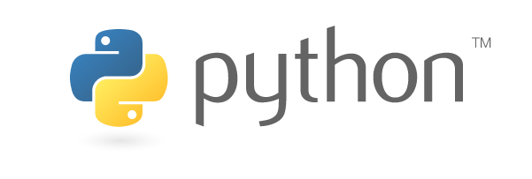

# Python at Netflix

_By Pythonistas at Netflix, coordinated by Amjith Ramanujam and edited by Ellen Livengood_

As many of us prepare to go to PyCon, we wanted to share a sampling of how Python is used at Netflix. We use Python through the full content lifecycle, from deciding which content to fund all the way to operating the CDN that serves the final video to 148 million members. We use and contribute to many open-source Python packages, some of which are mentioned below. If any of this interests you, check out the [jobs site](https://jobs.netflix.com/search?q=python) or find us at PyCon. We have donated a few Netflix Originals posters to the [PyLadies Auction](https://us.pycon.org/2019/events/auction/) and look forward to seeing you all there.

### Open Connect

[Open Connect](https://openconnect.netflix.com/en/) is Netflix’s content delivery network (CDN). An easy, though imprecise, way of thinking about Netflix infrastructure is that everything that happens before you press Play on your remote control (e.g., are you logged in? what plan do you have? what have you watched so we can recommend new titles to you? what do you want to watch?) takes place in Amazon Web Services (AWS), whereas everything that happens afterwards (i.e., video streaming) takes place in the Open Connect network. Content is placed on the network of servers in the Open Connect CDN as close to the end user as possible, improving the streaming experience for our customers and reducing costs for both Netflix and our Internet Service Provider (ISP) partners.

Various software systems are needed to design, build, and operate this CDN infrastructure, and a significant number of them are written in Python. The network devices that underlie a large portion of the CDN are mostly managed by Python applications. Such applications track the inventory of our network gear: what devices, of which models, with which hardware components, located in which sites. The configuration of these devices is controlled by several other systems including source of truth, application of configurations to devices, and back up. Device interaction for the collection of health and other operational data is yet another Python application. Python has long been a popular programming language in the networking space because it’s an intuitive language that allows engineers to quickly solve networking problems. Subsequently, many useful libraries get developed, making the language even more desirable to learn and use.

### Demand Engineering

[Demand Engineering](https://www.linkedin.com/pulse/what-demand-engineering-aaron-blohowiak/) is responsible for [Regional Failovers](https://opensource.com/article/18/4/how-netflix-does-failovers-7-minutes-flat), Traffic Distribution, Capacity Operations, and Fleet Efficiency of the Netflix cloud. We are proud to say that our team’s tools are built primarily in Python. The service that orchestrates failover uses numpy and scipy to perform numerical analysis, boto3 to make changes to our AWS infrastructure, rq to run asynchronous workloads and we wrap it all up in a thin layer of Flask APIs. The ability to drop into a [bpython](https://bpython-interpreter.org/) shell and improvise has saved the day more than once.

We are heavy users of Jupyter Notebooks and [nteract](https://nteract.io/) to analyze operational data and prototype [visualization tools ](https://github.com/nteract/nteract/tree/master/packages/data-explorer)that help us detect capacity regressions.

### CORE

The CORE team uses Python in our alerting and statistical analytical work. We lean on many of the statistical and mathematical libraries (numpy, scipy, ruptures, pandas) to help automate the analysis of 1000s of related signals when our alerting systems indicate problems. We’ve developed a time series correlation system used both inside and outside the team as well as a distributed worker system to parallelize large amounts of analytical work to deliver results quickly.

Python is also a tool we typically use for automation tasks, data exploration and cleaning, and as a convenient source for visualization work.

### Monitoring, alerting and auto-remediation

The Insight Engineering team is responsible for building and operating the tools for operational insight, alerting, diagnostics, and auto-remediation. With the increased popularity of Python, the team now supports Python clients for most of their services. One example is the [Spectator](https://github.com/Netflix/spectator-py) Python client library, a library for instrumenting code to record dimensional time series metrics. We build Python libraries to interact with other Netflix platform level services. In addition to libraries, the [Winston](https://medium.com/netflix-techblog/introducing-winston-event-driven-diagnostic-and-remediation-platform-46ce39aa81cc) and [Bolt](https://medium.com/netflix-techblog/introducing-bolt-on-instance-diagnostic-and-remediation-platform-176651b55505) products are also built using Python frameworks (Gunicorn + Flask + Flask-RESTPlus).

### Information Security

The information security team uses Python to accomplish a number of high leverage goals for Netflix: security automation, risk classification, auto-remediation, and vulnerability identification to name a few. We’ve had a number of successful Python open sources, including [Security Monkey](https://github.com/Netflix/security_monkey) (our team’s most active open source project). We leverage Python to protect our SSH resources using [Bless](https://github.com/Netflix/bless). Our Infrastructure Security team leverages Python to help with IAM permission tuning using [Repokid](https://github.com/Netflix/repokid). We use Python to help generate TLS certificates using [Lemur](https://github.com/Netflix/lemur).

Some of our more recent projects include Prism: a batch framework to help security engineers measure paved road adoption, risk factors, and identify vulnerabilities in source code. We currently provide Python and Ruby libraries for Prism. The [Diffy](https://medium.com/netflix-techblog/netflix-sirt-releases-diffy-a-differencing-engine-for-digital-forensics-in-the-cloud-37b71abd2698) forensics triage tool is written entirely in Python. We also use Python to detect sensitive data using Lanius.

### Personalization Algorithms

We use Python extensively within our broader [Personalization Machine Learning Infrastructure](https://www.slideshare.net/FaisalZakariaSiddiqi/ml-infra-for-netflix-recommendations-ai-nextcon-talk) to train some of the Machine Learning models for key aspects of the Netflix experience: from our [recommendation algorithms](https://research.netflix.com/research-area/recommendations) to [artwork personalization](https://medium.com/netflix-techblog/artwork-personalization-c589f074ad76) to [marketing algorithms](https://medium.com/netflix-techblog/engineering-to-scale-paid-media-campaigns-84ba018fb3fa). For example, some algorithms use TensorFlow, Keras, and PyTorch to learn Deep Neural Networks, XGBoost and LightGBM to learn Gradient Boosted Decision Trees or the broader scientific stack in Python (e.g. numpy, scipy, sklearn, matplotlib, pandas, cvxpy). Because we’re constantly trying out new approaches, we use Jupyter Notebooks to drive many of our experiments. We have also developed a number of higher-level libraries to help integrate these with the rest of our [ecosystem](https://www.slideshare.net/FaisalZakariaSiddiqi/ml-infra-for-netflix-recommendations-ai-nextcon-talk) (e.g. data access, fact logging and feature extraction, model evaluation, and publishing).

### Machine Learning Infrastructure

Besides personalization, Netflix applies machine learning to hundreds of use cases across the company. Many of these applications are powered by [Metaflow](https://www.youtube.com/watch?v=XV5VGddmP24), a Python framework that makes it easy to execute ML projects from the prototype stage to production.

**Metaflow pushes the limits of Python: We leverage well parallelized and optimized Python code to fetch data at 10Gbps, handle hundreds of millions of data points in memory, and orchestrate computation over tens of thousands of CPU cores.**

### Notebooks

We are avid users of Jupyter notebooks at Netflix, and we’ve written about the [reasons and nature of this investment](https://medium.com/netflix-techblog/notebook-innovation-591ee3221233) before.

But Python plays a huge role in how we provide those services. Python is a primary language when we need to develop, debug, explore, and prototype different interactions with the Jupyter ecosystem. We use Python to build custom extensions to the Jupyter server that allows us to manage tasks like logging, archiving, publishing, and cloning notebooks on behalf of our users.  
We provide many flavors of Python to our users via different Jupyter kernels, and manage the deployment of those kernel specifications using Python.

### Orchestration

The Big Data Orchestration team is responsible for providing all of the services and tooling to schedule and execute ETL and Adhoc pipelines.

Many of the components of the orchestration service are written in Python. Starting with our scheduler, which uses[ Jupyter Notebooks](https://jupyter.org/) with [papermill](https://papermill.readthedocs.io/en/latest/) to provide templatized job types (Spark, Presto, …). This allows our users to have a standardized and easy way to express work that needs to be executed. You can see some deeper details on the subject [here](https://medium.com/netflix-techblog/scheduling-notebooks-348e6c14cfd6). We have been using notebooks as real runbooks for situations where human intervention is required — for example: to restart everything that has failed in the last hour.

Internally, we also built an event-driven platform that is fully written in Python. We have created streams of events from a number of systems that get unified into a single tool. This allows us to define conditions to filter events, and actions to react or route them. As a result of this, we have been able to decouple microservices and get visibility into everything that happens on the data platform.

Our team also built the [pygenie](https://github.com/Netflix/pygenie) client which interfaces with [Genie](https://netflix.github.io/genie/), a federated job execution service. Internally, we have additional extensions to this library that apply business conventions and integrate with the Netflix platform. These libraries are the primary way users interface programmatically with work in the Big Data platform.

Finally, it’s been our team’s commitment to contribute to [papermill](https://papermill.readthedocs.io/en/latest/) and [scrapbook](https://nteract-scrapbook.readthedocs.io/en/latest/) open source projects. Our work there has been both for our own and external use cases. These efforts have been gaining a lot of traction in the open source community and we’re glad to be able to contribute to these shared projects.

### Experimentation Platform

The scientific computing team for experimentation is creating a platform for scientists and engineers to analyze AB tests and other experiments. Scientists and engineers can contribute new innovations on three fronts, data, statistics, and visualizations.

The Metrics Repo is a Python framework based on [PyPika](https://pypika.readthedocs.io/en/latest/) that allows contributors to write reusable parameterized SQL queries. It serves as an entry point into any new analysis.

The Causal Models library is a Python & R framework for scientists to contribute new models for causal inference. It leverages [PyArrow](https://arrow.apache.org/docs/python/) and [RPy2](https://rpy2.readthedocs.io/en/version_2.8.x/) so that statistics can be calculated seamlessly in either language.

The Visualizations library is based on [Plotly](https://plot.ly/). Since Plotly is a widely adopted visualization spec, there are a variety of tools that allow contributors to produce an output that is consumable by our platforms.

### Partner Ecosystem

The Partner Ecosystem group is expanding its use of Python for testing Netflix applications on devices. Python is forming the core of a new CI infrastructure, including controlling our orchestration servers, controlling Spinnaker, test case querying and filtering, and scheduling test runs on devices and containers. Additional post-run analysis is being done in Python using TensorFlow to determine which tests are most likely to show problems on which devices.

### Video Encoding and Media Cloud Engineering

Our team takes care of encoding (and re-encoding) the Netflix catalog, as well as leveraging machine learning for insights into that catalog.  
We use Python for ~50 projects such as [vmaf](https://github.com/Netflix/vmaf/blob/master/resource/doc/references.md) and [mezzfs](https://medium.com/netflix-techblog/mezzfs-mounting-object-storage-in-netflixs-media-processing-platform-cda01c446ba), we build [computer vision solutions](https://medium.com/netflix-techblog/ava-the-art-and-science-of-image-discovery-at-netflix-a442f163af6) using a media map-reduce platform called [Archer](https://medium.com/netflix-techblog/simplifying-media-innovation-at-netflix-with-archer-3f8cbb0e2bcb), and we use Python for many internal projects.  
We have also open sourced a few tools to ease development/distribution of Python projects, like [setupmeta](https://pypi.org/project/setupmeta/) and [pickley](https://pypi.org/project/pickley/).

### Netflix Animation and NVFX

Python is the industry standard for all of the major applications we use to create Animated and VFX content, so it goes without saying that we are using it very heavily. All of our integrations with Maya and Nuke are in Python, and the bulk of our Shotgun tools are also in Python. We’re just getting started on getting our tooling in the cloud, and anticipate deploying many of our own custom Python AMIs/containers.

### Content Machine Learning, Science & Analytics

The Content Machine Learning team uses Python extensively for the development of machine learning models that are the core of forecasting audience size, viewership, and other demand metrics for all content.

---
**Tags:** Data Science · Python · Netflix · Netflixoss · Programming
