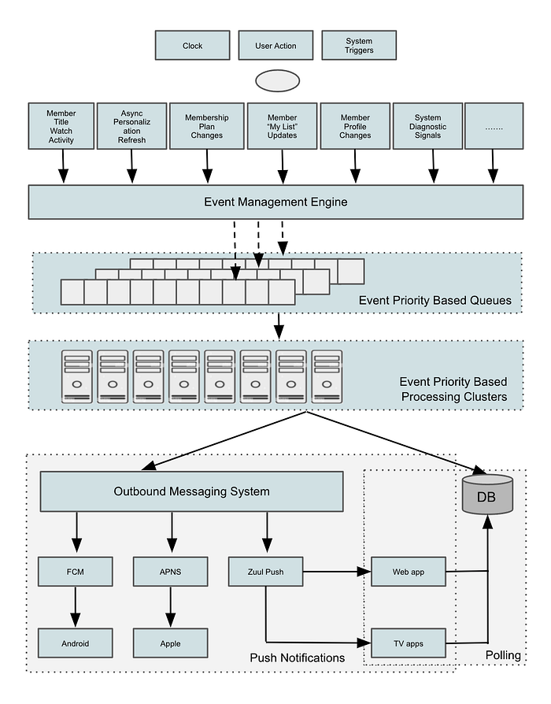

# Rapid Event Notification System at Netflix

By: [Ankush Gulati](https://www.linkedin.com/in/gulatiankush/), [David Gevorkyan](https://www.linkedin.com/in/davidgevorkyan/)  
Additional credits: [Michael Clark](https://www.linkedin.com/in/michael-clark-621880/), [Gokhan Ozer](https://www.linkedin.com/in/gokhan-ozer-94407822/)

## Intro

Netflix has more than 220 million active members who perform a variety of actions throughout each session, ranging from renaming a profile to watching a title. Reacting to these actions in near real-time to keep the experience consistent across devices is critical for ensuring an optimal member experience. This is not an easy task, considering the wide variety of supported devices and the sheer volume of actions our members perform. To this end, we developed a **Rapid Event Notification System** (RENO) to support use cases that require server initiated communication with devices in a scalable and extensible manner.

In this blog post, we will give an overview of the Rapid Event Notification System at Netflix and share some of the learnings we gained along the way.

## Motivation

With the rapid growth in Netflix member base and the increasing complexity of our systems, our architecture has evolved into an asynchronous one that enables both online and offline computation. Providing a seamless and consistent Netflix experience across various platforms (iOS, Android, smart TVs, Roku, Amazon FireStick, web browser) and various device types (mobile phones, tablets, televisions, computers, set top boxes) requires more than the traditional request-response model. Over time, we’ve seen an increase in use cases where backend systems need to initiate communication with devices to notify them of member-driven changes or experience updates quickly and consistently.

## Use cases

- **Viewing Activity  
**When a member begins to watch a show, their “Continue Watching” list should be updated across all of their devices to reflect that viewing.
- **Personalized Experience Refresh  
**Netflix Recommendation engine continuously refreshes recommendations for every member. The updated recommendations need to be delivered to the device timely for an optimal member experience.
- **Membership Plan Changes  
**Members often change their plan types, leading to a change in their experience that must be immediately reflected across all of their devices.
- **Member “My List” Updates**  
When members update their “My List” by adding or removing titles, the changes should be reflected across all of their devices.
- **Member Profile Changes  
**When members update their account settings like add/delete/rename profiles or change their preferred maturity level for content, these updates must be reflected across all of their devices.
- **System Diagnostic Signals  
**In special scenarios, we need to send diagnostic signals to the Netflix app on devices to help troubleshoot problems and enable tracing capabilities.

## Design Decisions

In designing the system, we made a few key decisions that helped shape the architecture of RENO:

1. Single Events Source
2. Event Prioritization
3. Hybrid Communication Model
4. Targeted Delivery
5. Managing High RPS

### Single Events Source

The use cases we wanted to support originate from various internal systems and member actions, so we needed to listen for events from several different microservices. At Netflix, our near-real-time event flow is managed by an internal distributed computation framework called Manhattan (you can learn more about it [here](https://netflixtechblog.com/system-architectures-for-personalization-and-recommendation-e081aa94b5d8)). We leveraged Manhattan’s event management framework to create a level of indirection serving as the single source of events for RENO.

### Event Prioritization

**Considering the use cases were wide ranging both in terms of their sources and their importance, we built segmentation into the event processing. For example, a member-triggered event such as “****_change in a profile’s maturity level”_**** should have a much higher priority than a “****_system diagnostic signal”._**** We thus assigned a priority to each use case and sharded event traffic by routing to priority-specific queues and the corresponding event processing clusters. This separation allows us to tune system configuration and scaling policies independently for different event priorities and traffic patterns.**

### Hybrid Communication Model

As mentioned earlier in this post, one key challenge for a service like RENO is supporting multiple platforms. While a mobile device is almost always connected to the internet and reachable, a smart TV is only online while in use. This network connection heterogeneity made choosing a single delivery model difficult. For example, entirely relying on a Pull model wherein the device frequently calls home for updates would result in chatty mobile apps. That in turn will be triggering the per-app communication limits that iOS and Android platforms enforce (we also need to be considerate of low bandwidth connections). On the other hand, using only a Push mechanism would lead smart TVs to miss notifications while they are powered off during most of the day. We therefore chose a hybrid Push AND Pull communication model wherein the server tries to deliver notifications to all devices immediately using Push notifications, and devices call home at various stages of the application lifecycle.

Using a Push-and-Pull delivery model combination also supports devices limited to a single communication model. This includes older, legacy devices that do not support Push Notifications.

### Targeted Delivery

Considering the use cases were wide ranging in terms of both sources and target device types, we built support for device specific notification delivery. This capability allows notifying specific device categories as per the use case. When an actionable event arrives, RENO applies the use case specific business logic, gathers the list of devices eligible to receive this notification and attempts delivery. This helps limit the outgoing traffic footprint considerably.

### Managing High RPS

With over 220 million members, we were conscious of the fact that a service like RENO needs to process many events per member during a viewing session. At peak times, RENO serves about 150k events per second. Such a high RPS during specific times of the day can create a [thundering herd problem](https://en.wikipedia.org/wiki/Thundering_herd_problem) and put strain on internal and external downstream services. We therefore implemented a few optimizations:

- **Event Age  
**Many events that need to be notified to the devices are time sensitive, and they are of no or little value unless sent almost immediately. To avoid processing old events, a staleness filter is applied as a gating check. If an event age is older than a configurable threshold, it is not processed. This filter weeds out events that have no value to the devices early in the processing phase and protects the queues from being flooded due to stale upstream events that may have been backed up.
- **Online Devices  
**To reduce the ongoing traffic footprint, notifications are sent only to devices that are currently online by leveraging an existing registry that is kept up-to-date by Zuul (learn more about it [here](https://netflixtechblog.com/tagged/zuul)).
- **Scaling Policies  
**To address the thundering herd problem and to keep latencies under acceptable thresholds, the cluster scale-up policies are configured to be more aggressive than the scale-down policies. This approach enables the computing power to catch up quickly when the queues grow.
- **Event Deduplication  
**Both iOS and Android platforms aggressively restrict the level of activity generated by backgrounded apps, hence the reason why incoming events are deduplicated in RENO. Duplicate events can occur in case of high RPS, and they are merged together when it does not cause any loss of context for the device.
- **Bulkheaded Delivery  
**Multiple downstream services are used to send push notifications to different device platforms including external ones like Apple Push Notification Service ([APNS](https://developer.apple.com/go/?id=push-notifications)) for Apple devices and Google’s Firebase Cloud Messaging ([FCM](https://firebase.google.com/docs/cloud-messaging)) for Android. To safeguard against a downstream service bringing down the entire notification service, the event delivery is parallelized across different platforms, making it best-effort per platform. If a downstream service or platform fails to deliver the notification, the other devices are not blocked from receiving push notifications.

## Architecture

As shown in the diagram above, the RENO service can be broken down into the following components.

### Event Triggers

Member actions and system-driven updates that require refreshing the experience on members’ devices.

### Event Management Engine

The near-real-time event flow management framework at Netflix referred to as Manhattan can be configured to listen to specific events and forward events to different queues.

### Event Priority Based Queues

Amazon SQS queues that are populated by priority-based event forwarding rules are set up in Manhattan to allow priority based sharding of traffic.

### Event Priority Based Clusters

AWS Instance Clusters that subscribe to the corresponding queues with the same priority. They process all the events arriving on those queues and generate actionable notifications for devices.

### Outbound Messaging System

The Netflix messaging system that sends in-app push notifications to members is used to send RENO-produced notifications on the last mile to mobile devices. This messaging system is described in [this blog post](./building-a-cross-platform-in-app-messaging-orchestration-service-86ba614f92d8.md).

For notifications to web, TV & other streaming devices, we use a homegrown push notification solution ​​called Zuul Push that provides “always-on” persistent connections with online devices. To learn more about the Zuul Push solution, listen to [this talk](https://qconnewyork.com/ny2018/presentation/architectures-youve-always-wondered-about-presentation) from a Netflix colleague.

### Persistent Store

A Cassandra database that stores all the notifications emitted by RENO for each device to allow those devices to poll for their messages at their own cadence.

## Observability

At Netflix, we put a strong emphasis on building robust monitoring into our systems to provide a clear view of system health. For a high RPS service like RENO that relies on several upstream systems as its traffic source and simultaneously produces heavy traffic for different internal and external downstream systems, it is important to have a strong combination of metrics, alerting and logging in place. For alerting, in addition to the standard system health metrics such as CPU, memory, and performance, we added a number of “edge-of-the-service” metrics and logging to capture any aberrations from upstream or downstream systems. Furthermore, in addition to real-time alerting, we added trend analysis for important metrics to help catch longer term degradations. We instrumented RENO with a real time stream processing application called Mantis (you can learn more about it [here](./open-sourcing-mantis-a-platform-for-building-cost-effective-realtime-operations-focused-5b8ff387813a.md)). It allowed us to track events in real-time over the wire at device specific granularity thus making debugging easier. Finally, we found it useful to have platform-specific alerting (for iOS, Android, etc.) in finding the root causes of issues faster.

## Wins

- Can easily support new use cases
- Scales horizontally with higher throughput

When we set out to build RENO the goal was limited to the “Personalized Experience Refresh” use case of the product. As the design of RENO evolved, support for new use cases became possible and RENO was quickly positioned as the centralized rapid notification service for all product areas at Netflix.

The design decisions we made early on paid off, such as making addition of new use cases a “plug-and-play” solution and providing a hybrid delivery model across all platforms. We were able to onboard additional product use cases at a fast pace thus unblocking a lot of innovation.

An important learning in building this platform was ensuring that RENO could scale horizontally as more types of events and higher throughput was needed over time. This ability was primarily achieved by allowing sharding based on either event type or priority, along with using an asynchronous event driven processing model that can be scaled by simply adding more machines for event processing.

## Looking Ahead

As Netflix’s member base continues to grow at a rapid pace, it is increasingly beneficial to have a service like RENO that helps give our members the best and most up to date Netflix experience. From membership related updates to contextual personalization, and more — we are continually evolving our notifications portfolio as we continue to innovate on our member experience. Architecturally, we are evaluating opportunities to build in more features such as guaranteed message delivery and message batching that can open up more use cases and help reduce the communication footprint of RENO.

## Building Great Things Together

We are just getting started on this journey to build impactful systems that help propel our business forward. The core to bringing these engineering solutions to life is our direct collaboration with our colleagues and using the most impactful tools and technologies available. If this is something that excites you, we’d love for you to [join us](https://jobs.netflix.com/).

---
**Tags:** Netflix · Distributed Systems · Scalability · Architecture
