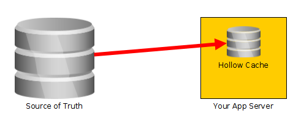
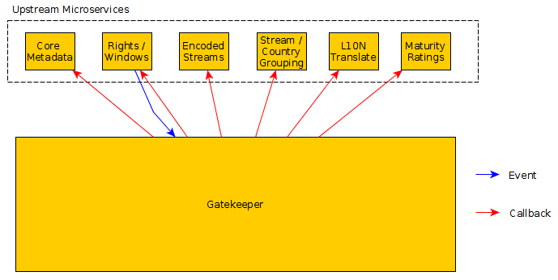
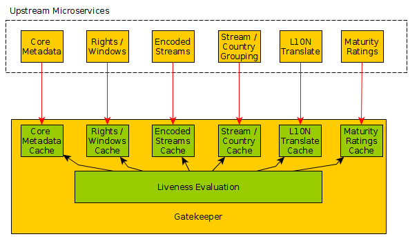
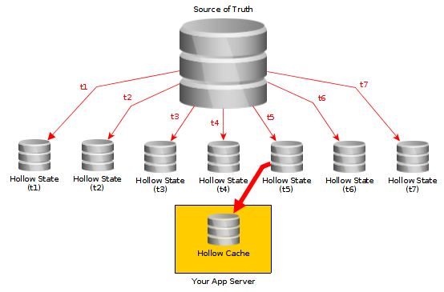
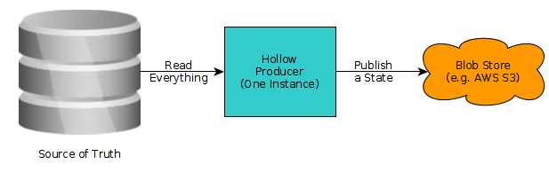
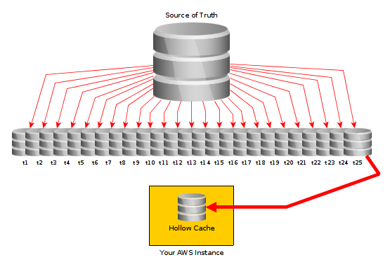
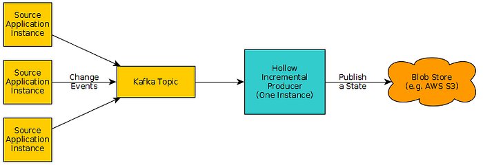
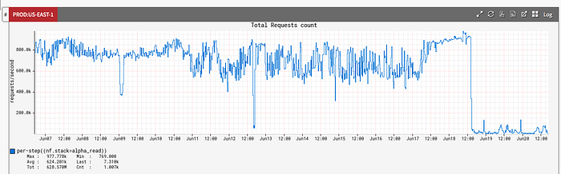
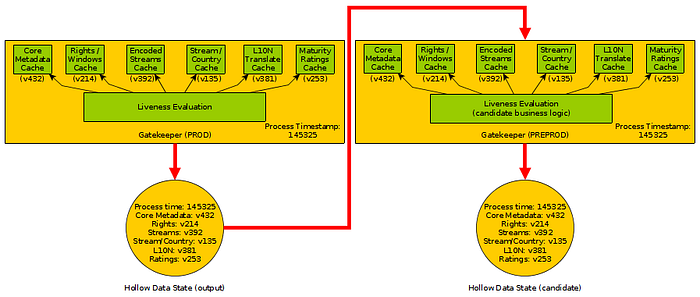
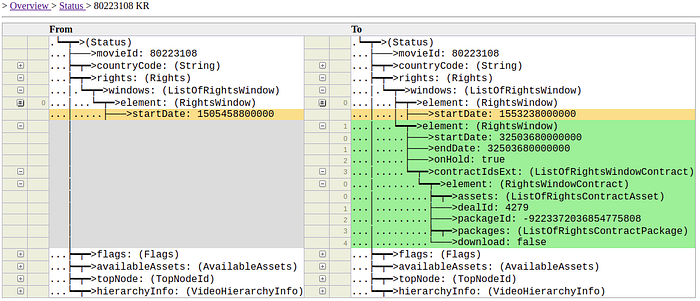

# Re-Architecting the Video Gatekeeper

> By Drew Koszewnik

This is the story about how the Content Setup Engineering team used Hollow, a Netflix OSS technology, to re-architect and simplify an essential component in our content pipeline — delivering a large amount of business value in the process.

### The Context

Each movie and show on the Netflix service is carefully curated to ensure an optimal viewing experience. The team responsible for this curation is _Title Operations_. Title Operations will confirm, among other things:

- We are in compliance with the contracts — date ranges and places where we can show a video are set up correctly for each title
- Video with captions, subtitles, and secondary audio “dub” assets are sourced, translated, and made available to the right populations around the world
- Title name and synopsis are available and translated
- The appropriate maturity ratings are available for each country

When a title meets all of the minimum above requirements, then it is allowed to go live on the service. _Gatekeeper_ is the system at Netflix responsible for evaluating the “liveness” of videos and assets on the site. **A title doesn’t become visible to members until Gatekeeper approves it — and if it can’t validate the setup, then it will assist Title Operations by pointing out what’s missing from the baseline customer experience.**

Gatekeeper accomplishes its prescribed task by aggregating data from multiple upstream systems, applying some business logic, then producing an output detailing the status of each video in each country.

### The Tech

[Hollow](http://hollow.how/), an [OSS](http://github.com/Netflix/hollow) technology we [released](https://medium.com/netflix-techblog/netflixoss-announcing-hollow-5f710eefca4b) a few years ago, has been best described as a _total high-density near cache_:

- **Total**: The entire dataset is cached on each node — there is no eviction policy, and there are no cache misses.
- **High-Density**: encoding, bit-packing, and deduplication techniques are employed to optimize the memory footprint of the dataset.
- **Near**: the cache exists in RAM on any instance which requires access to the dataset.

One exciting thing about the _total_ nature of this technology — because we don’t have to worry about swapping records in-and-out of memory, we can make assumptions and do some precomputation of the in-memory representation of the dataset which would not otherwise be possible. The net result is, for many datasets, vastly more efficient use of RAM. Whereas with a traditional partial-cache solution you may wonder whether you can get away with caching only 5% of the dataset, or if you need to reserve enough space for 10% in order to get an acceptable hit/miss ratio — with the same amount of memory Hollow may be able to cache 100% of your dataset and achieve a 100% hit rate.

And obviously, if you get a 100% hit rate, you eliminate all I/O required to access your data — and can achieve orders of magnitude more efficient data access, which opens up many possibilities.

### The Status-Quo

Until very recently, Gatekeeper was a completely event-driven system. When a change for a video occurred in any one of its upstream systems, that system would send an event to Gatekeeper. Gatekeeper would react to that event by reaching into each of its upstream services, gathering the necessary input data to evaluate the liveness of the video and its associated assets. It would then produce a single-record output detailing the status of that single video.

*Old Gatekeeper Architecture*

This model had several problems associated with it:

- This process was completely I/O bound and put a lot of load on upstream systems.
- Consequently, these events would queue up throughout the day and cause processing delays, which meant that titles may not actually go live on time.
- Worse, events would occasionally get missed, meaning titles wouldn’t go live _at all_ until someone from Title Operations realized there was a problem.

The mitigation for these issues was to “sweep” the catalog so Videos matching specific criteria (e.g., scheduled to launch next week) would get events automatically injected into the processing queue. Unfortunately, this mitigation added many more events into the queue, which exacerbated the problem.

Clearly, a change in direction was necessary.

### The Idea

We decided to employ a _total high-density near cache_ (i.e., Hollow) to eliminate our I/O bottlenecks. For each of our upstream systems, we would create a Hollow dataset which encompasses all of the data necessary for Gatekeeper to perform its evaluation. Each upstream system would now be responsible for keeping its cache updated.

*New Gatekeeper Architecture*

With this model, liveness evaluation is conceptually separated from the data retrieval from upstream systems. Instead of reacting to events, Gatekeeper would _continuously_ process liveness for all assets in all videos across all countries in a repeating cycle. The cycle iterates over every video available at Netflix, calculating liveness details for each of them. At the end of each cycle, it produces a complete output (also a Hollow dataset) representing the liveness status details of all videos in all countries.

We expected that this _continuous processing_ model was possible because a complete removal of our I/O bottlenecks would mean that we should be able to operate orders of magnitude more efficiently. We also expected that by moving to this model, we would realize many positive effects for the business.

- A definitive solution for the excess load on upstream systems generated by Gatekeeper
- A complete elimination of liveness processing delays and missed go-live dates.
- A reduction in the time the Content Setup Engineering team spends on performance-related issues.
- Improved debuggability and visibility into liveness processing.

### The Problem

Hollow can also be thought of like a time machine. As a dataset changes over time, it communicates those changes to consumers by breaking the timeline down into a series of discrete data _states_. Each data state represents a snapshot of the entire dataset at a specific moment in time.

*Hollow is like a time machine*

Usually, consumers of a Hollow dataset are loading the latest data state and keeping their cache updated as new states are produced. However, they may instead point to a prior state — which will revert their view of the entire dataset to a point in the past.

The traditional method of producing data states is to maintain a single producer which runs a repeating _cycle_. During that _cycle_, the producer iterates over all records from the source of truth. As it iterates, it adds each record to the Hollow library. Hollow then calculates the differences between the data added during this cycle and the data added during the last cycle, then publishes the state to a location known to consumers.

*Traditional Hollow usage*

The problem with this total-source-of-truth iteration model is that it can take a long time. In the case of some of our upstream systems, this could take hours. This data-propagation latency was unacceptable — we can’t wait hours for liveness processing if, for example, Title Operations adds a rating to a movie that needs to go live imminently.

### The Improvement

What we needed was a faster time machine — one which could produce states with a more frequent cadence, so that changes could be more quickly realized by consumers.

*Incremental Hollow is like a faster time machine*

To achieve this, we created an incremental Hollow infrastructure for Netflix, leveraging [work](https://github.com/Netflix/hollow/pull/69) which had been done in the Hollow library earlier, and [pioneered](https://github.com/Netflix/hollow/pull/142) in [production](https://github.com/Netflix/hollow/pull/188) [usage](https://github.com/Netflix/hollow/pull/181) by the Streaming Platform Team at Target (and is now a [public non-beta API](https://github.com/Netflix/hollow/pull/414)).

With this infrastructure, each time a change is detected in a source application, the updated record is [encoded](https://github.com/Netflix/hollow/pull/375) and emitted to a Kafka topic. A new component that is not part of the source application, the _Hollow Incremental Producer_ service, performs a repeating cycle at a predefined cadence. During each cycle, it reads all messages which have been added to the topic since the last cycle and mutates the Hollow state engine to reflect the new state of the updated records.

If a message from the Kafka topic contains the exact same data as already reflected in the Hollow dataset, no action is taken.

*Hollow Incremental Producer Service*

To mitigate issues arising from missed events, we implement a _sweep_ mechanism that periodically iterates over an entire source dataset. As it iterates, it emits the content of each record to the Kafka topic. In this way, any updates which may have been missed will eventually be reflected in the Hollow dataset. Additionally, because this is not the primary mechanism by which updates are propagated to the Hollow dataset, this does not have to be run as quickly or frequently as a cycle must iterate the source in traditional Hollow usage.

The Hollow Incremental Producer is capable of reading a great many messages from the Kafka topic and mutating its Hollow state internally very quickly — so we can configure its cycle times to be very short (we are currently defaulting this to 30 seconds).

This is how we built a faster time machine. Now, if Title Operations adds a maturity rating to a movie, within 30 seconds, that data is available in the corresponding Hollow dataset.

### The Tangible Result

With the data propagation latency issue solved, we were able to re-implement the Gatekeeper system to eliminate all I/O boundaries. With the prior implementation of Gatekeeper, re-evaluating all assets for all videos in all countries would have been unthinkable — it would tie up the entire content pipeline for more than a week (and we would then still be behind by a week since nothing else could be processed in the meantime). Now we re-evaluate everything in about 30 seconds — and we do that every minute.

There is no such thing as a missed or delayed liveness evaluation any longer, and the disablement of the prior Gatekeeper system reduced the load on our upstream systems — in some cases by up to 80%.

*Load reduction on one upstream system*

In addition to these performance benefits, we also get a resiliency benefit. In the prior Gatekeeper system, if one of the upstream services went down, we were unable to evaluate liveness at all because we were unable to retrieve any data from that system. In the new implementation, if one of the upstream systems goes down then it does stop publishing — but we still gate _stale_ data for its corresponding dataset while all others make progress. So for example, if the translated synopsis system goes down, we can still bring a movie on-site in a region if it was held back for, and then receives, the correct subtitles.

### The Intangible Result

Perhaps even more beneficial than the performance gains has been the improvement in our development velocity in this system. We can now develop, validate, and release changes in minutes which might have before taken days or weeks — and we can do so with significantly increased release quality.

The time-machine aspect of Hollow means that every deterministic process which uses Hollow exclusively as input data is 100% reproducible. For Gatekeeper, this means that an exact replay of what happened at time X can be accomplished by reverting all of our input states to time X, then re-evaluating everything again.

We use this fact to iterate quickly on changes to the Gatekeeper business logic. We maintain a PREPROD Gatekeeper instance which “follows” our PROD Gatekeeper instance. PREPROD is also continuously evaluating liveness for the entire catalog, but publishing its output to a different Hollow dataset. At the beginning of each cycle, the PREPROD environment will gather the latest produced state from PROD, and set each of its input datasets to the exact same versions which were used to produce the PROD output.

*The PREPROD Gatekeeper instance “follows” the PROD instance*

When we want to make a change to the Gatekeeper business logic, we do so and then publish it to our PREPROD cluster. The subsequent output state from PREPROD can be [_diffed_](https://hollow.how/tooling/#diff-tool) with its corresponding output state from PROD to view the precise effect that the logic change will cause. In this way, at a glance, we can validate that our changes have _precisely_ the intended effect, and _zero_ unintended consequences.

*A Hollow diff shows exactly what changes*

This, coupled with some iteration on the deployment process, has resulted in the ability for our team to code, validate, and deploy impactful changes to Gatekeeper in literally minutes — at least an order of magnitude faster than in the prior system — and we can do so with a higher level of safety than was possible in the previous architecture.

### Conclusion

This new implementation of the Gatekeeper system opens up opportunities to capture additional business value, which we plan to pursue over the coming quarters. Additionally, this is a pattern that can be replicated to other systems within the Content Engineering space and elsewhere at Netflix — already a couple of follow-up projects have been launched to formalize and capitalize on the benefits of this n-hollow-input, one-hollow-output architecture.

Content Setup Engineering is an exciting space right now, especially as we scale up our pipeline to produce more content with each passing quarter. We have many opportunities to solve real problems and provide massive value to the business — and to do so with a deep focus on computer science, using and often pioneering leading-edge technologies. If this kind of work sounds appealing to you, reach out to [Ivan](https://www.linkedin.com/in/ivanontiveros/) to get the ball rolling.

**_Who We Are:_**_ The Content Creative Engineering team creates and manages applications for acquisition & management of media (AV, Subtitles, Audio etc) & metadata (tags, annotations, maturity ratings, synopsis etc) for content going live on Netflix. The team builds back-end services that power user interfaces that are used internally at Netflix as well as externally by our content partners, fulfillment partners, creative agencies and freelancers that work with Netflix to curate one of the best entertainment catalogs in the world._

_Please reach out to us to learn about these and many more interesting challenges that we are working on._

_Content Creative Engineering — _[_Sameer Shah_](https://www.linkedin.com/in/sameerbshah/)_, Director of Engineering  
Content Setup Engineering — _[_Ivan Ontiveros_](https://www.linkedin.com/in/ivanontiveros/)_, Engineering Manager_

---
**Tags:** Programming · Software Engineering · Software Architecture · Open Source · Caching
