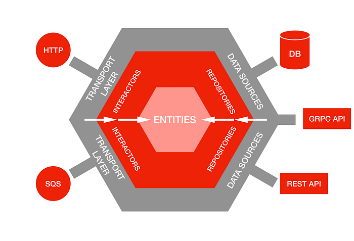
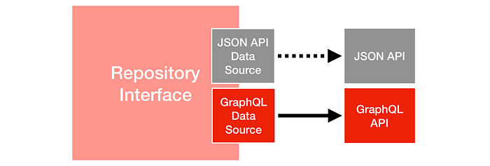
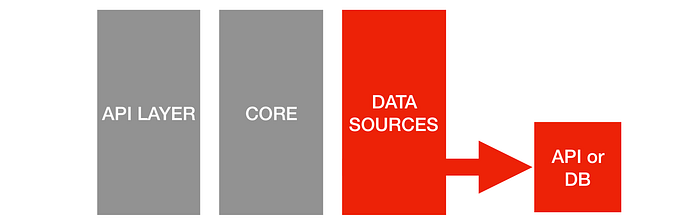
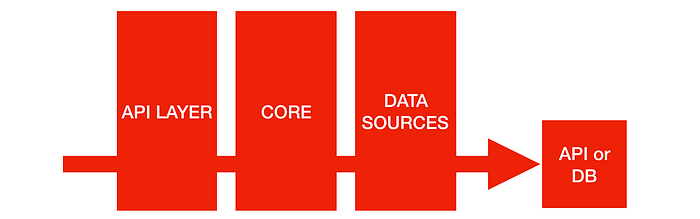

# Ready for changes with Hexagonal Architecture

_by _[_Damir Svrtan_](https://twitter.com/DamirSvrtan)_ and _[_Sergii Makagon_](https://twitter.com/makagon)

As the production of Netflix Originals grows each year, so does our need to build apps that enable efficiency throughout the entire creative process. Our wider Studio Engineering Organization has built numerous apps that help content progress from pitch (aka screenplay) to playback: ranging from script content acquisition, deal negotiations and vendor management to scheduling, streamlining production workflows, and so on.

## Highly integrated from the start

About a year ago, our Studio Workflows team started working on a new app that crosses multiple domains of the business. We had an interesting challenge on our hands: we needed to build the core of our app from scratch, but we also needed data that existed in many different systems.

Some of the data points we needed, such as data about movies, production dates, employees, and shooting locations, were **distributed across many services implementing various protocols: gRPC, JSON API, GraphQL and more.** Existing data was crucial to the behavior and business logic of our application. We needed to be highly integrated from the start.

## Swappable data sources

One of the early applications for bringing visibility into our productions was built as a monolith. The monolith allowed for rapid development and quick changes while the knowledge of the space was non-existent. At one point, more than 30 developers were working on it, and it had well over 300 database tables.

Over time applications evolved from broad service offerings towards being highly specialized. This resulted in a decision to decompose the monolith to specific services. This decision was not geared by performance issues — but with setting boundaries around all of these different domains and enabling dedicated teams to develop domain-specific services independently.

Large amounts of the data we needed for the new app were still provided by the monolith, but we knew that the monolith would be broken up at some point. We were not sure about the timing of the breakup, but we knew that it was inevitable, and we needed to be prepared.

Thus, we could leverage some of the data from the monolith at first as it was still the source of truth, but be prepared to swap those data sources to new microservices as soon as they came online.

## Leveraging Hexagonal Architecture

We needed to support the ability to **swap data sources without impacting business logic**, so we knew we needed to keep them decoupled. We decided to build our app based on principles behind [Hexagonal Architecture](https://en.wikipedia.org/wiki/Hexagonal_architecture_(software)).

**The idea of Hexagonal Architecture is to put inputs and outputs at the edges of our design. Business logic should not depend on whether we expose a REST or a GraphQL API, and it should not depend on where we get data from — a database, a microservice API exposed via gRPC or REST, or just a simple CSV file.**

The pattern allows us to isolate the core logic of our application from outside concerns. Having our core logic isolated means we can easily change data source details **without a ******significant****** impact or major code rewrites to the codebase**.

One of the main advantages we also saw in having an app with clear boundaries is our testing strategy — the majority of our tests can verify our business logic **without relying on protocols that can easily change**.

## Defining the core concepts

Leveraged from the Hexagonal Architecture, the three main concepts that define our business logic are **Entities**, **Repositories**, and **Interactors**.

- **Entities** are the domain objects (e.g., a Movie or a Shooting Location) — they have no knowledge of where they’re stored (unlike Active Record in Ruby on Rails or the Java Persistence API).
- **Repositories** are the interfaces to getting entities as well as creating and changing them. They keep a list of methods that are used to communicate with data sources and return a single entity or a list of entities. (e.g. UserRepository)
- **Interactors** are classes that orchestrate and perform domain actions — think of Service Objects or Use Case Objects. They implement complex business rules and validation logic specific to a domain action (e.g., onboarding a production)

With these three main types of objects, we are able to define business logic without any knowledge or care where the data is kept and how business logic is triggered. Outside of the business logic are the Data Sources and the Transport Layer:

- **Data Sources** are adapters to different storage implementations.  
A data source might be an adapter to a SQL database (an Active Record class in Rails or JPA in Java), an elastic search adapter, REST API, or even an adapter to something simple such as a CSV file or a Hash. A data source implements methods defined on the repository and stores the implementation of fetching and pushing the data.
- **Transport Layer** can trigger an interactor to perform business logic. We treat it as an input for our system. The most common transport layer for microservices is the HTTP **API Layer** and a set of controllers that handle requests. By having business logic extracted into interactors, we are not coupled to a particular transport layer or controller implementation. Interactors can be triggered not only by a controller, but also by an event, a cron job, or from the command line.

*The dependency graph in Hexagonal Architecture goes inward.*

With a traditional layered architecture, we would have all of our dependencies point in one direction, each layer above depending on the layer below. The transport layer would depend on the interactors, the interactors would depend on the persistence layer.

In Hexagonal Architecture all dependencies point inward — our core business logic does not know anything about the transport layer or the data sources. Still, the transport layer knows how to use interactors, and the data sources know how to conform to the repository interface.

With this, we are prepared for the inevitable changes to other Studio systems, and whenever that needs to happen, the task of swapping data sources is easy to accomplish.

## Swapping data sources

The need to swap data sources came earlier than we expected — we suddenly hit a read constraint with the monolith and needed to switch a certain read for one entity to a newer microservice exposed over a GraphQL aggregation layer. Both the microservice and the monolith were kept in sync and had the same data, reading from one service or the other produced the same results.

**We managed to transfer reads from a JSON API to a GraphQL data source within 2 hours.**

The main reason we were able to pull it off so fast was due to the Hexagonal architecture. We didn’t let any persistence specifics leak into our business logic. We created a GraphQL data source that implemented the repository interface. A **simple one-line change** was all we needed to start reading from a different data source.

*With a proper abstraction it was easy to change data sources*

At that point, we knew that **Hexagonal Architecture worked for us.**

The great part about a one-line change is that it mitigates risks to the release. It is very easy to rollback in the case that a downstream microservice failed on initial deployment. **This as well enables us to decouple deployment and activation, as we can decide which data source to use through configuration.**

## Hiding data source details

One of the great advantages of this architecture is that we are able to encapsulate data source implementation details. We ran into a case where we needed an API call that did not yet exist — a service had an API to fetch a single resource but did not have bulk fetch implemented. After talking with the team providing the API, we realized this endpoint would take some time to deliver. So we decided to move forward with another solution to solve the problem while this endpoint was being built.

**We defined a repository method that would grab multiple resources given multiple record identifiers — and the initial implementation of that method on the data source sent multiple concurrent calls to the downstream service. **We knew this was a temporary solution and that the second take at the data source implementation was to use the bulk API once implemented.

*Our business logic doesn’t need to be aware of specific data source limitations.*

A design like this enabled us to move forward with meeting the business needs without accruing much technical debt or the need to change any business logic afterward.

## Testing strategy

When we started experimenting with Hexagonal Architecture, we knew we needed to come up with a testing strategy. We knew that a prerequisite to great development velocity was to have a test suite that is reliable and super fast. **We didn’t think of it as a nice to have, but a must-have.**

We decided to test our app at three different layers:

- We test our **interactors**, where the core of our business logic lives but is independent of any type of persistence or transportation. We leverage dependency injection and mock any kind of repository interaction. This is where our business logic is **tested in detail**, and these are the tests we strive to have most of.

- We test our **data sources** to determine if they integrate correctly with other services, whether they conform to the repository interface, and check how they behave upon errors. We try to minimize the amount of these tests.

- **We have ******integration specs****** that go through the whole stack, from our Transport / API layer, through the interactors, repositories, data sources, and hit downstream services. These specs test whether we “wired” everything correctly. If a data source is an external API, we hit that endpoint and record the responses (and store them in git), allowing our test suite to run fast on every subsequent invocation. We don’t do extensive test coverage on this layer — usually just one success scenario and one failure scenario per domain action.**

We don’t test our repositories as they are simple interfaces that data sources implement, and we rarely test our entities as they are plain objects with attributes defined. We test entities if they have additional methods (without touching the persistence layer).

We have room for improvement, **such as not pinging any of the services we rely on but relying 100% on ****[contract testing](https://docs.pact.io/#what-is-contract-testing)**. With a test suite written in the above manner, we manage to run around 3000 specs in 100 seconds on a single process.

It’s lovely to work with a test suite that can easily be run on any machine, and our development team can work on their daily features without disruption.

## Delaying decisions

We are in a great position when it comes to swapping data sources to different microservices. One of the key benefits is that we can delay some of the decisions about whether and how we want to store data internal to our application. Based on the feature’s use case, we even have the flexibility to determine the type of data store — whether it be Relational or Documents.

At the beginning of a project, we have the least amount of information about the system we are building. We should not lock ourselves into an architecture with uninformed decisions leading to a [project paradox](https://twitter.com/tofo/status/512666251055742977).

The decisions we made make sense for our needs now and have enabled us to move fast. The best part of Hexagonal Architecture is that it keeps our application flexible for future requirements to come.

---
**Tags:** Hexagonal Architecture · Software Architecture · API · Api Integration
