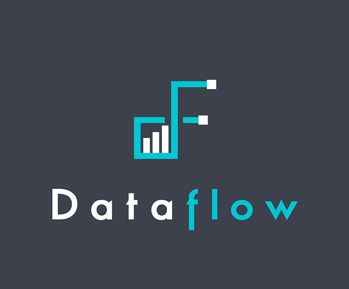

# Ready-to-go sample data pipelines with Dataflow

by [Jasmine Omeke](https://www.linkedin.com/in/ywnfm5/), [Obi-Ike Nwoke](https://www.linkedin.com/in/onwoke/), [Olek Gorajek](https://www.linkedin.com/in/agorajek/)

## Intro

This post is for all data **practitioners**, who are interested in learning about bootstrapping, standardization and automation of batch data pipelines at Netflix.

You may remember Dataflow from the post we wrote last year titled [Data pipeline asset management with Dataflow](./data-pipeline-asset-management-with-dataflow-86525b3e21ca.md). That article was a deep dive into one of the more technical aspects of Dataflow and didn’t properly introduce this tool in the first place. This time we’ll try to give justice to the intro and then we will focus on one of the very first features Dataflow came with. That feature is called **sample workflows**, but before we start in let’s have a quick look at Dataflow in general.



### Dataflow

Dataflow is a command line utility built to improve experience and to streamline the data pipeline development at Netflix. Check out this high level Dataflow help command output below:

```
$ dataflow --help
Usage: dataflow [OPTIONS] COMMAND [ARGS]...

Options:
  --docker-image TEXT  Url of the docker image to run in.
  --run-in-docker      Run dataflow in a docker container.
  -v, --verbose        Enables verbose mode.
  --version            Show the version and exit.
  --help               Show this message and exit.

Commands:
  migration  Manage schema migration.
  mock       Generate or validate mock datasets.
  project    Manage a Dataflow project.
  sample     Generate fully functional sample workflows.
```

As you can see, the Dataflow CLI is divided into four main subject areas (or commands). The most commonly used one is **dataflow project**, which helps folks in managing their data pipeline repositories through creation, testing, deployment and few other activities.

The **dataflow migration** command is a special feature, developed single handedly by [Stephen Huenneke](https://www.linkedin.com/in/stephenhuenneke/), to fully automate the communication and tracking of a data warehouse table changes. Thanks to the Netflix internal lineage system (built by [Girish Lingappa](https://www.linkedin.com/in/girish-lingappa-309aa24/)) Dataflow migration can then help you identify downstream usage of the table in question. And finally it can help you craft a message to all the owners of these dependencies. After your migration has started Dataflow will also keep track of its progress and help you communicate with the downstream users.

**Dataflow mock** command is another standalone feature. It lets you create YAML formatted mock data files based on selected tables, columns and a few rows of data from the Netflix data warehouse. Its main purpose is to enable easy unit testing of your data pipelines, but it can technically be used in any other situations as a readable data format for small data sets.

All the above commands are very likely to be described in separate future blog posts, but right now let’s focus on the **dataflow sample **command.


---

## Sample workflows

Dataflow **sample workflows **is a set of templates anyone can use to bootstrap their data pipeline project. And by “sample” we mean “an example”, like food samples in your local grocery store. One of the main reasons this feature exists is just like with food samples, to give you “a taste” of the production quality ETL code that you could encounter inside the Netflix data ecosystem.

All the code you get with the Dataflow sample workflows is fully functional, adjusted to your environment and isolated from other sample workflows that others generated. This pipeline is safe to run the moment it shows up in your directory. It will, not only, build a nice example aggregate table and fill it up with real data, but it will also present you with a complete set of recommended components:

- clean DDL code,
- proper table metadata settings,
- transformation job (in a language of choice) wrapped in an optional WAP (Write, Audit, Publish) pattern,
- sample set of data audits for the generated data,
- and a fully functional unit test for your transformation logic.

And last, but not least, these sample workflows are being tested continuously as part of the Dataflow code change protocol, so you can be sure that what you get is working. This is one way to build trust with our internal user base.

Next, let’s have a look at the actual business logic of these sample workflows.

### Business Logic

There are several variants of the sample workflow you can get from Dataflow, but all of them share the same business logic. This was a conscious decision in order to clearly illustrate the difference between various languages in which your ETL could be written in. Obviously not all tools are made with the same use case in mind, so we are planning to add more code samples for other (than classical batch ETL) data processing purposes, e.g. Machine Learning model building and scoring.

The example business logic we use in our template computes the top hundred movies/shows in every country where Netflix operates on a daily basis. This is not an actual production pipeline running at Netflix, because it is a highly simplified code but it serves well the purpose of illustrating a batch ETL job with various transformation stages. Let’s review the transformation steps below.

**Step 1:** on a daily basis, incrementally, sum up all viewing time of all movies and shows in every country

```
WITH STEP_1 AS (
   SELECT
       title_id
       , country_code
       , SUM(view_hours) AS view_hours
   FROM some_db.source_table
   WHERE playback_date = CURRENT_DATE
   GROUP BY
       title_id
       , country_code
)
```

**Step 2**: rank all titles from most watched to least in every county

```
WITH STEP_2 AS (
   SELECT
       title_id
       , country_code
       , view_hours
       , RANK() OVER (
          PARTITION BY country_code 
          ORDER BY view_hours DESC
       ) AS title_rank
   FROM STEP_1
)
```

**Step 3:** filter all titles to the top 100

```
WITH STEP_3 AS (
   SELECT
       title_id
       , country_code
       , view_hours
       , title_rank
   FROM STEP_2
   WHERE title_rank <= 100
)
```

Now, using the above simple 3-step transformation, we will produce data that can be written to the following Iceberg table:

```
CREATE TABLE IF NOT EXISTS ${TARGET_DB}.dataflow_sample_results (
  title_id INT COMMENT "Title ID of the movie or show."
  , country_code STRING COMMENT "Country code of the playback session."
  , title_rank INT COMMENT "Rank of a given title in a given country."
  , view_hours DOUBLE COMMENT "Total viewing hours of a given title in a given country."
)
COMMENT
  "Example dataset brought to you by Dataflow. For more information on this
   and other examples please visit the Dataflow documentation page."
PARTITIONED BY (
  date DATE COMMENT "Playback date."
)
STORED AS ICEBERG;
```

As you can infer from the above table structure we are going to load about [19,000](https://help.netflix.com/en/node/14164) rows into this table on a daily basis. And they will look something like this:

```
 sql> SELECT * FROM foo.dataflow_sample_results 
      WHERE date = 20220101 and country_code = 'US' 
      ORDER BY title_rank LIMIT 5;

 title_id | country_code | title_rank | view_hours | date
----------+--------------+------------+------------+----------
 11111111 | US           |          1 |   123      | 20220101
 44444444 | US           |          2 |   111      | 20220101
 33333333 | US           |          3 |   98       | 20220101
 55555555 | US           |          4 |   55       | 20220101
 22222222 | US           |          5 |   11       | 20220101
(5 rows)
```

With the business logic out of the way, we can now start talking about the components, or the boiler-plate, of our sample workflows.

### Components

Let’s have a look at the most common workflow components that we use at Netflix. These components may not fit into every ETL use case, but are used often enough to be included in every template (or sample workflow). The workflow author, after all, has the final word on whether they want to use all of these patterns or keep only some. Either way they are here to start with, ready to go, if needed.

**Workflow Definitions**

Below you can see a typical file structure of a sample workflow package written in SparkSQL.

```
.
├── backfill.sch.yaml
├── daily.sch.yaml
├── main.sch.yaml
├── ddl
│   └── dataflow_sparksql_sample.sql
└── src
    ├── mocks
    │   ├── dataflow_pyspark_sample.yaml
    │   └── some_db.source_table.yaml
    ├── sparksql_write.sql
    └── test_sparksql_write.py
```

Above bolded files define a series of steps (a.k.a. jobs) their cadence, dependencies, and the sequence in which they should be executed.

This is one way we can tie components together into a cohesive workflow. In every sample workflow package there are three workflow definition files that work together to provide flexible functionality. The sample workflow code assumes a daily execution pattern, but it is very easy to adjust them to run at different cadence. For the workflow orchestration we use Netflix homegrown [Maestro](./orchestrating-data-ml-workflows-at-scale-with-netflix-maestro-aaa2b41b800c.md) scheduler.

The **_main_** workflow definition file holds the logic of a single run, in this case one day-worth of data. This logic consists of the following parts: DDL code, table metadata information, data transformation and a few audit steps. It’s designed to run for a single date, and meant to be called from the _daily_ or _backfill_ workflows. This _main_ workflow can also be called manually during development with arbitrary run-time parameters to get a feel for the workflow in action.

The **_daily_** workflow executes the _main_ one on a daily basis for the predefined number of previous days. This is sometimes necessary for the purpose of catching up on some late arriving data. This is where we define a trigger schedule, notifications schemes, and update the “high water mark” timestamps on our target table.

The **_backfill_** workflow executes the _main_ for a specified range of days. This is useful for restating data, most often because of a transformation logic change, but sometimes as a response to upstream data updates.

**DDL**

Often, the first step in a data pipeline is to define the target table structure and column metadata via a DDL statement. We understand that some folks choose to have their output schema be an implicit result of the transform code itself, but the explicit statement of the output schema is not only useful for adding table (and column) level comments, but also serves as one way to validate the transform logic.

```
.
├── backfill.sch.yaml
├── daily.sch.yaml
├── main.sch.yaml
├── ddl
│   └── dataflow_sparksql_sample.sql
└── src
    ├── mocks
    │   ├── dataflow_pyspark_sample.yaml
    │   └── some_db.source_table.yaml
    ├── sparksql_write.sql
    └── test_sparksql_write.py
```

Generally, we prefer to execute DDL commands as part of the workflow itself, instead of running outside of the schedule, because it simplifies the development process. See below example of hooking the table creation SQL file into the _main_ workflow definition.

```
      - job:
          id: ddl
          type: Spark
          spark:
              script: $S3{./ddl/dataflow_sparksql_sample.sql}
              parameters:
                  TARGET_DB: ${TARGET_DB}
```

**Metadata**

The metadata step provides context on the output table itself as well as the data contained within. Attributes are set via [Metacat](https://netflixtechblog.com/metacat-making-big-data-discoverable-and-meaningful-at-netflix-56fb36a53520), which is a Netflix internal metadata management platform. Below is an example of plugging that metadata step in the _main_ workflow definition

```
     - job:
          id: metadata
          type: Metadata
          metacat:
              tables:
                - ${CATALOG}/${TARGET_DB}/${TARGET_TABLE}
              owner: ${username}
              tags:
                - dataflow
                - sample
              lifetime: 123
              column_types:
                date: pk
                country_code: pk
                rank: pk
```

**Transformation**

The transformation step (or steps) can be executed in the developer’s language of choice. The example below is using SparkSQL.

```
.
├── backfill.sch.yaml
├── daily.sch.yaml
├── main.sch.yaml
├── ddl
│   └── dataflow_sparksql_sample.sql
└── src
    ├── mocks
    │   ├── dataflow_pyspark_sample.yaml
    │   └── some_db.source_table.yaml
    ├── sparksql_write.sql
    └── test_sparksql_write.py
```

Optionally, this step can use the Write-Audit-Publish [pattern](https://www.dremio.com/subsurface/write-audit-publish-pattern-via-apache-iceberg/) to ensure that data is correct before it is made available to the rest of the company. See example below:

```
      - template:
          id: wap
          type: wap
          tables:
              - ${CATALOG}/${DATABASE}/${TABLE}
          write_jobs:
            - job:
                id: write
                type: Spark
                spark:
                    script: $S3{./src/sparksql_write.sql}
```

**Audits**

Audit steps can be defined to verify data quality. If a “blocking” audit fails, the job will halt and the write step is not committed, so invalid data will not be exposed to users. This step is optional and configurable, see a partial example of an audit from the _main_ workflow below.

```
         data_auditor:
            audits:
              - function: columns_should_not_have_nulls
                blocking: true
                params:
                    table: ${TARGET_TABLE}
                    columns:
                      - title_id
                      …
```

**High-Water-Mark Timestamp**

A successful write will typically be followed by a metadata call to set the valid time (or high-water mark) of a dataset. This allows other processes, consuming our table, to be notified and start their processing. See an example high water mark job from the _main_ workflow definition.

```
      - job:
         id: hwm
         type: HWM
         metacat:
           table: ${CATALOG}/${TARGET_DB}/${TARGET_TABLE}
           hwm_datetime: ${EXECUTION_DATE}
           hwm_timezone: ${EXECUTION_TIMEZONE}
```

**Unit Tests**

Unit test artifacts are also generated as part of the sample workflow structure. They consist of data mocks, the actual test code, and a simple execution harness depending on the workflow language. See the bolded file below.

```
.
├── backfill.sch.yaml
├── daily.sch.yaml
├── main.sch.yaml
├── ddl
│   └── dataflow_sparksql_sample.sql
└── src
    ├── mocks
    │   ├── dataflow_pyspark_sample.yaml
    │   └── some_db.source_table.yaml
    ├── sparksql_write.sql
    └── test_sparksql_write.py
```

These unit tests are intended to test one “unit” of data transform in isolation. They can be run during development to quickly capture code typos and syntax issues, or during automated testing/deployment phase, to make sure that code changes have not broken any tests.

We want unit tests to run quickly so that we can have continuous feedback and fast iterations during the development cycle. Running code against a production database can be slow, especially with the overhead required for distributed data processing systems like Apache Spark. Mocks allow you to run tests locally against a small sample of “real” data to validate your transformation code functionality.

### Languages

Over time, the extraction of data from Netflix’s source systems has grown to encompass a wider range of end-users, such as engineers, data scientists, analysts, marketers, and other stakeholders. Focusing on convenience, Dataflow allows for these differing personas to go about their work seamlessly. A large number of our data users employ SparkSQL, pyspark, and Scala. A small but growing contingency of data scientists and analytics engineers use R, backed by the Sparklyr interface or other data processing tools, like [Metaflow](https://docs.metaflow.org/introduction/what-is-metaflow).

With an understanding that the data landscape and the technologies employed by end-users are not homogenous, Dataflow creates a malleable path forward. It solidifies different recipes or repeatable templates for data extraction. Within this section, we’ll preview a few methods, starting with sparkSQL and python’s manner of creating data pipelines with dataflow. Then we’ll segue into the Scala and R use cases.

To begin, after installing Dataflow, a user can run the following command to understand how to get started.

```
$ dataflow sample workflow --help                                                         
Dataflow (0.6.16)

Usage: dataflow sample workflow [OPTIONS] RECIPE [TARGET_PATH]

Create a sample workflow based on selected RECIPE and land it in the 
specified TARGET_PATH.

Currently supported workflow RECIPEs are: spark-sql, pyspark, 
scala and sparklyr.

  If TARGET_PATH:
  - if not specified, current directory is assumed
  - points to a directory, it will be used as the target location

Options:
  --source-path TEXT         Source path of the sample workflows.
  --workflow-shortname TEXT  Workflow short name.
  --workflow-id TEXT         Workflow ID.
  --skip-info                Skip the info about the workflow sample.
  --help                     Show this message and exit.
```

Once again, let’s assume we have a directory called _stranger-data_ in which the user creates workflow templates in all four languages that Dataflow offers. To better illustrate how to generate the sample workflows using Dataflow, let’s look at the full command one would use to create one of these workflows, e.g:

```
$ cd stranger-data
$ dataflow sample workflow spark-sql ./sparksql-workflow
```

By repeating the above command for each type of transformation language we can arrive at the following directory structure:

```
.
├── pyspark-workflow
│   ├── main.sch.yaml
│   ├── daily.sch.yaml
│   ├── backfill.sch.yaml
│   ├── ddl
│   │   └── ...
│   ├── src
│   │   └── ...
│   └── tox.ini
├── scala-workflow
│   ├── build.gradle
│   └── ...
├── sparklyR-workflow
│   └── ...
└── sparksql-workflow
    └── ...
```

Earlier we talked about the business logic of these sample workflows and we showed the Spark SQL version of that example data transformation. Now let’s discuss different approaches to writing the data in other languages.

**PySpark**

This partial **pySpark **code below will have the same functionality as the SparkSQL example above, but it utilizes Spark dataframes Python interface.

```
def main(args, spark):
   
    source_table_df = spark.table(f"{some_db}.{source_table})

    viewing_by_title_country = (
        source_table_df.select("title_id", "country_code",      
        "view_hours")
        .filter(col("date") == date)
        .filter("title_id IS NOT NULL AND view_hours > 0")
        .groupBy("title_id", "country_code")
        .agg(F.sum("view_hours").alias("view_hours"))
    )

    window = Window.partitionBy(
        "country_code"
    ).orderBy(col("view_hours").desc())

    ranked_viewing_by_title_country = viewing_by_title_country.withColumn(
        "title_rank", rank().over(window)
    )

    ranked_viewing_by_title_country.filter(
        col("title_rank") <= 100
    ).withColumn(
        "date", lit(int(date))
    ).select(
        "title_id",
        "country_code",
        "title_rank",
        "view_hours",
        "date",
    ).repartition(1).write.byName().insertInto(
        target_table, overwrite=True
    )
```

**Scala**

Scala is another Dataflow supported recipe that offers the same business logic in a sample workflow out of the box.

```
package com.netflix.spark

object ExampleApp {
  import spark.implicits._

  def readSourceTable(sourceDb: String, dataDate: String): DataFrame =
    spark
      .table(s"$someDb.source_table")
      .filter($"playback_start_date" === dataDate)

  def viewingByTitleCountry(sourceTableDF: DataFrame): DataFrame = {
    sourceTableDF
      .select($"title_id", $"country_code", $"view_hours")
      .filter($"title_id".isNotNull)
      .filter($"view_hours" > 0)
      .groupBy($"title_id", $"country_code")
      .agg(F.sum($"view_hours").as("view_hours"))
  }

  def addTitleRank(viewingDF: DataFrame): DataFrame = {
    viewingDF.withColumn(
      "title_rank", F.rank().over(
        Window.partitionBy($"country_code").orderBy($"view_hours".desc)
      )
    )
  }

  def writeViewing(viewingDF: DataFrame, targetTable: String, dataDate: String): Unit = {
    viewingDF
      .select($"title_id", $"country_code", $"title_rank", $"view_hours")
      .filter($"title_rank" <= 100)
      .repartition(1)
      .withColumn("date", F.lit(dataDate.toInt))
      .writeTo(targetTable)
      .overwritePartitions()
  }

def main():
    sourceTableDF = readSourceTable("some_db", "source_table", 20200101)
    viewingDf = viewingByTitleCountry(sourceTableDF)
    titleRankedDf = addTitleRank(viewingDF)
    writeViewing(titleRankedDf)
```

R / sparklyR

As Netflix has a growing cohort of R users, R is the latest recipe available in Dataflow.

```
suppressPackageStartupMessages({
  library(sparklyr)
  library(dplyr)
})

...

main <- function(args, spark) {
  title_df <- tbl(spark, g("{some_db}.{source_table}"))

  title_activity_by_country <- title_df |>
    filter(title_date == date) |>
    filter(!is.null(title_id) & event_count > 0) |>
    select(title_id, country_code, event_type) |>
    group_by(title_id, country_code) |>
    summarize(event_count = sum(event_type, na.rm = TRUE))

  ranked_title_activity_by_country <- title_activity_by_country  |>
    group_by(country_code) |>
    mutate(title_rank = rank(desc(event_count)))

  top_25_title_by_country <- ranked_title_activity_by_country |>
    ungroup() |>
    filter(title_rank <= 25) |>
    mutate(date = as.integer(date)) |>
    select(
      title_id,
      country_code,
      title_rank,
      event_count,
      date
    )

    top_25_title_by_country |>
      sdf_repartition(partitions = 1) |>
      spark_insert_table(target_table, mode = "overwrite")
}
  main(args = args, spark = spark)
}
```


---

## Conclusions

As you can see we try to make Netflix data engineering life easier by offering paved paths and suggestions on how to structure their code, while trying to keep the variety of options wide enough so they can pick and choose what works best for them in any particular case.

Having a well-defined set of defaults for data pipeline creation across Netflix makes onboarding easier, provides standardization and centralization best practices. Let’s review them below.

### Onboarding

Ramping up on a new team or a business vertical always takes some effort, especially in a “highly aligned, loosely coupled” [culture](https://jobs.netflix.com/culture). Having a well-documented starting point removes some of the struggle that comes with starting from scratch and considerably speeds up the first iteration of the development cycle.

### Standardization

Standardization makes life easier for new team members as well as those already familiar with the domain and tech stack.

Some transfer of work between people or teams is inevitable. Having standardized layout and patterns removes friction from this exchange. Also, code reviews and suggestions are easier to manage when working from a similar baseline.

Standardization also makes project layout more intuitive and minimizes risk of human error as the codebase evolves.

### Centralized Best Practices

Data infrastructure evolves continually. Having easy access to a centralized set of good defaults is critical to ensure that best practices evolve along with the technology, and that users are aware of what’s the latest on the tech-stack menu.

Even better, Dataflow offers **executable** best practices, which present these concepts in the context of an actual use case. Instead of reading documentation, you can initialize a “real” project, change it as needed, and iterate from there.

## Credits

Special thanks to [Daniel Watson](https://www.linkedin.com/in/danielbwatson/), [Jim Hester](https://www.linkedin.com/in/jim-hester/), [Stephen Huenneke](https://www.linkedin.com/in/stephenhuenneke/), [Girish Lingappa](https://www.linkedin.com/in/girish-lingappa-309aa24/) for their contributions to Dataflow sample workflows and to [Andrea Hairston](https://www.linkedin.com/in/andreahairston/) for the Dataflow logo design.

## Next Episode

Hopefully you won’t need to wait another year to read about other features of Dataflow. Here are a few topics that we could write about next. Please have a look at the subjects below and, if you feel strongly about any of them, let us know in the comments section:

- **Branch driven deployment** — to explain how Dataflow lets anyone customize their CI/CD jobs based on the git branch for easy testing in isolated environments.
- **Local SparkSQL unit testing**— to clarify how Dataflow helps in making robust unit tests for Spark SQL transform code, with ease.
- **Data migrations made easy** — to show how Dataflow can be used to plan a table migration, support the communication with downstream users and help in monitoring it to completion.

---
**Tags:** Data Engineering · Dataflow · Etl · Standardization · Data Pipeline
