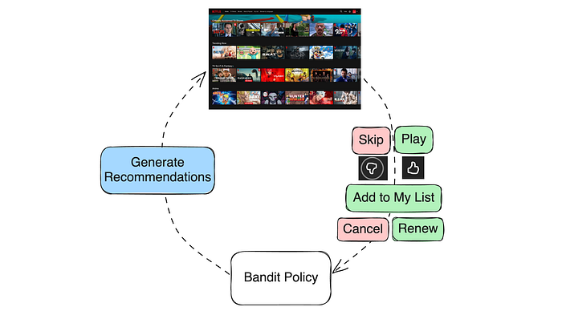
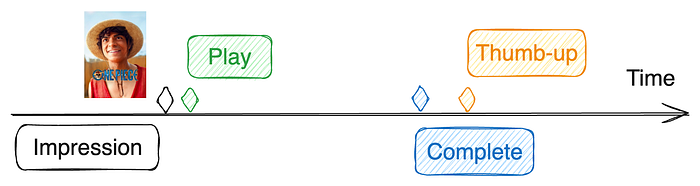
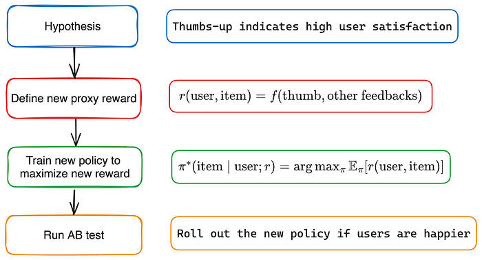
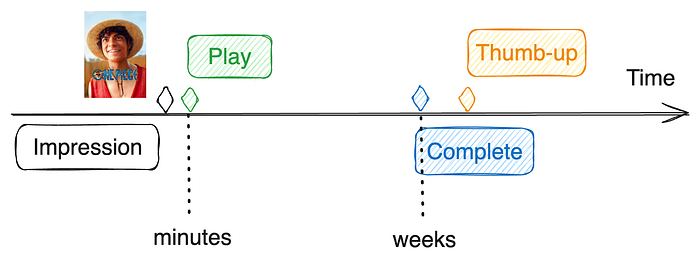
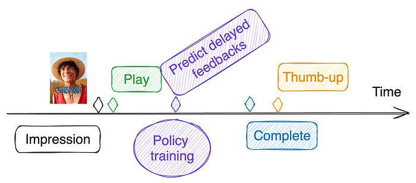
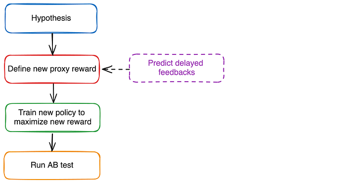

# Recommending for Long-Term Member Satisfaction at Netflix

By [Jiangwei Pan](https://www.linkedin.com/in/jiangwei-pan-66a62a13/), [Gary Tang](https://www.linkedin.com/in/thegarytang/), [Henry Wang](https://www.linkedin.com/in/henry-kang-wang-06701716/), and [Justin Basilico](https://www.linkedin.com/in/jbasilico/)

## Introduction

Our mission at Netflix is to entertain the world. Our personalization algorithms play a crucial role in delivering on this mission for all members by recommending the right shows, movies, and games at the right time. This goal extends beyond immediate engagement; we aim to create an experience that brings lasting enjoyment to our members. Traditional recommender systems often optimize for short-term metrics like clicks or engagement, which may not fully capture long-term satisfaction. We strive to recommend content that not only engages members in the moment but also enhances their long-term satisfaction, which increases the value they get from Netflix, and thus they’ll be more likely to continue to be a member.

## Recommendations as Contextual Bandit

One simple way we can view recommendations is as a contextual bandit problem. When a member visits, that becomes a context for our system and it selects an action of what recommendations to show, and then the member provides various types of feedback. These feedback signals can be immediate (skips, plays, thumbs up/down, or adding items to their playlist) or delayed (completing a show or renewing their subscription). **We can define reward functions to reflect the quality of the recommendations from these feedback signals and then train a contextual bandit policy on historical data to maximize the expected reward.**

## Improving Recommendations: Models and Objectives

There are many ways that a recommendation model can be improved. They may come from more informative input features, more data, different architectures, more parameters, and so forth. In this post, we focus on a less-discussed aspect about improving the recommender objective by defining a reward function that tries to better reflect long-term member satisfaction.

## Retention as Reward?

Member retention might seem like an obvious reward for optimizing long-term satisfaction because members should stay if they’re satisfied, however it has several drawbacks:

- **Noisy**: Retention can be influenced by numerous external factors, such as seasonal trends, marketing campaigns, or personal circumstances unrelated to the service.
- **Low Sensitivity**: Retention is only sensitive for members on the verge of canceling their subscription, not capturing the full spectrum of member satisfaction.
- **Hard to Attribute**: Members might cancel only after a series of bad recommendations.
- **Slow to Measure**: We only get one signal per account per month.

Due to these challenges, optimizing for retention alone is impractical.

## Proxy Rewards

Instead, we can train our bandit policy to optimize a proxy reward function that is highly aligned with long-term member satisfaction while being sensitive to individual recommendations. The proxy reward _r(user, item)_ is a function of user interaction with the recommended item. For example, if we recommend “One Piece” and a member plays then subsequently completes and gives it a thumbs-up, a simple proxy reward might be defined as _r(user, item) = f(play, complete, thumb)_.

### Click-through rate (CTR)

Click-through rate (CTR), or in our case play-through rate, can be viewed as a simple proxy reward where _r(user, item) _= 1 if the user clicks a recommendation and 0 otherwise. CTR is a common feedback signal that generally reflects user preference expectations. It is a simple yet strong baseline for many recommendation applications. In some cases, such as ads personalization where the click is the target action, CTR may even be a reasonable reward for production models. **However, in most cases, over-optimizing CTR can lead to promoting clickbaity items, which may harm long-term satisfaction.**

### Beyond CTR

To align the proxy reward function more closely with long-term satisfaction, we need to look beyond simple interactions, consider all types of user actions, and understand their true implications on user satisfaction.

We give a few examples in the Netflix context:

- **Fast season completion **✅: Completing a season of a recommended TV show in one day is a strong sign of enjoyment and long-term satisfaction.
- **Thumbs-down after completion **❌: Completing a TV show in several weeks followed by a thumbs-down indicates low satisfaction despite significant time spent.
- **Playing a movie for just 10 minutes **❓: In this case, the user’s satisfaction is ambiguous. The brief engagement might indicate that the user decided to abandon the movie, or it could simply mean the user was interrupted and plans to finish the movie later, perhaps the next day.
- **Discovering new genres **✅ ✅: Watching more Korean or game shows after “Squid Game” suggests the user is discovering something new. This discovery was likely even more valuable since it led to a variety of engagements in a new area for a member.

## Reward Engineering

Reward engineering is the iterative process of refining the proxy reward function to align with long-term member satisfaction. It is similar to feature engineering, except that it can be derived from data that isn’t available at serving time. Reward engineering involves four stages: hypothesis formation, defining a new proxy reward, training a new bandit policy, and A/B testing. Below is a simple example.

## Challenge: Delayed Feedback

User feedback used in the proxy reward function is often delayed or missing. For example, a member may decide to play a recommended show for just a few minutes on the first day and take several weeks to fully complete the show. This completion feedback is therefore delayed. Additionally, some user feedback may never occur; while we may wish otherwise, not all members provide a thumbs-up or thumbs-down after completing a show, leaving us uncertain about their level of enjoyment.

We could try and wait to give a longer window to observe feedback, but how long should we wait for delayed feedback before computing the proxy rewards? If we wait too long (e.g., weeks), we miss the opportunity to update the bandit policy with the latest data. In a highly dynamic environment like Netflix, a stale bandit policy can degrade the user experience and be particularly bad at recommending newer items.

### Solution: predict missing feedback

We aim to update the bandit policy shortly after making a recommendation while also defining the proxy reward function based on all user feedback, including delayed feedback. Since delayed feedback has not been observed at the time of policy training, we can predict it. This prediction occurs for each training example with delayed feedback, using already observed feedback and other relevant information up to the training time as input features. Thus, the prediction also gets better as time progresses.

The proxy reward is then calculated for each training example using both observed and predicted feedback. These training examples are used to update the bandit policy.

But aren’t we still only relying on observed feedback in the proxy reward function? Yes, because delayed feedback is predicted based on observed feedback. However, it is simpler to reason about rewards using all feedback directly. For instance, the delayed thumbs-up prediction model may be a complex neural network that takes into account all observed feedback (e.g., short-term play patterns). It’s more straightforward to define the proxy reward as a simple function of the thumbs-up feedback rather than a complex function of short-term interaction patterns. It can also be used to adjust for potential biases in how feedback is provided.

The reward engineering diagram is updated with an optional delayed feedback prediction step.

### Two types of ML models

It’s worth noting that this approach employs two types of ML models:

- **Delayed Feedback Prediction Models**: These models predict _p(final feedback | observed feedbacks)_. The predictions are used to define and compute proxy rewards for bandit policy training examples. As a result, these models are used offline during the bandit policy training.
- **Bandit Policy Models**: These models are used in the bandit policy _π(item | user; r)_ to generate recommendations online and in real-time.

## Challenge: Online-Offline Metric Disparity

Improved input features or neural network architectures often lead to better offline model metrics (e.g., AUC for classification models). However, when these improved models are subjected to A/B testing, we often observe flat or even negative online metrics, which can quantify long-term member satisfaction.

This online-offline metric disparity usually occurs when the proxy reward used in the recommendation policy is not fully aligned with long-term member satisfaction. In such cases, a model may achieve higher proxy rewards (offline metrics) but result in worse long-term member satisfaction (online metrics).

Nevertheless, the model improvement is genuine. One approach to resolve this is to further refine the proxy reward definition to align better with the improved model. When this tuning results in positive online metrics, the model improvement can be effectively productized. See [1] for more discussions on this challenge.

## Summary and Open Questions

In this post, we provided an overview of our reward engineering efforts to align Netflix recommendations with long-term member satisfaction. While retention remains our north star, it is not easy to optimize directly. Therefore, our efforts focus on defining a proxy reward that is aligned with long-term satisfaction and sensitive to individual recommendations. Finally, we discussed the unique challenge of delayed user feedback at Netflix and proposed an approach that has proven effective for us. Refer to [2] for an earlier overview of the reward innovation efforts at Netflix.

As we continue to improve our recommendations, several open questions remain:

- Can we learn a good proxy reward function automatically by correlating behavior with retention?
- How long should we wait for delayed feedback before using its predicted value in policy training?
- How can we leverage Reinforcement Learning to further align the policy with long-term satisfaction?

## References

[1] [Deep learning for recommender systems: A Netflix case study](https://ojs.aaai.org/aimagazine/index.php/aimagazine/article/view/18140). AI Magazine 2021. Harald Steck, Linas Baltrunas, Ehtsham Elahi, Dawen Liang, Yves Raimond, Justin Basilico.

[2] [Reward innovation for long-term member satisfaction](https://web.archive.org/web/20231011142826id_/https://dl.acm.org/doi/pdf/10.1145/3604915.3608873). RecSys 2023. Gary Tang, Jiangwei Pan, Henry Wang, Justin Basilico.

---
**Tags:** Recommendation System · Machine Learning · Contextual Bandit · Reward Engineering
