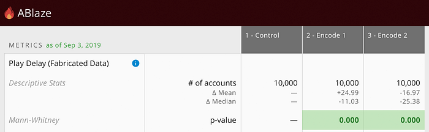
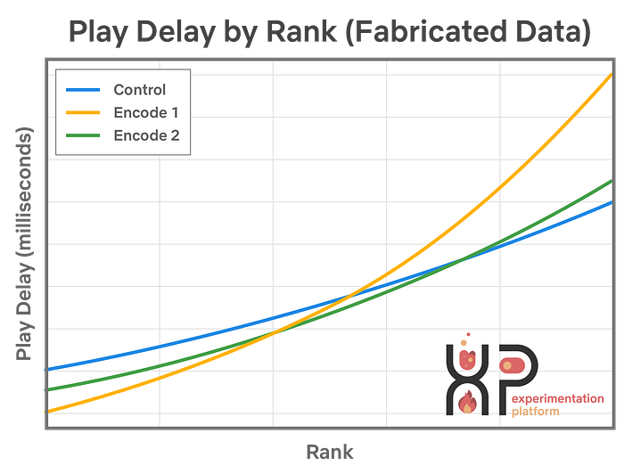
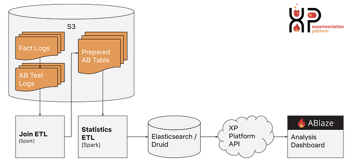
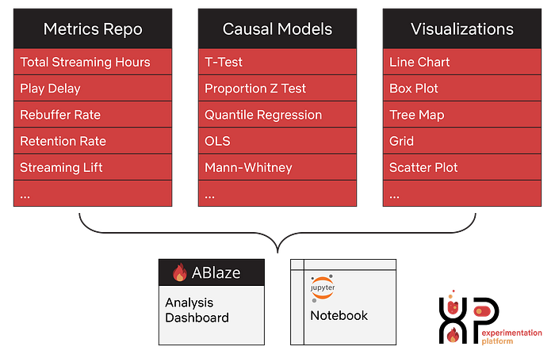
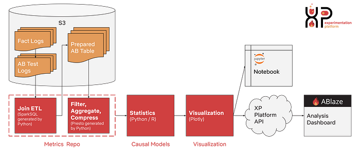
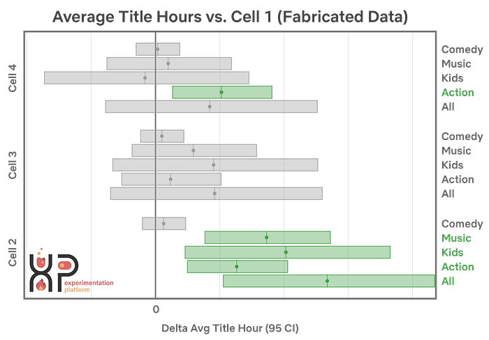
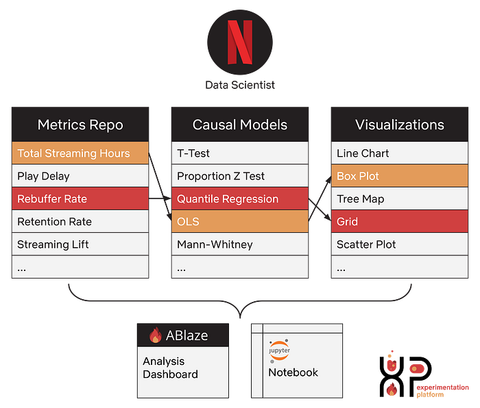

# Reimagining Experimentation Analysis at Netflix

[_Toby Mao_](https://www.linkedin.com/in/toby-mao/)_, _[_Sri Sri Perangur_](https://www.linkedin.com/in/perangur/)_, _[_Colin McFarland_](https://www.linkedin.com/in/mcfrl/)

Another day, another custom script to analyze an A/B test. Maybe you’ve done this before and have an old script lying around. If it’s new, it’s probably going to take some time to set up, right? Not at Netflix.

*ABlaze: The standard view of analyses in the XP UI*

Suppose you’re running a new [video encoding test](https://medium.com/netflix-techblog/more-efficient-mobile-encodes-for-netflix-downloads-625d7b082909) and theorize that the two new encodes should reduce play delay, a metric describing how long it takes for a video to play after you press the start button. You can look at [ABlaze](https://medium.com/netflix-techblog/its-all-a-bout-testing-the-netflix-experimentation-platform-4e1ca458c15) (our centralized A/B testing platform) and take a quick look at how it’s performing.

*Simulated dataset that shows what the distribution of play delay may look like. Note that the new encodes perform well in the lower quantiles but worse in the higher ones*

You notice that the first new encode (Cell 2 — Encode 1) increased the mean of the play delay but decreased the median!

After recreating the dataset, you can plot the raw numbers and perform custom analyses to understand the distribution of the data across test cells.

With our new platform for experimentation analysis, it’s easy for scientists to perfectly recreate analyses on their laptops in a notebook. They can then choose from a library of statistics and visualizations or contribute their own to get a deeper understanding of the metrics.

*Extending the same view of ABlaze with other contributed models and visualizations*

## Why it Matters

Netflix runs on an A/B testing culture: nearly every decision we make about our product and business is guided by member behavior observed in test. At any point a Netflix user is in many different A/B tests orchestrated through ABlaze. This enables us to optimize their experience at speed. Our A/B tests range across UI, algorithms, messaging, marketing, operations, and infrastructure changes. A user might be in a [title artwork test](https://medium.com/netflix-techblog/selecting-the-best-artwork-for-videos-through-a-b-testing-f6155c4595f6), [personalization algorithm test](https://medium.com/netflix-techblog/interleaving-in-online-experiments-at-netflix-a04ee392ec55), [or a video encoding testing](https://www.streamingmedia.com/Articles/Editorial/Short-Cuts/Video-How-Netflix-Optimized-Encoding-Quality-for-Jessica-Jones-125106.aspx?CategoryID=430), or all three at the same time.

The analysis reports tell us whether or not a new experience made statistically significant changes to relevant metrics, such as member behavior, or technical metrics that describe streaming video quality. However, the default reports only provide a summary view of the data with some powerful but limited filtering options. Our data scientists often want to apply their knowledge of the business and statistics to fully understand the outcome of an experiment.

> ****Instead of relying on engineers to productionize scientific contributions, we’ve made a ******[**strategic bet**](https://medium.com/netflix-techblog/design-principles-for-mathematical-engineering-in-experimentation-platform-15b3ea143b1f)****** to build an architecture that enables data scientists to easily contribute.****

The two main challenges with this approach are establishing an easy contribution framework and handling Netflix’s scale of data. When dealing with ‘big data’, it’s common to perform computation on frameworks like [Apache Spark](https://spark.apache.org/) or [Map Reduce](https://en.wikipedia.org/wiki/MapReduce). In order to reduce the learning curve of contributing analyses, we’ve decided to take an alternative path by performing all of our analyses on one machine. Due to compression and high performance computing, scientists can analyze billions of rows of raw data on their laptops using languages and statistical libraries they are familiar with like Python and R.

## Challenges with Pre-existing Infrastructure

Netflix’s well-known experimentation culture was fueled by our previous infrastructure: an optimized framework that scaled to the wide variety of use cases across Netflix. But as our experimentation culture grew, so too did our product areas, users, and ambitions around more sophisticated methodology on measurement.

Our data scientists faced numerous challenges in our previous infrastructure. Complex business logic was embedded directly into the [ETL](https://en.wikipedia.org/wiki/Extract,_transform,_load) pipelines by data engineers. In order to replicate results, scientists had to delve deep into the data, code, and documentation. Due to Netflix’s scale of over 150 million subscribers, scientists also frequently encountered issues while fetching data and performing custom statistical models in Python or R.

To offer new methods to the community and overcome any existing engineering barriers, scientists would have to run custom scripts outside of the centralized platform. Heavily used or high value scripts were sometimes converted into [Shiny apps](https://shiny.rstudio.com/), allowing easy access to these novel features. However, because these apps lived separately from the platform, they could be difficult to maintain as the underlying data and platform evolved. Also, since these apps were generally written for specific use cases, they were difficult to generalize and graduate back into the platform.

Our scientists come from many backgrounds, such as neuroscience, biostatistics, economics, and physics; each of these backgrounds has a meaningful contribution to how experiments should be analyzed. Instead of spending their time wrangling data and conducting the same ad-hoc analyses multiple times, we would like our data scientists to focus on contributing new and innovative techniques for analyzing tests, such as [Interleaving](https://medium.com/netflix-techblog/interleaving-in-online-experiments-at-netflix-a04ee392ec55), [Quantile Bootstrapping](https://medium.com/netflix-techblog/streaming-video-experimentation-at-netflix-visualizing-practical-and-statistical-significance-7117420f4e9a), [Quasi Experiments](https://medium.com/netflix-techblog/quasi-experimentation-at-netflix-566b57d2e362), Quantile Regression, and Heterogeneous Treatment Effects. Additionally, as these new techniques are contributed, we want them to be effortlessly leveraged across the Netflix experimentation community.

*Previous XP architecture: all systems are engineering-owned and not easily introspectable*

## Reimagining our Infrastructure: Democratization Across 3 Tracks

We are reimagining new infrastructure that makes the scientific development experience better. We’ve chosen to break down the contribution framework into 3 steps.

1. Getting Data with the Metrics Repo  
2. Computing Statistics with Causal Models  
3. Rendering Visualizations with Plotly

*Democratization across 3 tracks: Metrics, Stats, Viz*

The new architecture employs a modular design that permits data scientists to contribute using SQL, Python, and R, the tools of their trade. Users can contribute metrics and methods directly, without needing to master data engineering tools. We’ve also made sure that both production and local workflows use the same code base, so reproducibility is a given and promotion to production is just a pull request away.

*New XP architecture: Systems highlighted in red are introspectable and contributable by data scientists*

## Getting data with Metrics Repo

Metrics Repo is an in-house Python framework where users define programmatically generated SQL queries and metric definitions. It centralizes metrics definitions which used to be scattered across many teams. Previously, many teams at Netflix had their own pipelines to calculate success metrics which caused a lot of fragmentation and discrepancies in calculations.

A key design decision of Metrics Repo is that it moves the last mile of metric computation away from engineering owned ETL pipelines into dynamically generated SQL. This allows scientists to add metrics and join arbitrary tables. The new architecture is much more flexible compared to the previous Spark based jobs. Views of reports are only calculated on demand and take a couple minutes to execute, so there are no migrations or backfills when making changes or updates to metrics. Adding a new metric is as easy as adding a new field or joining a different table in SQL. By leveraging [PyPika](https://github.com/kayak/pypika), we represent each table as a Python class that can be customized with filters and additional joins. The code is self documenting and serializes to JSON so it can be easily exposed as an API.

## Calculating Statistics with Causal Models

Causal Models is an in-house Python library that allows scientists to contribute generic models for causal inference. Previously, the centralized platform only had T-Test and Mann-Whitney while advanced statistical tests were only available via scripts or Shiny apps. Scientists can now add their statistical models by overriding two functions in a model subclass. Many of the models are simple wrappers over [Scipy](https://www.scipy.org/), but it’s flexible enough to do arbitrarily complex calculations. The library also provides helper methods which abstract accessing compressed or raw data. We use [rpy2](https://rpy2.bitbucket.io/) so that models can be written in either R or Python.

We do not want data scientists to have to go outside of their comfort zone by writing Spark Scala or Map Reduce jobs. We also want to leverage the large ecosystem of statistical libraries written in Python and R. However, many analyses have raw datasets that don’t fit on one machine. So, we’ve implemented an optional compression layer that drastically reduces the size of the data. Depending on the statistic, the compression can be either lossless or tunably lossy. Additionally, we’ve structured the API so that model implementors don’t need to distinguish between compressed and uncompressed data. When contributing a new statistical test, the data scientist only needs to think about one comparison computation at a time. We take the functions that they’ve written and parallelize it for them through multi-processing.

Sometimes statistical models are expensive to run even on compressed data. It can be difficult to efficiently perform linear algebra operations in native Python or R. In those cases, our mathematical engineering team writes custom C++ in order to speed through those bottlenecks. Our scientists can then reference them easily in Python via [pybind11](https://github.com/pybind/pybind11) or in R via [Rcpp](http://www.rcpp.org/).

As a result, innovative methods like Quantile Bootstrapping and OLS with heterogeneous effects are no longer confined to un-versioned controlled notebooks/scripts. The barrier to entry is very low to develop on the production system and sharing methods across metrics and business areas is effortless.

## Rendering Visualizations with Plotly

In the old model, visualizations in the experimentation platform were created by UI engineers in React. The new architecture is still based on React, but we allow data scientists to contribute arbitrary graphs and plots using [Plotly](https://plot.ly/). We chose to use Plotly because it has a JSON specification that is implemented in many different frameworks and languages, including R and Python. Scientists can pick and choose from a wide variety of pre-made visualizations or create their own for others to use.

*This work kickstarted an initiative called Netflix Vizkit to create a cross-library shared design that lowers the barrier for a unified look and feel in contributions.*

Many scientists at Netflix primarily use [notebooks](https://medium.com/netflix-techblog/notebook-innovation-591ee3221233) for day to day development, so we wanted to make sure they could perform A/B test analysis on them as well. To ensure that the analysis shown in ABlaze can be replicated in a notebook, with e run the exact same code in both environments, even the visualizations!

Now scientists can easily introspect the data and extend it in an ad-hoc analysis. They can develop new metrics, statistical models, and visualizations in their notebooks and contribute it to the platform knowing the results will be identical because their exact code will be running in production. As a result, anyone at Netflix looking at ABlaze can now view these new contributions when looking at test analyses.

*XP: Combining contributions into analyses*

## Next Steps

We aim to accelerate research in causal inference methodology, expedite product innovation, and ultimately delight our members. We’re looking forward to enhancing our frameworks to tackle experimentation automation. This is an ongoing journey. If you are passionate about the field, we have opportunities to [join our dream team](https://research.netflix.com/research-area/machine-learning-platform)!

---
**Tags:** Experimentation · Data Science · Causal Inference
