# Reinforcement Learning for Budget Constrained Recommendations

_by _[_Ehtsham Elahi_](https://www.linkedin.com/in/ehtshamelahi/)_  
with _[_James McInerney_](https://www.linkedin.com/in/jemcinerney/)_, _[_Nathan Kallus_](https://www.linkedin.com/in/kallus/)_, _[_Dario Garcia Garcia_](https://www.linkedin.com/in/dar%C3%ADo-garc%C3%ADa-garc%C3%ADa-885b04a/)_ and _[_Justin Basilico_](https://www.linkedin.com/in/jbasilico/)

## Introduction

This writeup is about using reinforcement learning to construct an optimal list of recommendations when the **user has a finite time budget to make a decision from the list of recommendations**. Working within the time budget introduces an extra resource constraint for the recommender system. It is similar to many other decision problems (for e.g. in economics and operations research) where the entity making the decision has to find tradeoffs in the face of finite resources and multiple (possibly conflicting) objectives. Although time is the most important and finite resource, we think that it is an often ignored aspect of recommendation problems.

In addition to relevance of the recommendations, time budget also determines whether users will accept a recommendation or abandon their search. Consider the scenario that a user comes to the Netflix homepage looking for something to watch. The Netflix homepage provides a large number of recommendations and the user has to evaluate them to choose what to play. The evaluation process may include trying to recognize the show from its box art, watching trailers, reading its synopsis or in some cases reading reviews for the show on some external website. This evaluation process incurs a cost that can be measured in units of time. Different shows will require different amounts of evaluation time. If it’s a popular show like Stranger Things then the user may already be aware of it and may incur very little cost before choosing to play it. Given the limited time budget, the recommendation model should construct a slate of recommendations by considering both the relevance of the items to the user and their evaluation cost. Balancing both of these aspects can be difficult as a highly relevant item may have a much higher evaluation cost and it may not fit within the user’s time budget. Having a successful slate therefore depends on the user’s time budget, relevance of each item as well as their evaluation cost. The goal for the recommendation algorithm therefore is to construct slates that have a higher chance of engagement from the user with a finite time budget. It is important to point out that the user’s time budget, like their preferences, may not be directly observable and the recommender system may have to learn that in addition to the user’s latent preferences.

## A typical slate recommender system

We are interested in settings where the user is presented with a slate of recommendations. Many recommender systems rely on a bandit style approach to slate construction. A bandit recommender system constructing a slate of _K _items may look like the following:

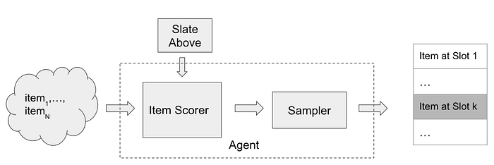
*A bandit style recommender system for slate construction*

To insert an element at slot _k _in the slate, the item scorer scores all of the available _N _items and may make use of the slate constructed so far (slate above) as additional context. The scores are then passed through a sampler (e.g. Epsilon-Greedy) to select an item from the available items. The item scorer and the sampling step are the main components of the recommender system.

## Problem formulation

Let’s make the problem of budget constrained recommendations more concrete by considering the following (simplified) setting. The recommender system presents a one dimensional slate (a list) of _K_ items and the user examines the slate sequentially from top to bottom.

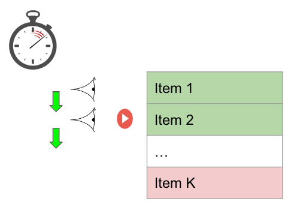
*A user with a fixed time budget evaluating a slate of recommendations with K items. Item 2 gets the click/response from the user. The item shaded in red falls outside of the user’s time budget.*

The user has a time budget which is some positive real valued number. Let’s assume that each item has two features, relevance (a scalar, higher value of relevance means that the item is more relevant) and cost (measured in a unit of time). Evaluating each recommendation consumes from the user’s time budget and the user can no longer browse the slate once the time budget has exhausted. For each item examined, the user makes a probabilistic decision to consume the recommendation by flipping a coin with probability of success proportional to the relevance of the video. Since we want to model the user’s probability of consumption using the relevance feature, it is helpful to think of relevance as a probability directly (between 0 and 1). Clearly the probability to choose _something_ from the slate of recommendations is dependent not only on the relevance of the items but also on the number of items the user is able to examine. **A recommendation system trying to maximize the user’s engagement with the slate ****_needs to pack in as many relevant items as possible within the user budget, by making a trade-off between relevance and cost_****.**

## Connection with the 0/1 Knapsack problem

Let’s look at it from another perspective. Consider the following definitions for the slate recommendation problem described above

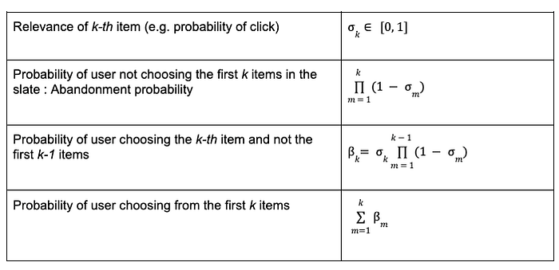

Clearly the abandonment probability is small if the items are highly relevant (high relevance) or the list is long (since the abandonment probability is a product of probabilities). The abandonment option is sometimes referred to as the null choice/arm in bandit literature.

This problem has clear connections with the 0/1 Knapsack problem in theoretical computer science. The goal is to find the subset of items with the highest total utility such that the total cost of the subset is not greater than the user budget. If β_i and c_i are the utility and cost of the _i-th_ item and _u _is the user budget, then the budget constrained recommendations can be formulated as

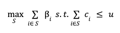
*0/1 Knapsack formulation for Budget constrained recommendations*

There is an additional requirement that optimal subset _S _be sorted in descending order according to the relevance of items in the subset.

The 0/1 Knapsack problem is a well studied problem and is known to be NP-Complete. There are many approximate solutions to the 0/1 Knapsack problem. In this writeup, we propose to model the budget constrained recommendation problem as a Markov Decision process and use algorithms from reinforcement learning (RL) to find a solution. It will become clear that the RL based solution to budget constrained recommendation problems fits well within the recommender system architecture for slate construction. To begin, we first model the budget constrained recommendation problem as a Markov Decision Process.

## Budget constrained recommendations as a Markov Decision Process

In a Markov decision process, the key component is the state evolution of the environment as a function of the current state and the action taken by the agent. In the MDP formulation of this problem, the agent is the recommender system and the environment is the user interacting with the recommender system. The agent constructs a slate of _K_ items by repeatedly selecting actions it deems appropriate at each slot in the slate. The state of the environment/user is characterized by the available time budget and the items examined in the slate at a particular step in the slate browsing process. Specifically, the following table defines the Markov Decision Process for the budget constrained recommendation problem,

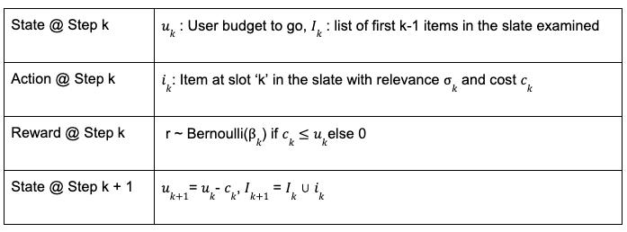
*Markov Decision Process for Budget constrained recommendations*

In real world recommender systems, the user budget may not be observable. This problem can be solved by computing an estimate of the user budget from historical data (e.g. how long the user scrolled before abandoning in the historical data logs). In this writeup, we assume that the recommender system/agent has access to the user budget for sake of simplicity.

The slate generation task above is an episodic task i-e the recommender agent is tasked with choosing _K _items in the slate. The user provides feedback by choosing one or zero items from the slate. This can be viewed as a binary reward _r_ per item in the slate. Let π be the recommender policy generating the slate and γ be the reward discount factor, we can then define the discounted return for each state, action pair as,

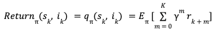

## State, Action Value function estimation

The reinforcement learning algorithm we employ is based on estimating this return using a model. Specifically, we use Temporal Difference learning TD(0) to estimate the value function. Temporal difference learning uses Bellman’s equation to define the value function of current state and action in terms of value function of future state and action.

*Bellman’s equation for state, action value function*

Based on this Bellman’s equation, a squared loss for TD-Learning is,

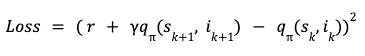
*Loss Function for TD(0) Learning*

The loss function can be minimized using semi-gradient based methods. Once we have a model for _q_, we can use that as the item scorer in the above slate recommender system architecture. If the discount factor γ =0, the return for each (state, action) pair is simply the immediate user feedback _r_. Therefore _q_ with γ = 0 corresponds to an item scorer for a contextual bandit agent whereas for γ > 0, the recommender corresponds to a (value function based) RL agent. Therefore simply using the model for the value function as the item scorer in the above system architecture makes it very easy to use an RL based solution.

## Budget constrained Recommendation Simulation

As in other applications of RL, we find simulations to be a helpful tool for studying this problem. Below we describe the generative process for the simulation data,

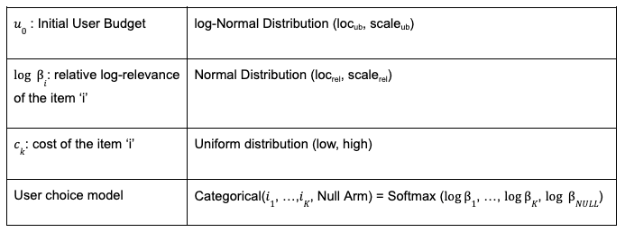
*Generative model for simulated data*

Note that, instead of sampling the per-item Bernoulli, we can alternatively sample once from a categorical distribution with relative relevances for items and a fixed weight for the null arm. The above generative process for simulated data depends on many hyper-parameters (loc, scale etc.). Each setting of these hyper-parameters results in a different simulated dataset and it’s easy to realize many simulated datasets in parallel. For the experiments below, we fix the hyper-parameters for the cost and relevance distributions and sweep over the initial user budget distribution’s location parameter. The attached notebook contains the exact settings of the hyper-parameters used for the simulations.

## Metric

A slate recommendation algorithm generates slates and then the user model is used to predict the success/failure of each slate. Given the simulation data, we can train various recommendation algorithms and compare their performance using a simple metric as the average number of successes of the generated slates (referred to as play-rate below). In addition to play-rate, we look at the effective-slate-size as well, which we define to be the number of items in the slate that fit the user’s time budget. As mentioned earlier, one of the ways play-rate can be improved is by constructing larger effective slates (with relevant items of-course) so looking at this metric helps understand the mechanism of the recommendation algorithms.

## On-policy learning results

Given the flexibility of working in the simulation setting, we can learn to construct optimal slates in an on-policy manner. For this, we start with some initial random model for the value function, generate slates from it, get user feedback (using the user model) and then update the value function model using the feedback and keep repeating this loop until the value function model converges. This is known as the SARSA algorithm.

The following set of results show how the learned recommender policies behave in terms of metric of success, play-rate for different settings of the user budget distributions’s location parameter and the discount factor. In addition to the play rate, we also show the effective slate size, average number of items that fit within the user budget. While the play rate changes are statistically insignificant (the shaded areas are the 95% confidence intervals estimated using bootstrapping simulations 100 times), we see a clear trend in the increase in the effective slate size (γ > 0) compared to the contextual bandit (γ= 0)

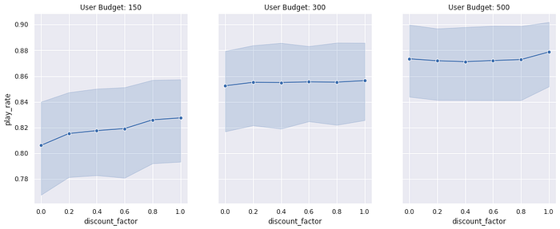

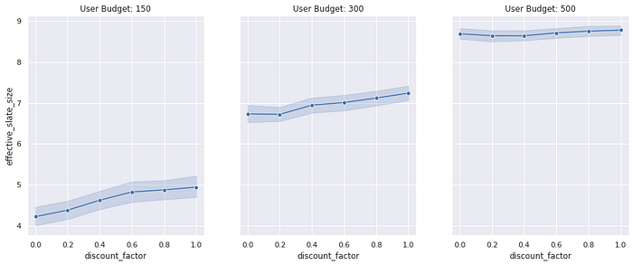
*Play-Rate and Effective slate sizes for different User Budget distributions. The user budget distribution’s location is on the same scale of the item cost and we are looking for changes in the metrics as we make changes to the user budget distribution*

We can actually get a more statistically sensitive result by comparing the result of the contextual bandit with an RL model for each simulation setting (similar to a paired comparison in paired t-test). Below we show the change in play rate (delta play rate) between any RL model (shown with γ = 0.8 below as an example) and a contextual bandit (γ = 0). We compare the change in this metric for different user budget distributions. By performing this paired comparison, we see a statistically significant lift in play rate for small to medium budget user budget ranges. This makes intuitive sense as we would expect both approaches to work equally well when the user budget is too large (therefore the item’s cost is irrelevant) and the RL algorithm only outperforms the contextual bandit when the user budget is limited and finding the trade-off between relevance and cost is important. The increase in the effective slate size is even more dramatic. This result clearly shows that the RL agent is performing better by minimizing the abandonment probability by packing more items within the user budget.

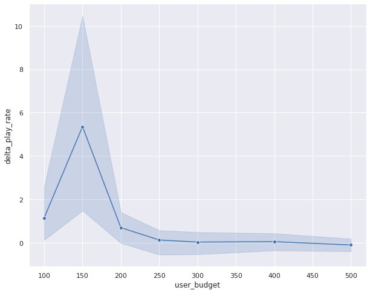

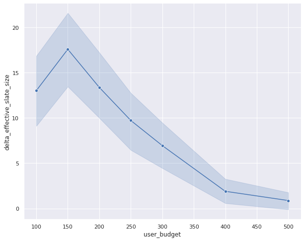
*Paired comparison between RL and Contextual bandit. For limited user budget settings, we see statistically significant lift in play rate for the RL algorithm.*

## Off-policy learning results

So far the results have shown that in the budget constrained setting, reinforcement learning outperforms contextual bandit. These results have been for the on-policy learning setting which is very easy to simulate but difficult to execute in realistic recommender settings. In a realistic recommender, we have data generated by a different policy (called a behavior policy) and we want to learn a new and better policy from this data (called the target policy). This is called the off-policy setting. Q-Learning is one well known technique that allows us to learn optimal value function in an off-policy setting. The loss function for Q-Learning is very similar to the TD(0) loss except that it uses Bellman’s optimality equation instead

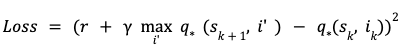
*Loss function for Q-Learning*

This loss can again be minimized using semi-gradient techniques. We estimate the optimal value function using Q-Learning and compare its performance with the optimal policy learned using the on-policy SARSA setup. For this, we generate slates using Q-Learning based optimal value function model and compare the play-rate with the slates generated using the optimal policy learned with SARSA. Below is result of the paired comparison between SARSA and Q-Learning,

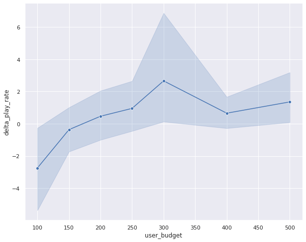

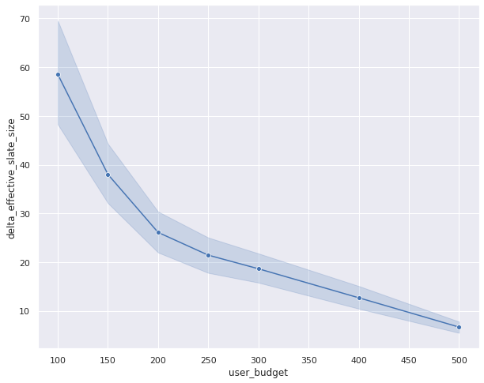
*Paired comparison between Q-Learning and SARSA. Play rates are similar between the two approaches but effective slate sizes are very different.*

In this result, the change in the play-rate between on-policy and off-policy models is close to zero (see the error bars crossing the zero-axis). This is a favorable result as this shows that Q-Learning results in similar performance as the on-policy algorithm. However, the effective slate size is quite different between Q-Learning and SARSA. Q-Learning seems to be generating very large effective slate sizes without much difference in the play rate. This is an intriguing result and needs a little more investigation to fully uncover. We hope to spend more time understanding this result in future.

## Conclusion:

To conclude, in this writeup we presented the budget constrained recommendation problem and showed that in order to generate slates with higher chances of success, a recommender system has to balance both the relevance and cost of items so that more of the slate fits within the user’s time budget. We showed that the problem of budget constrained recommendation can be modeled as a Markov Decision Process and we can find a solution to optimal slate construction under budget constraints using reinforcement learning based methods. We showed that the RL outperforms contextual bandits in this problem setting. Moreover, we compared the performance of On-policy and Off-policy approaches and found the results to be comparable in terms of metrics of success.

## Code

[Github repo](https://github.com/Netflix-Skunkworks/rl_for_budget_constrained_recs)

---
**Tags:** Reinforcement Learning · Recommendation System
