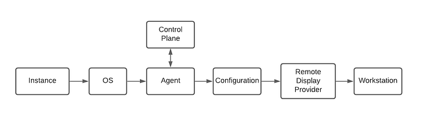
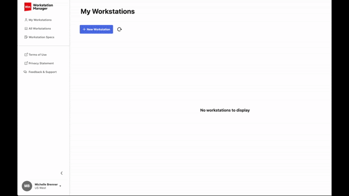

# Remote Workstations for the Discerning Artists

By [Michelle Brenner](https://www.linkedin.com/in/michellebrenner/)

Netflix is poised to become the world’s most prolific producer of visual effects and original animated content. To meet that demand, we need to attract the world’s best artistic talent. Artists like to work at places where they can create groundbreaking entertainment instead of worrying about getting access to the software or source files they need. To meet this need, the Studio Infrastructure team has created Netflix Workstations.

Netflix Workstations are remote workstations that allow content creators to get to work wherever they are. **As an engineer, I can work anywhere with a standard laptop as long as I have an IDE and access to Stack Overflow.** However, the artists creating stunning visual effects and animations for Netflix Originals need more than that. They need specialized hardware, access to petabytes of images, and digital content creation applications with controlled licenses.

Historically artists had these machines built for them at their desks and only had access to the data and applications when they were in the office. With global demand for talent skyrocketing, we want the flexibility to hire anyone, anywhere. One of our first partners for the Netflix Workstations is [NetFX](./empowering-the-visual-effects-community-with-the-netfx-platform-35fdf604909c.md), a cloud-based VFX platform that enables artists and creators worldwide to collaborate on Netflix VFX content.

Now that you know why, here is how we did it. Below is a broad technical overview of how to go from an AWS instance to a Netflix Workstation.



## Machine Configuration: Spinnaker

Starting at the left of the chart, [Spinnaker](https://spinnaker.io/) is an open-source platform that controls the creation of workstation pools. Spinnaker uses “pipelines” as instructions for creating the pools. An API in conjunction with variables in the pipeline creates Workstation pools programmatically. Artists need many components to be customized. They could need a GPU when doing graphics-intensive work or extra large storage to handle file management. Some artists needed Centos 7 to support their compositing software, while others required Windows to use their pre-visualization software. To minimize lag, the workstations need to be as close to the artist as possible, so we support a growing list of regions and zones.

Initially, we created big pools of workstations that only had the OS and a few internal tools. When the artist requested a workstation, all software was installed just-in-time. That led to long wait times and unhappy artists. Most artists were requesting a handful of standard configurations and did not need maximum flexibility. Instead, we created a service to take the most popular configurations and cache them. Now, artists can get a new workstation in seconds.

## Software Configuration: Salt

Today, there are ~100 different packages that can configure a workstation, from installing software to editing a registry. How did we get here? We needed a system that could manage hundreds to one-day thousands of workstations. It needed to be extremely flexible while easy to jump in and create new packages. That is where [SaltStack](https://www.saltstack.com/) comes in. We use Salt to make operating system agnostic declarative statements about how to configure a workstation. It has many built-in modules, from installing a package to editing the registry. It also allows for logic statements to handle situations such as mount this storage in this environment only or only run this script if this file does not exist.

This salt formula example is the equivalent of running a “yum install sis-lighting-10_1” in the terminal.

```
centos7_lighting_install:
    pkg.installed:
        - name: sis-lighting-10_1
```

## Artist Experience

We want the artists to be able to start their workday quickly. They simply select a previously created configuration, wait a few seconds to prepare, and jump right in via their browser.



While this is the quickest way to get started, there are a few remote display options. The artist can use the browser to see the desktop, as shown, or application streaming. Application streaming simplifies the experience to the single artist tool they need. They could also skip the browser and use a native client on their desktop.

As with any new technology, the experience is not always bug-free. With our front-line support teams’ help, we are responsible for monitoring and quickly fixing any artists’ issues. We rely on our internal partner teams to support components installed on the workstation, such as storage and artist tools. They depend on us to provide observability into a workstation. Part of that is being able to track a workstation’s lifecycle.

A gRPC Java Spring Boot control plane and a Golang agent manages and reports on the lifecycle. The lifecycle has many steps, but they fall into three main categories: before login, the artist is working, and the artist is done. Before login, we use Spinnaker & Salt to configure and have free rein to make all necessary changes. While the artist uses the workstation, we track the health but avoid making changes that could disrupt their work. We recommend that artists get new workstations frequently to have the latest updates, but we can use Salt to deploy quick fixes if necessary.

## Looking Ahead

We’ve made it easier for artists to create content remotely. However, we are only at the beginning of creating on-demand, secure, self-service remote workstations. We are looking to the future where Netflix Workstations are a platform for technical artists to make their own configurations. Where we can gather and analyze the usage data to create efficiencies and automation. Where an artist anywhere in the world can focus on their art and not on their commute. There is more work to be done, and if you want to be a part of it, [we are growing](https://jobs.netflix.com/jobs/55231330)!

---
**Tags:** Infrastructure · Remote Working · Spinnaker · Saltstack
