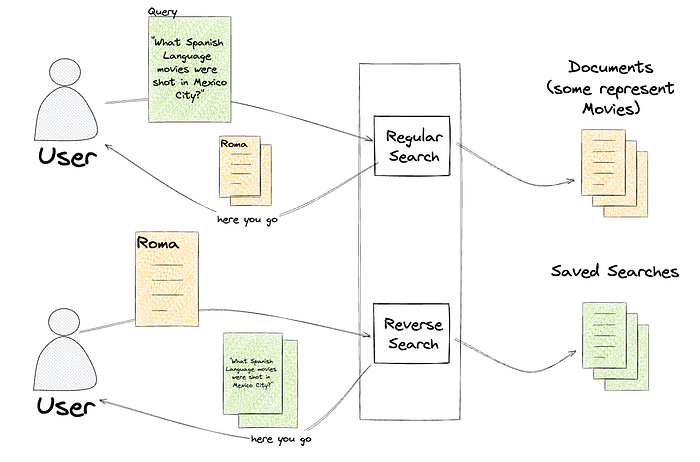
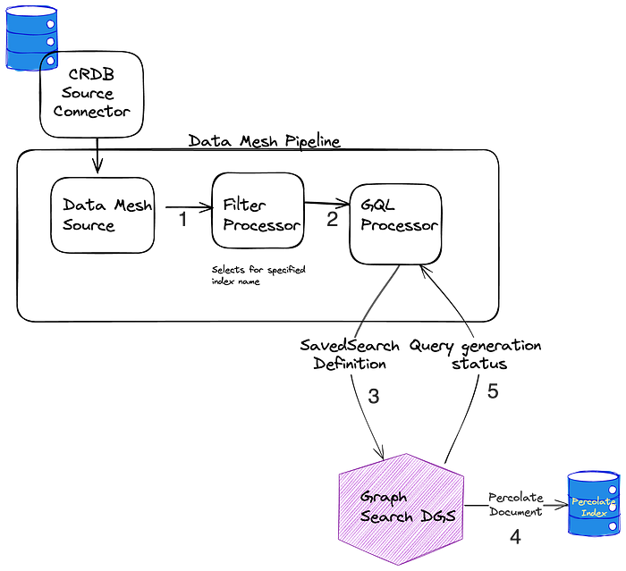

# Reverse Searching Netflix’s Federated Graph

By [Ricky Gardiner](https://www.linkedin.com/in/rickygardiner/), [Alex Hutter](https://www.linkedin.com/in/ahutter/), [Damir Svrtan](https://www.linkedin.com/in/damir-svrtan/) and [Katie Lefevre](https://www.linkedin.com/in/katielefevre/)

Since our previous posts regarding Content Engineering’s role in enabling search functionality within Netflix’s federated graph ([the first post](./how-netflix-content-engineering-makes-a-federated-graph-searchable-5c0c1c7d7eaf.md), where we identify the issue and elaborate on the indexing architecture, and [the second post](./how-netflix-content-engineering-makes-a-federated-graph-searchable-part-2-49348511c06c.md), where we detail how we facilitate querying) there have been significant developments. We’ve opened up Studio Search beyond Content Engineering to the entirety of the Engineering organization at Netflix and renamed it Graph Search. There are over 100 applications integrated with Graph Search and nearly 50 indices we support. We continue to add functionality to the service. As promised in the previous post, we’ll share how we partnered with one of our Studio Engineering teams to build reverse search. Reverse search inverts the standard querying pattern: rather than finding documents that match a query, it finds queries that match a document.

## Intro

Tiffany is a Netflix Post Production Coordinator who oversees a slate of nearly a dozen movies in various states of pre-production, production, and post-production. Tiffany and her team work with various cross-functional partners, including Legal, Creative, and Title Launch Management, tracking the progression and health of her movies.

So Tiffany subscribes to notifications and calendar updates specific to certain areas of concern, like “movies shooting in Mexico City which don’t have a key role assigned”, or “movies that are at risk of not being ready by their launch date”.

**_Tiffany is not subscribing to updates of particular movies, but subscribing to queries that return a dynamic subset of movies. _This poses an issue for those of us responsible for sending her those notifications. When a movie changes, we don’t know who to notify, since there’s no association between employees and the movies they’re interested in.**

We could save these searches, and then repeatedly query for the results of every search, but because we’re part of a large federated graph, this would have heavy traffic implications for every service we’re connected to. We’d have to decide if we wanted timely notifications or less load on our graph.

If we could answer the question “would this movie be returned by this query”, we could re-query based on change events with laser precision and not impact the broader ecosystem.

## The Solution

Graph Search is built on top of Elasticsearch, which has the exact capabilities we require:

- [percolator fields](https://www.elastic.co/guide/en/elasticsearch/reference/current/percolator.html#:~:text=The%20percolator%20field%20type%20parses,to%20be%20a%20percolator%20field.) that can be used to index Elasticsearch queries
- [percolate queries](https://www.elastic.co/guide/en/elasticsearch/reference/current/query-dsl-percolate-query.html) that can be used to determine which indexed queries match an input document.



Instead of taking a search (like “spanish-language movies shot in Mexico City”) and returning the documents that match (One for Roma, one for Familia), a percolate query takes a document (one for Roma) and returns the searches that match that document, like “spanish-language movies” and “scripted dramas”.

We’ve communicated this functionality as the ability to save a search, called `SavedSearches`, which is a persisted filter on an existing index.

```
type SavedSearch {
  id: ID!
  filter: String
  index: SearchIndex!
}
```

That filter, written in Graph Search DSL, is converted to an Elasticsearch query and indexed in a percolator field. To learn more about Graph Search DSL and why we created it rather than using Elasticsearch query language directly, [see the Query Language section of “How Netflix Content Engineering makes a federated graph searchable (Part 2)”](./how-netflix-content-engineering-makes-a-federated-graph-searchable-part-2-49348511c06c.md).

We’ve called the process of finding matching saved searches `ReverseSearch`. This is the most straightforward part of this offering. We added a new resolver to the [Domain Graph Service](./how-netflix-scales-its-api-with-graphql-federation-part-1-ae3557c187e2.md) (DGS) for Graph Search. It takes the index of interest and a document, and returns all the saved searches that match the document by issuing a percolate query.

```
"""
Query for retrieving all the registered saved searches, in a given index,
based on a provided document. The document in this case is an ElasticSearch
document that is generated based on the configuration of the index.
"""
reverseSearch(
  after: String,
  document: JSON!,
  first: Int!,
  index: SearchIndex!): SavedSearchConnection
```

Persisting a `SavedSearch` is implemented as a new mutation on the Graph Search DGS. This ultimately triggers the indexing of an Elasticsearch query in a percolator field.

```
"""
Mutation for registering and updating a saved search. They need to be updated
any time a user adjusts their search criteria.
"""
upsertSavedSearch(input: UpsertSavedSearchInput!): UpsertSavedSearchPayload
```

Supporting percolator fields fundamentally changed how we provision the indexing pipelines for Graph Search ([see Architecture section of How Netflix Content Engineering makes a federated graph searchable)](./how-netflix-content-engineering-makes-a-federated-graph-searchable-5c0c1c7d7eaf.md). Rather than having a single indexing pipeline per Graph Search index we now have two: one to index documents and one to index saved searches to a percolate index. We chose to add percolator fields to a separate index in order to tune performance for the two types of queries separately.

Elasticsearch requires the percolate index to have a mapping that matches the structure of the queries it stores and therefore must match the mapping of the document index. Index templates define mappings that are applied when creating new indices. By using the [index_patterns](https://www.elastic.co/guide/en/elasticsearch/reference/current/indices-templates-v1.html#put-index-template-v1-api-request-body) functionality of index templates, we’re able to share the mapping for the document index between the two. index_patterns also gives us an easy way to add a percolator field to every percolate index we create.

**Example of document index mapping**

**Index pattern — application_***

```
{
  "order": 1,
  "index_patterns": ["application_*"],
  "mappings": {
  "properties": {
    "movieTitle": {
      "type": "keyword"
    },
    "isArchived": {
      "type": "boolean"
    }
  }
}
```

**Example of percolate index mappings**

**Index pattern — *_percolate**

```
{
  "order": 2,
  "index_patterns": ["*_percolate*"],
  "mappings": {
    "properties": {
      "percolate_query": {
        "type": "percolator"
      }
    }
  }
}
```

**Example of generated mapping**

**Percolate index name is application_v1_percolate**

```
{
  "application_v1_percolate": {
    "mappings": {
      "_doc": {
        "properties": {
          "movieTitle": {
            "type": "keyword"
          },
          "isArchived": {
            "type": "boolean"
          },
          "percolate_query": {
            "type": "percolator"
          }
        }
      }
    }
  }
}
```

## Percolate Indexing Pipeline

The percolate index isn’t as simple as taking the input from the GraphQL mutation, translating it to an Elasticsearch query, and indexing it. Versioning, which we’ll talk more about shortly, reared its ugly head and made things a bit more complicated. Here is the way the percolate indexing pipeline is set up.


*See Data Mesh — A Data Movement and Processing Platform @ Netflix to learn more about Data Mesh.*

1. When `SavedSearches` are modified, we store them in our CockroachDB, and the source connector for the Cockroach database emits CDC events.
2. A single table is shared for the storage of all `SavedSearches`, so the next step is filtering down to just those that are for *this* index using a filter processor.
3. As previously mentioned, what is stored in the database is our custom Graph Search filter DSL, which is not the same as the Elasticsearch DSL, so we cannot directly index the event to the percolate index. Instead, we issue a mutation to the Graph Search DGS. The Graph Search DGS translates the DSL to an Elasticsearch query.
4. Then we index the Elasticsearch query as a percolate field in the appropriate percolate index.
5. The success or failure of the indexing of the `SavedSearch` is returned. On failure, the `SavedSearch` events are sent to a Dead Letter Queue (DLQ) that can be used to address any failures, such as fields referenced in the search query being removed from the index.

Now a bit on versioning to explain why the above is necessary. Imagine we’ve started tagging movies that have animals. If we want users to be able to create views of “movies with animals”, we need to add this new field to the existing search index to flag movies as such. However, the mapping in the current index doesn’t include it, so we can’t filter on it. To solve for this we have index versions.


*Dalia & Forrest from the series Baby Animal Cam*

When a change is made to an index definition that necessitates a new mapping, like when we add the animal tag, Graph Search creates a new version of the Elasticsearch index and a new pipeline to populate it. This new pipeline reads from a log-compacted Kafka topic in Data Mesh — this is how we can reindex the entire corpus without asking the data sources to resend all the old events. The new pipeline and the old pipeline run side by side, until the new pipeline has processed the backlog, at which point Graph Search cuts over to the version using Elasticsearch index aliases.

Creating a new index for our documents means we also need to create a new percolate index for our queries so they can have consistent index mappings. This new percolate index also needs to be backfilled when we change versions. This is why the pipeline works the way it does — we can again utilize the log compacted topics in Data Mesh to reindex the corpus of `SavedSearches` when we spin up a new percolate indexing pipeline.


*We persist the user provided filter DSL to the database rather than immediately translating it to Elasticsearch query language. This enables us to make changes or fixes when we translate the saved search DSL to an Elasticsearch query . We can deploy those changes by creating a new version of the index as the bootstrapping process will re-translate every saved search.*

## Another Use Case

We hoped reverse search functionality would eventually be useful for other engineering teams. We were approached almost immediately with a problem that reverse searching could solve.

The way you make a movie can be very different based on the type of movie it is. One movie might go through a set of phases that are not applicable to another, or might need to schedule certain events that another movie doesn’t require. Instead of manually configuring the workflow for a movie based on its classifications, we should be able to define the means of classifying movies and use that to automatically assign them to workflows. But determining the classification of a movie is challenging: you could define these movie classifications based on genre alone, like “Action” or “Comedy”, but you likely require more complex definitions. Maybe it’s defined by the genre, region, format, language, or some nuanced combination thereof. The Movie Matching service provides a way to classify a movie based on any combination of matching criteria. Under the hood, the matching criteria are stored as reverse searches, and to determine which criteria a movie matches against, the movie’s document is submitted to the reverse search endpoint.

In short, reverse search is powering an externalized criteria matcher. It’s being used for movie criteria now, but since every Graph Search index is now reverse-search capable, any index could use this pattern.

## A Possible Future: Subscriptions

Reverse searches also look like a promising foundation for creating more responsive UIs. Rather than fetching results once as a query, the search results could be provided via a GraphQL subscription. These subscriptions could be associated with a `SavedSearch` and, as index changes come in, reverse search can be used to determine when to update the set of keys returned by the subscription.

---
**Tags:** GraphQL · Elasticsearch · Search · Distributed Systems · Eventing
