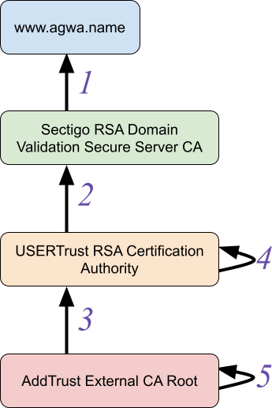
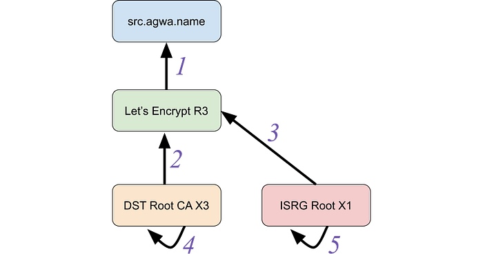

# Revisiting BetterTLS: Certificate Path Building

_By _[_Ian Haken_](https://twitter.com/ianhaken)

Last year the [AddTrust root certificate](https://crt.sh/?id=1) expired and lots of clients [had a bad time](https://www.agwa.name/blog/post/fixing_the_addtrust_root_expiration). Some Roku devices weren’t working right, [Heroku had problems](https://status.heroku.com/incidents/2034), and some folks [couldn’t even curl](https://twitter.com/bagder/status/1266833164703498241). In the aftermath Ryan Sleevi wrote a [really great blog post](https://medium.com/@sleevi_/path-building-vs-path-verifying-the-chain-of-pain-9fbab861d7d6) not just about the issue of this one certificate’s expiry, but the problem that so many TLS implementations have in general with certificate path building. If you haven’t read that blog post, you should. This post is probably going to make a lot more sense if you’ve read that one first, so go ahead and read it now.

To recap that previous AddTrust root certificate expiry, there was a certificate graph that looked like this:


*The AddTrust certificate graph*

This is a real example, and you can see the five certificates in the above graph here:

1. [www.agwa.name (leaf certificate)](https://crt.sh/?id=2412051912)
2. [Sectigo RSA Domain Validation Secure Server CA (intermediate CA)](https://crt.sh/?id=924467861)
3. [USERTrust RSA Certification Authority (intermediate CA)](https://crt.sh/?id=4860286)
4. [USERTrust RSA Certification Authority (self-signed)](https://crt.sh/?id=1199354)
5. [AddTrust External CA Root (self-signed)](https://crt.sh/?id=1)

The important thing to understand about a certificate graph is that the boxes represent _entities_ (meaning an X.500 Distinguished Name and public key). Entities are things you trust (or don’t, as the case may be). The _arrows_ between entities represent certificates: a way to extend trust from one entity to another. This means that if you trust either the “USERTrust RSA Certification Authority” entity or the “AddTrust External CA Root” entity, you should be able to discover a chain of trust from that trusted entity (the “trust anchor”) down to “www.agwa.name”, the “end-entity”.

(Note that the self-signed certificates (4 and 5) are often useful for defining trusted entities, but aren’t going to be important in the context of path building.)

The problem that occurred last summer started because certificate 3 expired. The “USERTrust RSA Certificate Authority” was relatively new and not directly trusted by many clients and so most servers would send certificates 1, 2, and 3 to clients. If a client only trusted “AddTrust External CA Root” then this would be fine; that client can build a certificate chain 1 ← 2 ← 3 and see that they should trust www.agwa.name’s public key. On the other hand, if the client trusts “USERTrust RSA Certification Authority” then that’s also fine; it only needs to build a chain 1 ← 2.

The problem that arose was that some clients weren’t good at certificate path building (even though this is a fairly simple case of path building compared to the next example below). Those clients didn’t realize that they could stop building a chain at 2 if they trusted “USERTrust RSA Certification Authority”. So when certificate 3 expired on May 30, 2020, these clients treated the entire collection of certificates sent by the server as invalid and would no longer establish trust in the end-entity.

Even though that story is a year old and was well covered then, I’m retelling it here because a couple of weeks ago something kind of similar happened: [a certificate for the Let’s Encrypt R3 CA expired](https://crt.sh/?id=3479778542) (certificate 2 below) on September 30, 2021. This should have been fine; the Let’s Encrypt R3 entity also [has a certificate signed by the ISRG Root X1 CA](https://crt.sh/?id=3334561879) (3) which nowadays is trusted by most clients.


*The Let’s Encrypt R3 Certificate Graph*

1. [src.agwa.name (leaf certificate)](https://crt.sh/?id=5163144271)
2. [Let’s Encrypt R3 (signed by DST Root CA X3)](https://crt.sh/?id=3479778542)
3. [Let’s Encrypt R3 (signed by ISRG Root X1)](https://crt.sh/?id=3334561879)
4. [DST Root CA X3 (self-signed)](https://crt.sh/?id=8395)
5. [ISRG Root X1 (self-signed)](https://crt.sh/?id=9314791)

But predictably, even though it’s been a year since Ryan’s post, [lots of services and clients had issues](https://twitter.com/Scott_Helme/status/1443293844292919304?s=19). You should read [Scott Helme’s full post-mortem](https://scotthelme.co.uk/lets-encrypt-root-expiration-post-mortem/) on the event to understand some of the contributing factors, but one big problem is that most TLS implementations _still_ aren’t very good at path building. As a result, servers generally can’t send a complete collection of certificates down to clients (containing different possible paths to different trust anchors) which makes it hard to host a service that both old and new devices can talk to.

Maybe it’s because I saw history repeating or maybe it’s because I had just [listened to Ryan Sleevi talk about the history of web PKI](https://podcasts.apple.com/us/podcast/how-to-be-a-certificate-authority-feat-ryan-sleevi/id1578405214?i=1000534433075), but the whole episode really made me want to get back to [something I had been wanting to do for a while](https://twitter.com/ianhaken/status/1275111545379278855). So over the last couple of weeks I set some time aside, started reading some RFCs, had to get more coffee, finished reading some RFCs, and finally started making certificates. The end result is the first major update to [BetterTLS](https://github.com/Netflix/bettertls/) since its [first release](https://netflixtechblog.com/bettertls-c9915cd255c0): a new suite of tests to exercise TLS implementations’ certificate path building. As a bonus, it also checks whether TLS implementations apply certain validity checks. Some of the checks are part of RFCs, like [Basic Constraints](https://datatracker.ietf.org/doc/html/rfc5280#section-4.2.1.9), while others are not fully standardized, like distrusting deprecated signature algorithms and [enforcing EKU constraints on CAs](https://wiki.mozilla.org/CA:CertificatePolicyV2.1).

I found the results of applying these tests to various TLS implementations pretty interesting, but before I get into those results let me give you a few more details about why TLS implementations _should_ be doing good path building and why we care about it.

## What is Certificate Path Building?

If you want the really detailed answer to “What is Certificate Path Building” you can take a look at [RFC 4158](https://datatracker.ietf.org/doc/html/rfc4158). But in short, certificate path building is the process of building a chain of trust from some end entity (like the blue boxes in the examples above) back to a trust anchor (like the ISRG Root X1 CA) given a collection of certificates. In the context of TLS, that collection of certificates is sent from the server to the client as part of the TLS handshake. A lot of the time, that collection of certificates is actually already an ordered sequence of certificates from end-entity to trust anchor, such as in the first example where servers would send certificates 1, 2, 3. This happens to already be a chain from “www.agwa.name” to “AddTrust External CA Root”.

But what happens if we can’t be sure what trust anchor the client has, such as the second example above where the server doesn’t know if the client will trust DST Root CA X3 or ISRG Root X1? In this case the server could send all the certificates (1, 2, and 3) and let the client figure out which path makes sense (either 1 ← 2, or 1 ← 3). But if the client expects the server’s certificates to simply be a chain already, the sequence 1 ← 2 ← 3 is going to fail to validate.

## Why Does This Matter?

The most important reason for clients to support robust path building is that it allows for agility in the web PKI ecosystem. For example, we can add additional certificates that conform to new requirements such as [SHA-1 deprecation](https://security.googleblog.com/2014/09/gradually-sunsetting-sha-1.html), [validity length restrictions](https://support.apple.com/en-us/HT211025), or [trust anchor removal](https://blog.mozilla.org/security/2018/03/12/distrust-symantec-tls-certificates/), all while leaving existing certificates in place to preserve legacy client functionality. This allows static, infrequently updated, or intentionally end-of-lifed clients to continue working while browsers (which frequently enforce new constraints like the ones mentioned above) can take advantage of the additional certificates in the handshake that conform to the new requirements.

In particular, Netflix runs on a lot of devices. [Millions of them](https://www.linkedin.com/pulse/why-netflix-works-millions-devices-bernd-hoidn). The reality though is that the above description applies to many of them. Some devices only run older versions of Android of iOS. Some are embedded devices that no longer receive updates. Regardless of the specifics, the update cadence (if one exists) for those devices is outside of our control. But ideally we’d love it if every device that used to work just kept working. To that end, it’s helpful to know what trade-offs we can make in terms of agility versus retaining support for every device. Are those devices stuck using certain signature algorithms or cipher suites? Will those devices accept a certificate set that includes extra certificates with other alternate signature algorithms?

As service owners, having test suites that can answer these questions can guide decision making. On the other hand, TLS library implementers using these test suites can ensure that applications built with their libraries operate reliably throughout churn in the web PKI ecosystem.

## An Aside About Agility

More than 4 years passed between publication of the [first draft of the TLS 1.3 specification](https://datatracker.ietf.org/doc/html/draft-ietf-tls-tls13-00) and the [final version](https://datatracker.ietf.org/doc/html/rfc8446). An impressive amount of consideration went into the design of all of the versions of the TLS and SSL protocols and it speaks to the designers’ foresight and diligence that a single server can support clients speaking SSL 3.0 (final specification released 1996) all the way up to TLS 1.3 (final specification released 2018).

(Although I should say that in practice, supporting such a broad set of protocol versions on a single server is [probably not a good idea](https://drownattack.com/).)

The reason that TLS protocol can support this is because agility has been designed into the system. The client advertises the TLS versions, cipher suites, and extensions it supports and the server can make decisions about the best supported version of those options and negotiate the details in its response. Over time this has allowed the ecosystem to evolve gracefully, supporting new cryptographic primitives (like elliptic curve cryptography) and deprecating old ones (like the MD5 hash algorithm).

Unfortunately the TLS specification has not enabled the same agility with the certificates that it relies on in practice. While there are great specifications like RFC 4158 for how to think about certificate path building, TLS specifications up to 1.2 only allowed for server to present “the chain”:

> This is a sequence (chain) of certificates. The sender’s certificate MUST come first in the list. Each following certificate MUST directly certify the one preceding it.

Only in TLS 1.3 did the specification allow for greater flexibility:

> The sender’s certificate MUST come in the first CertificateEntry in the list. Each following certificate SHOULD directly certify the one immediately preceding it.  
> …  
> Note: Prior to TLS 1.3, “certificate_list” ordering required each certificate to certify the one immediately preceding it; however, some implementations allowed some flexibility. Servers sometimes send both a current and deprecated intermediate for transitional purposes, and others are simply configured incorrectly, but these cases can nonetheless be validated properly. For maximum compatibility, all implementations SHOULD be prepared to handle potentially extraneous certificates and arbitrary orderings from any TLS version, with the exception of the end-entity certificate which MUST be first.

This change to the specification is hugely significant because it’s the first formalization that TLS implementations _should_ be doing robust path building. Implementations which conform to this are far more likely to continue operating in a PKI ecosystem undergoing frequent changes. If more TLS implementations _can_ tolerate changes, then web PKI ecosystem will be in a place where it is able to undergo those changes. And ultimately this means we will be able to update best practices and retain trust agility as time goes on, making the web a more secure place.

It’s hard to imagine a world where SSL and TLS were so inflexible that we wouldn’t have been able to gracefully transition off of MD5 or transition to [PFS](https://en.wikipedia.org/wiki/Forward_secrecy) cipher suites. I’m hopeful that this update to the TLS specification will help bring the same agility that has existed in the TLS protocol itself to the web PKI ecosystem.

## Test Results

So what does the new test suite in BetterTLS tell us about the state of certificate path building in TLS implementations? The good news is that there has been _some_ improvement in the state of the world since [Ryan’s roundup last year](https://medium.com/@sleevi_/path-building-vs-path-verifying-implementation-showdown-39a9272b2820). The bad news is that that improvement isn’t everywhere.

The test suite both identifies what relevant features a TLS implementation supports (like default distrust of deprecated signing algorithms) and evaluates correctness. Here’s a quick enumeration of what features this test suite looks for:

- **Branching Path Building:** Implementations that support “branching” path building can handle cases like the Let’s Encrypt R3 example above where an entity has multiple issuing certificates and the client needs to check multiple possible paths to find a route to a trust anchor. Importantly, as invalid certificates are found during path building (for all of the reasons listed below) the implementation should be able to pick an alternate issuer certificate to continue building a path. This is the primary feature of interest in this test suite.
- **Certificate expiration:** Implementations should treat expired certificates as invalid during path building. This is a pretty straightforward expectation and fortunately all the tested implementations were properly verifying this.
- **Name constraints:** Im**plementations should treat certificates with a name constraint extension in conflict with the end entity’s identity as invalid. Check out ****[BetterTLS’s name constraints test suite](https://bettertls.com/nameconstraints)**** for more thorou**gh evaluations of this evaluation. All of the implementations tested below correctly evaluated the simple name constraints check in this test suite.
- **Bad Extended Key Usage (EKU) on CAs:** This check tests whether an implementation rejects CA certificates with an [Extended Key Usage](https://datatracker.ietf.org/doc/html/rfc5280#section-4.2.1.12) extension that is incompatible with the end-entity’s use of the certificate for TLS server authentication. The [Mozilla Certificate Policy FAQ](https://wiki.mozilla.org/CA:CertificatePolicyV2.1#Frequently_Asked_Questions) states:

> Inclusion of EKU in CA certificates is generally allowed. NSS and CryptoAPI both treat the EKU extension in intermediate certificates as a constraint on the permitted EKU OIDs in end-entity certificates. Browsers and certificate client software have been using EKU in intermediate certificates, and it has been common for enterprise subordinate CAs in Windows environments to use EKU in their intermediate certificates to constrain certificate issuance.

While many implementations support the semantics of an incompatible EKU in CAs as a reason to treat a certificate as invalid, RFCs do not require this behavior so we do see several implementations below not applying this verification.

- **Missing Basic Constraints Extension:** This check tests whether the implementation rejects paths where a CA is missing the [Basic Constraints extension](https://datatracker.ietf.org/doc/html/rfc5280#section-4.2.1.9). RFC 5280 requires that all CAs have this extension, so all implementations should support this.
- **Not a CA:** This check tests whether the implementation rejects paths where a CA has a Basic Constraints extension, but that extension does not identify the certificate as being a CA. Similarly to the above, all implementations should support this and fortunately all of the implementations tested applied this check correctly.
- **Deprecated Signing Algorithm:** This check tests whether the implementation rejects certificates that have been signed with an algorithm that is considered deprecated (in particular, with an algorithm using SHA-1). Enforcement of SHA-1 deprecation is not universally present in all TLS implementations at this point, so we see a mix of implementations below that do and do not apply it.

For more information about these checks, check out the repository’s [README](https://github.com/Netflix/bettertls/blob/master/pathbuilding/README.md). Now on to the results!

### webpki

[webpki](https://github.com/briansmith/webpki) is a rust library for validating web PKI certificates. It’s the underlying validation mechanism for the [rustls](https://github.com/rustls/rustls) library that I actually tested. webpki shows up as the hero of the non-browser TLS implementations, supporting all of the features and having a 100% test pass rate. webpki is primarily maintained by [Brian Smith](https://briansmith.org/) who also worked on the [mozilla::pkix](https://github.com/briansmith/mozillapkix) codebase that’s used by Firefox.

### Go

Go didn’t distrust deprecated signature algorithms by default (although looking at the issues tracker, an [update was merged](https://github.com/golang/go/issues/41682) to change this long before I started working on this test suite; it should land in Go 1.18), but otherwise supported all the features in the test suite. However, while it supported EKU constraints on CAs the test suite [discovered a bug](https://github.com/golang/go/issues/48869) that causes path building to fail under certain conditions when only a subset of paths have an EKU constraint.

Upon inspection, the Go x509 library validates most certificate constraints (like expiration and name constraints) as it builds paths, but EKU constraints are [only applied after candidate paths are found](https://github.com/golang/go/blob/go1.17.1/src/crypto/x509/verify.go#L789-L793). This looks to be a violation of [Sleevi’s Rule](https://medium.com/@sleevi_/path-building-vs-path-verifying-the-chain-of-pain-9fbab861d7d6), which probably explains why the EKU corner case causes Go to have a bad time:

> Even if a library supports path building, doing some form of depth-first search in the PKI graph, the next most common mistake is still treating path building and path verification as separable, independent steps. That is, the path builder finds “a chain” that is rooted in a trusted CA, and then completes. The completed chain is then handed to a path verifier, which asks “Does this chain meet all the caller’s/application’s requirements”, and returns a “Yes/No” answer. If the answer is “No”, you want the path builder to consider those other paths in the graph, to see if there are any “Yes” paths. Yet if the path building and verification steps are different, you’re bound to have a bad time.

### Java

I didn’t evaluate JDKs other than OpenJDK, but the latest version of OpenJDK 11 actually performed quite well. This JDK didn’t enforce EKU constraints on CAs or distrust certificates signed with SHA-1 algorithms. Otherwise, the JDK did a good job of building certificate paths.

### PKI.js

The [PKI.js library](https://pkijs.org/) is a javascript library that can perform a number of PKI-related operations including certificate verification. It’s unclear if the “certificate chain validator” is meant to support complex certificate sets or if it was only meant to handle pre-validated paths, but the implementation fared poorly against the test suite. It didn’t support EKU constraints, distrust deprecated signature algorithms, didn’t perform any branching path building, and failed to validate even a simple “chain” when a parent certificate has expired but the intermediate was already trusted (this is the same issue OpenSSL ran into with the expired AddTrust certificate last year).

Even worse, when the certificate pool had a cycle (like in [RFC 4158 figure 7](https://datatracker.ietf.org/doc/html/rfc4158#section-2.3)), the validator got stuck in an infinite loop.

### OpenSSL

In short, OpenSSL doesn’t appear to have changed significantly since Ryan’s roundup last year. OpenSSL does support the less ubiquitous validation checks (such as EKU constraints on CAs and distrusting deprecated signing algorithms), but it still doesn’t support branching path building (only non-branching chains).

### LibreSSL

LibreSSL showed significant improvement over last year’s evaluation, which appears to be largely attributable to [Bob Beck’s work](https://twitter.com/bob_beck/status/1305173216776855552) on a [new x509 verifier](https://undeadly.org/cgi?action=article%3Bsid%3D20200921105847) in [LibreSSL 3.2.2](https://ftp.openbsd.org/pub/OpenBSD/LibreSSL/libressl-3.2.2-relnotes.txt) based on Go’s verifier. It supported path building and passed all of the non-skipped tests. As with other implementations it didn’t distrust deprecated algorithms by default. The one big surprise though is that it also didn’t distrust certificates missing the Basic Constraints extension, which as we described above is strictly required by the [RFC 5280 spec](https://datatracker.ietf.org/doc/html/rfc5280#section-4.2.1.9):

> If the basic constraints extension is not present in a version 3 certificate, or the extension is present but the cA boolean is not asserted, then the certified public key MUST NOT be used to verify certificate signatures.

### BoringSSL

BoringSSL performed similarly to OpenSSL. Not only did it not support any path building (only non-branching chains), but it also didn’t distrust deprecated signature algorithms.

### GnuTLS

GnuTLS looked just like OpenSSL in its results. It also supported all the validation checks in the test suite (EKU constraints, deprecated signature algorithms) but didn’t support branching path building.

### Browsers

By and large, browsers (or the operating system libraries they utilize) do a good job of path building.

### Firefox (all platforms)

Firefox didn’t distrust deprecated signature algorithms, but otherwise supported path building and passed all tests.

**Chrome (all platforms)  
**Chrome supported all validation cases and passed all tests.

**Microsoft Edge (Windows)**  
Edge supported all validation cases and passed all tests.

**Safari (MacOS)**  
Safari didn’t support EKU constraints on CAs but did pass simple branching path building test cases. However, it failed most of the more complicated path building test cases (such as cases with cycles).

## Summary

```
+-----------+----------+-------------------+---+-------------------+
|           | Supports | Distrusts SHA-1   |EKU| Has other errors? |
|           | branching| signing algs?     |   |                   |
+-----------+----------+-------------------+---+-------------------+
| webpki    | ✓        | ✓                 | ✓ |                   |
+-----------+----------+-------------------+---+-------------------+
| Go        | ✓        | ✖ (Fixed in 1.18) | ✓ | EKU bug           |
+-----------+----------+-------------------+---+-------------------+
| Java      | ✓        | ✖                 | ✖ |                   |
+-----------+----------+-------------------+---+-------------------+
| PKI.js    | ✖        | ✖                 | ✖ | Fails even non-   |
|           |          |                   |   | branching path    |
|           |          |                   |   | building cases,   |
|           |          |                   |   | has infinite loop |
+-----------+----------+-------------------+---+-------------------+
| OpenSSL   | ✖        | ✓                 | ✓ |                   |
+-----------+----------+-------------------+---+-------------------+
| LibreSSL  | ✓        | ✖                 | ✓ | Doesn't require   |
|           |          |                   |   | Basic Constraints |
+-----------+----------+-------------------+---+-------------------+
| BoringSSL | ✖        | ✖                 | ✓ |                   |
+-----------+----------+-------------------+---+-------------------+
| GnuTLS    | ✖        | ✓                 | ✓ |                   |
+-----------+----------+-------------------+---+-------------------+
| Firefox   | ✓        | ✖                 | ✓ |                   |
+-----------+----------+-------------------+---+-------------------+
| Chrome    | ✓        | ✓                 | ✓ |                   |
+-----------+----------+-------------------+---+-------------------+
| Edge      | ✓        | ✓                 | ✓ |                   |
+-----------+----------+-------------------+---+-------------------+
| Safari    | Kind of? | ✓                 | ✖ | Failed complex    |
|           |          |                   |   | path finding cases|
+-----------+----------+-------------------+---+-------------------+
```

## Closing Thoughts

For most of the history of TLS, implementations have been pretty poor at certificate path building (if they supported it at all). In fairness, until recently the TLS specifications asserted that servers MUST behave in such a way that didn’t require clients to implement certificate path building.

However the evolution of the web PKI ecosystem has necessitated flexibility and this has been more directly codified in the TLS 1.3 specification. If you work on a TLS implementation, you really _really_ ought to take heed of these new expectations in the TLS 1.3 specification. We’re going to have a lot more stability on the web if implementations can do good path building.

To be clear, it doesn’t need to be every implementation’s goal to pass every test in this suite. I’ll be the first to admit that the test suite contains some more pathological test cases than you’re likely to see in web PKI in practice. But at a minimum you should look at the changes that have occurred in the web PKI ecosystem in the past decade and be confident that your library supports enough path building to easily handle transitions (such as servers sending multiple possible paths to a trust anchor). And passing all of the tests in the BetterTLS test suite is a useful metric for establishing that confidence.

It’s important to make sure clients are forward-compatible with changes to the web PKI, because it’s not a matter of “if” but “when.” In [Scott’s own words](https://scotthelme.co.uk/lets-encrypt-root-expiration-post-mortem/):

> One thing that’s certain is that this event is coming again. Over the next few years we’re going to see a wide selection of Root Certificates expiring for all of the major CAs and we’re likely to keep experiencing the exact same issues unless something changes in the wider ecosystem.

If you are in a position to choose between different client-side TLS libraries, you can use these test results as a point of consideration for which libraries are most likely to weather those changes.

And if you are a service owner, it is important to know your customers. Will they be able to handle a transition from RSA to ECDSA? Will they be able to handle a transition from ECDSA to a post-quantum signature algorithm? Will they be able to handle having multiple certificates in a handshake when an old trust is expiring or no longer trusted by new clients? Knowing your clients can help you be resilient and set up appropriate configurations and endpoints to support them.

Standards, security base lines, and best practices in web PKI have been rapidly changing over the last few years and are only going to keep changing. Whether you implement TLS or just consume it, whether it’s a distrusted CA, a broken signature algorithm, or just the expiry of a certificate in good standing, it’s important to make sure that your application will be able to handle the next big change. We hope that BetterTLS can play a part in making that easier!

---
**Tags:** Bettertls · Tls · Pki · Https · Certificate
