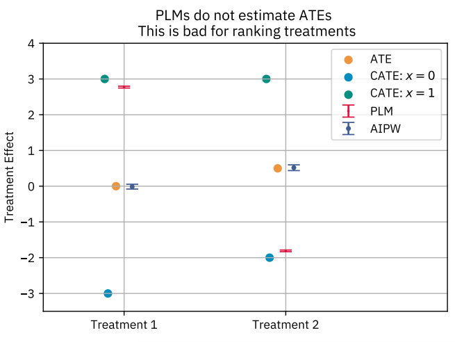
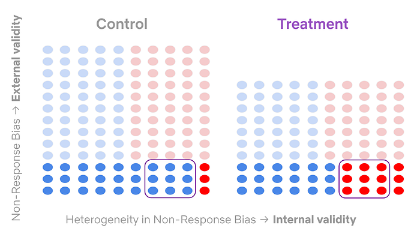
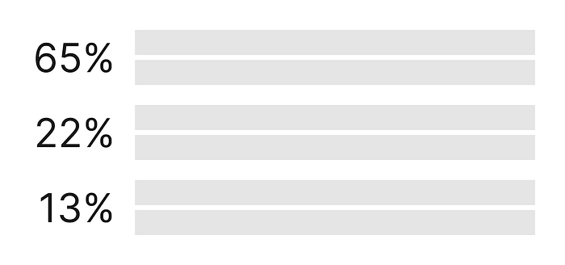
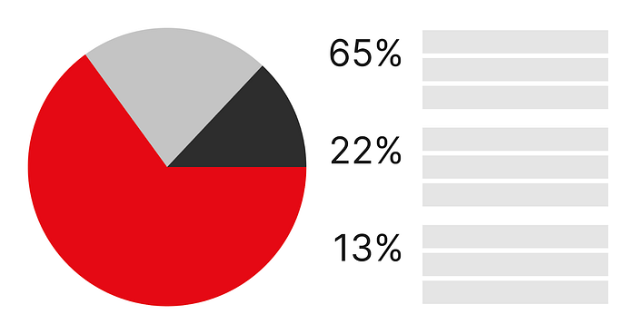
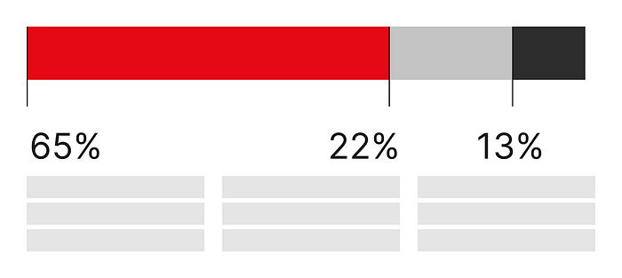
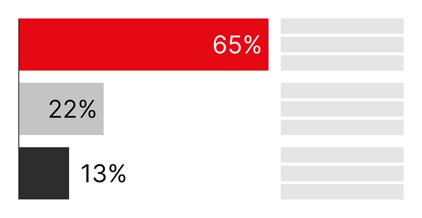
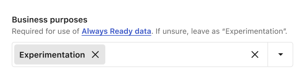

# Round 2: A Survey of Causal Inference Applications at Netflix

At Netflix, we want to ensure that every current and future member finds content that thrills them today and excites them to come back for more. Causal inference is an essential part of the value that Data Science and Engineering adds towards this mission. We rely heavily on both [experimentation](./decision-making-at-netflix-33065fa06481.md) and [quasi-experimentation](https://netflixtechblog.com/quasi-experimentation-at-netflix-566b57d2e362) to help our teams make the best decisions for growing member joy.

Building off of our last successful [Causal Inference and Experimentation Summit](./a-survey-of-causal-inference-applications-at-netflix-b62d25175e6f.md), we held another week-long internal conference this year to learn from our stunning colleagues. We brought together speakers from across the business to learn about methodological developments and innovative applications.

We covered a wide range of topics and are excited to share five talks from that conference with you in this post. This will give you a behind the scenes look at some of the causal inference research happening at Netflix!

## Metrics Projection for Growth A/B Tests

[Mihir Tendulkar](https://www.linkedin.com/in/tendulkar), [Simon Ejdemyr](https://www.linkedin.com/in/simon-ejdemyr-22b920123), [Dhevi Rajendran](https://www.linkedin.com/in/dhevi-rajendran-7b736b29), [David Hubbard](https://www.linkedin.com/in/david-hubbard-557a852), [Arushi Tomar](https://www.linkedin.com/in/arushi-tomar), [Steve Beckett](https://www.linkedin.com/in/steve-beckett-cfa-4384a382), [Judit Lantos](https://www.linkedin.com/in/jlantos?original_referer=https%3A%2F%2Fwww.google.com%2F), [Cody Chapman](https://www.linkedin.com/in/codychapmanucsd), [Ayal Chen-Zion](https://www.linkedin.com/in/achenzion), [Apoorva Lal](https://www.linkedin.com/in/apoorvalal), [Ekrem Kocaguneli](https://www.linkedin.com/in/kocaguneli), [Kyoko Shimada](https://www.linkedin.com/in/kshimada)

Experimentation is in Netflix’s DNA. When we launch a new product feature, we use — where possible — A/B test results to estimate the annualized incremental impact on the business.

Historically, that estimate has come from our Finance, Strategy, & Analytics (FS&A) partners. For each test cell in an experiment, they manually forecast signups, retention probabilities, and cumulative revenue on a one year horizon, using monthly cohorts. The process can be repetitive and time consuming.

We decided to build out a faster, automated approach that boils down to estimating two pieces of missing data. When we run an A/B test, we might allocate users for one month, and monitor results for only two billing periods. In this simplified example, we have one member cohort, and we have two billing period treatment effects (𝜏.cohort1,period1 and 𝜏.cohort1,period2, which we will shorten to 𝜏.1,1 and 𝜏.1,2, respectively).

To measure annualized impact, we need to estimate:

1. **Unobserved billing periods**. For the first cohort, we don’t have treatment effects (TEs) for their third through twelfth billing periods (𝜏.1,j , where j = 3…12).
2. **Unobserved sign up cohorts**. We only observed one monthly signup cohort, and there are eleven more cohorts in a year. We need to know both the size of these cohorts, and their TEs (𝜏.i,j, where i = 2…12 and j = 1…12).

For the first piece of missing data, we used a[ surrogate index approach](https://research.netflix.com/publication/evaluating-the-surrogate-index-as-a-decision-making-tool-using-200-a-b-tests). We make a standard assumption that the causal path from the treatment to the outcome (in this case, Revenue) goes through the surrogate of retention. We leverage our proprietary[ Retention Model](https://arxiv.org/pdf/1905.03818) and short-term observations — in the above example, 𝜏.1,2 — to estimate 𝜏.1,j , where j = 3…12.

For the second piece of missing data, we assume transportability: that each subsequent cohort’s billing-period TE is the same as the first cohort’s TE. Note that if you have long-running A/B tests, this is a testable assumption!

*Fig. 1: Monthly cohort-based activity as measured in an A/B test. In green, we show the allocation window throughout January, while blue represents the January cohort’s observation window. From this, we can directly observe 𝜏.1 and 𝜏.2, and we can project later 𝜏.j forward using the surrogate-based approach. We can transport values from observed cohorts to unobserved cohorts.*

Now, we can put the pieces together. For the first cohort, we project TEs forward. For unobserved cohorts, we transport the TEs from the first cohort and collapse our notation to remove the cohort index: 𝜏.1,1 is now written as just 𝜏.1. We estimate the annualized impact by summing the values from each cohort.

We empirically validated our results from this method by comparing to long-running AB tests and prior results from our FS&A partners. Now we can provide quicker and more accurate estimates of the longer term value our product features are delivering to members.

## A Systematic Framework for Evaluating Game Events

[Claire Willeck](https://www.linkedin.com/in/clairewilleck?original_referer=https%3A%2F%2Fwww.google.com%2F), [Yimeng Tang](https://www.linkedin.com/in/yimeng-tang-49566b207)

In Netflix Games DSE, we are asked many causal inference questions after an intervention has been implemented. For example, how did a product change impact a game’s performance? Or how did a player acquisition campaign impact a key metric?

While we would ideally conduct AB tests to measure the impact of an intervention, it is not always practical to do so. In the first scenario above, A/B tests were not planned before the intervention’s launch, so we needed to use observational causal inference to assess its effectiveness. In the second scenario, the campaign is at the country level, meaning everyone in the country is in the treatment group, which makes traditional A/B tests inviable.

To evaluate the impacts of various game events and updates and to help our team scale, we designed a framework and package around variations of synthetic control.

For most questions in Games, we have game-level or country-level interventions and relatively little data. This means most pre-existing packages that rely on time-series forecasting, unit-level data, or instrumental variables are not useful.

Our framework utilizes a variety of synthetic control (SC) models, including Augmented SC, Robust SC, Penalized SC, and synthetic difference-in-differences, since different approaches can work best in different cases. We utilize a scale-free metric to evaluate the performance of each model and select the one that minimizes pre-treatment bias. Additionally, we conduct robustness tests like backdating and apply inference measures based on the number of control units.

*Fig. 2: Example of Augmented Synthetic Control model used to reduce pre-treatment bias by fitting the model in the training period and evaluating performance in the validation period. In this example, the Augmented Synthetic Control model reduced the pre-treatment bias in the validation period more than the other synthetic control variations.*

This framework and package allows our team, and other teams, to tackle a broad set of causal inference questions using a consistent approach.

## Double Machine Learning for Weighing Metrics Tradeoffs

[Apoorva Lal](https://www.linkedin.com/in/apoorvalal), [Winston Chou](https://www.linkedin.com/in/winston-chou-6491b0168), [Jordan Schafer](https://www.linkedin.com/in/jjschafer)

As Netflix expands into new business verticals, we’re increasingly seeing examples of metric tradeoffs in A/B tests — for example, an increase in games metrics may occur alongside a decrease in streaming metrics. To help decision-makers navigate scenarios where metrics disagree, we developed a method to compare **the relative importance of different metrics (viewed as “treatments”) in terms of their causal effect on the north-star metric (****Retention****) using Double Machine Learning (DML).**

In our first pass at this problem, we found that ranking treatments according to their Average Treatment Effects using DML with a Partially Linear Model (PLM) could yield an incorrect ranking when treatments have different marginal distributions. The PLM ranking _would_ be correct if treatment effects were constant and additive. However, when treatment effects are heterogeneous, PLM upweights the effects for members whose treatment values are most unpredictable. This is problematic for comparing treatments with different baselines.

Instead, we discretized each treatment into bins and fit a multiclass propensity score model. This lets us estimate multiple Average Treatment Effects (ATEs) using Augmented Inverse-Propensity-Weighting (AIPW) to reflect different treatment contrasts, for example the effect of low versus high exposure.

We then weight these treatment effects by the baseline distribution. This yields an “apples-to-apples” ranking of treatments based on their ATE on the same overall population.

*Fig. 3: Comparison of PLMs vs. AIPW in estimating treatment effects. Because PLMs do not estimate average treatment effects when effects are heterogeneous, they do not rank metrics by their Average Treatment Effects, whereas AIPW does.*

In the example above, we see that PLM ranks Treatment 1 above Treatment 2, while AIPW correctly ranks the treatments in order of their ATEs. This is because PLM upweights the Conditional Average Treatment Effect for units that have more unpredictable treatment assignment (in this example, the group defined by x = 1), whereas AIPW targets the ATE.

## Survey AB Tests with Heterogeneous Non-Response Bias

[Andreas Aristidou](https://www.linkedin.com/in/andreasaristidou), [Carolyn Chu](https://www.linkedin.com/in/carolyn-chu-263147a9)

To improve the quality and reach of Netflix’s survey research, we leverage a research-on-research program that utilizes tools such as survey AB tests. Such experiments allow us to directly test and validate new ideas like providing incentives for survey completion, varying the invitation’s subject-line, message design, time-of-day to send, and many other things.

In our experimentation program we investigate treatment effects on not only primary success metrics, but also on guardrail metrics. A challenge we face is that, in many of our tests, the intervention (e.g. providing higher incentives) and success metrics (e.g. percent of invited members who begin the survey) are upstream of guardrail metrics such as answers to specific questions designed to measure data quality (e.g. survey straightlining).

In such a case, the intervention may (and, in fact, we expect it to) distort upstream metrics (especially sample mix), the balance of which is a necessary component for the identification of our downstream guardrail metrics. This is a consequence of non-response bias, a common external validity concern with surveys that impacts how generalizable the results can be.

For example, if one group of members — group X — responds to our survey invitations at a significantly lower rate than another group — group Y — , then average treatment effects will be skewed towards the behavior of group Y. Further, in a survey AB test, the type of non-response bias can differ between control and treatment groups (e.g. different groups of members may be over/under represented in different cells of the test), thus threatening the internal validity of our test by introducing a covariate imbalance. We call this combination heterogeneous non-response bias.

To overcome this identification problem and investigate treatment effects on downstream metrics, we leverage a combination of several techniques. First, we look at conditional average treatment effects (CATE) for particular sub-populations of interest where confounding covariates are balanced in each strata.

In order to examine the average treatment effects, we leverage a combination of propensity scores to correct for internal validity issues and iterative proportional fitting to correct for external validity issues. With these techniques, we can ensure that our surveys are of the highest quality and that they accurately represent our members’ opinions, thus helping us build products that they want to see.

## Design: The Intersection of Humans and Technology

[Rina Chang](https://www.linkedin.com/in/rinachang)

A design talk at a causal inference conference? Why, yes! Because **design is about how a product works**, it is fundamentally interwoven into the experimentation platform at Netflix. Our product serves the huge variety of internal users at Netflix who run — and consume the results of — A/B tests. Thus, choosing how to enable our users to take action and how we present data in the product is critical to decision-making via experimentation.

If you were to display some numbers and text, you might opt to show it in a tabular format.

While there is nothing inherently **_wrong_** with this presentation, it is not as easily digested as something more visual.

If your goal is to illustrate that those three numbers add up to 100%, and thus are parts of a whole, then you might choose a pie chart.

If you wanted to show how these three numbers combine to illustrate progress toward a goal, then you might choose a stacked bar chart.

Alternatively, if your goal was to compare these three numbers against each other, then you might choose a bar chart instead.

All of these show the same information, but the choice of presentation changes how **_easily_** a consumer of an infographic understands the “so what?” of the point you’re trying to convey. Note that there is no “right” solution here; rather, it depends on the desired takeaway.

Thoughtful design applies not only to static representations of data, but also to interactive experiences. In this example, a single item within a long form could be represented by having a pre-filled value.

Alternatively, the same functionality could be achieved by displaying a default value in text, with the ability to edit it.

While functionally equivalent, this UI change shifts the user’s narrative from “Is this value correct?” to “Do I need to do something that is not ‘normal’?” — which is a much easier question to answer. Zooming out even more, thoughtful design addresses product-level choices like if a person knows where to go to accomplish a task. In general, thoughtful design influences product strategy.

Design permeates all aspects of our experimentation product at Netflix, from small choices like color to strategic choices like our roadmap. By thoughtfully approaching design, we can ensure that tools help the team learn the most from our experiments.

## External Speaker: Kosuke Imai

In addition to the amazing talks by Netflix employees, we also had the privilege of hearing from [Kosuke Imai](https://imai.fas.harvard.edu/), Professor of Government and Statistics at Harvard, who delivered our keynote talk. He introduced the “[cram method](https://arxiv.org/abs/2403.07031),” a powerful and efficient approach to learning and evaluating treatment policies using generic machine learning algorithms.

---

Measuring causality is a large part of the data science culture at Netflix, and we are proud to have many stunning colleagues who leverage both experimentation and quasi-experimentation to drive member impact. The conference was a great way to celebrate each other’s work and highlight the ways in which causal methodology can create value for the business.

To stay up to date on our work, follow the [Netflix Tech Blog](https://netflixtechblog.com/), and if you are interested in joining us, we are currently looking for [new stunning colleagues](https://jobs.netflix.com/search?q=data+science&team=Data+Science+and+Engineering) to help us entertain the world!

---
**Tags:** Data Science · Experimentation · Causal Inference · Technology · Netflix
