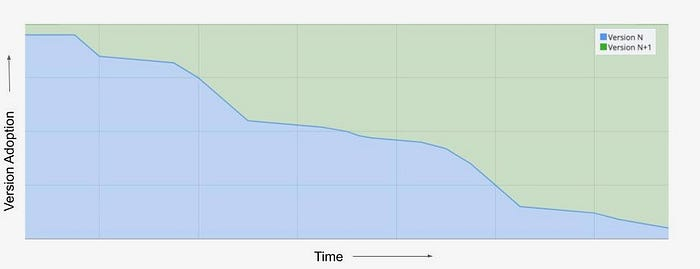
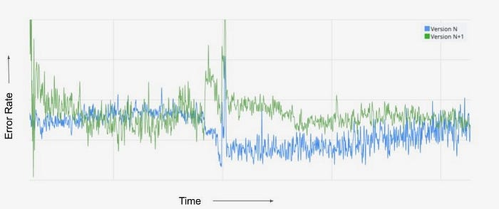
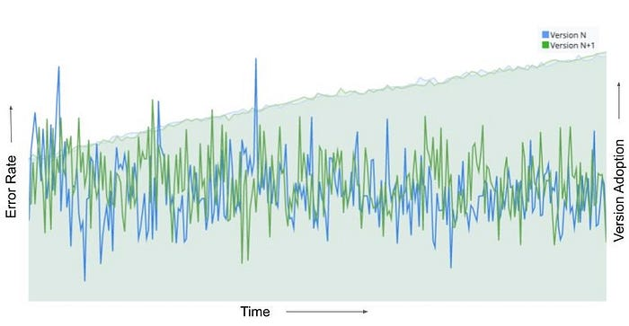
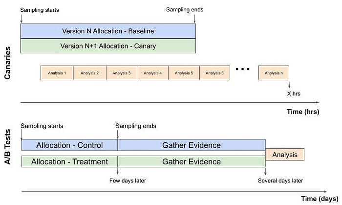
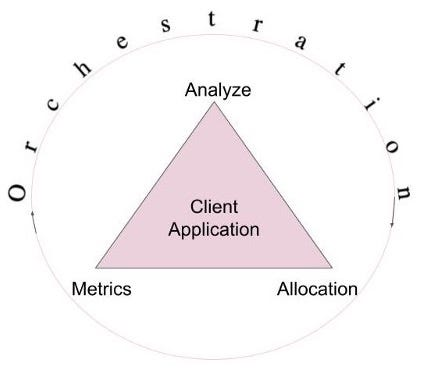
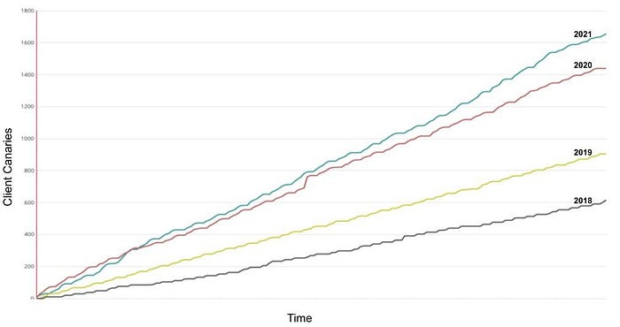

# Safe Updates of Client Applications at Netflix

_By Minal Mishra_

Quality of a client application is of paramount importance to global digital products, as it is the primary way customers interact with a brand. At Netflix, we have significant investments in ensuring new versions of our applications are well tested. However, Netflix is available for streaming on thousands of types of devices and it is powered by hundreds of micro-services which are deployed independently, making it extremely challenging to comprehensively test internally. Hence, it became important to supplement our release decisions with strong evidence received from the field during the update process.

Our team was formed to mine health signals from the field to quickly evaluate new versions of the client applications. As we invested in systems to enable this vision, it led to increased development velocity, which arguably led to better development practices and quality of the applications. The goal of this blog post is to highlight the investment areas for this vision and the challenges we are facing today.

## Client Applications

We deal with two classes of client application updates. The first is where an application package is downloaded from the service or a CDN. An example of this is Netflix’s video player or the TV UI javascript package. The second is one where an application is hosted behind an app store, for example mobile phones or even game consoles. We have more flexibility to control the distribution of the application in the former than in the latter case.

## Deployment Strategies

We are all familiar with the advantages of releasing frequently and in smaller chunks. It helps bring a healthy balance to the velocity and quality equation. The challenge for clients is that each instance of the application runs on a Netflix member’s device and signals are derived from a firehose of events being sent by devices across the globe. Depending on the type of client, we need to determine the right strategy to sample consumer devices, and provide a system that can enable various client engineering teams to look for their signals. Hence, the sampling strategy is different if it is a mobile application versus a smart TV. In contrast, a server application runs on servers which are typically identical and a routing abstraction can serve sampled traffic to new versions. And the signals to evaluate a new version are derived from comparatively few thousands of homogenous servers instead of millions of heterogeneous devices.

*Staged rollouts of apps mimic the different phases of moon*

A widely adopted technique for client applications is gradually rolling out a new version of software rather than making the release available to all users instantly, also known as **_staged or phased rollout_**. There are two main benefits to this approach.

- First, if something were to fail catastrophically, the release can be paused for triage, limiting the number of customers impacted.
- **Second, backend services or infrastructure can be scaled intelligently as adoption ramps up.**

*Application version adoption over time for a staged rollout*

This chart represents a counter metric, which exhibits version adoption over the duration of a staged rollout. There is a gradual increase in the percentage of devices switching to N+1 version. In the past, during this period client engineering teams would visually monitor their metric dashboards to evaluate signals as more consumers migrated to a new version of their application.

*Client-side error rate during the staged rollout*

The chart of client-side error rate during the same time period as the version migration is shown here. We observe that the metric for the new version N+1 stabilizes as the rollout ramps up and reaches closer to 100%, whereas the metric for the current version N becomes noisy over the same time duration. Trying to compare any metric during this time period can be a futile effort, as obvious in this case where there was no customer impacting shift in the error rate but we cannot interpret that from the chart. Typically, teams time-shift one metric over the other to visually detect metric deviations, but time can still be a confounder. Staged rollouts have a lot of benefits, but there is a significant opportunity cost to wait before the new version reaches a critical level of adoption.

## AB Tests/Client Canaries

So we brought the science of controlled testing into this decision framework by using what has been utilized for feature evaluations. The main goal of A/B testing is to design a robust experiment that is going to yield repeatable results and enable us to make sound decisions about whether or not to launch a product feature (read more about A/B tests at Netflix [here](./what-is-an-a-b-test-b08cc1b57962.md)). In the application update use case, we recommend an extreme version of A/B testing: we test the entire application. The new version may include a user facing feature which is designed to be A/B tested and resides behind a feature flag. However, most times it is adding new obvious improvements, simple bug fixes, performance enhancements, productizing outcomes from previous A/B tests, logging etc that are being shipped in the application. If we apply A/B tests methodology (or **_client canaries_** as we like to call them to differentiate from traditional feature based A/B tests) the allocation would look identical for both the versions at any time.

*Client Canary and Control allocation along with the client-side error rate metric*

This chart is showing the new and the baseline version allocations growing over time. Although, majority of users are already on the baseline version we are randomly “allocating” a fraction of those users to be the control group of our experiment. This ensures there is no sampling mismatch between the treatment and the control group. It is easier to visually compare the client side error rate for both versions and even apply statistical inference to change the conversation from “_we think_” there is a shift in metrics to “_we know_”.

*Client Canaries and A/B tests*

But there are differences between feature related A/B tests at Netflix and the incremental product changes used for Client Canaries. The main distinctions are: a shorter runtime, multiple executions of analysis sometimes concurrent with allocation, and use of data to support the null hypothesis. The runtime is predetermined, which in a way, is the stopping rule for client canaries. Unlike feature A/B tests at Netflix, we limit our evidence collection to a few hours, so we can release updates within a working day. We continuously analyze metrics to find egregious regressions sooner rather than once all the evidence has been collected.

*Phases of A/B Tests*

The three key phases of any A/B tests can be split into Allocation, Metric Collection and Analysis. We use orchestration to connect and manage client applications through the A/B test lifecycle, thereby reducing the cognitive load of deploying them frequently.

## Allocation

Sampling is the first stage once your new application has been packaged, tested and published. As time is of the essence here, we rely on dynamic allocation and **allocate devices which come to the service during the canary time period based on pre-configured rules**. We leverage the allocation service used for all [experimentation at Netflix](https://netflixtechblog.com/its-all-a-bout-testing-the-netflix-experimentation-platform-4e1ca458c15) for this purpose.

However, for applications gated behind an external app store (example mobile apps), we only have access to staged rollout solutions provided by the app stores. We can control the percentage of users receiving updated apps, which can increase over time. In order to mimic the client canary solution, we built a synthetic allocation service to perform sampling post-installation of the app updates. This service tries to allocate a device to the control group that typically matches the profile of a device seen in the treatment group, which was allocated by the app store’s staged rollout solution. This ensures we are controlling for key variables which have the potential to impact the analysis.

## Metrics

Metrics are a foundational component for client canaries and A/B tests as they give us the necessary insight required to make decisions. **And for our use case, metrics need to be computed in real time from millions of user events being sent to our service**. Operating at Netflix’s scale, we have to process the event streams on a scalable platform like [Mantis](./open-sourcing-mantis-a-platform-for-building-cost-effective-realtime-operations-focused-5b8ff387813a.md) and store the time-series data in Apache Druid. To be further cost-efficient with the time-series data we store the metrics for a sliding time window of a few weeks and compress it to a 1 minute time granularity.

The other challenge is to enable client application engineers to contribute to metrics and dimensions as they are aware of what can be a valuable insight. To do this, our real-time metric data pipeline provides the right abstractions to remove the complexity of a distributed stream processing system and also enables these contributions to be used in offline computations for feature A/B test evaluations.The former reduces the barrier to entry and the latter provides additional motivation for client engineers to contribute. Additionally, this gets us closer to consistent metric definitions in both realtime and offline systems.

As we accept contributions, we have to have the right checks in place to ensure the data pipeline is reliable and robust. Changes in user events, stream processing jobs or even in the platform can impact metrics, and so it is imperative that we actively monitor the data pipeline and ingestion.

## Analysis

Historically, we have relied on conventional statistical tests built into [Kayenta](https://netflixtechblog.com/automated-canary-analysis-at-netflix-with-kayenta-3260bc7acc69) to detect metric shifts for the release of new versions of applications. It has served us well over the last few years, however at Netflix we are always looking to improve. Some reasons to explore alternate solutions:

1. Under the hood, Kayenta uses a fixed horizon statistical hypothesis test which is subject to peeking due to frequent analysis execution during the canary time period. And without a correction, this can erode our false positive guarantees, and the correction itself is a function of the number of peeks — which is not known in advance. This often leads to more false errors in the outcomes.
2. Due to limited time for the canary, rare event metrics such as errors can often be missing from control or treatment and hence might not get evaluated.
3. Our intuition suggests any form of metric compression, like aggregating to 1 minute granularity, leads to a loss in power for the analysis, and the tradeoff is that we need more time to confidently detect the metric shifts.

We are actively working on a promising solution to tackle some of these limitations and hope to share more in future.

## Orchestration

Orchestration reduces the cognitive load of frequently setting up, executing, analyzing and making decisions for client application canaries. To manage A/B test lifecycle, we decided to build a _node.js_ powered extensible backend service to serve the javascript competency of client engineers while complementing the continuous deployment platform [Spinnaker](https://netflixtechblog.com/netflix-at-the-spinnaker-summit-2018-ac694692d007). The drawbacks of most orchestration solutions is the lack of version control and testing. So the main design tenets for this service along with reusability and extensibility are testability and traceability.

## Conclusion

Today, most client applications at Netflix use the client canary model to continuously update their applications. We have seen a significant increase in adoption of this methodology over the past 4 years as shown in this cumulative graph of client canary counts.

*Year-over-year increase in Client Canaries at Netflix*

Time constraints, the need for speed and quality have created several challenges in the client application’s frequent update domain that our team at Netflix aims to solve. We covered some metric related ones in a previous post describing “[How Netflix uses Druid for Real-time Insights to Ensure a High-Quality Experience](./how-netflix-uses-druid-for-real-time-insights-to-ensure-a-high-quality-experience-19e1e8568d06.md)”. We intend to share more in the future diving into the challenges and solutions in the Allocation, Analysis and Orchestration space.

---
**Tags:** Continuous Delivery · Ab Testing · Experimentation · Metrics · Mobile Apps
