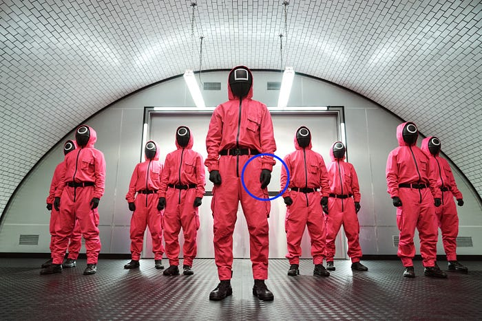
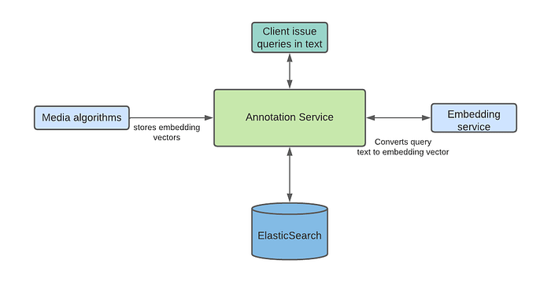
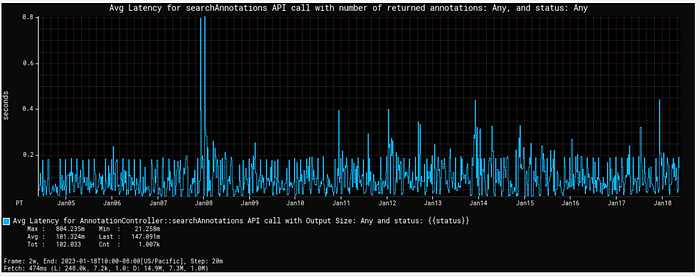
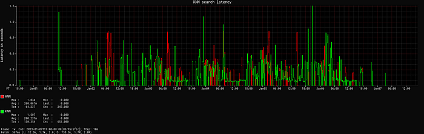

# Scalable Annotation Service — Marken

> by Varun Sekhri, Meenakshi Jindal

## Introduction

At Netflix, we have hundreds of micro services each with its own data models or entities. For example, we have a service that stores a movie entity’s metadata or a service that stores metadata about images. All of these services at a later point want to annotate their objects or entities. Our team, Asset Management Platform, decided to create a generic service called Marken which allows any microservice at Netflix to annotate their entity.

### Annotations

Sometimes people describe annotations as tags but that is a limited definition. **In Marken, an annotation is a piece of metadata which can be attached to an object from any domain.** There are many different kinds of annotations our client applications want to generate. A simple annotation, like below, would describe that a particular movie has violence.

- Movie Entity with id 1234 has violence.

But there are more interesting cases where users want to store temporal (time-based) data or spatial data. In Pic 1 below, we have an example of an application which is used by editors to review their work. They want to change the color of gloves to **rich black** so they want to be able to mark up that area, in this case using a blue circle, and store a comment for it. This is a typical use case for a creative review application.

An example for storing both time and space based data would be an ML algorithm that can identify characters in a frame and wants to store the following for a video

- In a particular frame (time)
- In some area in image (space)
- A character name (annotation data)


*Pic 1 : Editors requesting changes by drawing shapes like the blue circle shown above.*

### Goals for Marken

We wanted to create an annotation service which will have the following goals.

- Allows to annotate any entity. Teams should be able to define their data model for annotation.
- Annotations can be versioned.
- The service should be able to serve real-time, aka UI, applications so CRUD and search operations should be achieved with low latency.
- All data should be also available for offline analytics in Hive/Iceberg.

### Schema

Since the annotation service would be used by anyone at Netflix we had a need to support different data models for the annotation object. A data model in Marken can be described using schema — just like how we create schemas for database tables etc.

Our team, Asset Management Platform, owns a different service that has a json based DSL to describe the schema of a media asset. We extended this service to also describe the schema of an annotation object.

```
{
      "type": "BOUNDING_BOX", ❶
      "version": 0, ❷
      "description": "Schema describing a bounding box",
      "keys": {
        "properties": { ❸
          "boundingBox": {
            "type": "bounding_box",
            "mandatory": true
          },
          "boxTimeRange": {
             "type": "time_range",
             "mandatory": true
          }
      }
    }
}
```

In the above example, the application wants to represent in a video a rectangular area which spans a range of time.

1. Schema’s name is BOUNDING_BOX
2. Schemas can have versions. This allows users to make add/remove properties in their data model. We don’t allow incompatible changes, for example, users can not change the data type of a property.
3. The data stored is represented in the “properties” section. In this case, there are two properties
4. boundingBox, with type “bounding_box”. This is basically a rectangular area.
5. boxTimeRange, with type “time_range”. This allows us to specify start and end time for this annotation.

### Geometry Objects

To represent spatial data in an annotation we used the [Well Known Text (WKT)](https://en.wikipedia.org/wiki/Well-known_text_representation_of_geometry) format. We support following objects

- Point
- Line
- MultiLine
- BoundingBox
- LinearRing

Our model is extensible allowing us to easily add more geometry objects as needed.

### Temporal Objects

Several applications have a requirement to store annotations for videos that have time in it. We allow applications to store time as frame numbers or nanoseconds.

To store data in frames clients must also store frames per second. We call this a SampleData with following components:

- sampleNumber aka frame number
- sampleNumerator
- sampleDenominator

### Annotation Object

Just like schema, an annotation object is also represented in JSON. Here is an example of annotation for BOUNDING_BOX which we discussed above.

```
{  
  "annotationId": { ❶
    "id": "188c5b05-e648-4707-bf85-dada805b8f87",
    "version": "0"
  },
  "associatedId": { ❷
    "entityType": "MOVIE_ID",
    "id": "1234"
  },
  "annotationType": "ANNOTATION_BOUNDINGBOX", ❸
  "annotationTypeVersion": 1,
  "metadata": { ❹
    "fileId": "identityOfSomeFile",
    "boundingBox": {
      "topLeftCoordinates": {
        "x": 20,
        "y": 30
      },
      "bottomRightCoordinates": {
        "x": 40,
        "y": 60
      }
  },
  "boxTimeRange": {
    "startTimeInNanoSec": 566280000000,
    "endTimeInNanoSec": 567680000000
  }
 }
}
```

1. The first component is the unique id of this annotation. An annotation is an immutable object so the identity of the annotation always includes a version. Whenever someone updates this annotation we automatically increment its version.
2. An annotation must be associated with some entity which belongs to some microservice. In this case, this annotation was created for a movie with id “1234”
3. We then specify the schema type of the annotation. In this case it is BOUNDING_BOX.
4. Actual data is stored in the `metadata` section of json. Like we discussed above there is a bounding box and time range in nanoseconds.

### Base schemas

Just like in Object Oriented Programming, our schema service allows schemas to be inherited from each other. This allows our clients to create an “is-a-type-of” relationship between schemas. Unlike Java, we support multiple inheritance as well.

We have several ML algorithms which scan Netflix media assets (images and videos) and create very interesting data for example identifying characters in frames or identifying [match cuts](./match-cutting-at-netflix-finding-cuts-with-smooth-visual-transitions-31c3fc14ae59.md). This data is then stored as annotations in our service.

As a platform service we created a set of base schemas to ease creating schemas for different ML algorithms. One base schema (TEMPORAL_SPATIAL_BASE) has the following optional properties. This base schema can be used by any derived schema and not limited to ML algorithms.

- Temporal (time related data)
- Spatial (geometry data)

And another one BASE_ALGORITHM_ANNOTATION which has the following optional properties which is typically used by ML algorithms.

- `label` (String)
- `confidenceScore` (double) — denotes the confidence of the generated data from the algorithm.
- `algorithmVersion` (String) — version of the ML algorithm.

By using multiple inheritance, a typical ML algorithm schema derives from both TEMPORAL_SPATIAL_BASE and BASE_ALGORITHM_ANNOTATION schemas.

```
{
  "type": "BASE_ALGORITHM_ANNOTATION",
  "version": 0,
  "description": "Base Schema for Algorithm based Annotations",
  "keys": {
    "properties": {
      "confidenceScore": {
        "type": "decimal",
        "mandatory": false,
        "description": "Confidence Score",
      },
      "label": {
        "type": "string",
        "mandatory": false,
        "description": "Annotation Tag",
      },
      "algorithmVersion": {
        "type": "string",
        "description": "Algorithm Version"
      }
    }
  }
}
```

### Architecture

Given the goals of the service we had to keep following in mind.

- Our service will be used by a lot of internal UI applications hence the latency for CRUD and search operations must be low.
- Besides applications we will have ML algorithm data stored. Some of this data can be on the frame level for videos. So the amount of data stored can be large. The databases we pick should be able to scale horizontally.
- We also anticipated that the service will have high RPS.

Some other goals came from search requirements.

- Ability to search the temporal and spatial data.
- Ability to search with different associated and additional associated Ids as described in our Annotation Object data model.
- Full text searches on many different fields in the Annotation Object
- Stem search support

As time progressed the requirements for search only increased and we will discuss these requirements in detail in a different section.

Given the requirements and the expertise in our team we decided to choose Cassandra as the source of truth for storing annotations. For supporting different search requirements we chose ElasticSearch. Besides to support various features we have bunch of internal auxiliary services for eg. zookeeper service, internationalization service etc.


*Marken architecture*

Above picture represents the block diagram of the architecture for our service. On the left we show data pipelines which are created by several of our client teams to automatically ingest new data into our service. The most important of such a data pipeline is created by the Machine Learning team.

One of the key initiatives at Netflix, Media Search Platform, now uses Marken to store annotations and perform various searches explained below. Our architecture makes it possible to easily onboard and ingest data from Media algorithms. This data is used by various teams for eg. creators of promotional media (aka trailers, banner images) to improve their workflows.

### Search

Success of Annotation Service (data labels) depends on the effective search of those labels without knowing much of input algorithms details. As mentioned above, we use the base schemas for every new annotation type (depending on the algorithm) indexed into the service. This helps our clients to search across the different annotation types consistently. Annotations can be searched either by simply data labels or with more added filters like movie id.

We have defined a custom query DSL to support searching, sorting and grouping of the annotation results. Different types of search queries are supported using the [Elasticsearch](https://www.elastic.co/guide/en/elasticsearch/reference/current/search-search.html) as a backend search engine.

- **Full Text Search** — Clients may not know the exact labels created by the ML algorithms. As an example, the label can be _‘shower curtain’. _With full text search, clients can find the annotation by searching using label _‘curtain’_ . We also support fuzzy search on the label values. For example, if the clients want to search _‘curtain’_ but they wrongly typed _‘curtian_` — annotation with the _‘curtain’_ label will be returned.
- **Stem Search **— With global Netflix content supported in different languages, our clients have the requirement to support stem search for different languages. Marken service contains subtitles for a full catalog of titles in Netflix which can be in many different languages. As an example for stem search , `_clothing_` and `_clothes_` can be stemmed to the same root word `_cloth_`. We use ElasticSearch to support stem search for 34 different languages.
- **Temporal Annotations Search** — Annotations for videos are more relevant if it is defined along with the temporal (time range with start and end time) information. Time range within video is also mapped to the frame numbers. We support labels search for the temporal annotations within the provided time range/frame number also.
- **Spatial Annotation Search** — Annotations for video or image can also include the spatial information. For example a bounding box which defines the location of the labeled object in the annotation.
- **Temporal and Spatial Search** — Annotation for video can have both time range and spatial coordinates. Hence, we support queries which can search annotations within the provided time range and spatial coordinates range.
- **Semantics Search** — Annotations can be searched after understanding the intent of the user provided query. This type of search provides results based on the conceptually similar matches to the text in the query, unlike the traditional tag based search which is expected to be exact keyword matches with the annotation labels. ML algorithms also ingest annotations with vectors instead of actual labels to support this type of search. User provided text is converted into a vector using the same ML model, and then search is performed with the converted text-to-vector to find the closest vectors with the searched vector. Based on the clients feedback, such searches provide more relevant results and don’t return empty results in case there are no annotations which exactly match to the user provided query labels. We support semantic search using [Open Distro for ElasticSearch](https://opendistro.github.io/for-elasticsearch-docs/docs/knn/) . We will cover more details on Semantic Search support in a future blog article.


*Semantic search*

- **Range Intersection **— We recently started supporting the range intersection queries across multiple annotation types for a specific title in the real time. This allows the clients to search with multiple data labels (resulted from different algorithms so they are different annotation types) within video specific time range or the complete video, and get the list of time ranges or frames where the provided set of data labels are present. A common example of this query is to find the `James in the indoor shot drinking wine`. For such queries, the query processor finds the results of both data labels (James, Indoor shot) and vector search (drinking wine); and then finds the intersection of resulting frames in-memory.

### Search Latency

Our client applications are studio UI applications so they expect low latency for the search queries. As highlighted above, we support such queries using Elasticsearch. To keep the latency low, we have to make sure that all the annotation indices are balanced, and hotspot is not created with any algorithm backfill data ingestion for the older movies. We followed the rollover indices strategy to avoid such hotspots (as described in our [blog](https://netflixtechblog.medium.com/elasticsearch-indexing-strategy-in-asset-management-platform-amp-99332231e541) for asset management application) in the cluster which can cause spikes in the cpu utilization and slow down the query response. Search latency for the generic text queries are in milliseconds. Semantic search queries have comparatively higher latency than generic text searches. Following graph shows the average search latency for generic search and semantic search (including [KNN](https://en.wikipedia.org/wiki/K-nearest_neighbors_algorithm) and [ANN](https://opendistro.github.io/for-elasticsearch-docs/docs/knn/approximate-knn/) search) latencies.


*Average search latency*


*Semantic search latency*

### Scaling

One of the key challenges while designing the annotation service is to handle the scaling requirements with the growing Netflix movie catalog and ML algorithms. Video content analysis plays a crucial role in the utilization of the content across the studio applications in the movie production or promotion. We expect the algorithm types to grow widely in the coming years. With the growing number of annotations and its usage across the studio applications, prioritizing scalability becomes essential.

Data ingestions from the ML data pipelines are generally in bulk specifically when a new algorithm is designed and annotations are generated for the full catalog. We have set up a different stack (fleet of instances) to control the data ingestion flow and hence provide consistent search latency to our consumers. In this stack, we are controlling the write throughput to our backend databases using Java threadpool configurations.

Cassandra and Elasticsearch backend databases support horizontal scaling of the service with growing data size and queries. We started with a 12 nodes cassandra cluster, and scaled up to 24 nodes to support current data size. This year, annotations are added approximately for the Netflix full catalog. Some titles have more than 3M annotations (most of them are related to subtitles). Currently the service has around 1.9 billion annotations with data size of 2.6TB.

### Analytics

Annotations can be searched in bulk across multiple annotation types to build data facts for a title or across multiple titles. For such use cases, we persist all the annotation data in [iceberg](https://iceberg.apache.org/) tables so that annotations can be queried in bulk with different dimensions without impacting the real time applications CRUD operations latency.

One of the common use cases is when the media algorithm teams read subtitle data in different languages (annotations containing subtitles on a per frame basis) in bulk so that they can refine the ML models they have created.

### Future work

There is a lot of interesting future work in this area.

1. Our data footprint keeps increasing with time. Several times we have data from algorithms which are revised and annotations related to the new version are more accurate and in-use. So we need to do cleanups for large amounts of data without affecting the service.
2. Intersection queries over a large scale of data and returning results with low latency is an area where we want to invest more time.

### Acknowledgements

[Burak Bacioglu](https://www.linkedin.com/in/burakbacioglu/) and other members of the Asset Management Platform contributed in the design and development of Marken.

---
**Tags:** Annotations · Asset Management Software · Machine Learning · Scalable Service · Semantic Search
