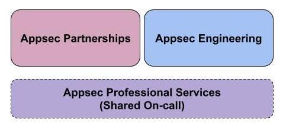
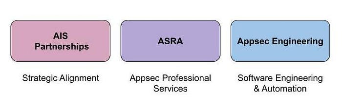

# Scaling Appsec at Netflix (Part 2)

By [Astha Singhal](https://twitter.com/astha_singhal), [Lakshmi Sudheer](https://twitter.com/Lak5hmi5udheer), [Julia Knecht](https://twitter.com/JuliaaMarieee)

The Application Security teams at Netflix are responsible for securing the software footprint that we create to run the Netflix product, the Netflix studio, and the business. Our customers are product and engineering teams at Netflix that build these software services and platforms. The Netflix [cultural values](https://jobs.netflix.com/culture) of ‘Context not Control’ and ‘Freedom and Responsibility’ strongly influence how we do Security at Netflix. Our goal is to manage security risks to Netflix via clear, opinionated security guidance, and by providing risk context to Netflix engineering teams to make pragmatic risk decisions at scale.

A few years ago, we published [this](https://netflixtechblog.medium.com/scaling-appsec-at-netflix-6a13d7ab6043) blog post about how we had organized our team to focus our bandwidth on scalable investments as opposed to just traditional Appsec functions, which were not scaling well in our rapidly growing environment. We leaned into the idea of **strategic security partnerships** and** automation investments **to create more leverage for application security. This became the foundation for our current org structure with teams focused on **Appsec Partnerships** and **Appsec Engineering**. In this operating model, we provided critical Appsec operational services to Netflix — including bug bounty, pentesting, PSIRT (product security incident response), security reviews, and developer security education — via a shared on-call rotation.

Over the past few years, this model has allowed us to focus on investments like** Secure by Default** for baseline security controls,** Security Self-Service** for clear actionable guidance and **Vulnerability Scanning at scale** for software supply chain security. We wanted to share an update on learnings from this model, how our needs have evolved, and where we expect to go from here.

Among the most notable wins, we have been able to utilize this scale focused approach to [productize](./the-show-must-go-on-securing-netflix-studios-at-scale-19b801c86479.md) application security for our rapidly growing studio engineering ecosystem, standardize security baseline for all Enterprise apps, and build [paved roads](https://slideslive.com/38942583/securing-your-companys-crown-jewels-while-the-world-watches-the-crown?ref=tag-2196-latest) to provide Secure by Default Authentication & Authorization capabilities for central data engineering tools. Our focus has been on improving overall security assurance as opposed to just vulnerability prevention. We are now expanding this approach to more parts of our ecosystem. This mindset has also allowed us to invest our capacity for white-glove service towards reasonable residual risk and standard guidance so we can reduce the need for white-glove engagements in the long term (e.g., investment in an API proxy that provides baseline security controls for free as opposed to pentesting all applications that would eventually sit behind that API proxy). This approach has also allowed us to build strong relationships with central engineering teams at Netflix (Data Platform, Developer Tools, Cloud Infrastructure, IAM Product Engineering) that will continue to serve as central points of leverage for security in the long term.

However, it has not been all sunshine and rainbows. On the partnership side, the bespoke nature of each partnership means that there isn’t consistency and redundancy built into the operating model and the related partnership artifacts (e.g., Security Strategy and Roadmap, Threat Model, Deliverable Tracking, Residual Risk Criteria, etc). This leads to insufficient context sharing and high operational churn every time we have personnel changes. The partnership charter has also grown laterally into the infrastructure space as we stack our leverage bets on infrastructure components (like Service Mesh, Container Platform, etc). The skill sets and domain depth in those partnerships has further diversified the skills on the team. But this is a tradeoff on our ability to serve generalized Appsec oncall needs like bug bounty triage with high consistency. Given that partnerships focus on long-running strategic initiatives, the wins can be few and far between and that can be difficult for team motivation. We also found various areas in which security partnership work bleeds into security product solutioning and it can be difficult to identify the appropriate handoff points.

Additionally, as the complexity of our ecosystem grows, the goal of “single PoC into information security” becomes increasingly more difficult to maintain. The team is now investing in **consistency** and **scalability** of partnership artifacts and communication channels, better **redundancy** and **context sharing** on the team through squad operating models, crisper **engagement criteria**, and **definition of done** for partnership engagements.

Our Appsec Engineering team builds products to help us scale, e.g.: a dynamic Asset Inventory that understands the nuances of our bespoke engineering ecosystem and how our applications and data relate to each other. This has evolved their identity to be a software engineering team that focuses on security problems as opposed to a security engineering team that writes code/software. Our hiring has reflected that shift, and we’ve added more dedicated software engineers (SWEs) to the team to help us build out software. With this shift, we’ve incorporated **engineering best practices**, and our products have appropriate investments toward **reliability** and **sustainability**. As the team skews towards more software engineering focused talent, ramping up to support the shared Appsec-focused on-call has been challenging.

While originally built to support AppSec use cases around providing guidance to developers in a self-service way, interest in the rich data and relationships we have in our tools, especially our Asset Inventory, has grown. As a result, we’ve continued to invest in making our solutions scalable and accessible, so security engineers can get the data they need more easily to drive security use cases. We’ve also discovered, through interviews with engineers, that self-service guidance doesn’t stand on its own. Moving forward, the team is investing in understanding our customer use cases better, and shifting our self-service story toward higher-context, more opinionated automated guidance to ensure developers have everything they need to make truly informed decisions about the security of their applications (similar to how they might make resiliency or other product decisions).

As the Netflix business and engineering workforce has grown, **our software footprint has also grown and become more heterogeneous**. At the same time, partnerships have grown more and more strategic, and engineering has grown more and more software-focused. As our team specialized, what emerged was a loss of strategic focus for our AppSec Professional Services charter. These services now need more dedicated strategic investment as the volume and support needs have grown. So, we are now building out a dedicated capability focused on these critical services that are important investments to be made and can no longer be served effectively via a shared Appsec on-call. This will be our **“Appsec Reviews and Assessments”** function and we are [hiring](https://jobs.netflix.com/jobs/210140918) for passionate, early career Appsec engineers to join this group.

We will continue to learn as we go through this next phase of evolution of our program. We hope to continue to share these learnings with the broader community interested in scalable product and application security.

---
**Tags:** Security · Appsec · Hiring
