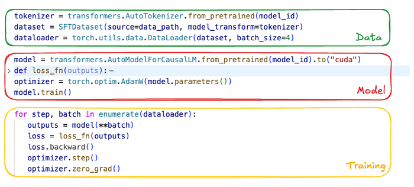
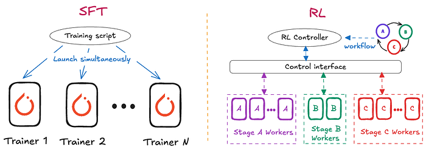
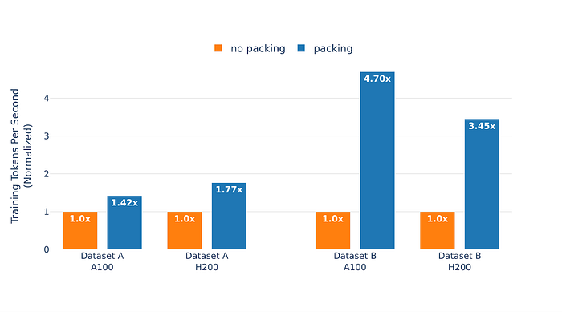

# Scaling LLM Post-Training at Netflix

[Baolin Li](https://www.linkedin.com/in/baolin-li-659426115/), [Lingyi Liu](https://www.linkedin.com/in/lingyi-liu-4b866016/), [Binh Tang](https://www.linkedin.com/in/binh-tang-3b76557b/), [Shaojing Li](https://www.linkedin.com/in/shaojingli/)

## Introduction

Pre-training gives Large Language Models (LLMs) broad linguistic ability and general world knowledge, but post-training is the phase that actually aligns them to concrete intents, domain constraints, and the reliability requirements of production environments. At Netflix, we are exploring how LLMs can enable new member experiences across recommendation, personalization, and search, which requires adapting generic foundation models so they can better reflect our catalog and the nuances of member interaction histories. At Netflix scale, **post-training quickly becomes an engineering problem as much as a modeling one**: building and operating complex data pipelines, coordinating distributed state across multi-node GPU clusters, and orchestrating workflows that interleave training and inference. This blog describes the architecture and engineering philosophy of our internal **Post-Training Framework**, built by the AI Platform team to hide infrastructure complexity so researchers and model developers can focus on model innovation — not **distributed** systems plumbing.

## A Model Developer’s Post-Training Journey

Post-training often starts deceptively simply: curate proprietary domain data, load an open-weight model from Hugging Face, and iterate batches through it. At the experimentation scale, that’s a few lines of code. But when fine-tuning production-grade LLMs at scale, the gap between “running a script” and “robust post-training” becomes an abyss of engineering edge cases.

*Figure 1. Simple steps to post-train an open-weight model.*

### Getting the data right

On paper, post-training is straightforward: choose a tokenizer, preprocess the dataset, and build a dataloader. In practice, data preparation is where things break. High-quality post-training — instruction following, multi-turn dialogue, Chain-of-Thought — depends on precisely controlling which tokens contribute to the loss. Hugging Face chat templates serialize conversations, but don’t specify what to train on versus ignore. The pipeline must apply explicit loss masking so only assistant tokens are optimized; otherwise the model learns from prompts and other non-target text, degrading quality.

Variable sequence length is another pitfall. Padding within a batch can waste compute, and uneven shapes across FSDP workers can cause GPU synchronization overhead. A more GPU-efficient approach is to pack multiple samples into fixed-length sequences and use a “document mask” to prevent cross-attention across samples, reducing padding and keeping shapes consistent.

### Setting up the model

Loading an open-source checkpoint sounds simple until the model no longer fits on one GPU. At that point you need a sharding strategy (e.g., FSDP, TP) and must load partial weights directly onto the device mesh to avoid ever materializing the full model on a single device.

After loading, you still need to make the model trainable: choose full fine-tuning vs. LoRA, and apply optimizations like activation checkpointing, compilation, and correct precision settings (often subtle for RL, where rollout and policy precision must align). Large vocabularies (>128k) add a further memory trap: logits are_ [batch, seq_len, vocab] _and can spike peak memory. Common mitigations include dropping ignored tokens before projection and computing logits/loss in chunks along the sequence dimension.

### Starting the training

Even with data and models ready, production training is not a simple “for loop”. The system must support everything from SFT’s forward/backward pass to on-policy RL workflows that interleave rollout generation, reward/reference inference, and policy updates.

At Netflix scale, training runs as a distributed job. We use Ray to orchestrate workflows via actors, decoupling modeling logic from hardware. Robust runs also require experiment tracking (model quality metrics like loss and efficiency metrics like MFU) and fault tolerance via standardized checkpoints to resume cleanly after failures.

These challenges motivate a post-training framework that lets developers focus on modeling rather than distributed systems and operational details.

## The Netflix Post-Training Framework

We built Netflix’s LLM post-training framework so Netflix model developers can turn ideas like those in Figure 1 into scalable, robust training jobs. It addresses the engineering hurdles described above, and also constraints that are specific to the Netflix ecosystem. Existing tools (e.g., Thinking Machines’ [Tinker](https://thinkingmachines.ai/tinker/)) work well for standard chat and instruction-tuning, but their structure can limit deeper experimentation. In contrast, our internal use cases often require architectural variation (for example, customizing output projection heads for task-specific objectives), expanded or nonstandard vocabularies driven by semantic IDs or special tokens, and even transformer models pre-trained from scratch on domain-specific, non-natural-language sequences. Supporting this range requires a framework that prioritizes flexibility and extensibility over a fixed fine-tuning paradigm.

*Figure 2. The post-training library within Netflix stack*

Figure 2 shows the end-to-end stack from infrastructure to trained models. At the base is Mako, Netflix’s internal ML compute platform, which provisions GPUs on AWS. On top of Mako, we run robust open-source components — PyTorch, Ray, and vLLM — largely out of the box. Our post-training framework sits above these foundations as a library: it provides reusable utilities and standardized training recipes for common workflows such as Supervised Fine-Tuning (SFT), Direct Preference Optimization (DPO), Reinforcement Learning (RL), and Knowledge Distillation. Users typically express jobs as configuration files that select a recipe and plug in task-specific components.

*Figure 3. Main components developed for the post-training framework*

Figure 3 summarizes the modular components we built to reduce complexity across four dimensions. As with most ML systems, training success hinges on three pillars — **Data**, **Model**, and **Compute** — and the rise of RL fine-tuning adds a fourth pillar: **Workflow**, to support multi-stage execution patterns that don’t fit a simple training loop. Below, we detail the specific abstractions and features the framework provides for each of these dimensions:

- **Data:** Dataset abstractions for SFT, reward modeling, and RL; high-throughput streaming from cloud and disk for datasets that exceed local storage; and asynchronous, on-the-fly sequence packing to overlap CPU-heavy packing with GPU execution and reduce idle time.
- **Model:** Support for modern architectures (e.g., Qwen3, Gemma3) and Mixture-of-Experts variants (e.g., Qwen3 MoE, GPT-OSS); LoRA integrated into model definitions; and high-level sharding APIs so developers can distribute large models across device meshes without writing low-level distributed code.
- **Compute:** A unified job submission interface that scales from a single node to hundreds of GPUs; MFU (Model FLOPS Utilization) monitoring that remains accurate under custom architectures and LoRA; and comprehensive checkpointing (states of trained parameters, optimizer, dataloader, data mixer, etc.) to enable exact resumption after interruptions.
- **Workflow:** Support for training paradigms beyond SFT, including complex online RL. In particular, we extend Single Program, Multiple Data (SPMD) style SFT workloads to run online RL with a hybrid single-controller + SPMD execution model, which we’ll describe next.

Today, this framework supports research use cases ranging from post-training large-scale foundation models to fine-tuning specialized expert models. By standardizing these workflows, we’ve lowered the barrier for teams to experiment with advanced techniques and iterate more quickly.

## Learnings from Building the Post-Training Framework

Building a system of this scope wasn’t a linear implementation exercise. It meant tracking a fast-moving open-source ecosystem, chasing down failure modes that only appear under distributed load, and repeatedly revisiting architectural decisions as the post-training frontier shifted. Below are three engineering learnings and best practices that shaped the framework.

### Scaling from SFT to RL

We initially designed the library around Supervised Fine-Tuning (SFT): relatively static data flow, a single training loop, and a Single Program, Multiple Data (SPMD) execution model. That assumption stopped holding in 2025. With DeepSeek-R1 and the broader adoption of efficient on-policy RL methods like GRPO, SFT became table stakes rather than the finish line. Staying close to the frontier required infrastructure that could move from “offline training loop” to “multi-stage, on-policy orchestration.”

SFT’s learning signal is dense and immediate: for each token position we compute logits over the full vocabulary and backpropagate a differentiable loss. Infrastructure-wise, this looks a lot like pre-training and maps cleanly to SPMD — every GPU worker runs the same step function over a different shard of data, synchronizing through Pytorch distributed primitives.

On-policy RL changes the shape of the system. The learning signal is typically sparse and delayed (e.g., a scalar reward at the end of an episode), and the training step depends on data generated by the current policy. Individual sub-stages — policy updates, rollout generation, reference model inference, reward model scoring — can each be implemented as SPMD workloads, but the end-to-end algorithm needs explicit coordination: you’re constantly handing off artifacts (prompts, sampled trajectories, rewards, advantages) across stages and synchronizing their lifecycle.

In our original SFT architecture, the driver node was intentionally “thin”: it launched N identical Ray actors, each encapsulating the full training loop, and scaling meant launching more identical workers. That model breaks down for RL. RL required us to decompose the system into distinct roles — Policy, Rollout Workers, Reward Model, Reference Model, etc. — and evolve the driver into an active controller that encodes the control plane: when to generate rollouts, how to batch and score them, when to trigger optimization, and how to manage cluster resources across phases.

*Figure 4. Architectural differences of SFT and RL framework*

Figure 4 highlights this shift. To add RL support without reinventing distributed orchestration from scratch, we integrated the core infrastructure from the open-source [**Verl**](https://github.com/verl-project/verl) library to manage Ray actor lifecycle and GPU resource allocation. Leveraging Verl’s backend let us focus on the “modeling surface area” — our Data/Model/Compute abstractions and internal optimizations — while keeping orchestration concerns decoupled. The result is a hybrid design: a unified user interface where developers can move between SFT and RL workflows without adopting an entirely different mental model or API set.

### Hugging Face-Centric Experience

The Hugging Face Hub has effectively become the default distribution channel for open-weight LLMs, tokenizers, and configs. We designed the framework to stay close to that ecosystem rather than creating an isolated internal standard. Even when we use optimized internal model representations for speed, we load and save checkpoints in standard Hugging Face formats. This avoids “walled garden” friction and lets teams pull in new architectures, weights, and tokenizers quickly.

This philosophy also shaped our tokenizer story. Early on, we bound directly to low-level tokenization libraries (e.g., SentencePiece, tiktoken) to maximize control. In practice, that created a costly failure mode: silent training–serving skew. Our inference stack (vLLM) defaults to Hugging Face AutoTokenizer, and tiny differences in normalization, special token handling, or chat templating can yield different token boundaries — exactly the kind of mismatch that shows up later as inexplicable quality regressions. We fixed this by making Hugging Face AutoTokenizer the single source of truth. We then built a thin compatibility layer (BaseHFModelTokenizer) to handle post-training needs — setting padding tokens, injecting generation markers to support loss masking, and managing special tokens / semantic IDs — while ensuring the byte-level tokenization path matches production.

We do take a different approach for model implementations. Rather than training directly on transformers model classes, we maintain our own optimized, unified model definitions that can still load/save Hugging Face checkpoints. This layer is what enables framework-level optimizations — e.g., FlexAttention, memory-efficient chunked cross-entropy, consistent MFU accounting, and uniform LoRA extensibility — without re-implementing them separately for every model family. A unified module naming convention also makes it feasible to programmatically locate and swap components (Attention, MLP, output heads) across architectures, and provides a consistent surface for Tensor Parallelism and FSDP wrapping policies.

The trade-off is clear: supporting a new model family requires building a bridge between the Hugging Face reference implementation and our internal definition. To reduce that overhead, we use AI coding agents to automate much of the conversion work, with a strict **logit verifier** as the gate: given random inputs, our internal model must match the Hugging Face logits within tolerance. Because the acceptance criterion is mechanically checkable, agents can iterate autonomously until the implementation is correct, dramatically shortening the time-to-support for new architectures.

Today, this design means we can only train architectures we explicitly support — an intentional constraint shared by other high-performance systems like [vLLM, SGLang](https://huggingface.co/docs/transformers/main/transformers_as_backend), and [torchtitan](https://github.com/pytorch/torchtitan/pull/2048). To broaden coverage, we plan to add a fallback Hugging Face backend, similar to the compatibility patterns these projects use: users will be able to run training directly on native transformers models for rapid exploration of novel architectures, with the understanding that some framework optimizations and features may not apply in that mode.

### Providing Differential Value

A post-training framework is only worth owning if it delivers clear value beyond assembling OSS components. We build on open source for velocity, but we invest heavily where off-the-shelf tools tend to be weakest: performance tuned to our workload characteristics, and integration with Netflix-specific model and business requirements. Here are some concrete examples:

First, we optimize training efficiency for our real use cases. A representative example is extreme variance in sequence length. In FSDP-style training, long-tail sequences create stragglers: faster workers end up waiting at synchronization points for the slowest batch, lowering utilization. Standard bin-packing approaches help, but doing them offline at our data scale can add substantial preprocessing latency and make it harder to keep datasets fresh. Instead, we built on-the-fly sequence packing that streams samples from storage and dynamically packs them in memory. Packing runs asynchronously, overlapping CPU work with GPU compute. Figure 5 shows the impact: for our most skewed dataset, on-the-fly packing improved the effective token throughput by up to 4.7x.

*Figure 5. Training throughput on two of our internal datasets on A100 and H200 GPUs*

We also encountered subtler performance cliffs around vocabulary expansion. Our workloads frequently add custom tokens and semantic IDs. We found that certain vocabulary sizes could cause the language model head to fall back from a highly optimized cuBLAS kernel to a much slower CUTLASS path, tripling that layer’s execution time. The framework now automatically pads vocabulary sizes to multiples of 64 so the compiler selects the fast kernel, preserving throughput without requiring developers to know these low-level constraints.

Second, owning the framework lets us support “non-standard” transformer use cases that generic LLM tooling rarely targets. For example, some internal models are trained on member interaction event sequences rather than natural language, and may require bespoke RL loops that integrate with highly-customized inference engines and optimize business-defined metrics. These workflows demand custom environments, reward computation, and orchestration patterns — while still needing the same underlying guarantees around performance, tracking, and fault tolerance. The framework is built to accommodate these specialized requirements without fragmenting into one-off pipelines, enabling rapid iteration.

## Wrap up

Building the Netflix Post-Training Framework has been a continual exercise in balancing standardization with specialization. By staying anchored to the open-source ecosystem, we’ve avoided drifting into a proprietary stack that diverges from where the community is moving. At the same time, by owning the core abstractions around Data, Model, Compute, and Workflow, we’ve preserved the freedom to optimize for Netflix-scale training and Netflix-specific requirements.

In the process, we’ve moved post-training from a loose collection of scripts into a managed, scalable system. Whether the goal is maximizing SFT throughput, orchestrating multi-stage on-policy RL, or training transformers over member interaction sequences, the framework provides a consistent set of primitives to do so reliably and efficiently. As the field shifts toward more agentic, reasoning-heavy, and multimodal architectures, this foundation will help us translate new ideas into scalable GenAI prototypes — **so experimentation is constrained by our imagination**, not by operational complexity.

## Acknowledgements

This work builds on the momentum of the broader open-source ML community. We’re especially grateful to the teams and contributors behind Torchtune, Torchtitan, and Verl, whose reference implementations and design patterns informed many of our training framework choices — particularly around scalable training recipes, distributed execution, and RL-oriented orchestration. We also thank our partner teams in Netflix AI for Member Systems for close collaboration, feedback, and shared problem-solving throughout the development and rollout of the Post-Training Framework, and the Training Platform team for providing the robust infrastructure and operational foundation that makes large-scale post-training possible.

---
**Tags:** Reinforcement Learning · LLM · Ai Infrastructure
