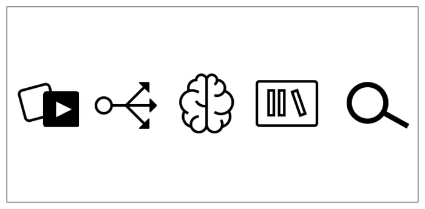
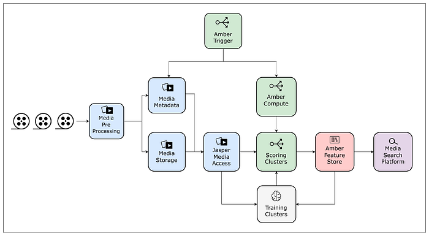
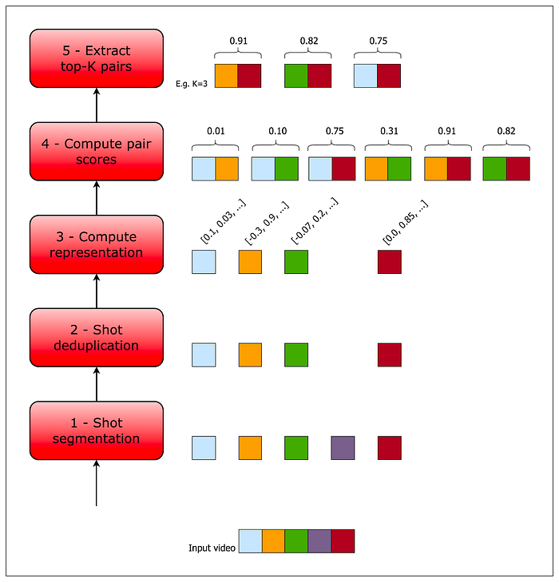
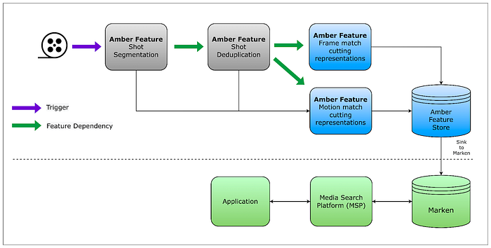

# Scaling Media Machine Learning at Netflix

By [Gustavo Carmo](https://www.linkedin.com/in/gucarmo/), [Elliot Chow](https://www.linkedin.com/in/ellchow/), [Nagendra Kamath](https://www.linkedin.com/in/nagendrak), [Akshay Modi](https://www.linkedin.com/in/akshay-naresh-modi), [Jason Ge](https://www.linkedin.com/in/jasonge27), [Wenbing Bai](https://www.linkedin.com/in/wenbingbai), [Jackson de Campos](https://www.linkedin.com/in/jacksondecampos), [Lingyi Liu](https://www.linkedin.com/in/lingyi-liu-4b866016/), [Pablo Delgado](https://www.linkedin.com/in/pabloadelgado), [Meenakshi Jindal](https://www.linkedin.com/in/meenakshijindal), [Boris Chen](https://www.linkedin.com/in/boris-chen-b921a214/), [Vi Iyengar](https://www.linkedin.com/in/vi-pallavika-iyengar-144abb1b/), [Kelli Griggs](https://www.linkedin.com/in/kelli-griggs-32990125/), [Amir Ziai](https://linkedin.com/in/amirziai), [Prasanna Padmanabhan](https://www.linkedin.com/in/prasannapadmanabhan), and [Hossein Taghavi](https://www.linkedin.com/in/mhtaghavi/)



## Introduction

In 2007, Netflix started offering streaming alongside its DVD shipping services. As the catalog grew and users adopted streaming, so did the opportunities for creating and improving our recommendations. With a catalog spanning thousands of shows and a diverse member base spanning millions of accounts, recommending the right show to our members is crucial.

Why should members care about any particular show that we recommend? Trailers and artworks provide a glimpse of what to expect in that show. We have been leveraging machine learning (ML) models to [personalize artwork](https://netflixtechblog.com/artwork-personalization-c589f074ad76) and to help our [creatives create promotional content](./new-series-creating-media-with-machine-learning-5067ac110bcd.md) efficiently.

Our goal in building a media-focused ML infrastructure is to reduce the time from ideation to productization for our media ML practitioners. We accomplish this by paving the path to:

- **Accessing** and processing **media data** (e.g. video, image, audio, and text)
- **Training** large-scale models efficiently
- **Productizing** models in a self-serve fashion in order to execute on existing and newly arriving assets
- **Storing** and **serving** model outputs for consumption in promotional content creation

In this post, we will describe some of the challenges of applying machine learning to media assets, and the infrastructure components that we have built to address them. We will then present a case study of using these components in order to optimize, scale, and solidify an existing pipeline. Finally, we’ll conclude with a brief discussion of the opportunities on the horizon.


---

## Infrastructure challenges and components

In this section, we highlight some of the unique challenges faced by media ML practitioners, along with the infrastructure components that we have devised to address them.


*Figure 1 — Media Machine Learning Infrastructure*


### Media Access: Jasper

In the early days of media ML efforts, it was very hard for researchers to access media data. Even after gaining access, one needed to deal with the challenges of homogeneity across different assets in terms of decoding performance, size, metadata, and general formatting.

To streamline this process, we_ _standardized media assets with pre-processing steps that create and store dedicated quality-controlled derivatives with associated snapshotted metadata. In addition, we provide a unified library that enables ML practitioners to seamlessly access video, audio, image, and various text-based assets.


### Media Feature Storage: Amber Feature Store

Media feature computation tends to be expensive and time-consuming. Many ML practitioners independently computed identical features against the same asset in their ML pipelines.

**To reduce costs and promote reuse, we have built a feature store in order to memoize features/embeddings tied to media entities. This feature store is equipped with a data replication system that enables copying data to different storage solutions depending on the required access patterns.**


### Compute Triggering and Orchestration: Amber Compute

Productized models must run over newly arriving assets for scoring. In order to satisfy this requirement, ML practitioners had to develop bespoke triggering and orchestration components per pipeline. Over time, these bespoke components became the source of many downstream errors and were difficult to maintain.

Amber is a suite of multiple infrastructure components that offers triggering capabilities to initiate the computation of algorithms with recursive dependency resolution.


### Training Performance

Media model training poses multiple system challenges in storage, network, and GPUs. We have developed a large-scale GPU training cluster based on [Ray](https://www.ray.io/), which supports multi-GPU / multi-node distributed training. We precompute the datasets, offload the preprocessing to CPU instances, optimize model operators within the framework, and utilize a high-performance file system to resolve the data loading bottleneck, increasing the entire training system throughput 3–5 times.


### Serving and Searching

Media feature values can be optionally synchronized to other systems depending on necessary query patterns. One of these systems is [Marken](./scalable-annotation-service-marken-f5ba9266d428.md), a scalable service used to persist feature values as annotations, which are versioned and strongly typed constructs associated with Netflix media entities such as videos and artwork.

This service provides a user-friendly query DSL for applications to perform search operations over these annotations with specific filtering and grouping. [Marken](./scalable-annotation-service-marken-f5ba9266d428.md) provides unique search capabilities on temporal and spatial data by time frames or region coordinates, as well as vector searches that are able to scale up to the entire catalog.

ML practitioners interact with this infrastructure mostly using Python, but there is a plethora of tools and platforms being used in the systems behind the scenes. These include, but are not limited to, [Conductor](https://conductor.netflix.com/), [Dagobah](https://www.youtube.com/watch?v=V2E1PdboYLk), [Metaflow](https://metaflow.org/), [Titus](https://netflix.github.io/titus/), [Iceberg](https://github.com/Netflix/iceberg), Trino, Cassandra, Elastic Search, Spark, Ray, [MezzFS](./mezzfs-mounting-object-storage-in-netflixs-media-processing-platform-cda01c446ba.md), S3, [Baggins](https://www.infoq.com/presentations/netflix-drive/), [FSx](https://aws.amazon.com/fsx/), and Java/Scala-based applications with Spring Boot.


---

## Case study: scaling match cutting using the media ML infra

The _Media Machine Learning Infrastructure_ is empowering various scenarios across Netflix, and some of them are described [here](https://netflixtechblog.medium.com/new-series-creating-media-with-machine-learning-5067ac110bcd). In this section, we showcase the use of this infrastructure through the case study of [_Match Cutting_](./match-cutting-at-netflix-finding-cuts-with-smooth-visual-transitions-31c3fc14ae59.md).

### Background

_Match Cutting_ is a video editing technique. It’s a transition between two [shots](https://en.wikipedia.org/wiki/Shot_(filmmaking)#:~:text=In%20filmmaking%20and%20video%20production,express%20emotion%2C%20ideas%20and%20movement.) that uses similar visual framing, composition, or action to fluidly bring the viewer from one scene to the next. It is a powerful visual storytelling tool used to create a connection between two scenes.


*Figure 2 — a series of frame match cuts from Wednesday.*

In [an earlier post](./match-cutting-at-netflix-finding-cuts-with-smooth-visual-transitions-31c3fc14ae59.md), we described how we’ve used machine learning to find candidate pairs. In this post, we will focus on the engineering and infrastructure challenges of delivering this feature.

### Where we started

Initially, we built _Match Cutting_ to find matches across a single title (i.e. either a movie or an episode within a show). An average title has 2k shots, which means that we need to enumerate and process ~2M pairs.


*Figure 3- The original Match Cutting pipeline before leveraging media ML infrastructure components.*

This entire process was encapsulated in a single [Metaflow](https://metaflow.org/) flow. Each step was mapped to a Metaflow [step](https://docs.metaflow.org/metaflow/basics#what-should-be-a-step), which allowed us to control the amount of resources used per step.

**Step 1**

We download a video file and produce [shot](https://en.wikipedia.org/wiki/Shot_(filmmaking)) boundary metadata. An example of this data is provided below:

```
SB = {0: [0, 20], 1: [20, 30], 2: [30, 85], …}
```

Each key in the `SB` dictionary is a shot index and each value represents the frame range corresponding to that shot index. For example, for the shot with index `1` (the second shot), the value captures the shot frame range `[20, 30]`, where `20` is the start frame and `29` is the end frame (i.e. the end of the range is exclusive while the start is inclusive).

Using this data, we then materialized individual clip files (e.g. `clip0.mp4`, `clip1.mp4`, etc) corresponding to each shot so that they can be processed in Step 2.

**Step 2**

This step works with the individual files produced in _Step 1_ and the list of shot boundaries. We first extract a representation (aka embedding) of each file using a video encoder (i.e. an algorithm that converts a video to a fixed-size vector) and use that embedding to identify and remove duplicate shots.

In the following example `SB_deduped` is the result of deduplicating `SB`:

```
# the second shot (index 1) was removed and so was clip1.mp4
SB_deduped = {0: [0, 20], 2: [30, 85], …}
```

`SB_deduped` along with the surviving files are passed along to step 3.

**Step 3**

We compute another representation per shot, depending on the flavor of match cutting.

**Step 4**

We enumerate all pairs and compute a score for each pair of representations. These scores are stored along with the shot metadata:

```
[
  # shots with indices 12 and 729 have a high matching score
  {shot1: 12, shot2: 729, score: 0.96},
  # shots with indices 58 and 419 have a low matching score
  {shot1: 58, shot2: 410, score: 0.02},
  …
]
```

**Step 5**

Finally, we sort the results by score in descending order and surface the top-`K` pairs, where `K` is a parameter.

### The problems we faced

This pattern works well for a single flavor of match cutting and finding matches within the same title. As we started venturing beyond single-title and added more flavors, we quickly faced a few problems.

**Lack of standardization**

The representations we extract in _Steps 2_ and _Step 3_ are sensitive to the characteristics of the input video files. In some cases such as instance segmentation, the output representation in _Step 3_ is a function of the dimensions of the input file.

Not having a standardized input file format (e.g. same encoding recipes and dimensions) created matching quality issues when representations across titles with different input files needed to be processed together (e.g. multi-title match cutting).

**Wasteful repeated computations**

Segmentation at the shot level is a common task used across many media ML pipelines. Also, deduplicating similar shots is a common step that a subset of those pipelines share.

We realized that memoizing these computations not only reduces waste but also allows for congruence between algo pipelines that share the same preprocessing step. In other words, having a single source of truth for shot boundaries helps us guarantee additional properties for the data generated downstream. As a concrete example, knowing that algo `A` and algo_ _`B` both used the same shot boundary detection step, we know that shot index `i` has identical frame ranges in both. Without this knowledge, we’ll have to check if this is actually true.

**Gaps in media-focused pipeline triggering and orchestration**

Our stakeholders (i.e. video editors using match cutting) need to start working on titles as quickly as the video files land. Therefore, we built a mechanism to trigger the computation upon the landing of new video files. This triggering logic turned out to present two issues:

1. Lack of standardization meant that the computation was sometimes re-triggered for the same video file due to changes in metadata, without any content change.
2. Many pipelines independently developed similar bespoke components for triggering computation, which created inconsistencies.

Additionally, decomposing the pipeline into modular pieces and orchestrating computation with dependency semantics did not map to existing workflow orchestrators such as [Conductor](https://conductor.netflix.com/) and [Meson](https://netflixtechblog.com/meson-workflow-orchestration-for-netflix-recommendations-fc932625c1d9) out of the box. The media machine learning domain needed to be mapped with some level of coupling between media assets metadata, media access, feature storage, feature compute and feature compute triggering, in a way that new algorithms could be easily plugged with predefined standards.

This is where _Amber_ comes in, offering a _Media Machine Learning Feature Development and Productization Suite,_ gluing all aspects of shipping algorithms while permitting the interdependency and composability of multiple smaller parts required to devise a complex system.

Each part is in itself an algorithm, which we call an _Amber Feature_, with its own scope of computation, storage, and triggering. Using dependency semantics, an _Amber Feature_ can be plugged into other_ Amber Features_, allowing for the composition of a complex mesh of interrelated algorithms.

**Match Cutting across titles**

_Step 4_ entails a computation that is quadratic in the number of shots. For instance, matching across a series with 10 episodes with an average of 2K shots per episode translates into 200M comparisons. Matching across 1,000 files (across multiple shows) would take approximately 200 trillion computations.

Setting aside the sheer number of computations required momentarily, editors may be interested in considering any subset of shows for matching. The naive approach is to pre-compute all possible subsets of shows. Even assuming that we only have 1,000 video files, this means that we have to pre-compute 2¹⁰⁰⁰ subsets, which is more than the [number of atoms in the observable universe](https://en.wikipedia.org/wiki/Observable_universe#Matter_content%E2%80%94number_of_atoms)!

Ideally, we want to use an approach that avoids both issues.

### Where we landed

The _Media Machine Learning Infrastructure _provided many of the building blocks required for overcoming these hurdles.


**Standardized video encodes**

The entire Netflix catalog is pre-processed and stored for reuse in machine learning scenarios. _Match Cutting _benefits from this standardization as it relies on homogeneity across videos for proper matching.


**Shot segmentation and deduplication reuse**

Videos are matched at the shot level. Since breaking videos into shots is a very common task across many algorithms, the infrastructure team provides this canonical feature that can be used as a dependency for other algorithms. With this, we were able to reuse memoized feature values, saving on compute costs and guaranteeing coherence of shot segments across algos.


**Orchestrating embedding computations**

We have used _Amber_’s feature dependency semantics to tie the computation of embeddings to shot deduplication. Leveraging _Amber_’s triggering, we automatically initiate scoring for new videos as soon as the standardized video encodes are ready. _Amber_ handles the computation in the dependency chain recursively.


**Feature value storage**

We store embeddings in _Amber_, which guarantees immutability, versioning, auditing, and various metrics on top of the feature values. This also allows other algorithms to be built on top of the _Match Cutting_ output as well as all the intermediate embeddings.


**Pair computation and sink to **[**Marken**](./scalable-annotation-service-marken-f5ba9266d428.md)

We have also used _Amber’s _synchronization mechanisms to replicate data from the main feature value copies to [_Marken_](./scalable-annotation-service-marken-f5ba9266d428.md), which is used for serving.


**Media Search Platform**

Used to serve high-scoring pairs to video editors in internal applications via [_Marken_](./scalable-annotation-service-marken-f5ba9266d428.md).

The following figure depicts the new pipeline using the above-mentioned components:


*Figure 4 — Match cutting pipeline built using media ML infrastructure components. Interactions between algorithms are expressed as a feature mesh, and each Amber Feature encapsulates triggering and compute.*


---

## Conclusion and Future Work

The intersection of media and ML holds numerous prospects for innovation and impact. We examined some of the unique challenges that media ML practitioners face and presented some of our early efforts in building a platform that accommodates the scaling of ML solutions.

In addition to the promotional media use cases we discussed, we are extending the infrastructure to facilitate a growing set of use cases. Here are just a few examples:

- ML-based VFX tooling
- Improving recommendations using a suite of content understanding models
- Enriching content understanding ML and creative tooling by leveraging personalization signals and insights

In future posts, we’ll dive deeper into more details about the solutions built for each of the components we have briefly described in this post.

If you’re interested in media ML, we’re always looking for [engineers](https://jobs.netflix.com/search?q=engineer) and ML researchers and engineers to join us!

### Acknowledgments

Special thanks to [Ben Klein](https://www.linkedin.com/in/benjamin-klein-usa/), [Fernando Amat Gil](https://www.linkedin.com/in/fernando-amat-6110931/), [Varun Sekhri](https://www.linkedin.com/in/varun-sekhri-087a213/), [Guru Tahasildar](https://www.linkedin.com/in/gurutahasildar/), and [Burak Bacioglu](https://www.linkedin.com/in/burakbacioglu/) for contributing to ideas, designs, and discussions.

---
**Tags:** Machine Learning · Mlops · Media · Netflix · Distributed Systems
