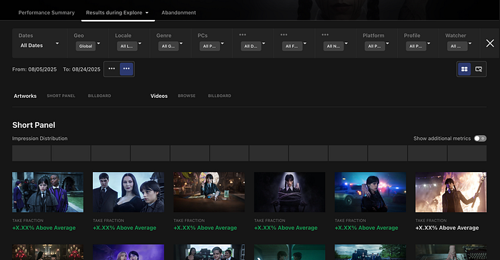
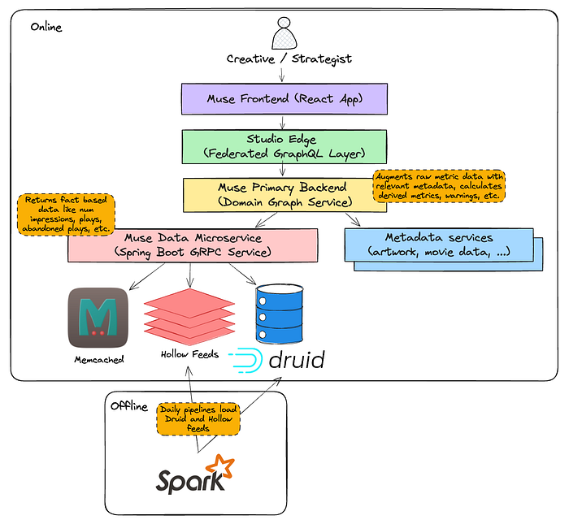
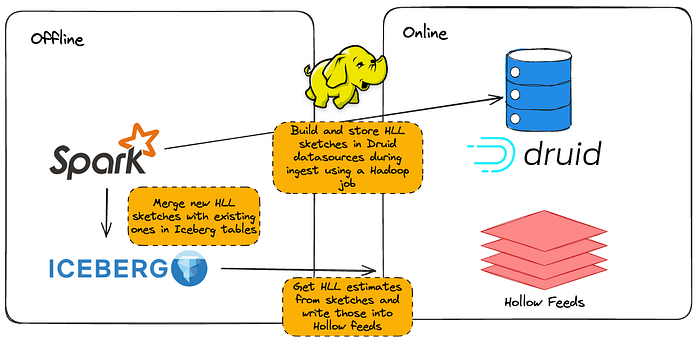
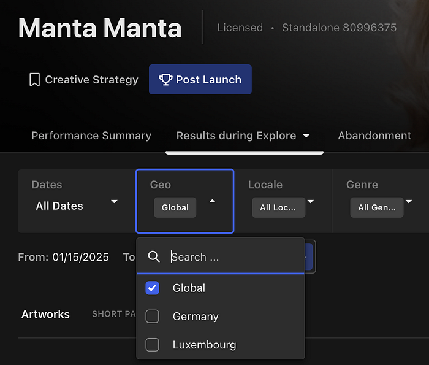
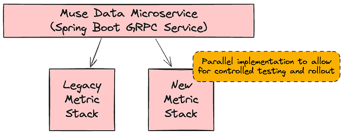

# Scaling Muse: How Netflix Powers Data-Driven Creative Insights at Trillion-Row Scale

By [Andrew Pierce](https://www.linkedin.com/in/andrew-pierce-34443a7/), [Chris Thrailkill](https://www.linkedin.com/in/chris-thrailkill-a268914/), [Victor Chiapaikeo](https://www.linkedin.com/in/victor-chiapaikeo-974a501b/)

**At Netflix, we prioritize getting timely data and insights into the hands of the people who can act on them.** One of our key internal applications for this purpose is Muse. Muse’s ultimate goal is to help Netflix members discover content they’ll love by ensuring our promotional media is as effective and authentic as possible. It achieves this by equipping creative strategists and launch managers with data-driven insights showing which artwork or video clips resonate best with global or regional audiences and flagging outliers such as potentially misleading (clickbait-y) assets. These kinds of applications fall under Online Analytical Processing (OLAP), a category of systems designed for complex querying and data exploration. However, enabling Muse to support new, more advanced filtering and grouping capabilities while maintaining high performance and data accuracy has been a challenge. Previous posts have touched on [artwork personalization](https://netflixtechblog.com/artwork-personalization-c589f074ad76) and our [impressions architecture](./introducing-impressions-at-netflix-e2b67c88c9fb.md). **In this post, we’ll discuss some steps we’ve taken to evolve the Muse data serving layer to enable new capabilities while maintaining high performance and data accuracy.**


*Muse application*

## An Evolving Architecture

Like many early analytics applications, Muse began as a simple dashboard powered by batch data pipelines (Spark¹) and a modest Druid² cluster. As the application evolved, so did user demands. Users wanted new features like outlier detection and notification delivery, media comparison and playback, and advanced filtering, all while requiring lower latency and supporting ever-growing datasets (in the order of trillions of rows a year). One of the most challenging requirements was enabling dynamic analysis of promotional media performance by “audience” affinities: internally defined, algorithmically inferred labels representing collections of viewers with similar tastes. Answering questions like **“Does specific promotional media resonate more with Character Drama fans or Pop Culture enthusiasts?”** required augmenting already voluminous impression and playback data. Supporting filtering and grouping by these many-to-many audience relationships led to a combinatorial explosion in data volume, pushing the limits of our original architecture.

To address these complexities and support the evolving needs of our users, we undertook a significant evolution of Muse’s architecture. Today’s Muse is a React app that queries a GraphQL layer served with a set of Spring Boot GRPC microservices. In the remainder of this post, we’ll focus on steps we took to scale the data microservice, its backing ETL, and our Druid cluster. **Specifically, we’ve changed the data model to rely on HyperLogLog (HLL) sketches, used **[**Hollow**](https://hollow.how/)** for access to in-memory, precomputed aggregates, and taken a series of steps to tune Druid. To ensure the accuracy of these changes, we relied heavily on internal debugging tools to validate pre- and post-changes.**


*Muse’s Current Architecture*

### Moving to HyperLogLog (HLL) Sketches for Distinct Counts

Some of the most important metrics we track are impressions, the number of times an asset is shown to a user within a time window, and qualified plays, which links a playback event with a minimum duration back to a specific impression. Calculating these metrics requires counting distinct users. However, performing distinct counts in distributed systems is resource-intensive and challenging. For instance, to determine how many unique profiles have ever seen a particular asset, we need to compare each new set of profile ids with those from all days before it, potentially spanning months or even years.

For performance, we can trade accuracy. The [Apache Datasketches library](https://datasketches.apache.org/) allows us to get distinct count estimates that are within a 1–2% error. This is tunable with a precision parameter called logK (0.8% in our case with logK of 17). We build sketches in two places:

1. During Druid ingest: we use the [HLLSketchBuild aggregator](https://druid.apache.org/docs/latest/development/extensions-core/datasketches-hll/#aggregators) with Druid [rollup set to true](https://druid.apache.org/docs/latest/ingestion/rollup/) to reduce our data in preparation for fast distinct counting
2. During our Spark ETL: we persist precomputed aggregates like all-time impressions per asset in the form of HLL sketches. Each day, we merge a new HLL sketch into the existing one using a combination of [hll_union](https://spark.apache.org/docs/3.5.1/api/java/org/apache/spark/sql/functions.html#hll_union(org.apache.spark.sql.Column,org.apache.spark.sql.Column)) and [hll_union_agg](https://spark.apache.org/docs/3.5.1/api/java/org/apache/spark/sql/functions.html#hll_union_agg(org.apache.spark.sql.Column)) ([functions added by our very own Ryan Berti](https://www.databricks.com/blog/apache-spark-3-apache-datasketches-new-sketch-based-approximate-distinct-counting))


*We use Datasketches in our ETL and serving systems*

HLL has been a huge performance boost for us both within the serving and ETL layer. Across our most common OLAP query patterns, we’ve seen latencies reduce by approx 50%. Nevertheless, running APPROX_COUNT_DISTINCT over large date ranges on the Druid cluster for very large titles exhausts limited threads, especially in high-concurrency situations. To further offload Druid query volume and preserve cluster threads, we’ve also relied extensively on the [Hollow library](https://github.com/Netflix/hollow).

### Hollow as a Read-Only Key Value Store for Precomputed Aggregates

Our in-house Hollow³ infrastructure allows us to easily create Hollow feeds — essentially highly compressed and performant in-memory key/value stores — from Iceberg⁴ tables. In this setup, dedicated producer servers listen for changes to Iceberg tables, and when updates occur, they push the latest data to downstream consumers. On the consumer side, our Spring Boot applications listen to announcements from these producers and automatically refresh in-memory caches with the latest dataset.

This architecture has enabled us to migrate several data access patterns from Druid to Hollow, specifically ones with a limited number of parameter combinations per title. One of these was fetching distinct filter dimensions. For example, while most Netflix-branded titles are released globally, licensed titles often have rights restrictions that limit their availability to specific countries and time windows. As a result, a particular licensed title might only be available to members in Germany and Luxembourg.


*Distinct countries queried from a Hollow feed for the assets for Manta Manta*

In the past, retrieving these distinct country values per asset required issuing a SELECT DISTINCT query to our Druid cluster. With Hollow, we maintain a feed of distinct dimension values, allowing us to perform stream operations like the one below directly on a cached dataset.

```
/**
 * Returns the possible filter values for a dimension such as countries
 */
public List<Dimension> getDimensions(long movieId, String dimensionId) {
    // Access in-memory Hollow feed with near instant query time
    Map<String, List<Dimension>> dimensions = dimensionsHollowConsumer.lookup(movieId);
    return dimensions.getOrDefault(dimensionId, List.of()).stream()
        .sorted(Comparator.comparing(Dimension::getName))
        .toList();
}
```

Although it adds complexity to our service by requiring more intricate request routing and a higher memory footprint, pre-computed aggregates have given us greater stability and performance. In the case of fetching distinct dimensions, we’ve observed query times drop from hundreds of milliseconds to just tens of milliseconds. More importantly, this shift has offloaded high concurrency demands from our Druid cluster, resulting in more consistent query performance. In addition to this use case, cached pre-computed aggregates also power features such as retrieving recently launched titles, accessing all-time asset metrics, and serving various pieces of title metadata.

### Tuning Druid

Even with the efficiencies gained from HLL sketches and Hollow feeds, ensuring that our Druid cluster operates performantly has been an ongoing challenge. Fortunately, at Netflix, we are in the company of multiple [Apache Druid PMC members](https://www.apache.org/foundation/governance/pmcs) like [Maytas Monsereenusorn](https://www.linkedin.com/in/maytasm/) and [Jesse Tuğlu](https://www.linkedin.com/in/jessetuglu/) who have helped us wring out every ounce of performance. Some of the key optimizations we’ve implemented include:

- **Increasing broker count relative to historical nodes:** We aim for a broker-to-historical ratio close to the [recommended 1:15](https://druid.apache.org/docs/latest/operations/basic-cluster-tuning/#number-of-brokers), which helps improve query throughput.
- **Tuning segment sizes:** By targeting the [300–700 MB “sweet spot”](https://druid.apache.org/docs/latest/operations/segment-optimization/) for segment sizes, primarily using the tuningConfig.targetRowsPerSegment parameter during ingestion — we ensure that each segment a single historical thread scans is not overly large.
- **Leveraging Druid lookups for data enrichment:** Since joins can be prohibitively expensive in Druid, we use [lookups](https://druid.apache.org/docs/latest/querying/lookups/) at query time for any key column enrichment.
- **Optimizing search predicates:** We ensure that all search predicates operate on physical columns rather than virtual ones, creating necessary columns during ingestion with [transformSpec.transforms](https://druid.apache.org/docs/latest/ingestion/ingestion-spec/#transforms).
- **Filtering and slimming data sources at ingest:** By applying filters within [transformSpec.filter](https://druid.apache.org/docs/latest/ingestion/ingestion-spec/#filter) and removing all unused columns in [dimensionsSpec.dimensions](https://druid.apache.org/docs/latest/ingestion/ingestion-spec/#dimensionsspec), we keep our data sources lean and improve the possibility of [higher rollup yield](https://druid.apache.org/docs/latest/ingestion/rollup).
- **Use of multi-value dimensions:** Exploiting the Druid [multi-value dimension](https://druid.apache.org/docs/latest/querying/multi-value-dimensions/) feature was key to overcoming the “many-to-many” combinatorial quandary when integrating audience filtering and grouping functionality mentioned in the “An Evolving Architecture” section above.

Together, these optimizations, combined with previous ones, have decreased our p99 Druid latencies by roughly 50%.

### Validation & Rollout

Rolling out these changes to our metrics system required a thorough validation and release strategy. Our approach prioritized both data integrity and user trust, leveraging a blend of automation, targeted tooling, and incremental exposure to production traffic. At the core of our strategy was a parallel stack deployment: both the legacy and new metric stacks operated side-by-side within the Muse Data microservice. This setup allowed us to validate data quality, monitor real-world performance, and mitigate risk by enabling seamless fallback at any stage.



We adopted a two-pronged validation process:

- **Automated Offline Validation: **Using Jupyter Notebooks, we automated the sampling and comparison of key metrics across both the legacy and new stacks. Our sampling set included a representative mix: recently accessed titles, high-profile launches, and edge-case titles with unique handling requirements. This allowed us to catch subtle discrepancies in metrics early in the process. Iterative testing on this set guided fixes, such as tuning the HLL logK parameter and benchmarking end-to-end latency improvements.
- **In-App Data Comparison Tooling: **To facilitate rapid triage, we built a developer-facing comparison feature within our application that displays data from both the legacy and new metric stacks side by side. The tool automatically highlights any significant differences, making it easy to quickly spot and investigate discrepancies identified during offline validation or reported by users.

We implemented several release best practices to mitigate risk and maintain stability:

- **Staggered Implementation by Application Segment: **We developed and deployed the new metric stack in stages, focusing on specific application segments. This meant building out support for asset types like artwork and video separately and then further dividing by CEE phase (Explore, Exploit). By implementing changes segment by segment, we were able to isolate issues early, validate each piece independently, and reduce overall risk during the migration.
- **Shadow Testing (“Dark Launch”):** Prior to exposing the new stack to end users, we mirrored production traffic asynchronously to the new implementation. This allowed us to validate real-world latency and catch potential faults in a live environment, without impacting the actual user experience.
- **Granular Feature Flagging: **We implemented fine-grained feature flags to control exposure within each segment. This allowed us to target specific user groups or titles and instantly roll back or adjust the rollout scope if any issues were detected, ensuring rapid mitigation with minimal disruption.

## Learnings and Next Steps

Our journey with Muse tested the limits of several parts of the stack: the ETL layer, the Druid layer, and the data serving layer. While some choices, like leveraging Netflix’s in-house Hollow infrastructure, were influenced by available resources, simple principles like offloading query volume, pre-filtering of rows and columns before Druid rollup, and optimizing search predicates (along with a bit of HLL magic) went a long way in allowing us to support new capabilities while maintaining performance. Additionally, engineering best practices like producing side-by-side implementations and backwards-compatible changes enabled us to roll out revisions steadily while maintaining rigorous validation standards. Looking ahead, we’ll continue to build on this foundation by supporting a wider range of content types like Live and Games, incorporating synopsis data, deepening our understanding of how assets work together to influence member choosing, and incorporating new metrics to distinguish between “effective” and “authentic” promotional assets, in service of helping members find content that truly resonates with them.


---

¹ Apache Spark is an open-source analytics engine for processing large-scale data, enabling tasks like batch processing, machine learning, and stream processing.

² Apache Druid is a high-performance, real-time analytics database designed for quickly querying large volumes of data.

³ Hollow is a Java library for efficient in-memory storage and access to moderately sized, read-only datasets, making it ideal for high-performance data retrieval.

⁴ Apache Iceberg is an open-source table format designed for large-scale analytical datasets stored in data lakes. It provides a robust and reliable way to manage data in formats like Parquet or ORC within cloud object storage or distributed file systems.

---
**Tags:** Data Engineering · Druid · Big Data
