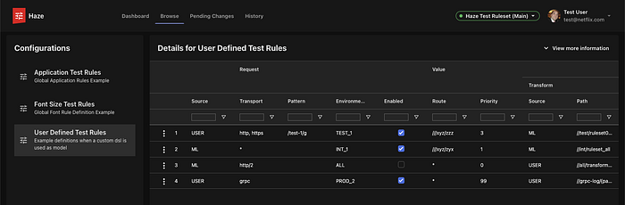
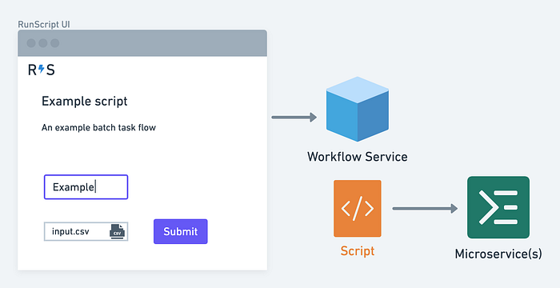

# Scaling Revenue & Growth Tooling

_Written by _[_Nick Tomlin_](https://www.linkedin.com/in/nick-tomlin-b0397636/)_, _[_Michael Possumato_](https://www.linkedin.com/in/michaelpossumato/)_, and _[_Rahul Pilani_](https://www.linkedin.com/in/rahul-pilani/)_._

This post shares how the Revenue & Growth Tools (RGT) team approaches creating full-stack tools for the teams that are the financial backbone of Netflix. Our primary partners are the teams of [Revenue and Growth Engineering](https://sites.google.com/netflix.com/revenue-growth-eng/home) (RGE): Growth, Membership, Billing, Payments, and Partner Subscription. Each of these engineering teams — and the operations teams they support — help Netflix acquire, sign up, and manage recurring payments for millions of members every month.

To provide a view of some of the unique challenges and opportunities of our domain, we’ll share some of the core strategies we’ve developed, some of the tools we’ve built as a result, and finally talk about our vision for the future of tooling on our team.

## Focusing on impact

Like many teams at Netflix, we are [full-cycle developers](https://netflixtechblog.com/full-cycle-developers-at-netflix-a08c31f83249), responsible for everything from design to ongoing development. As we grow, we must be selective in the projects we take on, and careful about managing our portfolio of full-stack products and tools to scale with the needs of the engineering teams we support. To help us strike the right balance, we focus on the impact of a given feature to help drive our internal product strategy.

Identifying impact requires deep engagement with our users. When someone within our team or organization identifies a new opportunity, we work closely with our engineering colleagues to identify the benefit not only of that team but the surrounding engineering and operational teams. Sometimes the result of this may mean investing in a highly customized tool for maximum impact. Often, this process discovers shared needs that we use to craft new product experiences that deliver value for multiple teams.

### Configuration management through Haze

One of the patterns we identified across multiple teams was the need for a stable process around configuration and metadata management. In the past, the approach was to develop singular tools to manage configuration for each backend system. We realized that we could have a much greater impact by focusing on an information-driven UI that could function as a standalone tool to manage any backend data.

Initially, we were targeting our internal rules engine for driving experiences across the Netflix platform as the only configuration backend. The more we talked with our cross-functional partners, the more we saw an opportunity for a generic product. This engagement led us to the Haze platform.

Haze consumes metadata via GraphQL and JSON descriptions to facilitate and orchestrate backend microservice api calls to manage configuration data. Teams can simply define their schemas and the Haze UI can be connected to their systems to act as a user-friendly interface to these APIs (for a deeper look, see this [blog post](./building-a-rule-based-platform-to-manage-netflix-membership-skus-at-scale-e3c0f82aa7bc.md)).

By leveraging the [DGS framework](./open-sourcing-the-netflix-domain-graph-service-framework-graphql-for-spring-boot-92b9dcecda18.md), and [Hawkins](./hawkins-diving-into-the-reasoning-behind-our-design-system-964a7357547.md) we delivered a full-fledged product experience on top of a stable Netflix platform, with the flexibility to evolve for future needs. Collaborating with the engineers we support, and the central platform teams we relied on (like the Hendrix team), ensured that we weren’t problem-solving in a vacuum, and opened the door for more generic solutions that benefit the whole of Netflix and not just our organization.

Haze removes the need for teams to create custom systems to manage configuration and safely expose that configuration to our cross-functional partners. It cuts down on engineering effort, empowers teams, and enables the business to quickly respond to new opportunities and challenges.

## Empowering the business through self-service

Scaling systems like signup or payments are essential, but it is only part of the product engineering picture. Engineers need to ensure that operations teams scale to meet the needs of the operations teams that maintain and refine the Netflix product. Things like managing configuration for our payment experiences, migrating data, and managing partner integrations. Initially, much of this can be handled through manual flows that involve spreadsheets, reminders, and emails. This works, but it means a drain on both engineers and business partners and a missed opportunity to empower the business to grow.

Unfortunately, building safe, user-friendly workflows is not a zero-cost solution. Engineering teams have to choose between building bespoke tooling to automate solutions or manually handling requests. Our team has been investigating different workflow solutions to help teams automate common business processes without having to invest in an entirely custom toolchain.

### Self servicing workflows through RunScript

One way we are helping engineering teams bridge this gap is with RunScript. RunScript provides a way for engineering teams to write a Kotlin or Java class and get a secure self-service UI to allow engineers and operations users to self-service common workflows. This allows engineers to connect to existing processes, or build their own with a familiar toolchain. This means that business users have the power to access systems by relying on an engineering team.

The service itself is built on top of The [DGS framework](./open-sourcing-the-netflix-domain-graph-service-framework-graphql-for-spring-boot-92b9dcecda18.md), Kotlin, and React. These technologies allowed us to rapidly prototype the product, respond to feedback from our cross-functional partners, and provide a solid platform for future growth.

We’ve already replaced some homegrown solutions that required users to individually bootstrap and configure scripts with a generic UI built from in-code definitions. Operational users have a consistent, easy way to interact with backends that don’t have to worry about maintaining a UI; engineers can focus on essential business logic and let the rest of the platform do the heavy lifting. The result is an auditable, repeatable process that saves time and effort for everyone.

## What’s next?

### Providing the building blocks for automation

We’ve been exploring how to provide a framework for teams to build self-service tools from existing microservices with projects like RunScript. We’d like to expand that scope to provide to allow teams to expose any business workflow as an easy to consume, pluggable unit. We hope this will be an impact multiplier that allows all teams to reap the same time-saving, business empowering benefits, without needing to invest in custom solutions.

By implementing a registry for these common tasks, we want to make it easy to discover and compose the building blocks of the RGE platform into new and powerful workflows.

### Federating our domain

Two of the Netflix principles we value the most are “Freedom and Responsibility” and “Highly aligned, loosely coupled” and we want our tools to reflect those philosophies. That means that engineering teams should feel empowered to architect their systems as they see fit. On the flip side, that freedom can make it harder to compose distributed microservices into a meaningful whole. We are investing in a [federated GraphQL](https://www.apollographql.com/docs/federation/) API to help preserve freedom but drive alignment.

The federated infrastructure will help provide a unified interface across the teams we serve, as well as pave the way for allowing teams to own and expose their information in a consistent and accessible manner.

### Bridging platform and product teams

Because we work with both platform teams and product teams, our team has a unique perspective on how tooling works at Netflix: we can build on or suggest platform technologies to our engineering partners, and bring their innovations and feedback to platform teams. This creates a virtuous cycle of feedback, alignment, and innovation where everyone benefits.

We’ve already seen some major wins with adopting things like the DGS framework, and we want to continue to further relationships with central teams to build unique experiences on top of centralized tools.

In the future, we want to take this even further where we act as a “Local Central Team” or LCT within RGE. We would coordinate our activities with other LCTs around Netflix and with central platform teams to share the great work that we are doing and hear about what other teams are building. The potential to engage with an even bigger audience to share and leverage some of the great products we are building together with our partners makes this space even more exciting.

## Build great things together

We are just getting started on this journey to build impactful, full-stack experiences that help propel our business forward. The core to bringing these experiences to life is our direct collaboration with our colleagues, using the most impactful tools and technologies available. If this is something that excites you, we’d love for you to [join us](https://jobs.netflix.com/jobs/53821786).

---
**Tags:** Tooling · Stakeholder Engagement
