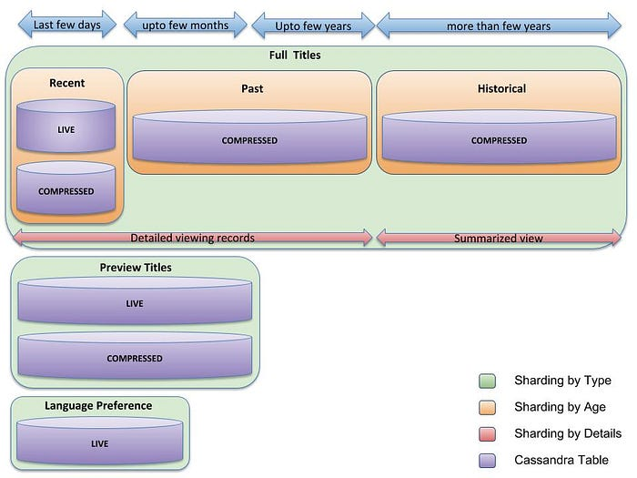
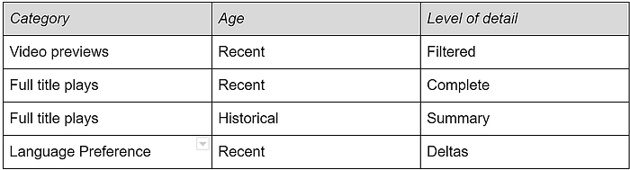
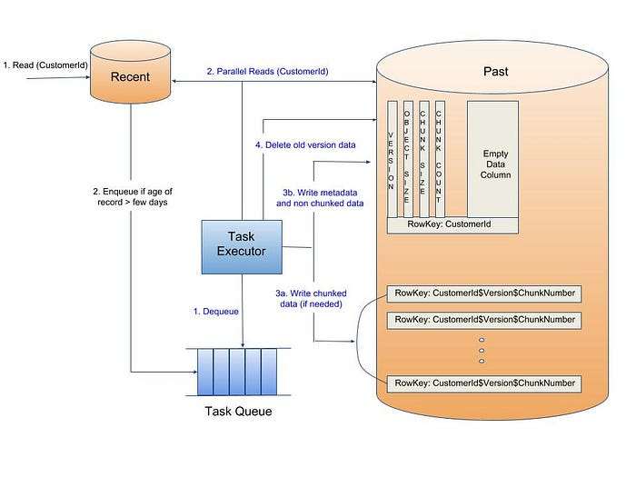
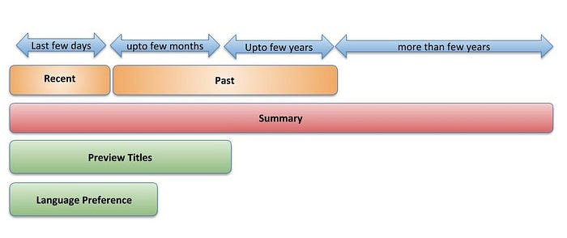

# Scaling Time Series Data Storage — Part II

> by Dhruv Garg, Dhaval Patel, Ketan Duvedi

In January 2016 Netflix [expanded worldwide](https://media.netflix.com/en/press-releases/netflix-is-now-available-around-the-world), opening service to 130 additional countries and supporting 20 total languages. Later in 2016 the TV experience evolved to include [video previews](https://media.netflix.com/en/company-blog/new-netflix-tv-experience-includes-video-previews-that-speed-your-next-selection) during the browsing experience. More members, more languages, and more video playbacks stretched the times series data storage architecture from [part 1](https://medium.com/netflix-techblog/scaling-time-series-data-storage-part-i-ec2b6d44ba39) close to its breaking point. In part 2 here, we will explore the limitations of that architecture and describe how we’re re-architecting for this next phase in our evolution.

## Breaking Point

[Part 1’s](https://medium.com/netflix-techblog/scaling-time-series-data-storage-part-i-ec2b6d44ba39) architecture treated all viewing data the same, regardless of type (full title plays vs video previews) or age (how long ago a title was viewed). The ratio of previews to full views was growing rapidly as that feature rolled out to more devices. By the end of 2016 we were seeing 30% growth in one quarter for that data store; video preview roll-outs were being delayed because of their potential impact to this data store. The naive solution would be to scale the underlying viewing data Cassandra (C*) cluster to accommodate that growth, but it was already the biggest cluster in use and nearing cluster size limits that few C* users have gone past successfully. Something had to be done, and that too soon.

## Rethinking Our Design

We challenged ourselves to rethink our approach and design one that would scale for at least 5x growth. We had patterns that we could reuse from [part 1’s](https://medium.com/netflix-techblog/scaling-time-series-data-storage-part-i-ec2b6d44ba39) architecture, but by themselves those weren’t sufficient. New patterns and techniques were needed.

## Analysis

We started by analyzing our data set’s access patterns. What emerged was three distinct categories of data:

- Full title plays
- Video preview plays
- Language preference (i.e., which subtitles/dubs were played, indicating what is the member’s preference when they play titles in a given language)

For each category, we discovered another pattern — the majority of access was to recent data. As the age of the data increased, the level of detail needed decreased. Combining these insights with conversations with our data consumers, we negotiated which data was needed at what detail and for how long.

### Storage Inefficiency

For the fastest growing data sets, video previews and language information, our partners needed only recent data. Very short duration views of video previews were being filtered out by our partners as they weren’t a positive or negative signal of member’s intent for the content. Additionally, we found most members choose the same subs/dubs languages for the majority of the titles that they watched. Storing the same language preference with each viewing record resulted in a lot of data duplication.

### Client Complexity

Another limiting factor we looked into was how our viewing data service’s client library satisfied a caller’s particular need for specific data from a specific time duration. Callers could retrieve viewing data by specifying:

- Video Type — Full title or video preview
- Time Range — last X days/months/years with X being different for various use cases
- Level of detail — complete or summary
- Whether to include subs/dubs information

For the majority of use cases, these filters were applied on the client side after fetching the complete data from the back-end service. As you might imagine, this led to a lot of unnecessary data transfer. Additionally, for larger viewing data sets the performance degraded rapidly, leading to huge variations in the 99th percentile read latencies.

## Redesign

Our goal was to design a solution that would scale to 5x growth, with reasonable cost efficiencies and improved as well as more predictable latencies. Informed by the analysis and understanding of the problems discussed above, we undertook this significant redesign. Here are our design guidelines:

**Data Category**

- Shard by data type
- Reduce data fields to just the essential elements

**Data Age**

- Shard by age of data. For recent data, expire after a set [TTL](https://en.wikipedia.org/wiki/Time_to_live)
- For historical data, summarize and rotate into an archive cluster

**Performance**

- Parallelize reads to provide an unified abstraction across recent and historical data

## Cluster Sharding

Previously, we had all the data combined together into one cluster, with a client library that filtered the data based on type/age/level of detail. We inverted that approach and now have clusters sharded by type/age/level of detail. This decouples each data set’s different growth rates from one another, simplifies the client, and improves the read latencies.

## Storage Efficiency

For the fastest growing data sets, video previews and language information, we were able to align with our partners on only keeping recent data. We do not store very short duration preview plays since they are not a good signal of member’s interest in the content. Also, we now store the initial language preference and then store only the deltas for subsequent plays. For vast majority of members, this means storing only a single record for language preference resulting in huge storage saving. We also have a lower TTL for preview plays and for language preference data thereby expiring it more aggressively than data for full title plays.

Where needed, we apply the live and compressed technique from [part I](https://medium.com/netflix-techblog/scaling-time-series-data-storage-part-i-ec2b6d44ba39), where a configurable number of recent records are stored in uncompressed form and the rest of the records are stored in compressed form in a separate table. For clusters storing older data, we store the data entirely in compressed form, trading off lower storage costs for higher compute costs at the time of access.

**Finally, instead of storing all the details for historical full title plays, we store summarized view with fewer columns in a separate table. This summary view is also compressed to further optimize for storage costs.**

Overall, our new architecture looks like this:

*Viewing Data Storage Architecture*

As shown above, Viewing data storage is sharded by type — there are separate clusters for full title plays, preview title plays and language preferences. Within full title plays, storage is sharded by age. There are separate clusters for recent viewing data (last few days), past viewing data (few days to few years) and historical viewing data. Finally, there is only a summary view rather than detailed records for historical viewing data.

## Data Flows

### Writes

Data writes go to into the most recent clusters. Filters are applied before entry, like not storing very short video previews plays or comparing the subs/dubs played to the previous preferences, and only storing when there is a change from previous behavior.

### Reads

Requests for the most recent data go directly to the most recent clusters. When more data is requested, parallel reads enable efficient retrieval.

_Last few days of viewing data_: For the large majority of use cases that need few days of full title plays, information is read only from the “Recent” cluster. Parallel reads to LIVE and COMPRESSED tables in the cluster are performed. Continuing on the pattern of Live and Compressed data sets that is detailed in [part 1](https://medium.com/netflix-techblog/scaling-time-series-data-storage-part-i-ec2b6d44ba39) of this blog post series, during reads from LIVE if the number of records is beyond a configurable threshold, then the records are rolled up, compressed and written to COMPRESSED table as a new version with the same row key.

Additionally, if language preference information is needed, then a parallel read to the “Language Preference” cluster is made. Similarly if preview plays information is needed then parallel reads are made to the LIVE and COMPRESSED tables in the “Preview Titles” cluster. Similar to full title viewing data, if number of records in the LIVE table exceed a configurable threshold then the records are rolled up, compressed and written to COMPRESSED table as a new version with the same row key.

_Last few months of full title plays_ are enabled via parallel reads to the “Recent” and “Past” clusters.

_Summarized viewing data _is returned via parallel reads to the “Recent”, “Past” and “Historical” clusters. The data is then stitched together to get the complete summarized view. To reduce storage size and cost, the summarized view in “Historical” cluster does not contain updates from the last few years of member viewing and hence needs to be augmented by summarizing viewing data from the “Recent” and “Past” clusters.

## Data Rotation

For full title plays, movement of records between the different age clusters happens asynchronously. On reading viewing data for a member from the “Recent” cluster, if it is determined that there are records older than configured number of days, then a task is queued to move relevant records for that member from “Recent” to “Past” cluster. On task execution, the relevant records are combined with the existing records from COMPRESSED table in the “Past” cluster. The combined recordset is then compressed and stored in the COMPRESSED table with a new version. Once the new version write is successful, the previous version record is deleted.

If the size of the compressed new version recordset is greater than a configurable threshold then the recordset is chunked and the multiple chunks are written in parallel. These background transfers of records from one cluster to other are batched so that they are not triggered on every read. All of this is similar to the data movement in the Live to Compressed storage approach that is detailed in [part 1](https://medium.com/netflix-techblog/scaling-time-series-data-storage-part-i-ec2b6d44ba39).

*Data Rotation between clusters*

Similar movement of records to “Historical” cluster is accomplished while reading from “Past” cluster. The relevant records are re-processed with the existing summary records to create new summary records. They are then compressed and written to the COMPRESSED table in the “Historical” cluster with a new version. Once the new version is written successfully, the previous version record is deleted.

## Performance Tuning

Like in the previous architecture, LIVE and COMPRESSED records are stored in different tables and are tuned differently to achieve better performance. Since LIVE tables have frequent updates and small number of viewing records, [compactions](http://docs.datastax.com/en/dse/5.1/dse-arch/datastax_enterprise/dbInternals/dbIntHowDataMaintain.html) are run frequently and [gc_grace_seconds](http://docs.datastax.com/en/dse/5.1/dse-arch/datastax_enterprise/dbInternals/dbIntAboutDeletes.html) is small to reduce number of SSTables and data size. [Read repair](http://docs.datastax.com/en/dse/5.1/dse-arch/datastax_enterprise/dbArch/archRepairNodesReadRepair.html) and [full column family repair](http://docs.datastax.com/en/dse/5.1/dse-arch/datastax_enterprise/dbArch/archAntiEntropyRepair.html) are run frequently to improve data consistency. Since updates to COMPRESSED tables are rare, manual and infrequent full compactions are sufficient to reduce number of SSTables. Data is checked for consistency during the rare updates. This obviates the need for read repair as well as full column family repair.

## Caching Layer Changes

Since we do a lot of parallel reads of large data chunks from Cassandra, there is a huge benefit to having a caching layer. The [EVCache](https://medium.com/netflix-techblog/announcing-evcache-distributed-in-memory-datastore-for-cloud-c26a698c27f7) caching layer architecture is also changed to mimic the backend storage architecture and is illustrated in the following diagram. All of the caches have close to 99% hit rate and are very effective in minimizing the number of read requests to the Cassandra layer.

*Caching Layer Architecture*

One difference between the caching and storage architecture is that the “Summary” cache cluster stores the compressed summary of the entire viewing data for full title plays. With approximately 99% cache hit rate only a small fraction of total requests goes to the Cassandra layer where parallel reads to 3 tables and stitching together of records is needed to create a summary across the entire viewing data.

## Migration: Preliminary Results

The team is more than halfway through these changes. Use cases taking advantage of sharding by data type have already been migrated. So while we don’t have complete results to share, here are the preliminary results and lessons learned:

- Big improvement in the operational characteristics (compactions, GC pressure and latencies) of Cassandra based just on sharding the clusters by data type.
- Huge headroom for the full title, viewing data Cassandra clusters enabling the team to scale for at least 5x growth.
- Substantial cost savings due to more aggressive data compression and data TTL.
- Re-architecture is backward compatible. Existing APIs will continue to work and are projected to have better and more predictable latencies. New APIs created to access subset of data would give significant additional latency benefits but need client changes. This makes it easier to roll out server side changes independent of client changes as well as migrate various clients at different times based on their engagement bandwidth.

## Conclusion

Viewing data storage architecture has come a long way over the last few years. We evolved to using a pattern of live and compressed data with parallel reads for viewing data storage and have re-used that pattern for other time-series data storage needs within the team. Recently, we sharded our storage clusters to satisfy the unique needs of different use cases and have used the live and compressed data pattern for some of the clusters. We extended the live and compressed data movement pattern to move data between the age-sharded clusters.

Designing these extensible building blocks scales our storage tier in a simple and efficient way. While we redesigned for 5x growth of today’s use cases, we know Netflix’s product experience continues to change and improve. We’re keeping our eyes open for shifts that might require further evolution.

If similar problems excite you, we are always on the lookout for talented engineers to [join our team](https://jobs.netflix.com/jobs/866030) and help us solve the next set of challenges around scaling data storage and data processing.

---
**Tags:** Big Data · Timeseries · Distributed Systems · Database · Netflix
