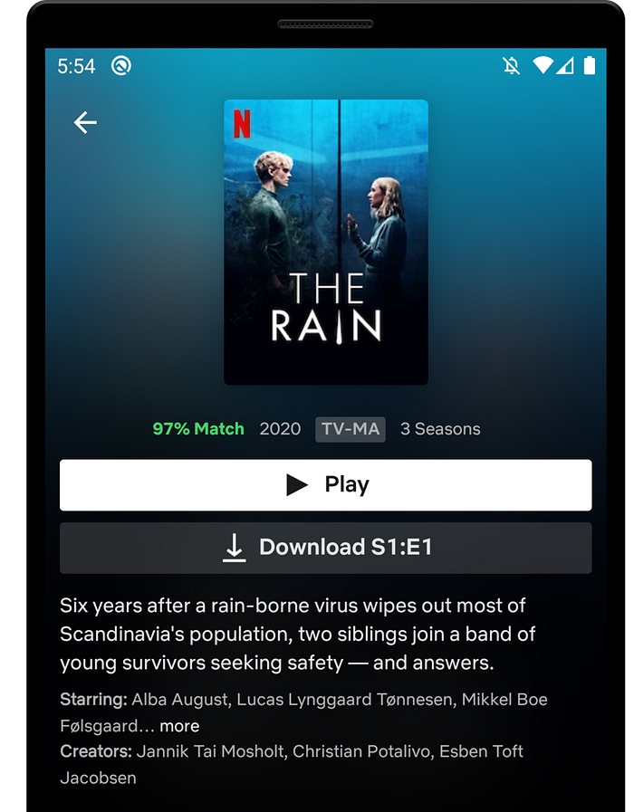
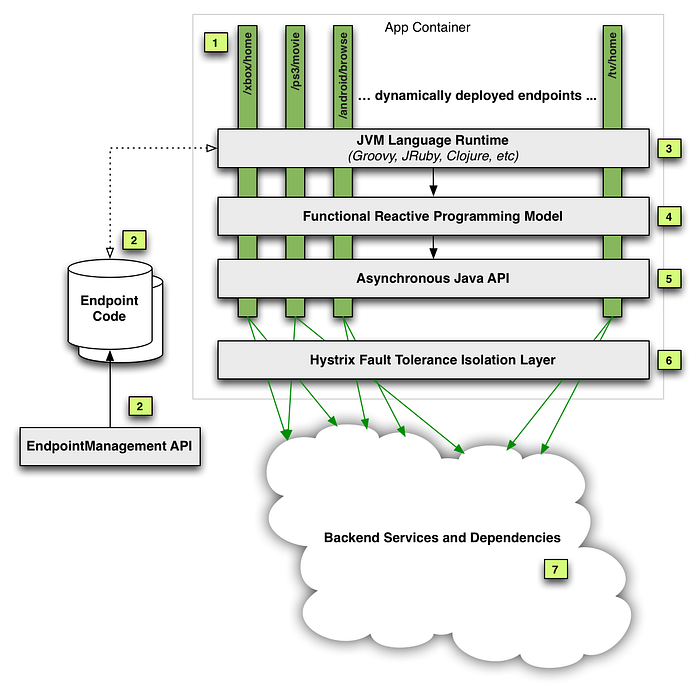
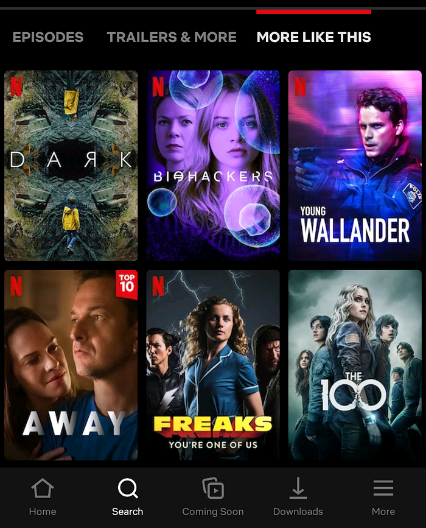
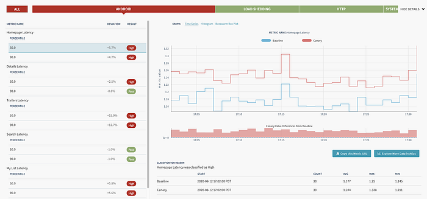
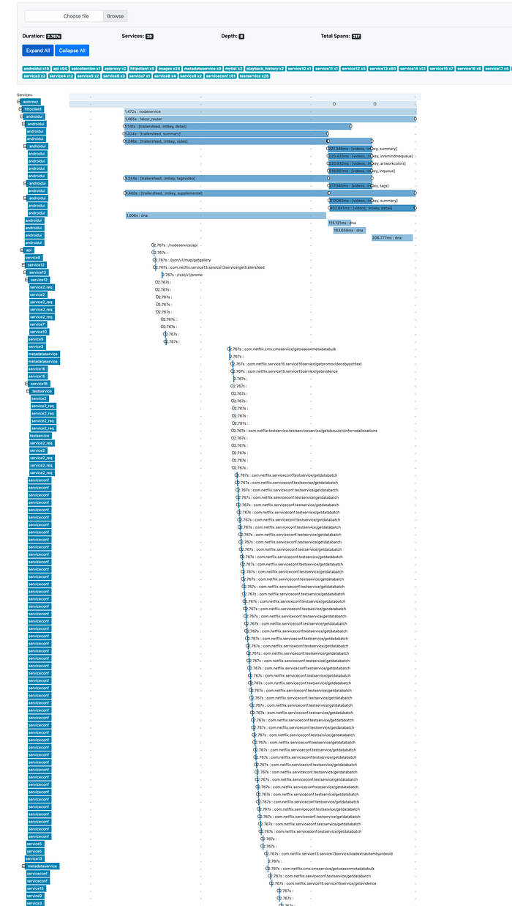
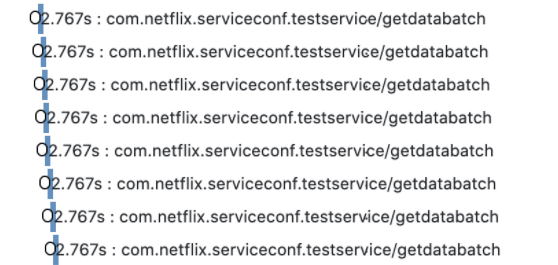

# Seamlessly Swapping the API backend of the Netflix Android app

> How we migrated our Android endpoints out of a monolith into a new microservice

_by _[_Rohan Dhruva_](https://www.linkedin.com/in/rohandhruva/)_, _[_Ed Ballot_](https://www.linkedin.com/in/eballot/)

As Android developers, we usually have the luxury of treating our backends as magic boxes running in the cloud, faithfully returning us JSON. At Netflix, we have adopted the [Backend for Frontend (BFF) pattern](https://samnewman.io/patterns/architectural/bff/): instead of having one general purpose “backend API”, we have one backend per client (Android/iOS/TV/web). On the Android team, while most of our time is spent working on the app, we are also responsible for maintaining this backend that our app communicates with, and its orchestration code.

Recently, we completed a year-long project rearchitecting and decoupling our backend from the centralized model used previously. We did this migration without slowing down the usual cadence of our releases, and with particular care to avoid any negative effects to the user experience. We went from an essentially serverless model in a monolithic service, to deploying and maintaining a new microservice that hosted our app backend endpoints. This allowed Android engineers to have much more control and observability over how we get our data. Over the course of this post, we will talk about our approach to this migration, the strategies that we employed, and the tools we built to support this.

## Background

The Netflix Android app uses the [falcor data model](https://netflix.github.io/falcor/starter/what-is-falcor.html) and query protocol. This allows the app to query a list of “paths” in each HTTP request, and get specially formatted JSON (`jsonGraph`) that we use to cache the data and hydrate the UI. As mentioned earlier, each client team owns their respective endpoints: which effectively means that we’re writing the resolvers for each of the paths that are in a query.



As an example, to render the screen shown here, the app sends a query that looks like this:

```
paths: ["videos", 80154610, "detail"]
```

A [_path_](https://netflix.github.io/falcor/documentation/paths.html) starts from a _root object_, and is followed by a sequence of _keys_ that we want to retrieve the data for. In the snippet above, we’re accessing the `detail` key for the `video` object with id `80154610`.

For that query, the response is:

![Response for the query [“videos”, 80154610, “detail”]](../images/f5706abd57d111ca.png)
*Response for the query [“videos”, 80154610, “detail”]*

### In the Monolith

In the example you see above, the data that the app needs is served by different backend microservices. For example, the artwork service is separate from the video metadata service, but we need the data from both in the `detail` key.

We do this orchestration on our endpoint code using a library provided by our API team, which exposes an RxJava API to handle the downstream calls to the various backend microservices. Our endpoint route handlers are effectively fetching the data using this API, usually across multiple different calls, and massaging it into data models that the UI expects. These handlers we wrote were deployed into a service run by the API team, shown in the diagram below.


*Image taken from a previously published blog post*

As you can see, our code was just a part (#2 in the diagram) of this monolithic service. In addition to hosting our route handlers, this service also handled the business logic necessary to make the downstream calls in a fault tolerant manner. While this gave client teams a very convenient “serverless” model, over time we ran into multiple operational and devex challenges with this service. You can read more about this in our previous posts here: [part 1](https://netflixtechblog.com/developer-experience-lessons-operating-a-serverless-like-platform-at-netflix-a8bbd5b899a0), [part 2](https://netflixtechblog.com/developer-experience-lessons-operating-a-serverless-like-platform-at-netflix-part-ii-63a376c28228).

## The Microservice

It was clear that we needed to isolate the endpoint code (owned by each client team), from the complex logic of fault tolerant downstream calls. Essentially, we wanted to break out the client-specific code from this monolith into its own service. We tried a few iterations of what this new service should look like, and eventually settled on a modern architecture that aimed to give more control of the API experience to the client teams. It was a Node.js service with a composable JavaScript API that made downstream microservice calls, replacing the old Java API.

### Java…Script?

As Android developers, we’ve come to rely on the safety of a strongly typed language like Kotlin, maybe with a side of Java. Since this new microservice uses Node.js, we had to write our endpoints in JavaScript, a language that many people on our team were not familiar with. The context around why the Node.js ecosystem was chosen for this new service deserves an article in and of itself. For us, it means that we now need to have ~15 [MDN](https://developer.mozilla.org/en-US/docs/Web/JavaScript) tabs open when writing routes :)

Let’s briefly discuss the architecture of this microservice. It looks like a very typical backend service in the Node.js world: a combination of [Restify](http://restify.com/), a stack of HTTP middleware, and the Falcor-based API. We’ll gloss over the details of this stack: the general idea is that we’re still writing resolvers for paths like `[videos, <id>, detail]`, but we’re now writing them in JavaScript.

The big difference from the monolith, though, is that this is now a standalone service deployed as a separate “application” (service) in our cloud infrastructure. More importantly, we’re no longer just getting and returning requests from the context of an endpoint script running in a service: we’re now getting a chance to handle the HTTP request in its entirety. Starting from “terminating” the request from our public gateway, we then make downstream calls to the `api` application (using the previously mentioned JS API), and build up various parts of the response. Finally, we return the required JSON response from our service.

## The Migration

Before we look at what this change meant for us, we want to talk about how we did it. Our app had ~170 query paths (think: route handlers), so we had to figure out an iterative approach to this migration. Let’s take a look at what we built in the app to support this migration. Going back to the screenshot above, if you scroll a bit further down on that page, you will see the section titled “more like this”:



As you can imagine, this does not belong in the video details data for this title. Instead, it is part of a different [path](https://netflix.github.io/falcor/documentation/paths.html): `[videos, <id>, similars]`. The general idea here is that each UI screen (`Activity`/`Fragment`) needs data from multiple query paths to render the UI.

To prepare ourselves for a big change in the tech stack of our endpoint, we decided to track metrics around the time taken to respond to queries. After some consultation with our backend teams, we determined the most effective way to group these metrics were by UI screen. Our app uses a version of the repository pattern, where each screen can fetch data using a list of query paths. These paths, along with some other configuration, builds a `Task`. These `Tasks` already carry a `uiLabel` that uniquely identifies each screen: this label became our starting point, which we passed in a header to our endpoint. We then used this to log the time taken to respond to each query, grouped by the `uiLabel`. This meant that we could track any possible regressions to user experience by screen, which corresponds to how users navigate through the app. We will talk more about how we used these metrics in the sections to follow.

Fast forward a year: the 170 number we started with slowly but surely whittled down to 0, and we had all our “routes” (query paths) migrated to the new microservice. So, how did it go…?


---

## The Good

Today, a big part of this migration is done: most of our app gets its data from this new microservice, and hopefully our users never noticed. As with any migration of this scale, we hit a few bumps along the way: but first, let’s look at good parts.

### Migration Testing Infrastructure

Our monolith had been around for many years and hadn’t been created with functional and unit testing in mind, so those were independently bolted on by each UI team. For the migration, testing was a first-class citizen. While there was no technical reason stopping us from adding full automation coverage earlier, it was just much easier to add this while migrating each query path.

For each route we migrated, we wanted to make sure we were not introducing any regressions: either in the form of missing (or worse, wrong) data, or by increasing the latency of each endpoint. If we pare down the problem to absolute basics, we essentially have two services returning JSON. We want to make sure that for a given set of paths as input, the returned JSON is always exactly the same. With lots of guidance from other platform and backend teams, we took a 3-pronged approach to ensure correctness for each route migrated.

**Functional Testing  
**Functional testing was the most straightforward of them all: a set of tests alongside each path exercised it against the old and new endpoints. We then used the excellent [Jest](https://jestjs.io/) testing framework with a set of custom matchers that sanitized a few things like timestamps and uuids. It gave us really high confidence during development, and helped us cover all the code paths that we had to migrate. The test suite automated a few things like setting up a test user, and matching the query parameters/headers sent by a real device: but that’s as far as it goes. The scope of functional testing was limited to the already setup test scenarios, but we would never be able to replicate the variety of device, language and locale combinations used by millions of our users across the globe.

**Replay Testing  
**Enter replay testing. This was a custom built, 3-step pipeline:

- **Capture the production traffic for the desired path(s)**
- Replay the traffic against the two services in the TEST environment
- Compare and assert for differences

It was a self-contained flow that, by design, captured entire requests, and not just the one path we requested. This test was the closest to production: it replayed real requests sent by the device, thus exercising the part of our service that fetches responses from the old endpoint and stitches them together with data from the new endpoint. The thoroughness and flexibility of this replay pipeline is best described in its own post. For us, the replay test tooling gave the confidence that our new code was nearly bug free.

**Canaries  
**Canaries were the last step involved in “vetting” our new route handler implementation. In this step, a pipeline picks our candidate change, deploys the service, makes it publicly discoverable, and redirects a small percentage of production traffic to this new service. You can find a lot more details about how this works in the [Spinnaker canaries documentation](https://spinnaker.io/guides/user/canary/).

This is where our previously mentioned `uiLabel` metrics become relevant: for the duration of the canary, [Kayenta](https://github.com/spinnaker/kayenta) was [configured](https://spinnaker.io/guides/user/canary/config/) to capture and compare these metrics for all requests (in addition to the system level metrics already being tracked, like server CPU and memory). At the end of the canary period, we got a report that aggregated and compared the percentiles of each request made by a particular UI screen. Looking at our high traffic UI screens (like the homepage) allowed us to identify any regressions caused by the endpoint before we enabled it for all our users. Here’s one such report to get an idea of what it looks like:



Each identified regression (like this one) was subject to a lot of analysis: chasing down a few of these led to previously unidentified performance gains! Being able to canary a new route let us verify latency and error rates were within acceptable limits. This type of tooling required time and effort to create, but in the end, the feedback it provided was well worth the cost.

### Observability

Many Android engineers will be familiar with systrace or one of the excellent profilers in Android Studio. Imagine getting a similar tracing for your endpoint code, traversing along many different microservices: that is effectively what distributed tracing provides. Our microservice and router were already integrated into the Netflix request tracing infrastructure. We used [Zipkin](https://zipkin.io/) to consume the traces, which allowed us to search for a trace by path. Here’s what a typical trace looks like:


*A typical zipkin trace (truncated)*

Request tracing has been critical to the success of Netflix infrastructure, but when we operated in the monolith, we did not have the ability to get this detailed look into how our app interacted with the various microservices. To demonstrate how this helped us, let us zoom into this part of the picture:


*Serialized calls to this service adds a few ms latency*

It’s pretty clear here that the calls are being serialized: however, at this point we’re already ~10 hops disconnected from our microservice. It’s hard to conclude this, and uncover such problems, from looking at raw numbers: either on our service or the `_testservice_` above, and even harder to attribute them back to the exact UI platform or screen. With the rich end-to-end tracing instrumented in the Netflix microservice ecosystem and made easily accessible via Zipkin, we were able to pretty quickly triage this problem to the responsible team.

### End-to-end Ownership

As we mentioned earlier, our new service now had the “ownership” for the lifetime of the request. Where previously we only returned a Java object back to the api middleware, now the final step in the service was to flush the JSON down the request buffer. This increased ownership gave us the opportunity to easily test new optimisations at this layer. For example, with about a day’s worth of work, we had a prototype of the app using the binary msgpack response format instead of plain JSON. In addition to the flexible service architecture, this can also be attributed to the Node.js ecosystem and the rich selection of npm packages available.

### Local Development

Before the migration, developing and debugging on the endpoint was painful due to slow deployment and lack of local debugging ([this post](https://netflixtechblog.com/developer-experience-lessons-operating-a-serverless-like-platform-at-netflix-a8bbd5b899a0#caa2) covers that in more detail). One of the Android team’s biggest motivations for doing this migration project was to improve this experience. The new microservice gave us fast deployment and debug support by running the service in a local Docker instance, which has led to significant productivity improvements.

## The Not-so-good

In the arduous process of breaking a monolith, you might get a sharp shard or two flung at you. A lot of what follows is not specific to Android, but we want to briefly mention these issues because they did end up affecting our app.

### Latencies

The old `api` service was running on the same “machine” that also cached a lot of video metadata (by design). This meant that data that was static (e.g. video titles, descriptions) could be aggressively cached and reused across multiple requests. However, with the new microservice, even fetching this cached data needed to incur a network round trip, which added some latency.

This might sound like a classic example of “monoliths vs microservices”, but the reality is somewhat more complex. The monolith was also essentially still talking to a _lot_ of downstream microservices: it just happened to have a custom-designed cache that helped a lot. Some of this increased latency was mitigated by better observability and more efficient batching of requests. But, for a small fraction of requests, after a lot of attempts at optimization, we just had to take the latency hit: sometimes, there are no silver bullets.

### Increased Partial Query Errors

As each call to our endpoint might need to make multiple requests to the api service, some of these calls can fail, leaving us with partial data. Handling such partial query errors isn’t a new problem: it is baked into the nature of composite protocols like Falcor or GraphQL. However, as we moved our route handlers into a new microservice, we now introduced a network boundary for fetching _any_ data, as mentioned earlier.

This meant that we now ran into partial states that weren’t possible before because of the custom caching. We were not completely aware of this problem in the beginning of our migration: we only saw it when some of our deserialized data objects had `null` fields. Since a lot of our code uses Kotlin, these partial data objects led to immediate crashes, which helped us notice the problem early: before it ever hit production.

As a result of increased partial errors, we’ve had to improve overall error handling approach and explore ways to minimize the impact of the network errors. In some cases, we also added custom retry logic on either the endpoint or the client code.

## Final Thoughts

This has been a long (you can tell!) and a fulfilling journey for us on the Android team: as we mentioned earlier, on our team we typically work on the app and, until now, we did not have a chance to work with our endpoint with this level of scrutiny. Not only did we learn more about the intriguing world of microservices, but for us working on this project, it provided us the perfect opportunity to add observability to our app-endpoint interaction. At the same time, we ran into some unexpected issues like partial errors and made our app more resilient to them in the process.

As we continue to evolve and improve our app, we hope to share more insights like these with you.


---

_The planning and successful migration to this new service was the combined effort of multiple backend and front end teams._

_On the Android team, we ship the Netflix app on Android to millions of members around the world. Our responsibilities include extensive A/B testing on a wide variety of devices by building highly performant and often custom UI experiences. We work on data driven optimizations at scale in a diverse and sometimes unforgiving device and network ecosystem. If you find these challenges interesting, and want to work with us, we have an _[_open position_](http://jobs.netflix.com/jobs/870128)_._

---
**Tags:** Android · Microservices · Backends For Frontends · Backend · Mobile
