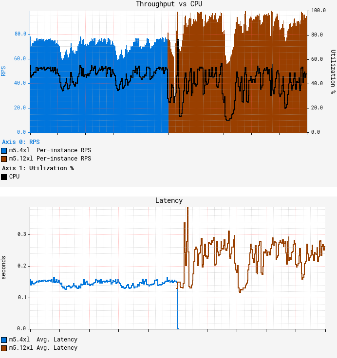
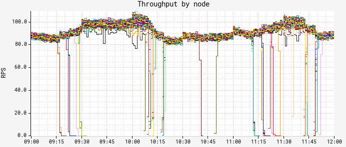
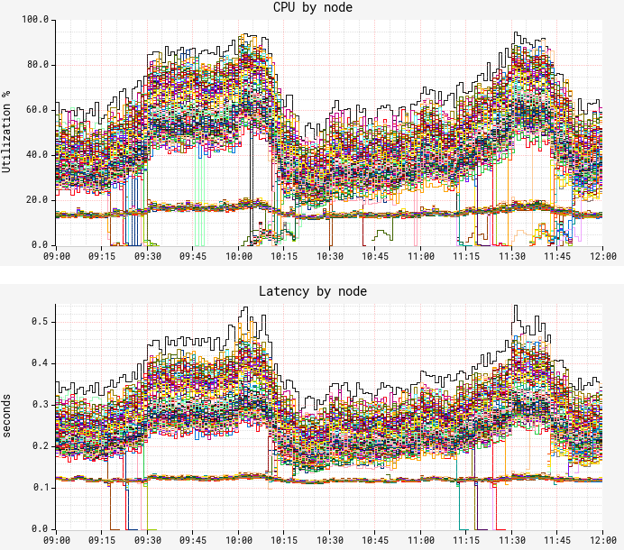
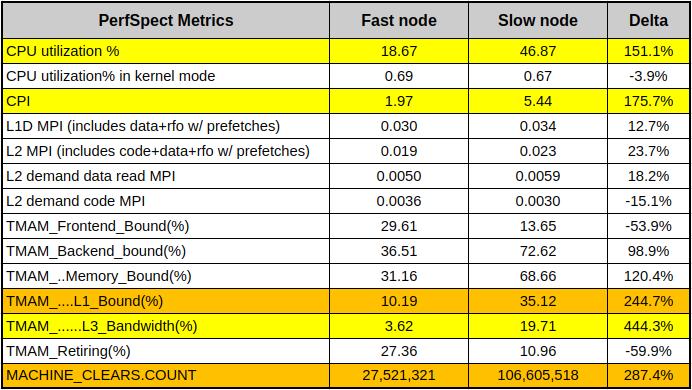
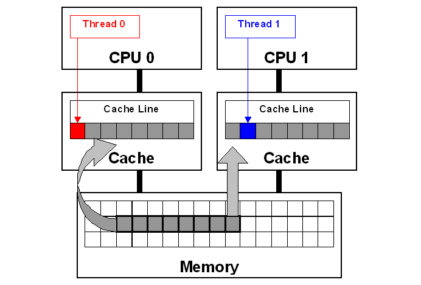
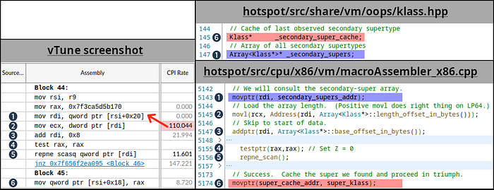
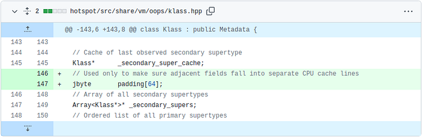
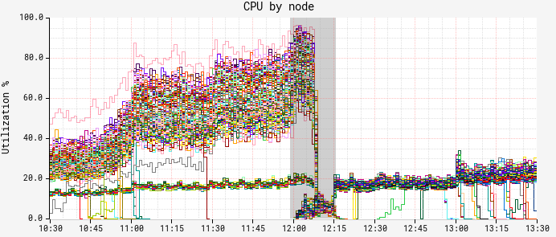
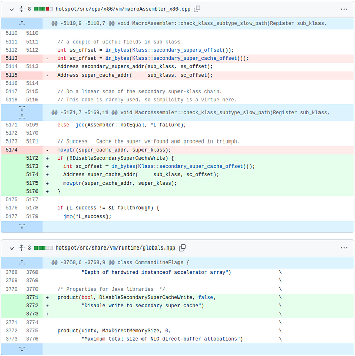
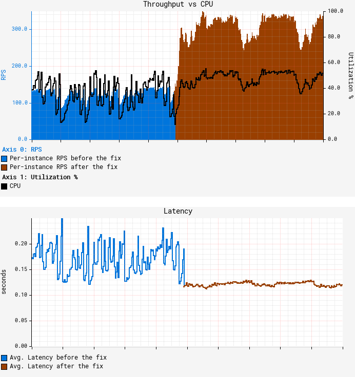

# Seeing through hardware counters: a journey to threefold performance increase

_By _[_Vadim Filanovsky_](https://www.linkedin.com/in/vfilanovsky/)_ and _[_Harshad Sane_](https://www.linkedin.com/in/harshad-sane-56711a11/)

In one of our previous blogposts, [A Microscope on Microservices](https://netflixtechblog.com/a-microscope-on-microservices-923b906103f4) we outlined three broad domains of observability (or “levels of magnification,” as we referred to them) — Fleet-wide, Microservice and Instance. We described the tools and techniques we use to gain insight within each domain. There is, however, a class of problems that requires an even stronger level of magnification going deeper down the stack to introspect CPU microarchitecture. In this blogpost we describe one such problem and the tools we used to solve it.

## The problem

It started off as a routine migration. At Netflix, we periodically reevaluate our workloads to optimize utilization of available capacity. We decided to move one of our Java microservices — let’s call it GS2 — to a larger AWS instance size, from m5.4xl (16 vCPUs) to m5.12xl (48 vCPUs). The workload of GS2 is computationally heavy where CPU is the limiting resource. While we understand it’s virtually impossible to achieve a linear increase in throughput as the number of vCPUs grow, a near-linear increase is attainable. Consolidating on the larger instances reduces the amortized cost of background tasks, freeing up additional resources for serving requests and potentially offsetting the sub-linear scaling. Thus, we expected to roughly triple throughput per instance from this migration, as 12xl instances have three times the number of vCPUs compared to 4xl instances. A quick [canary test](https://netflixtechblog.com/automated-canary-analysis-at-netflix-with-kayenta-3260bc7acc69) was free of errors and showed lower latency, which is expected given that our standard canary setup routes an equal amount of traffic to both the baseline running on 4xl and the canary on 12xl. As GS2 relies on [AWS EC2 Auto Scaling](https://docs.aws.amazon.com/autoscaling/ec2/userguide/what-is-amazon-ec2-auto-scaling.html) to target-track CPU utilization, we thought we just had to redeploy the service on the larger instance type and wait for the [ASG (Auto Scaling Group)](https://docs.aws.amazon.com/autoscaling/ec2/userguide/auto-scaling-groups.html) to settle on the CPU target. Unfortunately, the initial results were far from our expectations:

The first graph above represents average per-node throughput overlaid with average CPU utilization, while the second graph shows average request latency. We can see that as we reached roughly the same CPU target of 55%, the throughput increased only by ~25% on average, falling far short of our desired goal. What’s worse, average latency degraded by more than 50%, with both CPU and latency patterns becoming more “choppy.” GS2 is a stateless service that receives traffic through a flavor of round-robin load balancer, so all nodes should receive nearly equal amounts of traffic. Indeed, the RPS (Requests Per Second) data shows very little variation in throughput between nodes:

But as we started looking at the breakdown of CPU and latency by node, a strange pattern emerged:

Although we confirmed fairly equal traffic distribution between nodes, CPU and latency metrics surprisingly demonstrated a very different, bimodal distribution pattern. There is a “lower band” of nodes exhibiting much lower CPU and latency with hardly any variation; and there is an “upper band” of nodes with significantly higher CPU/latency and wide variation. We noticed only ~12% of the nodes fall into the lower band, a figure that was suspiciously consistent over time. In both bands, performance characteristics remain consistent for the entire uptime of the JVM on the node, i.e. nodes never jumped the bands. This was our starting point for troubleshooting.

## First attempt at solving it

Our first (and rather obvious) step at solving the problem was to compare [flame graphs](https://netflixtechblog.com/java-in-flames-e763b3d32166) for the “slow” and “fast” nodes. While flame graphs clearly reflected the difference in CPU utilization as the number of collected samples, the distribution across the stacks remained the same, thus leaving us with no additional insight. We turned to JVM-specific profiling, starting with the basic hotspot stats, and then switching to more detailed [JFR (Java Flight Recorder)](https://docs.oracle.com/en/java/java-components/jdk-mission-control/8/user-guide/using-jdk-flight-recorder.html) captures to compare the distribution of the events. Again, we came away empty-handed as there was no noticeable difference in the amount or the distribution of the events between the “slow” and “fast” nodes. Still suspecting something might be off with JIT behavior, we ran some basic stats against symbol maps obtained by [perf-map-agent](https://github.com/jvm-profiling-tools/perf-map-agent) only to hit another dead end.

## False Sharing

Convinced we’re not missing anything on the app-, OS- and JVM- levels, we felt the answer might be hidden at a lower level. Luckily, the m5.12xl instance type exposes a set of core [PMCs](https://www.brendangregg.com/blog/2017-05-04/the-pmcs-of-ec2.html) (Performance Monitoring Counters, a.k.a. PMU counters), so we started by collecting a baseline set of counters using [PerfSpect](https://github.com/intel/PerfSpect):

In the table above, the nodes showing low CPU and low latency represent a “fast node”, while the nodes with higher CPU/latency represent a “slow node”. Aside from obvious CPU differences, we can see that the slow node has almost 3x CPI (Cycles Per Instruction) of the fast node. We also see much higher L1 cache activity combined with 4x higher count of [MACHINE_CLEARS](http://portal.nacad.ufrj.br/online/intel/vtune2017/help/GUID-F0FD7660-58B5-4B5D-AA9A-E1AF21DDCA0E.html). One common cause of these symptoms is so-called **“false sharing” — a usage pattern occurring when 2 cores reading from / writing to unrelated variables that happen to share the same L1 cache line.** Cache line is a concept similar to memory page — a contiguous chunk of data (typically 64 bytes on x86 systems) transferred to and from the cache. This diagram illustrates it:

Each core in this diagram has its own private cache. Since both cores are accessing the same memory space, caches have to be consistent. This consistency is ensured with so-called “[cache coherency protocol](https://www.cs.auckland.ac.nz/~goodman/TechnicalReports/MESIF-2009.pdf).” As Thread 0 writes to the “red” variable, coherency protocol marks the whole cache line as “modified” in Thread 0’s cache and as “invalidated” in Thread 1’s cache. Later, when Thread 1 reads the “blue” variable, even though the “blue” variable is not modified, coherency protocol forces the entire cache line to be reloaded from the cache that had the last modification — Thread 0’s cache in this example. Resolving coherency across private caches takes time and causes CPU stalls. Additionally, ping-ponging coherency traffic has to be monitored through the [last level shared cache](https://cvw.cac.cornell.edu/ClusterArch/LastLevelCache)’s controller, which leads to even more stalls. We take CPU cache consistency for granted, but this “false sharing” pattern illustrates there’s a huge performance penalty for simply reading a variable that is neighboring with some other unrelated data.

Armed with this knowledge, we used [Intel vTune](https://www.intel.com/content/www/us/en/developer/tools/oneapi/vtune-profiler.html) to run microarchitecture profiling. Drilling down into “hot” methods and further into the assembly code showed us blocks of code with some instructions exceeding 100 CPI, which is extremely slow. This is the summary of our findings:

Numbered markers from 1 to 6 denote the same code/variables across the sources and vTune assembly view. The red arrow indicates that the CPI value likely belongs to the previous instruction — this is due to the profiling skid in absence of PEBS (Processor Event-Based Sampling), and usually it’s off by a single instruction. Based on the fact that (5) _“repne scan”_ is a rather rare operation in the JVM codebase, we were able to link this snippet to [the routine for subclass checking](https://github.com/openjdk/jdk8u/blob/jdk8u352-b07/hotspot/src/cpu/x86/vm/macroAssembler_x86.cpp#L5142-L5174) (the same code exists in JDK mainline as of the writing of this blogpost). Going into the details of subtype checking in HotSpot is far beyond the scope of this blogpost, but curious readers can learn more about it from the 2002 publication [Fast Subtype Checking in the HotSpot JVM](https://www.researchgate.net/publication/221552851_Fast_subtype_checking_in_the_HotSpot_JVM). Due to the nature of the class hierarchy used in this particular workload, we keep hitting the code path that keeps updating (6) the _“_secondary_super_cache”_ field, which is a single-element cache for the last-found secondary superclass. Note how this field is adjacent to the _“_secondary_supers”_, which is a list of all superclasses and is being read (1) in the beginning of the scan. Multiple threads do these read-write operations, and if fields (1) and (6) fall into the same cache line, then we hit a false sharing use case. We highlighted these fields with red and blue colors to connect to the false sharing diagram above.

**Note that since the cache line size is 64 bytes and the pointer size is 8 bytes, we have a 1 in 8 chance of these fields falling on separate cache lines, and a 7 in 8 chance of them sharing a cache line.** This 1-in-8 chance is 12.5%, matching our previous observation on the proportion of the “fast” nodes. Fascinating!

Although the fix involved patching the JDK, it was a simple change. We inserted padding between _“_secondary_super_cache”_ and _“_secondary_supers”_ fields to ensure they never fall into the same cache line. Note that we did not change the functional aspect of JDK behavior, but rather the data layout:

The results of deploying the patch were immediately noticeable. The graph below is a breakdown of CPU by node. Here we can see a [red-black deployment](https://spinnaker.io/docs/guides/user/kubernetes-v2/rollout-strategies/#redblack-rollouts) happening at noon, and the new ASG with the patched JDK taking over by 12:15:

Both CPU and latency (graph omitted for brevity) showed a similar picture — the “slow” band of nodes was gone!

## True Sharing

We didn’t have much time to marvel at these results, however. As the autoscaling reached our CPU target, we noticed that we still couldn’t push more than ~150 RPS per node — well short of our goal of ~250 RPS. Another round of vTune profiling on the patched JDK version showed the same bottleneck around secondary superclass cache lookup. It was puzzling at first to see seemingly the same problem coming back right after we put in a fix, but upon closer inspection we realized we’re dealing with “true sharing” now. Unlike “false sharing,” where 2 independent variables share a cache line, “true sharing” refers to the same variable being read and written by multiple threads/cores. In this case, [CPU-enforced memory ordering](http://www.rdrop.com/users/paulmck/scalability/paper/ordering.2007.09.19a.pdf) is the cause of slowdown. We reasoned that removing the obstacle of false sharing and increasing the overall throughput resulted in increased execution of the same JVM superclass caching code path. Essentially, we have higher execution concurrency, causing excessive pressure on the superclass cache due to CPU-enforced memory ordering protocols. The common way to resolve this is to avoid writing to the shared variable altogether, effectively bypassing the JVM’s secondary superclass cache. Since this change altered the behavior of the JDK, we gated it behind a command line flag. This is the entirety of our patch:

And here are the results of running with disabled superclass cache writes:

Our fix pushed the throughput to ~350 RPS at the same CPU autoscaling target of 55%. To put this in perspective, **that’s a 3.5x improvement** over the throughput we initially reached on m5.12xl, along with a reduction in both average and tail latency.

## Future work

Disabling writes to the secondary superclass cache worked well in our case, and even though this might not be a desirable solution in all cases, we wanted to share our methodology, toolset and the fix in the hope that it would help others encountering similar symptoms. While working through this problem, we came across [JDK-8180450](https://bugs.openjdk.org/browse/JDK-8180450) — a bug that’s been dormant for more than five years that describes exactly the problem we were facing. **It seems ironic that we could not find this bug until we actually figured out the answer.** We believe our findings complement the great work that has been done in diagnosing and remediating it.

## Conclusion

We tend to think of modern JVMs as highly optimized runtime environments, in many cases rivaling more “performance-oriented” languages like C++. While it holds true for the majority of workloads, we were reminded that performance of certain workloads running within JVMs can be affected not only by the design and implementation of the application code, but also by the implementation of the JVM itself. In this blogpost we described how we were able to leverage PMCs in order to find a bottleneck in the JVM’s native code, patch it, and subsequently realize better than a threefold increase in throughput for the workload in question. When it comes to this class of performance issues, the ability to introspect the execution at the level of CPU microarchitecture proved to be the only solution. Intel vTune provides valuable insight even with the core set of PMCs, such as those exposed by m5.12xl instance type. Exposing a more comprehensive set of PMCs along with PEBS across all instance types and sizes in the cloud environment would pave the way for deeper performance analysis and potentially even larger performance gains.  
**Update:** After publishing this post we were alerted to a separate independent development in this area, including a [writeup on how superclass cache affects regex pattern matching](https://github.com/openjdk/jdk/pull/6434), as well as a [tool to automate the detection of JDK-8180450](https://github.com/RedHatPerf/type-pollution-agent) using an agent. Also of interest is [this video](https://youtu.be/G40VfIsnCdo) describing an alternative approach to diagnosing the issue. Our goal in sharing our work is to provide information and insight to the open-source community, and it is always exciting to see (and share!) how others approach similar problems.

---

_Special thanks to _[_Sandhya Viswanathan_](https://www.linkedin.com/in/sandhya-viswanathan-4484942/)_, _[_Jennifer Dimatteo_](https://www.linkedin.com/in/jennifer-dimatteo-5671aab/)_, _[_Brendan Gregg_](https://www.linkedin.com/in/brendangregg/)_, _[_Susie Xia_](https://www.linkedin.com/in/susie-xia/)_, _[_Jason Koch_](https://www.linkedin.com/in/jason-koch-5692172/)_, _[_Mike Huang_](https://www.linkedin.com/in/mike-huang-a552781/)_, _[_Amer Ather_](https://www.linkedin.com/in/amer-ather-9071181/)_, _[_Chris Berry_](https://www.linkedin.com/in/chris-berry-a821634/)_, _[_Chris Sanden_](https://www.linkedin.com/in/csanden/),_ and _[_Guy Cirino_](https://www.linkedin.com/in/guycirino/)

---
**Tags:** Performance · Vtune · Jdk 8180450 · Netflix · Pmc
