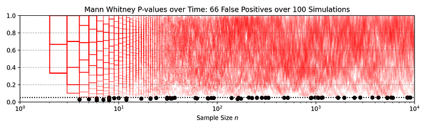
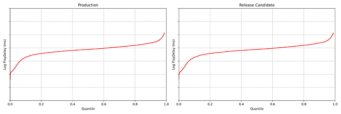
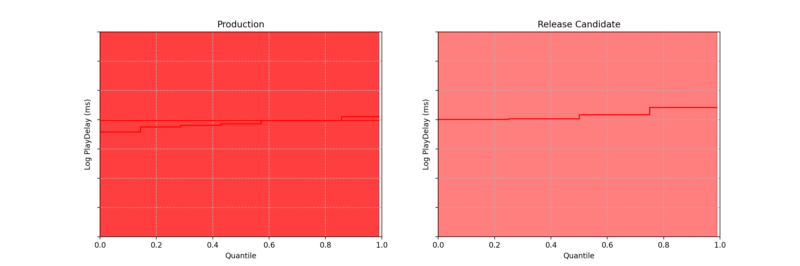

# Sequential A/B Testing Keeps the World Streaming NetflixPart 1: Continuous Data

[Michael Lindon](https://www.linkedin.com/in/michaelslindon/), [Chris Sanden](https://www.linkedin.com/in/csanden/), [Vache Shirikian](https://www.linkedin.com/in/vshirikian/), [Yanjun Liu](https://www.linkedin.com/in/liuyanjun/), [Minal Mishra](https://www.linkedin.com/in/minalmishra/), [Martin Tingley](https://www.linkedin.com/in/martintingley/)

**1. Spot the Difference**

Can you spot any difference between the two data streams below? Each observation is the time interval between a Netflix member hitting the play button and playback commencing, i.e., _play-delay_. These observations are from a particular type of A/B test that Netflix runs called a software canary or regression-driven experiment. More on that below — for now, what’s important is that we want to **quickly** and **confidently** identify any difference in the distribution of play-delay — or conclude that, within some tolerance, there is no difference.

In this blog post, we will develop a statistical procedure to do just that, and describe the impact of these developments at Netflix. **The key idea is to switch from a “fixed time horizon” to an “any-time valid” framing of the problem.**

*Figure 1. An example data stream for an A/B test where each observation represents play-delay for the control (left) and treatment (right). Can you spot any differences in the statistical distributions between the two data streams?*

**2. Safe software deployment, canary testing, and play-delay**

Software engineering readers of this blog are likely familiar with unit, integration and load testing, as well as other testing practices that aim to prevent bugs from reaching production systems. Netflix also performs canary tests — software A/B tests between current and newer software versions. To learn more, see our previous blog post on [Safe Updates of Client Applications](./safe-updates-of-client-applications-at-netflix-1d01c71a930c.md).

The purpose of a canary test is twofold: to act as a quality-control gate that catches bugs prior to full release, and to measure performance of the new software in the wild. This is carried out by performing a randomized controlled experiment on a small subset of users, where the treatment group receives the new software update and the control group continues to run the existing software. If any bugs or performance regressions are observed in the treatment group, then the full-scale release can be prevented, limiting the “impact radius” among the user base.

One of the metrics Netflix monitors in canary tests is how long it takes for the video stream to start when a title is requested by a user. **Monitoring this “play-delay” metric throughout releases ensures that the streaming performance of Netflix only ever improves as we release newer versions of the Netflix client.** In Figure 1, the left side shows a real-time stream of play-delay measurements from users running the existing version of the Netflix client, while the right side shows play-delay measurements from users running the updated version. We ask ourselves: Are users of the updated client experiencing longer play-delays?

We consider any increase in play-delay to be a serious performance regression and would prevent the release if we detect an increase. Critically, testing for differences in means or medians is not sufficient and does not provide a complete picture. For example, one situation we might face is that the median or mean play-delay is the same in treatment and control, but the treatment group experiences an increase in the upper quantiles of play-delay. This corresponds to the Netflix experience being degraded for those who already experience high play delays — likely our members on slow or unstable internet connections. Such changes should not be ignored by our testing procedure.

For a complete picture, we need to be able to reliably and quickly detect an upward shift _in any part of the play-delay distribution_. That is, we must do inference on and test for any differences between the distributions of play-delay in treatment and control.

To summarize, here are the design requirements of our **canary testing system:**

1. Identify bugs and performance regressions, as measured by play-delay, as quickly as possible. **_Rationale_**: To minimize member harm, if there is any problem with the streaming quality experienced by users in the treatment group we need to abort the canary and roll back the software change as quickly as possible.
2. Strictly control false positive (false alarm) probabilities. **_Rationale_**: This system is part of a semi-automated process for all client deployments. A false positive test unnecessarily interrupts the software release process, reducing the velocity of software delivery and sending developers looking for bugs that do not exist.
3. This system should be able to detect any change in the distribution. **_Rationale_**_: _We care not only about changes in the mean or median, but also about changes in tail behaviour and other quantiles.

We now build out a sequential testing procedure that meets these design requirements.

**3. Sequential Testing: The Basics**

Standard statistical tests are fixed-n or fixed-time horizon: the analyst waits until some pre-set amount of data is collected, and then performs the analysis a single time. The classic t-test, the Kolmogorov-Smirnov test, and the Mann-Whitney test are all examples of fixed-n tests. A limitation of fixed-n tests is that they can only be performed once — yet in situations like the above, we want to be testing frequently to detect differences as soon as possible. If you apply a fixed-n test more than once, then you forfeit the Type-I error or false positive guarantee.

Here’s a quick illustration of how fixed-n tests fail under repeated analysis. In the following figure, each red line traces out the p-value when the Mann-Whitney test is repeatedly applied to a data set as 10,000 observations accrue in both treatment and control. Each red line shows an independent simulation, and in each case, there is no difference between treatment and control: these are simulated A/A tests.

The black dots mark where the p-value falls below the standard 0.05 rejection threshold. An alarming **70% of simulations **declare a significant difference at some point in time, even though, by construction, there is no difference: the actual false positive rate is much higher than the nominal 0.05. Exactly the same behaviour would be observed for the Kolmogorov-Smirnov test.

*Figure 2. 100 Sample paths of the p-value process simulated under the null hypothesis shown in red. The dotted black line indicates the nominal alpha=0.05 level. Black dots indicate where the p-value process dips below the alpha=0.05 threshold, indicating a false rejection of the null hypothesis. A total of 66 out of 100 A/A simulations falsely rejected the null hypothesis.*

This is a manifestation of “peeking”, and much has been written about the downside risks of this practice (see, for example, [Johari _et al. _2017](https://dl.acm.org/doi/abs/10.1145/3097983.3097992)). If we restrict ourselves to correctly applied fixed-n statistical tests, where we analyze the data exactly once, we face a difficult tradeoff:

- Perform the test early on, after a small amount of data has been collected. In this case, we will only be powered to detect larger regressions. Smaller performance regressions will not be detected, and we run the risk of steadily eroding the member experience as small regressions accrue.
- Perform the test later, after a large amount of data has been collected. In this case, we are powered to detect small regressions — but in the case of large regressions, we expose members to a bad experience for an unnecessarily long period of time.

Sequential, or “any-time valid”, statistical tests overcome these limitations. They permit for peeking –in fact, they can be applied after every new data point arrives– while providing false positive, or Type-I error, guarantees that hold throughout time. As a result, we can continuously monitor data streams like in the image above, using _confidence sequences_ or _sequential p-values_, and rapidly detect large regressions while eventually detecting small regressions.

Despite relatively recent adoption in the context of digital experimentation, these methods have a long academic history, with initial ideas dating back to Abraham Wald’s [_Sequential Tests of Statistical Hypotheses_](https://www.jstor.org/stable/2235829)_ _from 1945. Research in this area remains active, and Netflix has made a number of contributions in the last few years (see the references in these papers for a more complete literature review):

- [Rapid Regression Detection in Software Deployments](https://dl.acm.org/doi/abs/10.1145/3534678.3539099)
- [Anytime-Valid Inference For Multinomial Count Data](https://openreview.net/forum?id=a4zg0jiuVi)
- [Anytime-Valid Linear Models and Regression Adjusted Causal Inference in Randomized Experiments](https://arxiv.org/abs/2210.08589)
- [Design-Based Confidence Sequences: A General Approach to Risk Mitigation in Online Experimentation](https://arxiv.org/abs/2210.08639)
- [Near-Optimal Non-Parametric Sequential Tests and Confidence Sequences with Possibly Dependent Observations](https://arxiv.org/abs/2212.14411)

In this and following blogs, we will describe both the methods we’ve developed and their applications at Netflix. The remainder of this post discusses the first paper above, which was published at KDD ’22 (and available on [ArXiV](https://arxiv.org/abs/2205.14762)). We will keep it high level — readers interested in the technical details can consult the paper.

**4. A sequential testing solution**

**Differences in Distributions**

At any point in time, we can estimate the empirical quantile functions for both treatment and control, based on the data observed so far.

*Figure 3: Empirical quantile function for control (left) and treatment (right) at a snapshot in time after starting the canary experiment. This is from actual Netflix data, so we’ve suppressed numerical values on the y-axis.*

These two plots look pretty close, but we can do better than an eyeball comparison — and we want the computer to be able to continuously evaluate if there is any significant difference between the distributions. Per the design requirements, we also wish to detect large effects early, while preserving the ability to detect small effects eventually — and we want to maintain the false positive probability at a nominal level while permitting continuous analysis (aka peeking).

**That is, we need a sequential test on the difference in distributions**.

Obtaining “fixed-horizon” confidence bands for the quantile function can be achieved using the [DKWM inequality](https://en.wikipedia.org/wiki/Dvoretzky%E2%80%93Kiefer%E2%80%93Wolfowitz_inequality). To obtain time-uniform confidence bands, however, we use the anytime-valid confidence sequences from [Howard and Ramdas (2022)](https://projecteuclid.org/journals/bernoulli/volume-28/issue-3/Sequential-estimation-of-quantiles-with-applications-to-A-B-testing/10.3150/21-BEJ1388.short) [[arxiv version](https://arxiv.org/abs/1906.09712)]. As the coverage guarantee from these confidence bands holds uniformly across time, we can watch them become tighter without being concerned about [peeking](https://www.kdd.org/kdd2017/papers/view/peeking-at-ab-tests-why-it-matters-and-what-to-do-about-it). As more data points stream in, these sequential confidence bands continue to shrink in width, which means any difference in the distribution functions — if it exists — will eventually become apparent.

*Figure 4: 97.5% Time-Uniform Confidence bands on the quantile function for control (left) and treatment (right)*

Note each frame corresponds to a point in time after the experiment began, not sample size. In fact, there is no requirement that each treatment group has the same sample size.

Differences are easier to see by visualizing the difference between the treatment and control quantile functions.

*Figure 5: 95% Time-Uniform confidence band on the quantile difference function Q_b(p) — Q_a(p) (left). The sequential p-value (right).*

As the sequential confidence band on the treatment effect quantile function is anytime-valid, the inference procedure becomes rather intuitive. We can continue to watch these confidence bands tighten, and if at any point the band no longer covers zero at any quantile, we can conclude that the distributions are different and stop the test. In addition to the sequential confidence bands, we can also construct a sequential p-value for testing that the distributions differ. Note from the animation that the moment the 95% confidence band over quantile treatment effects excludes zero is the same moment that the sequential p-value falls below 0.05: as with fixed-n tests, there is consistency between confidence intervals and p-values.

There are many multiple testing concerns in this application. Our solution controls Type-I error across all quantiles, all treatment groups, and all joint sample sizes simultaneously (see [our paper](https://arxiv.org/pdf/2205.14762.pdf), or[ Howard and Ramdas](https://projecteuclid.org/journals/bernoulli/volume-28/issue-3/Sequential-estimation-of-quantiles-with-applications-to-A-B-testing/10.3150/21-BEJ1388.short) for details). Results hold for all quantiles, and for all times.

**5. Impact at Netflix**

Releasing new software always carries risk, and we always want to reduce the risk of service interruptions or degradation to the member experience. Our canary testing approach is another layer of protection for preventing bugs and performance regressions from slipping into production. It’s fully automated and has become an integral part of the software delivery process at Netflix. Developers can push to production with peace of mind, knowing that bugs and performance regressions will be rapidly caught. The additional confidence empowers developers to push to production more frequently, reducing the time to market for upgrades to the Netflix client and increasing our rate of software delivery.

So far this system has successfully prevented a number of serious bugs from reaching our end users. We detail one example.

**Case study: Safe Rollout of Netflix Client Application**

Figures 3–5 are taken from a canary test in which the behaviour of the client application was modified application (actual numerical values of play-delay have been suppressed). As we can see, the canary test revealed that the new version of the client increases a number of quantiles of play-delay, with the median and 75% percentile of play experiencing relative increases of at least 0.5% and 1% respectively. The timeseries of the sequential p-value shows that, in this case, we were able to reject the null of no change in distribution at the 0.05 level after about 60 seconds. This provides rapid feedback in the software delivery process, allowing developers to test the performance of new software and quickly iterate.

**6. What’s next?**

If you are curious about the technical details of the sequential tests for quantiles developed here, you can learn all about the math in our [KDD paper](https://dl.acm.org/doi/abs/10.1145/3534678.3539099) ([also available on arxiv](https://arxiv.org/pdf/2205.14762.pdf)).

You might also be wondering what happens if the data are not continuous measurements. Errors and exceptions are critical metrics to log when deploying software, as are many other metrics which are best defined in terms of counts. Stay tuned — our next post will develop sequential testing procedures for count data.

**Update:**

[Part 2: Count Data](./sequential-testing-keeps-the-world-streaming-netflix-part-2-counting-processes-da6805341642.md)

---
**Tags:** Software Development · Software Testing · Data Science · Statistics · Experimentation
