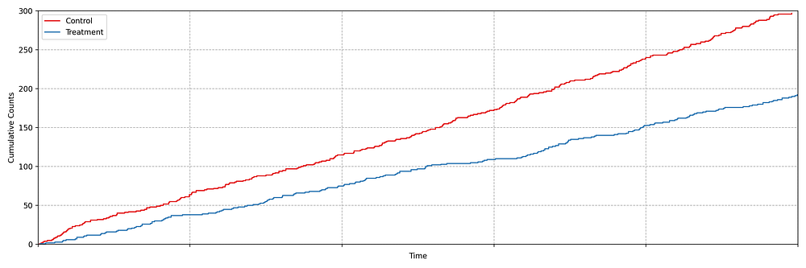
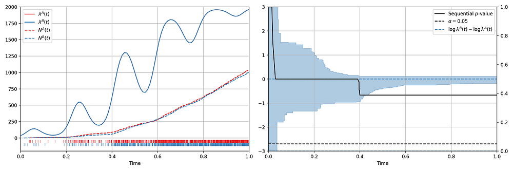
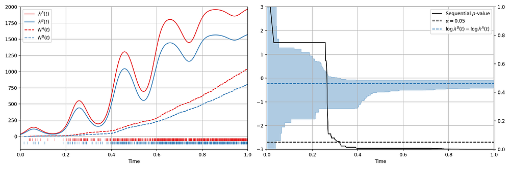
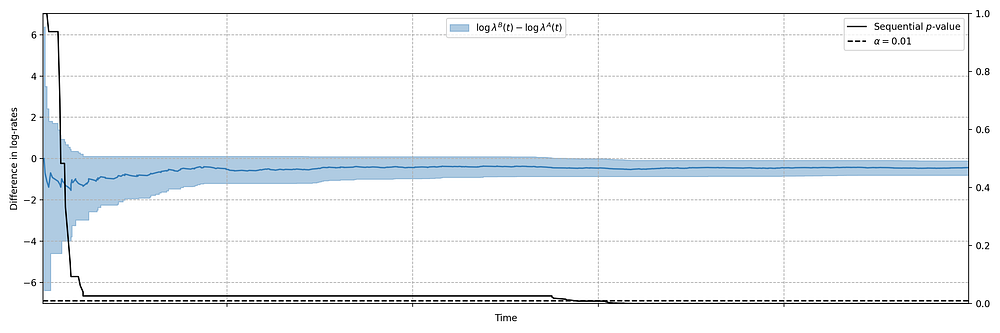
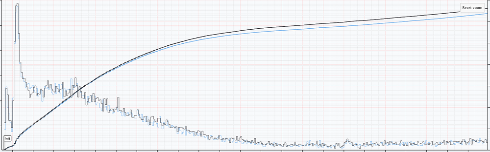
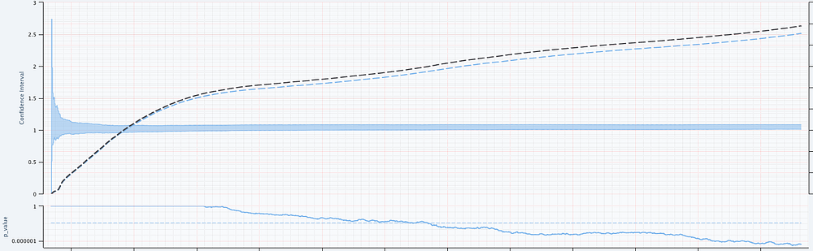
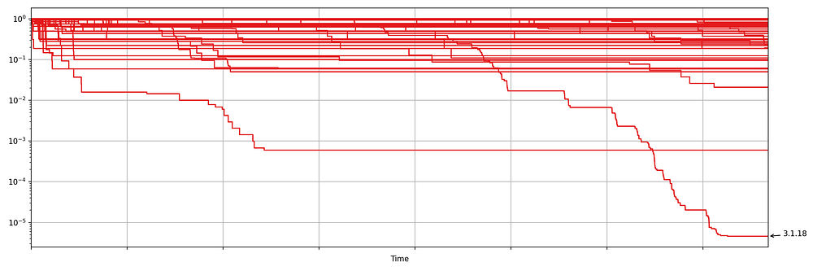
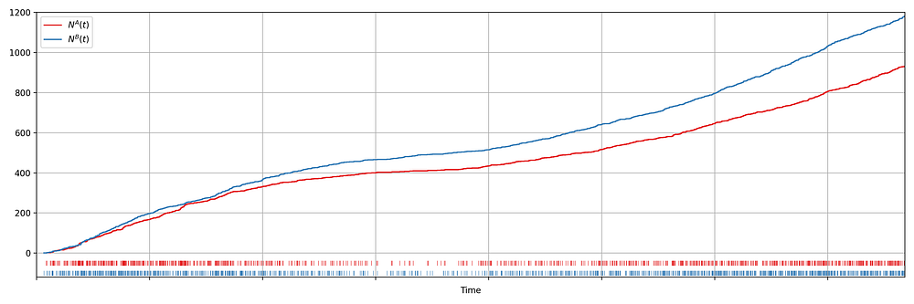
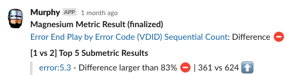

# Sequential A/B Testing Keeps the World Streaming Netflix Part 2: Counting Processes

[Michael Lindon](https://www.linkedin.com/in/michaelslindon/), [Chris Sanden](https://www.linkedin.com/in/csanden/), [Vache Shirikian](https://www.linkedin.com/in/vshirikian/), [Yanjun Liu](https://www.linkedin.com/in/liuyanjun/), [Minal Mishra](https://www.linkedin.com/in/minalmishra/), [Martin Tingley](https://www.linkedin.com/in/martintingley/)


Have you ever encountered a bug while streaming Netflix? Did your title stop unexpectedly, or not start at all? In the first installment of this blog series on sequential testing, we described our [canary testing methodology for continuous metrics such as _play-delay_](https://medium.com/p/cba6c7ed49df). One of our readers commented

> What if the new release is not related to a new play/streaming feature? For example, what if the new release includes modified login functionality? Will you still monitor the “play-delay” metric?

**Netflix monitors a large suite of metrics, many of which can be classified** as counts. These include metrics such as the number of logins, errors, successful play starts, and even the number of customer call center contacts. In this second installment, we describe our sequential methodology for testing count metrics, outlined in the NeurIPS paper [_Anytime Valid Inference for Multinomial Count Data_](https://openreview.net/forum?id=a4zg0jiuVi).

### Spot the Difference

Suppose we are about to deploy new code that changes the login behavior. To de-risk the software rollout we A/B test the new code, known also as a canary test. Whenever an event such as a login occurs, a log flows through our real-time backend and the corresponding timestamp is recorded. Figure 1 illustrates the sequences of timestamps generated by devices assigned to the new (treatment) and existing (control) software versions. A question that naturally concerns us is whether there are fewer login events in the treatment. Can you tell?


*Figure 1: Timestamps of events occurring in control and treatment*

It is not immediately obvious by simple inspection of the point processes in Figure 1. The difference becomes immediately obvious when we visualize the observed [counting processes](https://en.wikipedia.org/wiki/Counting_process#:~:text=Counting%20processes%20deal%20with%20the,be%20a%20Markov%20counting%20process.), shown in Figure 2.


*Figure 2: Visualizing the counting processes — the number of events observed by time t*

The counting processes are functions that increment by 1 whenever a new event arrives. Clearly, there are fewer events occurring in the treatment than in the control. If these were login events, this would suggest that the new code contains a bug that prevents some users from being able to log in successfully.

This is a common situation when dealing with event timestamps. To give another example, if events corresponded to errors or crashes, we would like to know if these are accruing faster in the treatment than in the control. Moreover, we want to answer that question _as quickly as possible _to prevent any further disruption to the service_._ This necessitates sequential testing techniques which were introduced in [part 1](https://medium.com/p/cba6c7ed49df).

### Time-Inhomogeneous Poisson Process

Our data for each treatment group is a realization of a one-dimensional point process, that is, a sequence of timestamps. As the rate at which the events arrive is time-varying (in both treatment and control), we model the point process as a time-inhomogeneous [Poisson point process](https://en.wikipedia.org/wiki/Poisson_point_process#Inhomogeneous_Poisson_point_process). This point process is defined by an intensity function λ: ℝ → [0, ∞). The number of events in the interval [0,t), denoted N(t), has the following Poisson distribution

N(t) ~ Poisson(Λ(t)), where Λ(t) = ∫₀ᵗ λ(s) ds.

We seek to test the null hypothesis H₀: λᴬ(t) = λᴮ(t) for all t i.e. the intensity functions for control (A) and treatment (B) are the same. This can be done semiparametrically without making any assumptions about the intensity functions λᴬ and λᴮ. Moreover, the novelty of the research is that this can be done sequentially, as described in [section 4](https://openreview.net/pdf?id=a4zg0jiuVi) of our paper. Conveniently, the only data required to test this hypothesis at time t is Nᴬ(t) and Nᴮ(t), the total number of events observed so far in control and treatment. In other words, all you need to test the null hypothesis is two integers, which can easily be updated as new events arrive. Here is an example from a simulated A/A test, in which we know by design that the intensity function is the same for the control (A) and the treatment (B), **albeit** nonstationary.


*Figure 3: (Left) An A/A simulation of two inhomogeneous Poisson point processes. (Right) Confidence sequence on the log-difference of intensity functions, and sequential p-value.*

Figure 3 provides an illustration of an A/A setting. The left figure presents the raw data and the intensity functions, and the right figure presents the sequential statistical analysis. The blue and red rug plots indicate the observed arrival timestamps of events from the treatment and control streams respectively. The dashed lines are the observed counting processes. As this data is simulated under the null, the intensity functions are identical and overlay each other. The left axis of the right figure visualizes the evolution of the confidence sequence on the log-difference of intensity functions. The right axis of the right figure visualizes the evolution of the sequential p-value. We can make the two following observations

- Under the null, the difference of log intensities is zero, which is correctly covered by the 0.95 confidence sequence at all times.
- The sequential p-value is greater than 0.05 at all times

Now let’s consider an illustration of an A/B setting. Figure 4 shows observed arrival times for treatment and control when the intensity functions differ. As this is a simulation, the true difference between log intensities is known.


*Figure 4: (Left) An A/B simulation of two inhomogeneous Poisson point processes. (Right) Confidence sequence on the difference of log of intensity functions, and sequential p-value.*

We can make the following observations

- The 0.95 confidence sequence covers the true log-difference at all times
- The sequential p-value falls below 0.05 at the same time the 0.95 confidence sequence excludes the null value of zero

Now we present a number of case studies where this methodology has rapidly detected serious problems in a number of count metrics

### Case Study 1: Drop in Successful Title Starts

Figure 2 actually presents counts of title start events from a real canary test. Whenever a title starts successfully, an [event](https://netflixtechblog.com/sps-the-pulse-of-netflix-streaming-ae4db0e05f8a) is sent from the device to Netflix. We have a stream of title start events from treatment devices and a stream of title start events from control devices. Whenever fewer title starts are observed among treatment devices, there is usually a bug in the new client preventing playback.

In this case, the canary test detected a bug that was later determined to have prevented approximately 60% of treatment devices from being able to start their streams. The confidence sequence is shown in Figure 5, in addition to the (sequential) p-value. While the exact units of time have been omitted, this bug was detected at the _sub-second_ level.


*Figure 5: 0.99 Confidence sequence on the difference of log-intensities with sequential p-value.*

### Case Study 2: Increase in Abnormal Shutdowns

In addition to title start events, we also monitor whenever the Netflix client shuts down unexpectedly. As before, we have two streams of abnormal shutdown events, one from treatment devices, and one from control devices. The following screenshots are taken directly from our [Lumen](./lumen-custom-self-service-dashboarding-for-netflix-8c56b541548c.md) dashboards.


*Figure 6: Counts of Abnormal Shutdowns over time, cumulative and non-cumulative. Treatment (Black) and Control (Blue)*

Figure 6 illustrates two important points. There is clearly nonstationarity in the arrival of abnormal shutdown events. It is also not easy to visibly see any difference between treatment and control from the non-cumulative view. The difference is, however, much easier to see from the cumulative view by observing the counting process. There is a small but visible increase in the number of abnormal shutdowns in the treatment. Figure 7 shows how our sequential statistical methodology is even able to identify such small differences.


*Figure 7: Abnormal Shutdowns. (Top Panel) Confidence sequences on λᴮ(t)/λᴬ(t) (shaded blue) with observed counting processes for treatment (black dashed) and control (blue dashed). (Bottom Panel) sequential p-values.*

### Case Study 3: Increase in Errors

Netflix also monitors the number of errors produced by treatment and control. This is a high cardinality metric as every error is annotated with a code indicating the type of error. Monitoring errors segmented by code helps developers diagnose issues quickly. Figure 8 shows the sequential p-values, on the log scale, for a set of error codes that Netflix monitors during client rollouts. In this example, we have detected a higher volume of [3.1.18](https://help.netflix.com/en/node/100573?q=3.1.18) errors being produced by treatment devices. Devices experiencing this error are presented with the following message:

> “We’re having trouble playing this title right now”


*Figure 8: Sequential p-values for start play errors by error code*


*Figure 9: Observed error-3.1.18 timestamps and counting processes for treatment (blue) and control (red)*

Knowing _which_ errors increased can streamline the process of identifying the bug for our developers. We immediately send developers alerts through Slack integrations, such as the following


*Figure 10: Notifications via Slack Integrations*

The next time you are watching Netflix and encounter an error, know that we’re on it!

### Try it Out!

The statistical approach outlined in our[ paper](https://openreview.net/pdf?id=a4zg0jiuVi) is remarkably easy to implement in practice. All you need are two integers, the number of events observed so far in the treatment and control. The code is available in this short[ GitHub gist](https://gist.github.com/michaellindon/5ce04c744d20755c3f653fbb58c2f4dd). Here are two usage examples:

```
> counts = [100, 101]
> assignment_probabilities = [0.5, 0.5]
> sequential_p_value(counts, assignment_probabilities)
  1

> counts = [100, 201]
> assignment_probabilities = [0.5, 0.5]
> sequential_p_value(counts, assignment_probabilities)
  5.06061172163498e-06
```

The[ code](https://gist.github.com/michaellindon/5ce04c744d20755c3f653fbb58c2f4dd) generalizes to more than just two treatment groups. For full details, including hyperparameter tuning, see[ section 4](https://openreview.net/pdf?id=a4zg0jiuVi) of the paper.

### Further Reading

- [Anytime Valid Inference for Multinomial Count Data](https://openreview.net/forum?id=a4zg0jiuVi)
- [Sequential A/B Testing Keeps the World Streaming Netflix Part 1: Continuous Data](./sequential-a-b-testing-keeps-the-world-streaming-netflix-part-1-continuous-data-cba6c7ed49df.md)

---
**Tags:** Ab Testing · DevOps · Software Development · Statistics · Machine Learning
