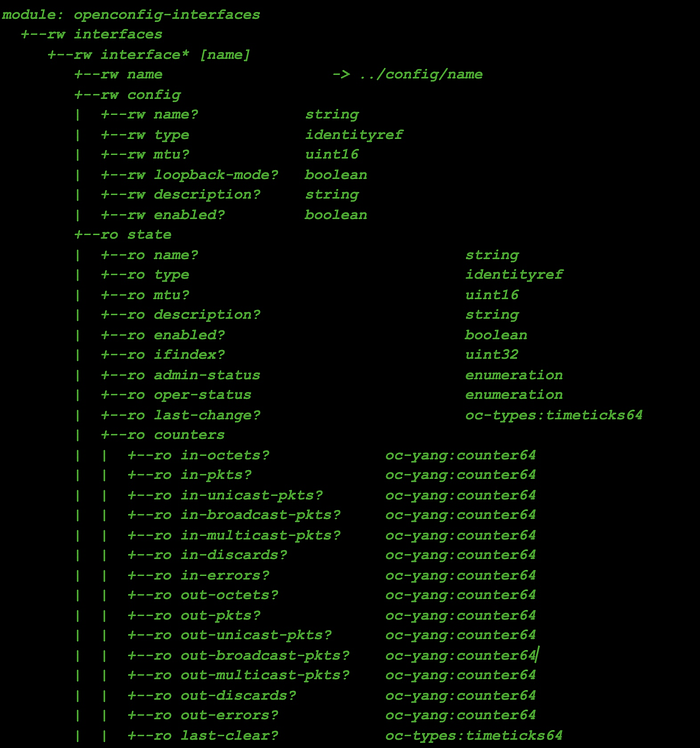
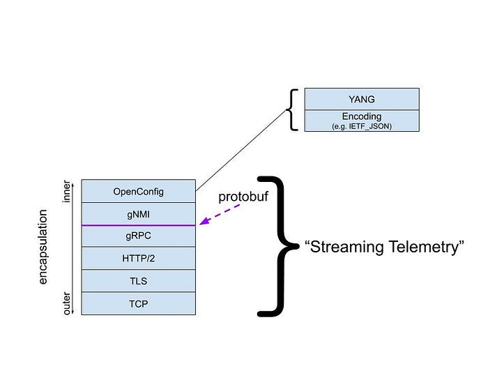
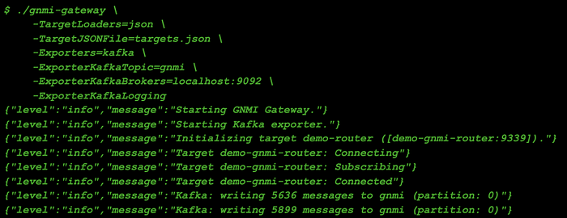

# Simple streaming telemetry

> Introducing gnmi-gateway: a modular, distributed, and highly available service for modern network telemetry via OpenConfig and gNMI

By: Colin McIntosh, Michael Costello

Netflix runs its own content delivery network, [Open Connect](https://openconnect.netflix.com/), which delivers all streaming traffic to our members. A backbone network underlies a large portion of the CDN, and we also run the high capacity networks that support our studios and corporate offices. In order to design, operate, and measure these networks, we must collect metrics and state data from the thousands of devices that compose them.

Towards this end, we created [_gnmi-gateway_](https://github.com/openconfig/gnmi-gateway), which we have released as an open source project. This article goes over some background on the project, why we created it, and how you can use it to monitor your own network.

## Background

Traditional network management tools, namely SNMP and CLI screen-scraping, have been used for decades for this purpose, and there are numerous software packages, protocols, and libraries to choose from. As is common with mature technologies, any number of shortcomings have revealed themselves. The data itself is largely unstructured, untyped, and vendor-proprietary, and its format often changes between even minor software releases. The mechanisms by which the data is retrieved may not be inherently reliable (in the case of SNMP’s UDP transport) and always require active polling by the collector — which, for time series data, must be driven by a strict clock. Other shortcomings include a lack of source timestamps, support for multiple connections, and general scalability challenges.

Modern vendor APIs address some, but not all, of these shortcomings. For example, Arista’s EOS provides eAPI, a RESTful service using JSON payloads. Similarly, Juniper has its Junos XML API, utilizing NETCONF and XML. In both cases the data remains only semi-structured, both vendors format it differently, and collectors must actively poll.

To address the issues associated with polling, some vendors have developed implementations of streaming telemetry, a technology that pushes data from devices on a clock or when state changes rather than requiring polling. However, as with legacy protocols, different vendors implement streaming protocols and payloads differently, and the data is often still unstructured or untyped.

## OpenConfig

A few years ago, an operator-driven working group, [OpenConfig](https://openconfig.net/), was formed with the goal of solving all these problems. The result is a strongly typed vendor-agnostic data model that describes the state and configuration of network devices. The data model is arranged in a tree-like structure of various leaves. Here is a example of what some of these leaves may look like:


*Tree example generated by pyang. Some leaves are removed for brevity.*

This OpenConfig data model is defined in YANG and can be found [on GitHub](https://github.com/openconfig/public/tree/master/release/models) where the latest changes are published.

## gNMI

While the OpenConfig data model describes the structure and state of network devices, the data itself is streamed from network devices at Netflix using the gRPC Network Management Interface (gNMI) protocol. gNMI is an open-source protocol [specification](https://github.com/openconfig/reference/blob/master/rpc/gnmi/gnmi-specification.md) created by the OpenConfig working group that is used to stream data to and from network devices, also known as _gNMI targets_. gNMI provides four RPC mechanisms:

- **Capabilities**: Describes the services and data models supported by the target
- **Get**: Allows clients to request the value of specific leaves in the tree
- **Set**: Allows clients to set writable leaves in the tree
- **Subscribe**: Streams state changes about the target to clients

**Subscribe** is the RPC that we’re primarily interested in to stream state from targets to our network management platform, and is the the RPC that gnmi-gateway supports today.

Here’s a diagram that will give you an idea of how OpenConfig and gNMI fit together:



At the bottom of the diagram is a normal gRPC connection over HTTP/2 and TLS. The gRPC code is auto-generated from the gNMI protobuf model and gNMI carries the data modeled in OpenConfig, which has some encoding.

When we talk about streaming telemetry at Netflix, we’re typically talking about all of the components in this stack.

## Existing Systems

OpenConfig and gNMI streaming telemetry solve many of the problems that network operators encounter, but to date there have been no commercial or open source systems that provide scalable integration of this data into traditional network management tools. Where is [Cacti](https://www.cacti.net/) for streaming telemetry? Although there are [gnmi_collector](https://github.com/openconfig/gnmi/blob/master/cmd/gnmi_collector), [gNMI Plugin for Telegraf](https://github.com/influxdata/telegraf/tree/master/plugins/inputs/gnmi), and [Cisco Big Muddy](https://github.com/cisco/bigmuddy-network-telemetry-pipeline), none of these provide a distributed and highly available collection service that exports streaming data in a useful manner.

## The Gateway

To fill these gaps — under the OpenConfig working group, Netflix has built and now introduces [gnmi-gateway](https://github.com/openconfig/gnmi-gateway), a modular, distributed, and highly available service for OpenConfig modeled streaming telemetry data over gNMI.

Our goals in building a gateway to consume and distribute data from gNMI were similar to goals in services that we’ve built in the past for SNMP and CLI screen-scraping. We strived for a service that:

- is tolerant to failure
- dynamically loads/unloads metadata to form connections to network devices
- can export data to our constantly-evolving suite of network management tools
- uses existing code where possible

Additionally, we wanted to improve the accessibility of the gNMI protocol and OpenConfig data by enabling network operators everywhere to deploy the service with no additional software development (coding) required.

That said, we also didn’t want to limit the ability for network operators to further extend the functionality. Whenever possible, we enabled additional exporter and target loading plugins to be added with loose coupling and without the need to develop a complete gNMI client.

We chose to build gnmi-gateway in Golang given the first-class support for protobufs in Go and that much of the existing reference code for gNMI exists in Golang. Although we chose Golang, clients for the gNMI protocol can be generated for any language with Protobuf 3 tools. Network operators should feel encouraged to deploy gnmi-gateway to manage connections to gNMI targets and write consuming gNMI applications in the language that is most appropriate for their situation.

As mentioned earlier, we wanted to use existing code whenever possible. Within the _openconfig/gnmi _repo there are three specific components built by the OpenConfig community that we directly utilized:

- **gnmi/client**: A fault-tolerant client for forming gNMI connections to targets
- **gnmi/cache** and **gnmi/subscribe**: Libraries for aggregating gNMI messages from multiple targets and serving them in a consolidated stream

## Addressing the Need for High Availability

One of the primary issues we found with existing software for gNMI was a lack of tolerance for failure. Most of the existing software was stateful and either required a mutable deployment or didn’t include any cluster awareness for failover or coordination.

To support better failure tolerance, we included clustering in gnmi-gateway that allows multiple instances of the service to coordinate and deduplicate connections to targets. We have many consumers interested in this streaming telemetry, but we only need a single connection to a target to receive it. By using this clustering functionality and replication, we’re able to avoid unnecessary duplicate gNMI connections to targets.

gnmi-gateway uses a shared lock per-target for coordinating these connections. We chose to build locking on Apache Zookeeper, which is included in Netflix’s [paved road](https://netflixtechblog.com/full-cycle-developers-at-netflix-a08c31f83249) and provides all of the features necessary for cluster consensus. Although Zookeeper is the included clustering implementation, gnmi-gateway provides a Golang interface that can be used to implement connection coordination with systems other than Zookeeper.

After an instance of gnmi-gateway acquires a lock for a target and forms a connection, it begins to forward data into the local in-memory cache. To allow any instance of gnmi-gateway in the cluster to serve a subscription for any target in the cluster, gNMI messages are replicated from the instance with the lock to other instances in the cluster. This replication allows any clustered instance of gnmi-gateway to accept client requests for any known target.

With every instance in the cluster able to serve streams for each target, we’re able to load balance incoming clients connections among all of the cluster instances. The underlying transport for gNMI is, like most gRPC connections, HTTP/2 over TLS — so this allows us to use a simple Layer 4 load balancer between gnmi-gateway and our gNMI clients. Although we’ve chosen to use a Layer 4 load balancer, this could be substituted for a Layer 7 load balancer or an alternative load balancing solution, such as DNS load balancing.

## Target Loaders

At Netflix, our network infrastructure is constantly changing. To allow network engineers to make changes on the network without needing to update the configuration of gnmi-gateway many times per day, we included a feature that loads our gNMI targets from our network management system (NMS) based on tags on network devices. Although our NMS (and therefore its API) is not open source, we included a Target Loader plugin for loading devices from NetBox as well as from watched files.

Here is an example of a simple target loader configuration file:

```
---
connection:
  demo-gnmi-router:
    addresses:
     - demo-gnmi-router.example.com:9339
    request: demo-request
    meta: {}
request:
  demo-request:
    target: "*"
    paths:
      - /components
      - /interfaces/interface[name=*]/state/counters
      - /interfaces/interface[name=*]/ethernet/state/counters
```

## Exporters

While gnmi-gateway allows us to form connections to our gNMI data sources (network devices) and serve gNMI streams to clients on the other side, we still need to integrate this data with our existing tooling, most of which does not support the gNMI protocol.

```
// Exporter is an interface to send data to other systems and
// protocols.
type Exporter interface {
  // Name must return unique exporter name that will be used for
  // registration and recording internal stats.
  Name() string
  // Start will be called once by the gateway.Gateway after
  // StartGateway is called. It will receive a pointer to the
  // cache.Cache that receives all of the updates from gNMI targets
  // that the gateway has a subscription for. If Start returns an
  // error the gateway will fail to start with an error.
  Start(*cache.Cache) error
  // Export will be called once for every gNMI notification that is
  // inserted into the cache.Cache. Export should complete as
  // quickly as possible to prevent delays in the system and
  // upstream gNMI clients. Export receives the leaf parameter
  // which is a *ctree.Leaf type and has a value of type
  // *gnmipb.Notification. You can access the notification with a
  // type assertion: leaf.Value().(*gnmipb.Notification)
  Export(leaf *ctree.Leaf)
}
```

To enable this integration, we included plug-in components in gnmi-gateway called Exporters, which are able to present data to non-gNMI systems. Exporters were designed to be easily extendable with a Golang interface, but to help users of gnmi-gateway get started without needing to write code, we’ve included a few to start.

Here’s an example of gnmi-gateway being started with a Kafka Exporter enabled:



To see additional Exporter functionality, take a look at another example in the GitHub repo [here](https://github.com/openconfig/gnmi-gateway/tree/release/examples/gnmi-prometheus) that will get you up and running with a development instance of Prometheus and gnmi-gateway.

## You can try gnmi-gateway right now!

With all of these great features, we bet you’re itching to try gnmi-gateway right away! Good news — you can go grab a copy of gnmi-gateway right now and try it out for yourself. To get started you’ll need to have installed:

- Golang 1.13 or later
- git
- openssl (or another tool to generate certificate pairs)
- A target that supports gNMI and OpenConfig (see list in the Appendix)

In a new shell or terminal:

```
$ git clone github.com/openconfig/gnmi-gateway && cd gnmi-gateway
```

The gNMI specification requires that gNMI connections be encrypted with TLS, so you’ll need to create a few TLS certificates before you can start the gnmi-gateway server:

```
$ make tls
```

Make sure that the .crt and .key file were created successfully:

```
$ ls -al server.*
-rw-rw-r-- 1 user user 717 Sep  1 20:50 server.crt
-rw------- 1 user user 359 Sep  1 20:50 server.key
```

Next, you’ll need to define the target and paths that you want to subscribe to. First copy the example .yaml file which will be used with the ‘simple’ target loader:

```
$ cp targets-example.yaml targets.yaml
```

Edit the file to match the details of your router. Here we have a few predefined paths, but feel free to modify them to paths that you’re interested in seeing.

```
$ vim targets.yaml
```

At this point, you should be ready to start gnmi-gateway. Run gnmi-gateway with the ‘debug’ Exporter enabled to see all of the received messages logged to stdout.

```
$ make build && ./gnmi-gateway -EnableGNMIServer \
    -ServerTLSCert=server.crt \
    -ServerTLSKey=server.key \
    -TargetLoaders=simple \
    -TargetJSONFile=targets.yaml \
    -Exporters=debug
```

Congratulations — you’re now collecting gNMI data with gnmi-gateway!

---
**Tags:** Open Connect · Open Source
