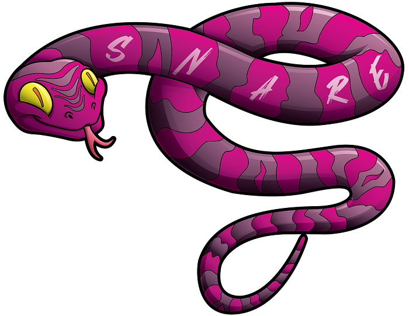
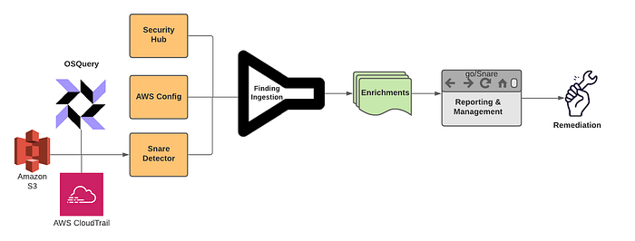
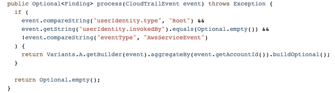
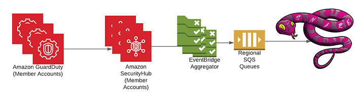
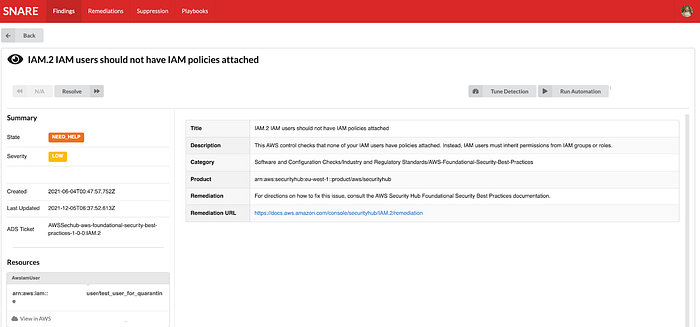
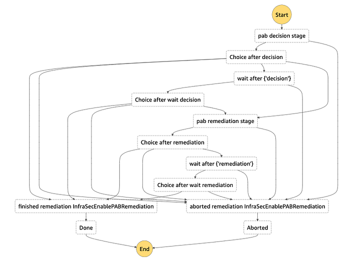

# Snaring the Bad Folks

> Project by Netflix’s Cloud Infrastructure Security team (Alex Bainbridge, Mike Grima, Nick Siow)

Cloud security is a hard problem, but an even harder one is cloud security at scale. In recent years we’ve seen [several cloud focused data breaches](https://firewalltimes.com/amazon-web-services-data-breach-timeline/) and evidence shows that [threat actors are becoming more advanced with their techniques, goals, and tooling](https://www.computerweekly.com/news/252489805/Threat-actors-becoming-vastly-more-sophisticated). With 2021 set to be a [new high for the number of data breaches](https://www.securitymagazine.com/articles/96318-us-expected-to-break-data-breach-record-in-2021), it was plainly evident that we needed to evolve how we approach our cloud infrastructure security strategy.

In 2020, we decided to reinvent how we handle cloud security findings by redefining how we write and respond to cloud detections. We knew that given our scale, we needed to rely heavily on automations and that we needed to build our solutions using battle tested scalable infrastructure.

## Introducing Snare

*Snare Logo*

**Snare is our Detection, Enrichment, and Response platform for handling cloud security related findings at Netflix.** Snare is responsible for receiving millions of records a minute, analyzing, alerting, and responding to them. Snare also provides a space for our security engineers to track what’s going on, drill down into various findings, follow their investigation flow, and ensure that findings are reaching their proper resolution. Snare can be broken down into the following parts: Detection, Enrichment, Reporting & Management, and Remediation.

*Snare Finding Lifecycle*

---

## Overview

Snare was built from the ground up to be scalable to manage Netflix’s massive scale. We currently process tens of millions of log records every minute and analyze these events to perform in-house custom detections. We collect findings from a number of sources, which includes AWS Security Hub, AWS Config Rules, and our own in-house custom detections. Once ingested, findings are then enriched and processed with additional metadata collected from Netflix’s internal data sources. Finally, findings are checked against suppression rules and routed to our control plane for triaging and remediation.

## Where We Are Today

We’ve developed, deployed, and operated Snare for almost a year, and since then, we’ve seen tremendous improvements while handling our cloud security findings. A number of findings are auto remediated, others utilize slack alerts to loop in the oncall to triage via the Snare UI. One major improvement was a direct time savings for our detection squad. Utilizing Snare, we were able to perform more granular tuning and aggregation of findings leading to an average of 73.5% reduction in our false positive finding volume across our ingestion streams. With this additional time, we were able to focus on new detections and new features for Snare.

Speaking of new detections, we’ve more than doubled the number of our in-house detections, and onboarded several detection solutions from security vendors. The Snare framework enables us to write detections quickly and efficiently with all of the plumbing and configurations abstracted away from us. Detection authors only need to be concerned with their actual detection logic, and everything else is handled for them.

*Simple Snare Root User Detection*

As for security vendors, we’ve most notably worked with AWS to ensure that services like GuardDuty and Security Hub are first class citizens when it comes to detection sources. Integration with [Security Hub](https://aws.amazon.com/security-hub/) was a critical design decision from the start due to the high amount of leverage we get from receiving all of the AWS Security findings in a normalized format and in a centralized location. Security Hub has played an integral role in our platform, and made evaluations of AWS security services and new features easy to try out and adopt. Our plumbing between Security Hub and Snare is managed through AWS Organizations as well as EventBridge rules deployed in every region and account to aid in aggregating all findings into our centralized Snare platform.

*High Level Security Service Plumbing*

*Example AWS Security Finding from our testing/sandbox account In Snare UI*

One area that we are investing heavily is our automated remediation potential. We’ve explored a few different options ranging from fully automated remediations, manually triggered remediations, as well as automated playbooks for additional data gathering during incident triage. We decided to employ [AWS Step Functions](https://aws.amazon.com/step-functions/) to be our execution environment due to the unique DAGs we could build and the simplistic “[wait](https://docs.aws.amazon.com/step-functions/latest/dg/amazon-states-language-wait-state.html)”/”[task token](https://docs.aws.amazon.com/step-functions/latest/dg/connect-to-resource.html#connect-wait-token)” functionality, which allows us to involve humans when necessary for approval/input.

Building on top of step functions, we created a 4 step remediation process: pre-processing, decision, remediation, and post-processing. Pre/post processing can be used for managing out-of-band resource checks, or any work that needs to be done in order to ensure a successful remediation. The decision step is used to perform a final pre-flight check before remediation. This can involve a human reachout, verifying the resource is still around, etc. The remediation step is where we perform our actual remediation. We’ve been able to use this to a great deal of success with infrastructure-wide misconfigured resources being automatically fixed near real time, and enabling the creation of new fully automated incident response playbooks. We’re still exploring new ways we might be able to use this, and are excited for how we might evolve our approach in the near future.

*Step Function DAG for S3 Public Access Block Remediation*

Diagram from a remediation to enable S3’s public access block on a non-compliant bucket. Each choice stage allows for dynamic routing to a variety of different stages based on the output of the previous function. Wait stages are used when human intervention/approval is needed.

---

## Extensible Learnings

We’ve come a long way in our journey, and we’ve had numerous learning opportunities that we wanted to collect and share. Hopefully, we’ve made the mistakes and learned from those experiences.

## Information is Key

Home grown context and metadata streams are invaluable for a detection and response program. By uniting detections and context, you’re able to unlock a new world of possibilities for reducing false positives, creating new detections that rely on business specific context, and help better tailor your severities and automated remediation decisions based on your desired risk appetite. A common theme we’ve often encountered is the need to bring additional context throughout various stages of our pipeline, so make sure to plan for that from the get-go.

## Step Functions for Remediations

Step functions provide a highly extensible and unique platform to create remediations. Utilizing the AWS CDK, we were able to build a platform to enable us to easily roll out new remediations. While creating our remediation platform, we explored SSM Automation Runbooks. While SSM Automation Runbooks have great potential for remediating simple issues, we found they weren’t flexible enough to cover a wide spread of our needs, nor did they offer some of the more advanced features we were looking for such as reaching out to humans. Step functions gave us the right amount of flexibility, control, and ease of use in order to be a great asset for the Snare platform.

## Closing Thoughts

We’ve come a long way in a year, and we still have a number of interesting things on the horizon. We’re looking at continuing to create new, more advanced features and detections for Snare to reduce cloud security risks in order to keep up with all of the exciting things happening here at Netflix. Make sure to check out some of our other recent blog posts!

## Special Thanks

Special thanks to everyone who helped to contribute and provide feedback during the design and implementation of Snare. Notably Shannon Morrison, Sapna Solanki, Jason Schroth from our partner team Detection Engineering, as well as some of the folks from AWS — Prateek Sharma & Ely Kahn. Additional thanks to the rest of our Cloud Infrastructure Security team (Hee Won Kim, Joseph Kjar, Steven Reiling, Patrick Sanders, Srinath Kuruvadi) for their support and help with Snare features, processes, and design decisions!

---
**Tags:** AWS · Cloud Security · Cloud · Security · Netflix
