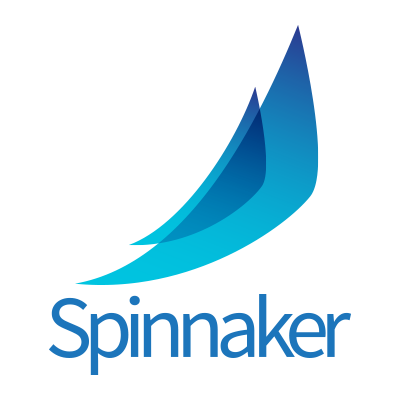

# Spinnaker Sets Sail to the Continuous Delivery Foundation

_Author: _[_Andy Glover_](https://twitter.com/aglover)

Since releasing [Spinnaker](https://www.spinnaker.io/) to the [open source community in 2015](https://medium.com/netflix-techblog/global-continuous-delivery-with-spinnaker-2a6896c23ba7), the platform has flourished with the addition of new cloud providers, triggers, pipeline stages, and much more. Myriad new features, improvements, and innovations have been added by an ever growing, actively engaged community. Each new innovation has been a step towards an even better Continuous Delivery platform that facilitates rapid, reliable, [safe delivery](https://medium.com/netflix-techblog/automated-canary-analysis-at-netflix-with-kayenta-3260bc7acc69) of flexible assets to pluggable deployment targets.

Over the last year, Netflix has improved overall management of Spinnaker by enhancing community engagement and transparency. At the [Spinnaker Summit](https://www.spinnakersummit.com/) in 2018, we announced that we had adopted a formalized [project governance](https://www.spinnaker.io/community/governance/) plan with Google. Moreover, we also realized that we’ll need to share the responsibility of Spinnaker’s direction as well as yield a level of long-term strategic influence over the project so as to maintain a healthy, engaged community. This means enabling more parties outside of Netflix and Google to have a say in the direction and implementation of Spinnaker.

A strong, healthy, committed community benefits everyone; however, open source projects rarely reach this critical mass. It’s clear Spinnaker has reached this special stage in its evolution; accordingly, we are thrilled to announce two exciting developments.

First, Netflix and Google are jointly donating Spinnaker to the newly created [Continuous Delivery Foundation (or CDF)](https://cd.foundation/), which is part of the Linux Foundation. The CDF is a neutral organization that will grow and sustain an open continuous delivery ecosystem, much like the Cloud Native Computing Foundation (or CNCF) has done for the cloud native computing ecosystem. The initial set of projects to be donated to the CDF are Jenkins, Jenkins X, Spinnaker, and Tekton. Second, Netflix is joining as a founding member of the CDF. Continuous Delivery powers innovation at Netflix and working with other leading practitioners to promote Continuous Delivery through specifications is an exciting opportunity to join forces and bring the benefits of rapid, reliable, and safe delivery to an even larger community.

Spinnaker’s success is in large part due to the amazing community of companies and people that use it and contribute to it. Donating Spinnaker to the CDF will strengthen this community. This move will encourage contributions and investments from additional companies who are undoubtedly waiting on the sidelines. Opening the doors to new companies increases the innovations we’ll see in Spinnaker, which benefits everyone.

Donating Spinnaker to the CDF doesn’t change Netflix’s commitment to Spinnaker, and what’s more, current users of Spinnaker are unaffected by this change. Spinnaker’s previously defined governance policy remains in place. Overtime, new stakeholders will emerge and play a larger, more formal role in shaping Spinnaker’s future. The prospects of an even healthier and more engaged community focused on Spinnaker and the manifold benefits of Continuous Delivery is tremendously exciting and we’re looking forward to seeing it continue to flourish.

---
**Tags:** Continuous Delivery · Spinnaker · Cloud Computing · Open Source
