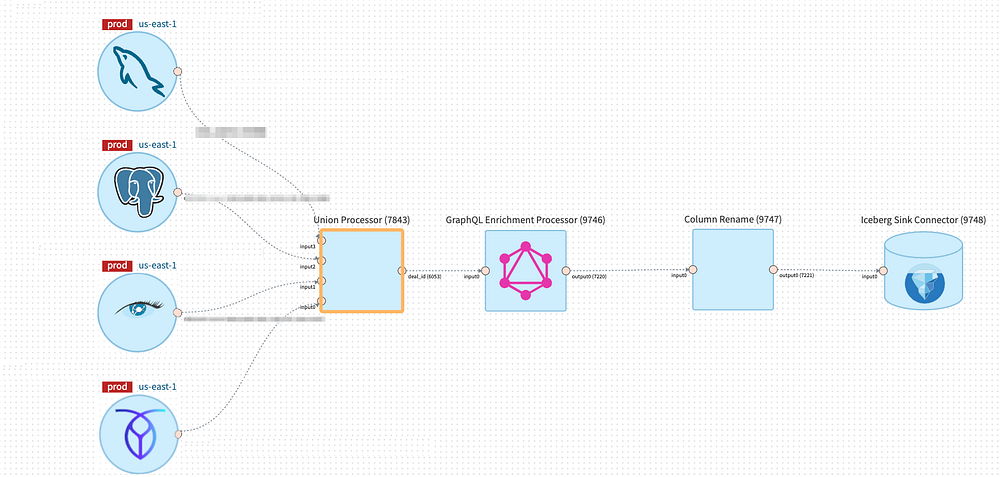
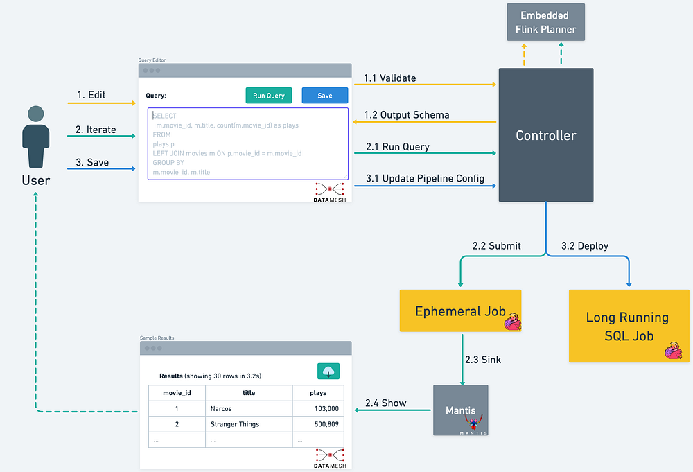

# Streaming SQL in Data Mesh

**Democratizing Stream Processing @ Netflix**

By [_Guil Pires_](https://www.linkedin.com/in/guilhermesmi/)_, _[_Mark Cho_](https://www.linkedin.com/in/markcho/)_, _[_Mingliang Liu_](https://www.linkedin.com/in/liuml07/)_, _[_Sujay Jain_](https://www.linkedin.com/in/sujayjain/)

Data powers much of what we do at Netflix. On the Data Platform team, we build the infrastructure used across the company to process data at scale.

In our last blog post, we introduced [“Data Mesh” — A Data Movement and Processing Platform](./data-mesh-a-data-movement-and-processing-platform-netflix-1288bcab2873.md). When a user wants to leverage Data Mesh to move and transform data, they start by creating a new Data Mesh pipeline. The pipeline is composed of individual “Processors” that are connected by Kafka topics. The Processors themselves are implemented as Flink jobs that use the DataStream API.

Since then, we have seen many use cases (including [Netflix Graph Search](./how-netflix-content-engineering-makes-a-federated-graph-searchable-5c0c1c7d7eaf.md)) adopt Data Mesh for stream processing. We were able to onboard many of these use cases by offering some commonly used Processors out of the box, such as _Projection_, _Filtering_, _Unioning_, and _Field Renaming_.

*An example of a Data Mesh pipeline which moves and transforms data using Union, GraphQL Enrichment, and Column Rename Processor before writing to an Iceberg table.*

By keeping the logic of individual Processors simple, it allowed them to be reusable so we could centrally manage and operate them at scale. It also allowed them to be composable, so users could combine the different Processors to express the logic they needed.

However, this design decision led to a different set of challenges.

**Some teams found the provided building blocks were not expressive enough. For use cases which were not solvable using existing Processors, users had to express their business logic by building a custom Processor**. To do this, they had to use the low-level DataStream API from Flink and the Data Mesh SDK, which came with a steep learning curve. After it was built, they also had to operate the custom Processors themselves.

Furthermore, many pipelines needed to be composed of multiple Processors. Since each Processor was implemented as a Flink Job connected by Kafka topics, it meant there was a relatively high runtime overhead cost for many pipelines.

We explored various options to solve these challenges, and eventually landed on building the Data Mesh SQL Processor that would provide additional flexibility for expressing users’ business logic.

**The existing Data Mesh Processors have a lot of overlap with SQL. For example, filtering and projection can be expressed in SQL through ******_SELECT_****** and ******_WHERE_****** clauses. Additionally, instead of implementing business logic by composing multiple individual Processors together, users could express their logic in a single SQL query, avoiding the additional resource and latency overhead that came from multiple Flink jobs and Kafka topics. Furthermore, SQL can support User Defined Functions (UDFs) and custom connectors for ****_lookup_**** ****_joins_****, which can be used to extend expressiveness.**

## Data Mesh SQL Processor

Since Data Mesh Processors are built on top of Flink, it made sense to consider using Flink SQL instead of continuing to build additional Processors for every transform operation we needed to support.

The Data Mesh SQL Processor is a platform-managed, parameterized Flink Job that takes schematized sources and a Flink SQL query that will be executed against those sources. By leveraging Flink SQL within a Data Mesh Processor, we were able to support the streaming SQL functionality without changing the architecture of Data Mesh.

Underneath the hood, the Data Mesh SQL Processor is implemented using Flink’s Table API, which provides a powerful abstraction to convert between DataStreams and Dynamic Tables. Based on the sources that the processor is connected to, the SQL Processor will automatically convert the upstream sources as tables within Flink’s SQL engine. User’s query is then registered with the SQL engine and translated into a Flink job graph consisting of physical operators that can be executed on a Flink cluster. Unlike the low-level DataStream API, users do not have to manually build a job graph using low-level operators, as this is all managed by Flink’s SQL engine.

## SQL Experience on Data Mesh

The SQL Processor enables users to fully leverage the capabilities of the Data Mesh platform. This includes features such as autoscaling, the ability to manage pipelines declaratively via Infrastructure as Code, and a rich connector ecosystem.

In order to ensure a seamless user experience, we’ve enhanced the Data Mesh platform with SQL-centric features. These enhancements include an Interactive Query Mode, real-time query validation, and automated schema inference.

To understand how these features help the users be more productive, let’s take a look at a typical user workflow when using the Data Mesh SQL Processor.

- Users start their journey by live sampling their upstream data sources using the Interactive Query Mode.
- As the user iterate on their SQL query, the query validation service provides real-time feedback about the query.
- With a valid query, users can leverage the Interactive Query Mode again to execute the query and get the live results streamed back to the UI within seconds.
- For more efficient schema management and evolution, the platform will automatically infer the output schema based on the fields selected by the SQL query.
- Once the user is done editing their query, it is saved to the Data Mesh Pipeline, which will then be deployed as a long running, streaming SQL job.

*Overview of the SQL Processor workflow.*

Users typically iterate on their SQL query multiple times before deploying it. Validating and analyzing queries at runtime after deployment will not only slow down their iteration, but also make it difficult to automate schema evolution in Data Mesh.

To address this challenge, we have implemented a query validation service that can verify a Flink SQL query and provide a meaningful error message for violations in real time. This enables users to have prompt validation feedback while they are editing the query. We leverage Apache Flink’s internal Planner classes to parse and transform SQL queries without creating a fully-fledged streaming table environment. This makes the query service lightweight, scalable, and execution agnostic.

To effectively operate thousands of use cases at the platform layer, we built opinionated guardrails to limit some functionalities of Flink SQL. We plan on gradually expanding the supported capabilities over time. We implemented the guardrails by recursively inspecting the Calcite tree constructed from user’s query. If the tree contains nodes that we currently don’t support, the query will be rejected from being deployed. Additionally, we translate Flink’s internal exceptions containing cryptic error messages into more meaningful error messages for our users. We plan on continuing our investments into improving the guardrails, as having proper guardrails help to improve the user experience. Some ideas for the future include rules to reject expensive and suboptimal queries.

To help Data Mesh users iterate quickly on their business logic, we have built the Interactive Query Mode as part of the platform. Users can start live sampling their streaming data by executing a simple `**_SELECT_**_ _**_*_**_ _**_FROM_**_ _**_<table>`_** query. Using the Interactive Query Mode, Data Mesh platform will execute the Flink SQL query and display the results in the UI in seconds. Since this is a Flink SQL query on streaming data, new results will continue to be delivered to the user in real-time.

Users can continue to iterate and modify their Flink SQL query and once they’re satisfied with their query output, they can save the query as part of their stream processing pipeline.

To provide this interactive experience, we maintain an always-running Flink Session Cluster that can run concurrent parameterized queries. These queries will output their data to a [Mantis](https://netflix.github.io/mantis/) sink in order to stream the results back to the user’s browser.

*Interactive Query mode in action*

## Learnings from our journey

In hindsight, we wish we had invested in enabling Flink SQL on the DataMesh platform much earlier. If we had the Data Mesh SQL Processor earlier, we would’ve been able to avoid spending engineering resources to build smaller building blocks such as the Union Processor, Column Rename Processor, Projection and Filtering Processor.

Since we’ve productionized Data Mesh SQL Processor, we’ve seen excitement and quick adoption from our Data Mesh users. Thanks to the flexibility of Flink SQL, users have a new way to express their streaming transformation logic other than writing a custom processor using the low-level DataStream API.

While Flink SQL is a powerful tool, we view the Data Mesh SQL Processor as a complimentary addition to our platform. It is not meant to be a replacement for custom processors and Flink jobs using low-level DataStream API. Since SQL is a higher-level abstraction, users no longer have control over low-level Flink operators and state. This means that if state evolution is critical to the user’s business logic, then having complete control over the state can only be done through low-level abstractions like the DataStream API. Even with this limitation, we have seen that there are many new use cases that are unlocked through the Data Mesh SQL Processor.

Our early investment in guardrails has helped set clear expectations with our users and keep the operational burden manageable. It has allowed us to productionize queries and patterns that we are confident about supporting, while providing a framework to introduce new capabilities gradually.

## Future of SQL on Data Mesh

While introducing the SQL Processor to the Data Mesh platform was a great step forward, we still have much more work to do in order to unlock the power of stream processing at Netflix. We’ve been working with our partner teams to prioritize and build the next set of features to extend the SQL Processor. These include stream enrichment using Slowly-Changing-Dimension (SCD) tables, temporal joins, and windowed aggregations.

Stay tuned for more updates!

---
**Tags:** Stream Processing · Data Mesh · Big Data · Event Streaming · Flink
