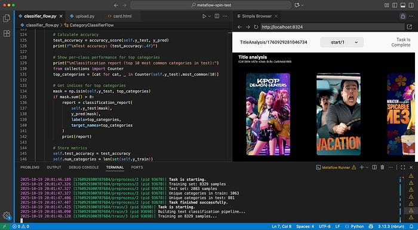
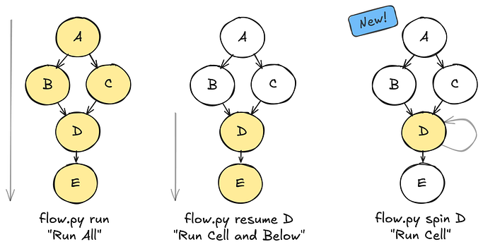
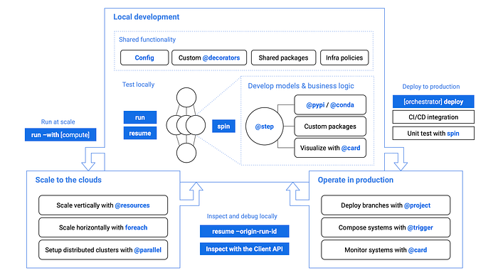

# Supercharging the ML and AI Development Experience at Netflix with Metaflow

[_Shashank Srikanth_](https://www.linkedin.com/in/shashanksrikanth/), [_Romain Cledat_](https://www.linkedin.com/in/romain-cledat-4a211a5/)

[Metaflow](https://docs.metaflow.org/) — a framework we started and [open-sourced](./open-sourcing-metaflow-a-human-centric-framework-for-data-science-fa72e04a5d9.md) in 2019 — now powers [a wide range of ML and AI systems across Netflix](./supporting-diverse-ml-systems-at-netflix-2d2e6b6d205d.md) and at [many other companies](https://github.com/Netflix/metaflow/blob/master/ADOPTERS.md). It is well loved by users for helping them take their ML/AI workflows from [prototype to production](https://docs.metaflow.org/introduction/what-is-metaflow#how-does-metaflow-support-prototyping-and-production-use-cases), allowing them to focus on building cutting-edge systems that bring joy and entertainment to audiences worldwide.

Metaflow allows users to:

1. **Iterate and ship quickly **by minimizing friction
2. **Operate systems reliably** in production with minimal overhead, at Netflix scale.

Metaflow works with many battle-hardened tooling to address the second point — among them** ****[Maestro](./100x-faster-how-we-supercharged-netflix-maestros-workflow-engine-028e9637f041.md)****, ****our newly open-sourced workflow orchestrator that powers nearly every ML and AI system at Netflix and serves as a backbone for Metaflow itself.**

In this post, we focus on the first point and introduce a new Metaflow functionality, **Spin**, that helps users **accelerate their iterative development process**. By the end, you’ll have a solid understanding of Spin’s capabilities and learn how to try it out yourself with **Metaflow 2.19**.

## Iterative development in ML and AI workflows


*Developing a Metaflow flow with cards in VSCode*

To understand our approach to improving the ML and AI development experience, it helps to consider how these workflows differ from traditional software engineering.

ML and AI development revolves not just around code but also around data and models, which are large, mutable, and computationally expensive to process. Iteration cycles can involve long-running data transformations, model training, and stochastic processes that yield slightly different results from run to run. These characteristics make fast, stateful iteration a critical part of productive development.

This is where notebooks — such as Jupyter, [Observable](https://observablehq.com/documentation/notebooks/), or [Marimo](https://marimo.io/) — shine. Their ability to preserve state in memory allows developers to load a dataset once and iteratively explore, transform, and visualize it without reloading or recomputing from scratch. This persistent, interactive environment turns what would otherwise be a slow, rigid loop into a fluid, exploratory workflow — perfectly suited to the needs of ML and AI practitioners.

Because ML and AI development is computationally intensive, stochastic, and data- and model-centric, tools that optimize iteration speed must treat state management as a first-class design concern. Any system aiming to improve the development experience in this domain must therefore enable quick, incremental experimentation without losing continuity between iterations.

## New: rapid, iterative development with spin

At first glance, Metaflow code looks like a workflow — similar to [Airflow](https://airflow.apache.org/) — but there’s another way to look at it: each Metaflow `@step` serves as [a checkpoint boundary](https://docs.metaflow.org/metaflow/basics#what-should-be-a-step). At the end of every step, Metaflow automatically persists all instance variables as _artifacts_, allowing the execution to [resume](https://docs.metaflow.org/metaflow/debugging#how-to-use-the-resume-command) seamlessly from that point onward. The below animation shows this behavior in action:


*Using resume in Metaflow*

In a sense, we can consider a `@step` similar to a notebook cell: it is the smallest unit of execution that updates state upon completion. It does have a few differences that address the issues with notebook cells:

- **The execution order is explicit and deterministic: **no surprises due to out-of-order cell execution;
- **The state is not hidden: **state is explicitly stored as `self.` variables as shared state, which can be [discovered and inspected](https://docs.metaflow.org/metaflow/client);
- **The state is versioned and persisted** making results more reproducible.

While **Metaflow**’s `resume` feature can approximate the incremental and iterative development approach of notebooks, it restarts execution from the selected step onward, introducing more latency between iterations. In contrast, a **notebook** allows near-instant feedback by letting users tweak and rerun individual cells while seamlessly reusing data from earlier cells held in memory.

The new `spin` command in Metaflow 2.19 addresses this gap. Similar to executing a single notebook cell, it quickly executes a single Metaflow `@step` — with all the state carried over from the parent step. As a result, users can develop and debug Metaflow steps as easily as a cell in a notebook.

The effect becomes clear when considering the three complementary execution modes — `run`, `resume`, and `spin` — side by side, mapping them to the corresponding notebook behavior:


*Run, Resume and Spin “modes”*

Another major difference isn’t just what gets executed, but what gets recorded. Both `run` and `resume` create a full, versioned run with complete metadata and artifacts, while `spin` skips tracking altogether. It’s built for fast, throw-away iterations during development.

The one-minute clip below illustrates a typical iterative development workflow that alternates between `run` and `spin`. In this example, we are building a flow that reads a dataset from a Parquet file and trains a separate model for each product category, focusing on computer-related categories.

As shown in the video, we start by creating a flow from scratch and running a minimal version of it to persist test artifacts — in this case, a Parquet dataset. From there, we can use `spin` to iterate on one step at a time, incrementally building out the flow, for example, by adding the parallel training steps demonstrated in the clip.

Once the flow has been iterated on locally, it can be seamlessly deployed to production orchestrators like Maestro or [Argo](https://docs.metaflow.org/production/scheduling-metaflow-flows/scheduling-with-argo-workflows), and [scaled up](https://docs.metaflow.org/scaling/remote-tasks/requesting-resources) on compute platforms such as AWS Batch, Titus, Kubernetes and more. Thus, the experience is as smooth as developing in a notebook, but the outcome is a production-ready, scalable workflow, implemented as an idiomatic Python project!

## Spin up smooth development in VSCode/Cursor

Instead of typing `run` and `spin` manually in the terminal, we can bind them to keyboard shortcuts. For example, [the simple metaflow-dev VS Code extension](https://github.com/outerbounds/metaflow-dev-vscode) (works with Cursor as well) maps `Ctrl+Opt+R` to `run` and `Ctrl+Opt+S` to `spin`. Just hack away, hit `Ctrl+Opt+S`, and the extension will save your file and `spin` the step you are currently editing.

One area where `spin` truly shines is in creating mini-dashboards and reports with [Metaflow Cards](https://docs.metaflow.org/metaflow/visualizing-results). Visualization is another strong point of notebooks but the combination of `spin` and cards makes Metaflow a very compelling alternative for developing real-time and post-execution visualizations. Developing cards is inherently iterative and visual (much like building web pages) where you want to tweak code and see the results instantly. This workflow is readily available with the combination of VSCode/Cursor, which includes a built-in web-view, [the local card viewer](https://docs.metaflow.org/metaflow/visualizing-results/effortless-task-inspection-with-default-cards#using-local-card-viewer), and `spin`.

To see the trio of tools — along with the VS Code extension — in action, in this short clip we add observability to the train step that we built in the earlier example:

A major benefit of Metaflow Cards is that we don’t need to deploy any extra services, data streams, and databases for observability. Just develop visual outputs as above, deploy the flow, and wehave a complete system in production with reporting and visualizations included.

## Spin to the next level: injecting inputs, inspecting outputs

Spin does more than just run code — it also lets us take full control of a spun `@step`’s inputs and outputs, enabling a range of advanced patterns.

In contrast to notebooks, we can `spin` any arbitrary `@step` in a flow using state from any past run, making it easy to test functions with different inputs. For example, if we have multiple models produced by separate runs, we could `spin` an inference step, supplying a different model run each time.

We can also override artifact values or inject arbitrary Python objects — similar to a notebook cell — for `spin`. Simply specify a Python module with an `ARTIFACTS` dictionary:

```
ARTIFACTS = {
  "model": "kmeans",
  "k": 15
}
```

and point `spin` at the module:

```
spin train --artifacts-module artifacts.py
```

By default `spin` doesn’t persist artifacts, but we can easily change this by adding `--persist`. Even in this case, artifacts are not persisted in the usual Metaflow datastore but to a directory-specific location which you can easily clean up after testing. We can access the results with [the Client API](https://docs.metaflow.org/metaflow/client) as usual — just specify the directory you want to inspect with `inspect_spin`:

```
from metaflow import inspect_spin

inspect_spin(".")
Flow("TrainingFlow").latest_run["train"].task["model"].data
```

Being able to inspect and modify a step’s inputs and outputs on the fly unlocks a powerful use case:** unit testing individual steps**. We can use `spin` programmatically through [the Runner API](https://docs.metaflow.org/metaflow/managing-flows/runner) and assert the results:

```
from metaflow import Runner

with Runner("flow.py").spin("train", persist=True) as spin:
  assert spin.task["model"].data == "kmeans"
```

## Making AI agents spin

In addition to speeding up development for humans, `spin` turns out to be surprisingly handy for coding agents too. There are two major advantages to teaching AI how to `spin`:

1. **It accelerates the development loop**. Agents don’t naturally understand what’s slow, or why speed matters, so they need to be nudged to favor faster tools over slower ones.
2. **It helps surface errors faster **and contextualizes them to a specific piece of code, increasing the chance that the agent is able to fix errors by itself.

Metaflow users are already [using](https://claude.com/product/claude-code) Claude Code; `spin` makes this even easier. In the example below, we added the following section in a `CLAUDE.md `file:

```
## Developing Metaflow code
Follow this incremental development workflow that ensures quick iterations
and correct results. You must create a flow incrementally, step by step
following this process:
1. Create a flow skeleton with empty `@step`s.
2. Add a data loading step.
3. `run` the flow.
4. Populate the next step and use `spin` to test it with the correct inputs.
5. `run` the flow to record outputs from the new step.
5. Iterate on (4–5) until all steps have been implemented and work correctly.
6. `run` the whole flow to ensure final correctness.

To test a flow, run the flow as follows
```
python flow.py - environment=pypi run
```

Do this once before running `spin`.
As you are building the flow, you `spin` to test steps quickly.
For instance
```
python flow.py - environment=pypi spin train
```
```

Just based on these quick instructions, the agent is able to use `spin` effectively. Take a look at the following inspirational example that one-shots Claude to create a flow, along the lines of our earlier examples, which trains a classifier to predict product categories:

In the video, we can see Claude using `spin` around the 45-second mark to test a `preprocess` step. The step initially fails due to a classic data science pitfall: during testing, Claude samples only a small subset of data, causing some classes to be underrepresented. The first `spin` surfaces the issue, which Claude then fixes by switching to stratified sampling — and finally does another `spin` to confirm the fix, before proceeding to complete the task.

## The inner loop of end-to-end ML/AI

To circle back to where we started, our motivation for adding `spin` — and for creating Metaflow in the first place — is to accelerate development cycles so we can deliver more joy to our subscribers, faster. Ultimately, we believe there’s no single magic feature that makes this possible. It takes all parts of an ML/AI platform working together coherently — `spin` included.

From this perspective, it’s useful to place `spin` in the context of other Metaflow features. It’s designed for the innermost loop of model and business-logic development, with the added benefit of supporting unit testing during deployment, as shown in the overall blueprint of the Metaflow toolchain below.


*Metaflow tool-chain*

In this diagram, the solid blue boxes represent different Metaflow commands, while the blue text denotes decorators and other features. In particular, note the _Shared Functionality_ box — another key focus area for us over the past year — which includes [configuration management](./introducing-configurable-metaflow-d2fb8e9ba1c6.md) and [custom decorators](https://docs.metaflow.org/metaflow/composing-flows/introduction). These capabilities let domain-specific teams and platform providers tailor Metaflow to their own use cases. Following our ethos of composability, all of these features integrate seamlessly with `spin` as well.

**Another key design philosophy of Metaflow is to let projects start small and simple, adding complexity only when it becomes necessary. **So don’t be overwhelmed by the diagram above. To get started, install Metaflow easily with

```
pip install metaflow
```

and take your first baby `@step`s for a `spin`! Check out the [docs](https://docs.metaflow.org/metaflow/authoring-flows/introduction) and for questions, support, and feedback, join the friendly [Metaflow Community Slack](http://chat.metaflow.org/).

## Acknowledgments

We would like to thank our partners at [Outerbounds](https://outerbounds.com/), and particularly [Ville Tuulos](https://www.linkedin.com/in/villetuulos/), [Savin Goyal](https://www.linkedin.com/in/savingoyal/), and [Madhur Tandon](https://www.linkedin.com/in/madhur-tandon/), for their collaboration on this feature, from initial ideation to review, testing and documentation. We would also like to acknowledge the rest of the Model Development and Management team ([Maria Alder](https://www.linkedin.com/in/maria-alder/), [David J. Berg](https://www.linkedin.com/in/david-j-berg/), [Shaojing Li](https://www.linkedin.com/in/shaojingli/), [Rui Lin](https://www.linkedin.com/in/rui-lin-483a83111/), [Nissan Pow](https://www.linkedin.com/in/nissanpow/), [Chaoying Wang](https://www.linkedin.com/in/chaoying-wang/), [Regina Wang](https://www.linkedin.com/in/reginalw/), [Seth Yang](https://www.linkedin.com/in/shuishiyang/), [Darin Yu](https://www.linkedin.com/in/zitingyu/)) for their input and comments.

---
**Tags:** Metaflow · Mlops · Developer Tools · Machine Learning · Artificial Intelligence
